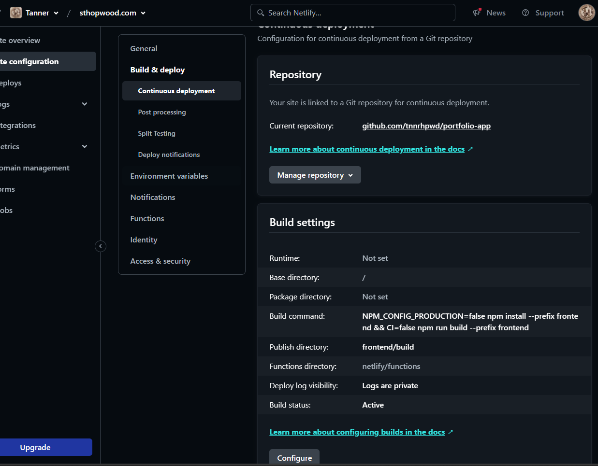
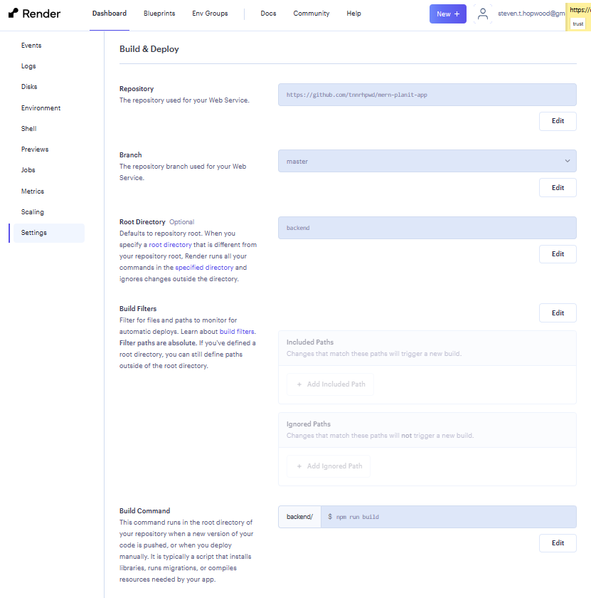

# Steven Tanner Hopwood's Portfolio Website

Welcome to the GitHub repository for my personal portfolio website, [www.sthopwood.com](http://www.sthopwood.com). This project showcases my skills and projects as a software developer.

## Technologies Used

This project is built with:

- React.js (v18.0.0)
- CSS
- HTML

Additional libraries and tools include:

- axios (v0.26.1) for promise-based HTTP requests
- chart.js (v3.7.1) and react-chartjs-2 (v4.1.0) for creating charts
- dotenv (v16.0.0) for environment variable management
- gsap (v3.10.3) for JavaScript animations
- react-circular-progressbar (v2.0.4) for circular progress bars
- react-router-dom (v6.3.0) for routing
- react-scroll (v1.8.7) and react-scroll-trigger (v0.6.14) for scroll animations
- react-slideshow-image (v4.2.1) for image slideshows
- react-tooltip (v4.2.21) for tooltips
- react-youtube (v7.14.0) for embedding YouTube videos
- readline (v1.3.0) for reading lines from readable streams
- sunrise-sunset-js (v2.2.1) for sunrise and sunset times
- web-vitals (v2.1.4) for measuring web vitals

## Getting Started

To run this project locally:

1. Clone the repository:

    ```bash
    git clone https://github.com/tnnrhpwd/portfolio-app.git
    ```

2. Navigate into the project directory:

    ```bash
    cd portfolio-app
    ```

3. Install the dependencies:

    ```bash
    npm install
    ```

4. Start the development server:

    ```bash
    npm start
    ```

    
    
    

The application will start on http://localhost:3000.

Contributing
While this project is primarily a personal portfolio, contributions are welcome. If you find a bug or think of a new feature, please feel free to create an issue or a pull request.

License
This project is open source and available under the MIT License.
