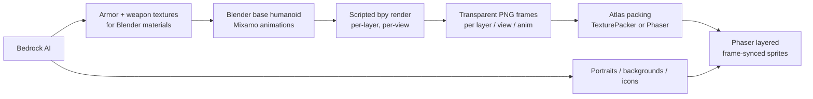

# Coliseum — art & asset pipeline (archived)

The art half of the archived Coliseum plan: what the assets are licensed from, the
3D→2D sprite pipeline, the Blender authoring checklist that feeds it, and the
modular "paperdoll" rigging idea that came after. It was four files; nothing in it
is current — see [`GAME_GUIDE.md`](../../guides/GAME_GUIDE.md) for the layout and
rendering lessons that did survive.

---

## Asset licenses, provenance and budget


The Coliseum rebuild is original. This file records the provenance and
licensing of every non-code asset and of the audio layer. Nothing here is
copied from the reference game (see `COLISEUM-SPEC.md`).

### Art / Visuals

#### Shipped: original vector sprites + arena backdrop

- **Source:** `frontend/src/pages/Projects/Coliseum/game/assets/art.ts`
  (inline SVG, generated as code; registered as Phaser textures by
  `game/assets/textures.ts`).
- **What it contains:** five stylized, flat-shaded gladiator figures (one per
  weapon style: spear+shield, shield+blade, trident+net, dual blades,
  two-handed) drawn from a shared original body template, plus an original
  flat arena backdrop (sand floor, stone arch band, audience silhouette).
- **Provenance:** 100% original vector art, authored from scratch in code. No
  reference art was traced or copied. No third-party license applies.
- **License:** original work, released under the same license as the project's
  own code (no separate attribution required).

#### Asset budget (mobile)

- No external image files are downloaded: every sprite is an inline SVG string
  (a few hundred bytes of source each) rasterized in memory at its display
  size by Phaser's `addBase64`.
- Display sizes: style figures 120x180 px at the 1280x720 design resolution;
  arena backdrop 1280x720.
- Estimated added GPU/texture cost: well under 1 MB of texture memory for all
  five sprites + backdrop combined, loaded lazily with the game itself (the
  game only mounts after the player taps "Play").
- If richer animated spritesheets are added later, each atlas must be recorded
  here with its file, author, source, license, and per-frame dimensions.

### Audio

#### Shipped: original synthesized SFX

- **Source:** `frontend/src/pages/Projects/Coliseum/game/audio/sfx.ts`
  (WebAudio oscillators, generated at runtime).
- **Provenance:** all sounds are synthesized in code. They contain no sampled,
  purchased, or copied audio, so they are original works with no third-party
  license requirements.
- **License:** original work (no attribution required).

#### Stock audio intake manifest (for a future swap-in)

The plan is to optionally layer licensed royalty-free stock on top of the
synthesized SFX. Before any stock file is committed, its row below MUST be
filled in — file path, author, source URL, license, and attribution text — per
the project's IP policy. Approved, verifiable sources (CC0 / free commercial):

| Slot | File | Source | License | Attribution |
| :-- | :-- | :-- | :-- | :-- |
| hit | *(pending)* | Pixabay / OpenGameArt (CC0) | | |
| crit | *(pending)* | Pixabay / OpenGameArt (CC0) | | |
| block | *(pending)* | Freesound (CC0) | | |
| victory | *(pending)* | Pixabay / OpenGameArt (CC0) | | |
| defeat | *(pending)* | Freesound (CC0) | | |
| music loop | *(pending)* | OpenGameArt (CC0) | | |

Rules: only CC0 or clearly "free for commercial use, no attribution required"
files are acceptable without explicit written permission; anything with an
attribution clause must carry that attribution verbatim in the table above.

### Code

- All game code, names, and text are original. No expression is copied from the
  reference game. The five style names use factual historical gladiator
  categories (generic type terms), not game-invented lore.


---

## Sprite art pipeline — pre-rendered 3D → 2D, layered paperdoll


Status: **decided, scaffolding in progress** (2026-09-04).

This document replaces the pure-SVG art approach currently in
`frontend/src/pages/Projects/Coliseum/game/assets/art.ts` / `textures.ts` with a
pre-rendered 3D → 2D pipeline. The Phaser **integration architecture is
unchanged** — only the art source changes.

### Locked decisions

- **Target:** the Coliseum Phaser game (turn-based arena). Not a side-scroller engine.
- **Views:** **front** and **side** — two fixed orthographic render directions.
- **Shading:** **PBR** (Blender). PBR is only expensive at *render time*, never at
  runtime — the game just blits PNG frames exactly like it blits SVG today.
- **Animation:** real frame animation (not tweens): `idle`, `walk`, `attack`,
  `hit`, `death`.
- **Equipment matrix: unchanged from today.** Keep the existing tiers and
  distinctions, just overwrite the art:
  - 3 armor material groups (`armorGroup(tier)`: ≤2 bronze, ≤5 iron/steel, else gold)
    × 5 slots (`head`, `torso`, `leftArm`, `rightArm`, `legs`)
  - 9 weapon kinds: `gladius`, `axe`, `mace`, `spear`, `dagger`, `trident`,
    `greatsword`, `maul`, `halberd`
  - 4 shield kinds: `buckler`, `round`, `tower`, `net`
- **AI (AWS Bedrock) role:** portraits, backgrounds, panels, icons, and 3D
  *textures* — **not** animation and **not** the paperdoll compositing.

### The one structural consequence

`art.ts` currently synthesizes an arbitrary appearance (`skin × hair × robe`) as
SVG at runtime (`buildAppearanceSprite`, `ensureHumanAppearance`). Pre-rendered
3D cannot synthesize new variants at runtime, so the appearance system becomes a
**finite, pre-rendered catalog**:

- Bodies: **2 genders × 4 skin tones × 5 hairstyles = 40** pre-rendered base
  bodies. Robe color is applied as a runtime `setTint` on the body layer (or
  pre-render 8 robe colors and pick).
- The current 800-combo runtime synthesis is retired; `appearance.ts` keeps its
  data model but maps onto the finite catalog instead of generating geometry.

### Pipeline overview



### Phase plan

#### Phase 0 — Lock fundamentals
- Two cameras in the `.blend`: `CamFront`, `CamSide` (orthographic, fixed,
  transparent film, matching scale — the two must render the character at the
  same pixel height).
- Animation set: `idle`, `walk`, `attack`, `hit`, `death`. Each stored as an
  Action/NLA strip with the same name so the render script can drive frame ranges.
- Frame budget (keep small, it's a management game):
  - `idle` 8–12, `walk` 8–12, `attack` 8–14, `hit` 4–6, `death` 8–12.
- Render size: **240×360** (2× the current 120×180 display) transparent RGBA PNG.

#### Phase 1 — Base rig (Blender + Mixamo)
- One male + one female CC0/MakeHuman base mesh.
- Auto-rig via Mixamo and retarget the five animations onto a shared armature.
- Author collections named exactly (see **Naming convention** below).
- Full step-by-step `.blend` authoring checklist:
  **the Blender authoring spec below**.

#### Phase 2 — Scripted render
- `scripts/coliseum/blender/render_fighter_layers.py` (scaffolded) renders each layer
  pass with only that layer visible, body hidden where appropriate, weapon
  parented to the hand bone so it already carries the correct per-frame
  position/rotation.
- **Prototype first:** render *one* full combo (body + one armor set + one
  sword) and get the look approved before rendering the whole matrix.

#### Phase 3 — Phaser integration (after first render approves)
- New `game/assets/sprites.ts`: `loadFighterSheets()`, an
  `addLayeredFighter` rewrite that returns a `Container` of **frame-synced
  `Sprite`s** (all layers `anims.play(sameKey)`, synced on the master sprite's
  frame index), and `addEquipmentIcon` for the rendered icon sheets.
- Wounds: re-author blood/severed as per-frame 3D renders (or screen-space
  overlays) so they stay aligned during motion.

#### Phase 4 — Bedrock for static assets
- Portraits: Titan Image Generator v2 with **image conditioning** on one approved
  reference so every bust matches style (fixes the earlier style-drift revert).
- Backgrounds, panels, icons, title art — same conditioning workflow.
- Armor/weapon albedo + roughness + normal textures for the Blender materials.

#### Phase 5 — Polish
- Drop shadows, texture atlases (memory), `reducedMotion` fallback (play fewer
  frames), responsive rescale.

### Naming convention (Blender → Phaser keys)

The render script emits frames whose folder names map 1:1 onto the existing
Phaser texture keys in `textures.ts`:

| Layer | Blender collection | Folder | Existing Phaser key prefix |
| --- | --- | --- | --- |
| Body | `Body.<variantId>` | `human/<variantId>/<view>/<anim>/` | `coliseum-human-` |
| Armor | `Armor.<slot>-<tier>` | `armor/<slot>-<tier>/<view>/<anim>/` | `coliseum-armor-` |
| Armor icon | `ArmorIcon.<slot>-<tier>` | `armor-icon/<slot>-<tier>/` | `coliseum-armor-icon-` |
| Weapon | `Weapon.<kind>` | `weapon/<kind>/<view>/<anim>/` | `coliseum-weapon-` |
| Off-hand weapon | `Offhand.<kind>` | `offhand-weapon/<kind>/<view>/<anim>/` | `coliseum-offhand-weapon-` |
| Weapon icon | `WeaponIcon.<kind>` | `weapon-icon/<kind>/` | `coliseum-weapon-icon-` |
| Shield | `Shield.<kind>` | `shield/<kind>/<view>/<anim>/` | `coliseum-shield-` |
| Shield icon | `ShieldIcon.<kind>` | `shield-icon/<kind>/` | `coliseum-shield-icon-` |

- `<view> ∈ {front, side}`, `<anim> ∈ {idle, walk, attack, hit, death}`.
- Icons are a single orthographic frame (no animation), like the current SVG icons.

### Rollout (prototype-first)

1. Author one base body + one sword + one armor set in Blender.
2. Run the render script for just those, approve the look + camera scale.
3. Render the full catalog, pack atlases.
4. Swap in `sprites.ts` behind a flag, delete the old SVG maps once stable.

### Gotchas

- `TextureManager.addBase64` is async (existing note) — the new pipeline loads
  raster files via `scene.load`, so preload + await in `BootScene` like
  `loadMapRaster`/`loadArenaRaster` already do.
- Keep the 2:3 frame ratio (240×360) so `SPRITE_W×SPRITE_H` (120×180) scaling
  is distortion-free.
- Front and side must render at the **same bounding height** or a view switch
  will visibly change the character's size.
- IP rule: original 3D models/materials only — no copied reference assets.


---

## Blender authoring spec (build the `.blend`)


Companion to the sprite pipeline above. This is the step-by-step checklist to
author the Blender file that `scripts/coliseum/blender/render_fighter_layers.py` renders.
Follow it in order; the script and the Phaser integration assume these exact
names and structure.

> **Prototype first.** Build ONE body + ONE sword + ONE helmet, run the render,
> and approve the look before authoring the full 40-body / 9-weapon matrix.

### What you'll produce

- `coliseum-fighters.blend` — one armature, a base human mesh, armor/weapon/shield
  meshes, two orthographic cameras, PBR materials, HDRI lighting.
- Running `blender --background coliseum-fighters.blend --python render_fighter_layers.py`
  emits `sprites/` (240×360 transparent PNG frames + `manifest.json`).

### Software & accounts

- **Blender 4.x LTS** (4.2+) — free, from blender.org.
- **Mixamo** — **mixamo.com** (it's "Mixamo", not "Maximo"!) — free with an
  Adobe account, for the rig + animations. Needs a WebGL-enabled browser
  (Chrome/Edge/Firefox).
- Optional: **MakeHuman** for a custom base mesh (or use Mixamo's built-in
  characters to start).
- **Fallback if mixamo.com won't load:** **AccuRig** (free Windows app from
  Reallusion) for auto-rigging + **ActorCore** for animations, or Blender's
  built-in **Rigify** (free). See the note in Step 1.

#### Opening Blender and running the render

On Windows, Blender installs to
`C:\Program Files\Blender Foundation\Blender <version>\blender.exe`. To run the
render script from this repo's root, use the full path:

```powershell
& "C:\Program Files\Blender Foundation\Blender 4.2\blender.exe" --background coliseum-fighters.blend --python scripts/coliseum/blender/render_fighter_layers.py
```

(If you add Blender's folder to PATH you can type `blender` instead.)

### Blender UI primer (read this first)

Blender looks intimidating; you only need a small slice of it.

**The 3D Viewport** (the big middle area) shows your scene:
- **Orbit:** hold the middle mouse button and drag.
- **Pan:** Shift + middle-mouse drag.
- **Zoom:** scroll wheel.
- **Numpad 1** = front view, **3** = side, **7** = top, **0** = through the camera.
  (No numpad? View menu → Viewpoint → Front/Side/Top/Camera.)
- **G** = move, **R** = rotate, **S** = scale, **X** = delete, **Tab** = toggle Edit Mode.

**Editors** are the panels around the viewport. The ones you'll use:
- **Outliner** (top-right by default): lists objects AND collections. Rename by
  double-clicking a name or pressing **F2**; manage collections here.
- **Properties** (bottom-right): tabbed settings. The tab icons you'll click:
  - **Render** (camera-back icon) — render engine, film/transparency.
  - **Output** (printer icon) — image size + format.
  - **Data** (green camera icon on a camera) — object-specific settings (lens).
  - **Material** (red checkered sphere) — materials.
  - **Object** (orange square) — transforms and collection membership.

**Add a new object:** Shift+A (Object Mode) → choose e.g. Mesh, Camera, Light.

**Move a mesh into a collection:** select it, press **M**, pick the collection.

> If you ever get lost: File → New → General gives a fresh scene. Save often
> (Ctrl+S).

---

### Step 1 — Get a base mesh (Mixamo)

You need one humanoid in a neutral **T-pose/A-pose**, no animation.

1. Go to **https://www.mixamo.com** (it's "Mixamo", not "Maximo") and sign in
   with a free Adobe account. Use a WebGL-enabled browser (Chrome, Edge, or
   Firefox).
2. Click **Characters** and pick a human character (avoid robots/creatures).
   "X Bot" works, but a plain human-looking one is closer to a gladiator.
3. Click **Download** and set:
   - Format: **FBX for Unity (.fbx)** (imports fine into Blender)
   - Pose: **T-pose**
   - Skin: **With Skin** (includes the mesh)
4. Click Download → save the `.fbx` somewhere you'll remember (e.g. a
   `coliseum-assets/` folder).

You'll need **two** bodies eventually (male + female); start with one.

> Using MakeHuman instead? Export an FBX from MakeHuman, then upload it to
> Mixamo (Step 2) to auto-rig it.

#### If Mixamo won't load (or is down)

Mixamo is free but unmaintained and has occasional outages. If the site won't
load for you, use this free fallback for the same result:

1. **AccuRig** (free Windows app from Reallusion) — drop in your character, it
   auto-rigs it (like Mixamo) and exports FBX.
2. **ActorCore** (Reallusion's site) — browse free/cheap animations and download
   them for your rigged character.
3. Or skip web tools entirely: **Rigify** (built into Blender) auto-rigs a
   character, and free mocap clips (e.g. the CMU library) can be retargeted
   onto it.

Whichever route you take, the Blender-side steps (3 onward) are the same — all
that matters is you end up with a rigged humanoid + five animation clips named
`idle`/`walk`/`attack`/`hit`/`death`.

### Step 2 — Download the five animations (Mixamo)

1. On Mixamo (mixamo.com), click **Animations**. Search/download each clip below,
   one at a time.
2. For each clip, keep the SAME character selected and set:
   - Format: **FBX for Unity (.fbx)**
   - Pose: **In Place** (the character animates on the spot — critical for
     sprite sheets)
   - Skin: **With Skin**
3. Download these five (names aren't mandatory — these are a starting point):

   | Slot | Mixamo clip | Notes |
   | --- | --- | --- |
   | `idle` | "Breathing Idle" | subtle, loops |
   | `walk` | "Walk" (or "Walking") | front/side motion |
   | `attack` | "Sword Slash" | generic weapon swing |
   | `hit` | "Hit Reaction" / "Taking Damage" | short flinch |
   | `death` | "Dying" / "Death" | falls, ends on the ground |

4. Also download the **T-pose (no animation)** version once — set Pose: T-pose.
   This is the rig + body you'll build everything on.

### Step 3 — Import into Blender

#### 3.1 Import the T-pose

1. Open Blender — the default scene has a cube, camera, and light. Leave them.
2. **File → Import → FBX (.fbx)** and select your T-pose file.
3. You should now see an **Armature** (the skeleton, drawn as lines) and a body
   **mesh** in the Outliner.

#### 3.2 Fix the scale

Mixamo FBX often imports at the wrong size.

1. Click the armature, press **S** and move the mouse to scale; hold **Ctrl** to
   snap. Aim for the character to be roughly **2 grid squares tall** (one grid
   square = 1 m), with the feet on **Z = 0**.
2. Or set it exactly: **Properties → Object** → set Scale X/Y/Z to the same
   value until the character is ~2 units tall.
3. Apply the scale so it sticks: select the armature (and mesh), press
   **Ctrl+A → Scale**.

#### 3.3 Import the animations

1. **File → Import → FBX** for each of the five animation files, one at a time.
2. Each import adds a NEW armature + mesh (clones). Don't panic — the important
   thing each import adds is an **Action** (the animation data).

#### 3.4 Rename the actions

Actions are stored globally, separate from the clones.

1. In the **Outliner**, change its display mode: the dropdown at the top of the
   Outliner currently says **"View Layer"** → switch it to **"Blender File"**.
2. Expand **Actions**. You'll see entries named after the Mixamo clips.
3. Rename each with **F2** (or right-click → Rename) to exactly:
   `idle`, `walk`, `attack`, `hit`, `death`.

#### 3.5 Delete the animation clones

The imported animation FBXs brought duplicate armatures + meshes you don't need.

1. Switch the Outliner back to **"View Layer"** mode.
2. Select the duplicate armatures and meshes (NOT your original T-pose armature
   + body) and press **X → Delete**.
3. The renamed Actions stay in the file even after deleting the clones.

#### 3.6 Check each animation

1. Select your original armature.
2. Change any editor to the **Action Editor** (use the editor-type dropdown in a
   panel's top-left corner, pick "Action Editor").
3. In its header, click the action dropdown and pick `idle`, then press **Space**
   to play. Repeat for `walk` / `attack` / `hit` / `death`.
4. Watch for: feet sliding, the character flying away, or bones bending wrong.
   If a clip looks broken, re-download it from Mixamo in **In Place** mode.

> You don't need to leave an action assigned — the render script assigns each
> action itself when it renders. This step is just to verify the animations.

### Step 4 — Scene, transparency, and cameras

#### 4.1 Transparent background

1. **Properties → Render** (camera-back icon).
2. Under **Film**, tick **Transparent**. (Rendered images show a checkerboard =
   transparent.)

#### 4.2 Output size + format

1. **Properties → Output** (printer icon).
2. Set **Resolution X = 240**, **Y = 360**.
3. File Format: **PNG**, Color: **RGBA**.

(The render script also sets these — this is for a manual test render.)

#### 4.3 Two orthographic cameras

1. Add a camera: **Shift+A → Camera**. Rename it `CamFront` (Outliner → F2).
2. Aim it at the front: press **Numpad 1** (front view), select the camera, then
   **Ctrl+Alt+Numpad 0** ("Camera to View"). Press **Numpad 0** to check.
3. Make it orthographic: select the camera → **Properties → Data** (green camera
   icon) → **Lens → Type: Orthographic**. Set **Orthographic Scale** so the
   character (head to feet) fills the view with a little margin.
4. Duplicate for the side view: select `CamFront`, **Shift+D**, press **R → Z →
   90 → Enter**, rename it `CamSide`.
5. Aim it at the side: press **Numpad 3** (side view), select `CamSide`, then
   **Ctrl+Alt+Numpad 0**.
6. **Use the same Orthographic Scale on both** so front and side render the same
   height. Nudge the scale on both until the character fits the same way.

#### 4.4 Render engine

- **Properties → Render → Render Engine**: choose **Cycles** (quality) or
  **EEVEE Next** (speed). The script sets this too; Cycles + denoise is the
  safe default.

### Step 5 — PBR materials + lighting

#### 5.1 HDRI lighting (makes PBR look right)

1. Download a free HDRI from **polyhaven.com** (any neutral studio/outdoor one).
2. Open a **Shader Editor** panel (switch an editor's type to "Shader Editor").
3. In its header, change the dropdown that says **Object** to **World**.
4. **Shift+A → Texture → Environment Texture**, load your `.hdr` file, and
   connect: `Environment Texture (Color)` → `Background (Color)` →
   `World Output (Surface)`.
5. In the 3D viewport, switch the shading mode (top-right corner icons) to
   **Rendered** (4th icon) or **Material Preview** (3rd icon) to see lighting.

#### 5.2 Body material (skin)

1. Select the body mesh → **Properties → Material** (red sphere) → **New**.
2. Surface is **Principled BSDF** by default. Set **Base Color** to a skin tone
   and **Roughness ≈ 0.6**.

#### 5.3 Metal materials (armor/weapons/shields)

1. Select a metal mesh → Material tab → **New**.
2. **Metallic = 1.0**, **Roughness** 0.35–0.6, and **Base Color** by tier:
   - bronze `#8a5a2b`, iron/steel `#9aa4ad`, gold `#e8b84b`
   (these match the current SVG tier colors).

> For 240px sprites, a clean base color + HDRI is usually enough — skip
> Normal/Roughness maps until the prototype looks wrong.

### Step 6 — Collections (exact names)

The render script shows/hides things by **collection name**. Get these exactly
right or the script renders nothing.

#### 6.1 Create the master collection

1. In the **Outliner**, right-click in empty space → **New Collection**. Name it
   `Render` (F2).

#### 6.2 Create one sub-collection per layer

Right-click on `Render` → **New Collection** for each name below. Start with the
prototype minimum, then add the rest:

| Collection | Contains | Render pass |
| --- | --- | --- |
| `Body.male-light-short` | body mesh (one variant) | body |
| `Armor.head-0` | helmet (bronze) | armor overlay |
| `Weapon.gladius` | sword | weapon overlay |
| `Offhand.gladius` | off-hand sword (optional) | off-hand overlay |
| `Shield.round` | round shield | shield overlay |

**Full name lists** (author incrementally, after the prototype):

- Armor: `{head,torso,leftArm,rightArm,legs}` × `{0,1,2}` (bronze/iron/gold).
- Weapons: `{gladius,axe,mace,spear,dagger,trident,greatsword,maul,halberd}`.
- Off-hand: same weapon list.
- Shields: `{buckler,round,tower,net}`.
- Bodies: `{male,female}-{light,tan,brown,dark}-{short,long,tied,curly,bald}`
  (40 total — author them incrementally, not all at once).
- Icons (single frame, no animation): `ArmorIcon.*`, `WeaponIcon.*`, `ShieldIcon.*`.

#### 6.3 Put each mesh in its collection

1. Select the mesh in the viewport or Outliner.
2. Press **M → choose the collection** (or **New** and name it).
3. Verify in the Outliner: the mesh appears nested under the right collection.

#### Critical structural rules

1. **The armature must NOT be inside `Render`.** Keep it at scene top level so
   it keeps animating while the script hides every mesh collection.
2. **Parenting decides how a piece follows the character:**
   - **Deforming pieces** (torso/arm/leg armor): select the armor mesh, Shift-click
     the armature, **Ctrl+P → With Automatic Weights** (it flexes with the body).
   - **Rigid attachments** (helmet, weapon, shield): select the mesh, Shift-click
     the armature, switch to **Pose Mode** (top-left dropdown), select the target
     bone (head / right hand / left hand), then **Ctrl+P → Bone**.
3. **Collection membership and parenting are separate.** A mesh can be parented
   to the armature (for movement) AND belong to a `Render` sub-collection (for
   visibility). Do both.
4. **Same origin/scale for everything:** every piece must be modeled/positioned
   against the SAME armature at the SAME world origin, or layers won't align
   when stacked in the game.

### Step 7 — Render the prototype

#### 7.1 Manual test first

1. Select `CamFront`, press **Numpad 0**, then **F12** to render one frame.
   Check: the character is centered, background is the transparent checkerboard,
   and it fits the 240×360 frame.
2. Do the same for `CamSide`.

#### 7.2 Run the script

From the repo root, in PowerShell:

```powershell
& "C:\Program Files\Blender Foundation\Blender 4.2\blender.exe" --background coliseum-fighters.blend --python scripts/coliseum/blender/render_fighter_layers.py
```

- Replace the Blender path with your installed version.
- Set `$env:COLISEUM_OUT = "..."` first to override the output folder.
- Output lands in `sprites/` next to the `.blend` (or in `COLISEUM_OUT`), plus
  `manifest.json` listing every rendered frame.

> If you get `Missing collection: ...` — a collection name in the `.blend` does
> not match the script. Check Step 6 names character-for-character.

### Step 8 — Review checklist (prototype gate)

Render ONE body + ONE weapon + ONE helmet, then confirm every box:

- [ ] Frames are transparent (no grey/black background).
- [ ] `CamFront` and `CamSide` produce the same character height.
- [ ] Armor aligns on the body when stacked (no floating helmet / offset chest).
- [ ] Weapons follow the hand through the attack arc (no detach in any frame).
- [ ] All five animations play at the expected frame counts.
- [ ] No bone-name/foot-slide errors from the Mixamo import.

Approve this, then author the remaining bodies, armor tiers, and weapon/shield
kinds — and the Phaser `sprites.ts` integration can start against the locked
frame/name contract.


---

## The paperdoll idea — AI-assisted modular rigging


To handle interchangeable armor, weapons, and tools, traditional AI sprite sheet generation (generating flat frame-by-frame images) will quickly turn into a logistical nightmare. If you have 5 animations, 10 armor sets, and 10 weapons, drawing or generating frame-by-frame sheets requires rendering 500 distinct animation sets.Instead, combine AI asset creation with a Modular 2D Skeletal Setup (Paperdoll System).  The Strategy: Modular Paperdoll + AI GenerationInstead of generating full animations, use AI to generate individual static body parts, armor, and weapon parts, and then assemble and animate them using skeletal rigging software.+------------------+       +-------------------+       +--------------------+
|  AI Asset Gen    |  -->  |   Slice & Layer   |  -->  |  Skeletal Rigging  |
| (Midjourney/FLUX)|       | (Figma / Photoshop)|       |  (Spine2D / Godot) |
+------------------+       +-------------------+       +--------------------+
Base Body Generation: Use AI image generators (e.g., FLUX, Midjourney, or Stable Diffusion with ControlNet) to generate T-pose or neutral side-profile characters.Layer Slicing: Separate the image into distinct limb layers (Head, Torso, Upper Arm, Lower Arm, Hand, Thigh, Shin, Foot).Skeletal Rigging: Import these parts into a 2D skeletal animation tool.Paperdoll Swapping: Generate equipment (helmets, chestplates, swords) as standalone overlays that attach to the existing character bones.Result: You animate the skeleton once, and any attached armor or tool follows the animation automatically.  Step-by-Step WorkflowStep 1: Generate Clean Source ImagesUse an AI generator with strict parameters to keep art style consistent.Prompt structure:2D side-scroller game asset, side profile view of an armored knight, orthographic view, flat colors, clean vector lineart, isolated on a white background --no shadows, complex backgroundStyle Consistency: Lock your seed or use reference image conditioning (ControlNet or IP-Adapter) to ensure your base character, armor sets, and weapons share identical line weight and shading styles.Step 2: Extract & Slice Equipment LayersInstead of SVGs, export high-resolution PNGs with transparent backgrounds.Use AI background removers (e.g., Clipdrop or Photoroom) to isolate the character.In Photoshop, GIMP, or Figma, cut the parts into a modular layer library:Base Rig: head.png, torso.png, arm_upper.png, hand.pngHead Equipment: helmet_iron.png, cap_leather.pngWeapon Attachment: sword_iron.png, pickaxe_steel.pngStep 3: Animate via Skeletal RiggingInstead of drawing frame-by-frame walk cycles, set up a skeletal rig:ToolBest ForEngine SupportSpine 2DIndustry standard, powerful mesh deformation.Unity, Godot, Unreal, WebGLSpriter ProSimple paperdoll setup, budget-friendly.Unity, Construct, CustomEngine NativeNative 2D skeletal tools (e.g., Unity 2D Animation package, Godot's Skeleton2D).Built-inStep 4: Equipment Swap ImplementationIn your game engine:Attach bone slot anchors to your skeleton (e.g., hand_R_slot, head_slot).Swap the sprite assigned to head_slot programmatically when equipping a new helmet (e.g., changing helmet_iron to helmet_gold).The helmet inherits all bone transformations, rotations, and scale keyframes from the base animation seamlessly.Alternative: AI-Driven Pixel Art RouteIf vector/raster skeletal animation does not fit your game's aesthetic and you prefer frame-by-frame pixel art:Tools: Use dedicated AI sprite generators like SpriteFlow or Layer.ai.  Workflow: Generate the base walk cycle sprite sheet, then generate individual equipment overlay sprite sheets using image-to-image/ControlNet conditioning to match the exact silhouette and frame positions of the base animations.

---
