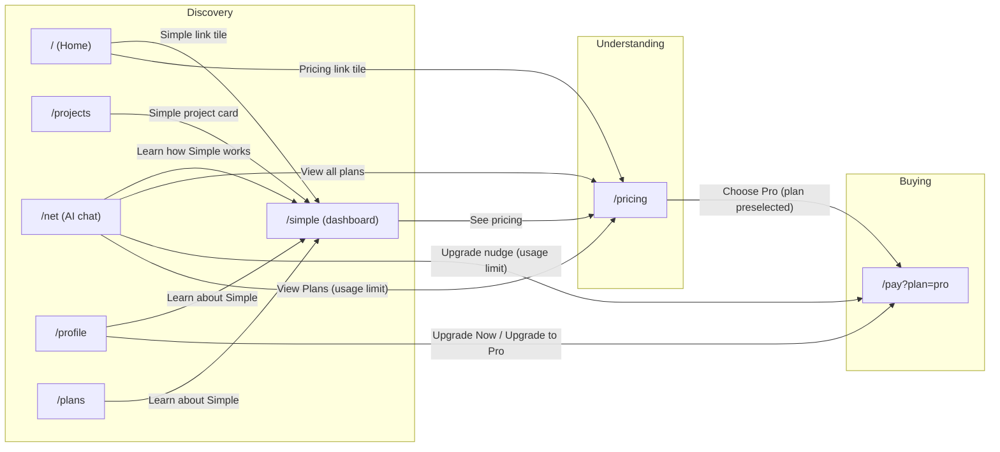

# Business — what we sell, to whom, and the funnel

The commercial picture, in one place: what the product is worth to someone, who the
customer is, what each tier buys, and the funnel that turns a visitor into a
subscriber — mapped page by page, with the CTA policy the pages are held to.

---

## The one-sentence version

**Simple gives non-technical Windows users a personal agent that watches what they do on their PC and does the repetitive parts for them — without writing a single line of code or automation script.**

---

## What you are actually providing customers

Strip away the pricing tiers and infrastructure talk — here is the actual value, in plain terms:

### Time back, not "automation software"
Customers aren't buying "automation" as an abstract feature. They're buying **relief from doing the same boring clicks/keystrokes/data-entry over and over**. The product's job is to notice a repeated pattern (or take a plain-English instruction) and carry it out reliably, so the person doesn't have to.

### Automation without technical skill
Traditional automation tools (AutoHotkey, Power Automate, Zapier, macros) require the user to think like a programmer — write scripts, define triggers, debug logic. Simple's differentiation is that **the user can just describe the goal in plain English (or let the agent watch and learn), and it figures out the steps.** That's the real product: removing the technical barrier, not the automation itself.

### A second set of eyes/hands on their own machine
Because Simple perceives screen, input, and (optionally) audio, it can act as a live assistant — not just a script runner. Practical value: "watch for this and alert me," "do this thing while I'm away," "remember how I did this task and repeat it." This is closer to hiring a very literal personal assistant for your computer than to installing a utility.

### A conversational AI chat that's actually wired into your machine
Most AI chat tools can only talk. The AI chat here is tied to the same agent that can act — so the differentiation from generic ChatGPT-style tools is that the customer can ask it to *do* something on their PC, not just explain how.

### Their data stays theirs, with straightforward cloud sync/storage
Cloud storage isn't the product — it's a supporting feature so the customer's automations, chat history, and settings follow them and aren't lost if their PC dies. The value is continuity and peace of mind, not storage as a commodity.

---

## Who the customer actually is

Be specific — "everyone with a Windows PC" is not a customer segment. Realistic early segments, based on what the product does well:

| Segment | Their pain today | Why Simple helps |
|---|---|---|
| Non-technical power users (e.g. small business owners, admins) doing repetitive desktop tasks (data entry, report generation, file organizing) | They know *what* they want automated but can't code a macro or Power Automate flow | Plain-English instruction → agent executes, no scripting required |
| Solo professionals/freelancers with repetitive multi-step workflows (invoicing, client follow-ups, screen recording for tutorials) | Existing automation tools have too steep a learning curve for one person to justify learning | Fast time-to-value: describe the task once, it runs |
| Enthusiasts/tinkerers who like AI agents and want to test/build in this space | Curiosity about agentic AI, want a hands-on tool that "does things," not just chats | Live, tangible demonstration of an AI agent acting on their own PC |

Pick **one** of these to focus your messaging, onboarding, and first outreach on — trying to speak to all three dilutes the message. Given the product's current audience (portfolio site visitors, engineers, hobbyists), the **enthusiast/tinkerer** segment is probably your fastest path to your first 100 real paying users, with the **solo professional** segment as the segment to grow into once the product is more polished/reliable.

---

## Monetization strategies (realistic)

An earlier draft was too aspirational — it listed enterprise SLAs, marketplaces, and developer API licensing that assume a scale this project doesn't have yet. This section focuses on **what's actually achievable right now** for a solo/small-team product with a real but modest user base, using infrastructure that already exists (Stripe subscriptions via `Pay.jsx`/`CheckoutForm.jsx`, usage-metered plans in `Pricing.jsx`, the Simple desktop addon, AI chat, and cloud storage).

Ground rules for "realistic":
- No new revenue idea should require hiring, a sales team, or building an entirely new product category.
- Prefer ideas that extend code you already have (Stripe checkout, usage tracking, storage limits) over ones requiring new infrastructure.
- Only charge for things that cost you real, measurable money (LLM tokens, storage, compute, bandwidth) or that solve a specific, validated pain point a user already told you about.
- Validate demand cheaply (a waitlist button, a "would you pay for this?" prompt, a support-channel request) before building anything big.

This is why Tier 1 below (perfecting the free→pro funnel) matters more than inventing new revenue streams: the entire business model depends on the free experience being good enough to convince someone the paid ceiling is worth removing.

### Tier 1 — Do these first (low effort, uses existing infrastructure)

#### Keep perfecting the core Free → Pro upgrade path
This is already your main revenue mechanism and it's the most realistic lever you have. The highest-leverage move isn't inventing new tiers — it's making the existing $15/mo Pro plan convert better:
- Show a usage meter in-app for storage (e.g. "82 MB/100 MB used") so users *see* the ceiling before they hit it — this is honest and drives upgrades far better than a surprise limit. (Automation commands are not gated per the cost-based tiering below — see note there.)
- Add a "you're at 90% of your daily limit — upgrade or wait until tomorrow" banner instead of a hard block. Never silently fail a request.
- A/B test the Pro price itself. $15 may be under- or over-priced for what it delivers — you won't know until you try $9 or $19 with new signups for a month each.

**Why realistic:** zero new features required, just UX/pricing tuning on code that already exists.

#### Annual billing discount
Offer "$15/mo or $144/yr (2 months free)" — a standard, well-understood, ethical incentive that improves cash flow and retention with about a day of Stripe + `CheckoutForm.jsx` work.

**Why realistic:** Stripe supports this natively; it's a pricing/config change, not new product work.

#### Storage top-up packs (one-time, not subscription)
For users who are 90% happy on Free but occasionally need more storage (e.g. a busy week), let them buy a one-time top-up ($3 for +5GB for the month) instead of committing to a full Pro subscription. (Not command top-ups — per *Growth and conversion levers* below, automation commands aren't gated since running them locally costs nothing.)
- Captures revenue from price-sensitive users who'd otherwise churn away rather than subscribe.
- Needs one new Stripe one-time-payment flow. You already have subscription checkout in `CheckoutForm.jsx` — adding a one-time SKU is a smaller lift than it sounds.

**Why realistic:** small, well-scoped engineering task; directly tied to real infra cost (compute/storage).

### Tier 2 — Do these next (moderate effort, validate demand first)

#### A genuinely useful one-time "Pro feature" for non-subscribers
Some users just dislike recurring billing. Pick **one** feature existing Pro users value most (ask them which feature they'd miss most) and offer it as a one-time lifetime unlock (e.g. "$39 once: live phone screen viewing, forever").
- Validate first: survey your current paying users — "would you rather pay $39 once for X than $15/mo?" If nobody says yes, skip this entirely.

**Why realistic:** low build cost if #3's one-time payment flow already exists; only build if you get real signal, not because it sounds clever.

#### Scheduled/background automation reminders (small paid add-on)
Simple runs locally today. A genuinely differentiated paid feature: let a user schedule an automation to run at a specific time, starting with the cheapest possible version — a scheduled notification/email reminder ("time to run your automation") — before ever building actual remote/cloud execution.
- Only invest in full server-side execution (a real, ongoing infra cost) once you have paying demand for the lightweight reminder version.

**Why realistic:** staged approach — cheap version first, expensive version only if validated by real usage.

#### "Supporter" tier priced honestly as patronage
A $3-5/mo tier with a small non-functional perk (badge, name on a credits page, early access to a beta toggle) for users who like the product and want to support it, independent of needing more automation commands.
- Only pursue this if you already see qualitative signs of goodwill (support emails, reviews, community messages thanking you) — it will not perform for a product without an emotionally engaged niche audience.

**Why realistic:** cheap to build (a Stripe price + a small profile badge), but only worth doing with real evidence of user goodwill first.

---

## Tiers, the credit gate, and growth levers — 🟡 provider-boundary gate shipped

> Moved out of the platform plan doc on 2026-09-16, when it became a pointer file for
> agents ([`agent.md`](../implementation/agent.md)). Section names are the reference
> here — no chapter numbers.


Freemium, gated at one seam (the LLM provider interface, `LLM_PROVIDERS.md`) — not scattered
through feature code. Downgrade/expiry falls back to the free path without
breaking an installed skill's core replay.


### What each tier buys

| What | Free | Pro |
|---|---|---|
| Price | $0 | $15/mo (or $144/yr) |
| AI chat — cheapest configured cloud model (today DeepSeek-V3; Claude Haiku 4.5 also available), metered | $0.50/mo credit | $10/mo credit |
| OCR — platform-funded, metered | same credit allowance | same credit allowance |
| Local automation & addon | Unlimited (fair use) | Unlimited (fair use) |
| Cloud storage | 100 MB | 50 GB |
| Live phone viewing | — | Included |
| Support | Community | Email |

Locked decisions: **no BYOK** (all cloud AI is operator-funded and metered);
**OCR platform-funded**; **cancellation deferred to period end**; **annual billing**;
**no automation command cap**. (The admin `Special` flag can grant a specific user
unlimited credits — see [`AUTOMATION_SECURITY.md`](../implementation/AUTOMATION_SECURITY.md); it's an admin
tool, not a documented tier.)


### Where the limit is enforced — 🟡 partially implemented (provider-boundary gate shipped)

The meter already lived in `backend/utils/apiUsageTracker.js`
(`MEMBERSHIP_LIMITS` / `getMembershipLimit` / `canMakeApiCall` / `trackApiUsage`).
The gap was **enforcement at the provider boundary** — `agent-chat`/`agent-vision`
invoked Bedrock without checking it. That gate now exists.

- ✅ Enforce the credit limit at the provider boundary only — `agentChatProxy` /
  `agentVisionProxy` (`backend/controllers/workspaceController.js`) call
  `canMakeApiCall` before Bedrock, return a structured 402 (`planRequired`,
  `membership`, `limit`, `creditsRemaining`, `upgradeUrl`) when blocked, then
  `trackApiUsage` with the real token counts after success.
- ✅ Per-tier limits in one config table — `MEMBERSHIP_LIMITS` (Free $0.50 / Pro
  $10) in `backend/utils/apiUsageTracker.js`; local automation stays unmetered.
- 🟡 Downgrade immediately reflects in the limit — `getMembershipLimit(userRank)`
  resolves the rank from Stripe per call, so a downgrade/cancel drops the
  allowance on the next cloud-LLM call. (Grace-period copy and the local-path
  fallback for chat remain.)
- ✅ Blocked-call UX copy — `SimpleChat.jsx` already renders an "Usage Limit
  Reached → Upgrade" message for 402/credit/limit errors in both chat paths
  (and `dataService.js` shows upgrade toasts). The structured fields
  (`planRequired`/`membership`/`limit`/`creditsRemaining`/`upgradeUrl`) now also
  flow through `workspace-client.js` for richer copy later.
- 🟡 Integration tests — route gate covered in
  `backend/controllers/workspaceAgentGate.test.js`; the free/paid/expired/
  grace state machine now has unit coverage in
  `backend/utils/apiUsageTracker.test.js` (`getMembershipLimit`,
  `needsMonthlyReset`, `performMonthlyReset`). A full route-layer pass against
  real DynamoDB/Stripe fixtures remains.


### Example marketable use cases

Concrete "show don't tell" scenarios for marketing/onboarding — each a plausible
single-demo recording in plain language with the payoff up front.

1. **Never organize your downloads again** — show it once; every messy file sorts itself forever.
2. **Grind your video game while you live your life** — show it the repetitive part; it keeps playing.
3. **Fill out the same form a hundred times** — it repeats your exact answers.
4. **Turn 10,000 photos into an organized album overnight** — it renames your collection.
5. **Copy information between programs** — it does the rest of your list.
6. **Get your daily report before you sit down** — it builds, saves, and emails it.
7. **Post once, appear everywhere** — it shares to all your accounts.
8. **Wake up to a clean inbox** — it keeps email tidy around the clock.
9. **Turn a shoebox of receipts into a budget** — it reads and totals them.
10. **Keep your game character stocked 24/7** — it handles shopping/crafting/cleanup.
11. **Make a folder of photos look professional** — it applies your edit to every photo.
12. **Never miss a sold-out item** — it watches and grabs it on restock.
13. **Turn messy notes into something you'd send** — it hands back a clean summary.
14. **Set up a new computer in minutes** — it repeats your setup.
15. **A tireless assistant for your files** — it flags what needs attention.
16. **Keep your media collection organized** — new downloads sort themselves.
17. **Apply to dozens of jobs while you do something else** — it repeats your info.
18. **Never build an expense report again** — it gathers, sorts, submits.
19. **Back up what matters, automatically** — copies on a schedule.
20. **Run your livestream like a one-person crew** — it switches scenes and saves clips.


### Growth & conversion levers — ⬜ planned

The biggest revenue lever is converting the existing Free → Pro funnel, not
inventing new tiers. Ordered by effort/risk.

**Tier 1 — do first (extends existing Stripe + usage-tracking code):**

- ⬜ In-app usage meter for storage ("82 MB/100 MB used") so free users see the
  ceiling before they hit it, plus a "you're at 90% of your daily limit —
  upgrade or wait" banner instead of a hard block. **Never silently fail a request.**
- ⬜ Annual billing discount — "$15/mo or $144/yr (2 months free)".
- ⬜ One-time storage top-up packs (~$3 for +5 GB/month) for users who are 90%
  happy on Free but occasionally need more — captures price-sensitive churn
  without a full subscription. (Automation commands stay ungated: local runs
  cost nothing.)

**Tier 2 — validate demand first, then build:**

- ⬜ One-time lifetime unlock of *one* Pro feature (e.g. "live phone viewing,
  $39 once") for users who dislike recurring billing — survey current Pro users
  first; skip if there's no signal.
- ⬜ Scheduled automation — start with a local reminder ("time to run your
  automation"), graduate to real background/remote execution only when paying
  demand for the cheap version exists.
- ⬜ "Supporter" tier ($3–5/mo patronage: badge, credits page, beta toggle) —
  only pursue with real goodwill signals (support mail, reviews, community).


---

## The funnel

### Discovery

Entry pages where a visitor first lands and starts learning. The goal here is
to route them toward Understanding without friction.

| Page | Route | Role |
|------|-------|------|
| Home | `/` | Primary landing page |
| Projects | `/projects` | Project catalog (surfaces Simple as a project card) |
| Net (AI chat) | `/net` | Try the AI chat directly (login-gated) |
| Profile | `/profile` | Account page (upgrade CTAs when logged in) |
| Simple | `/simple` | **Live dashboard** (agent status, goals, macros, mini chat) |

**CTAs leaving Discovery (all → Understanding `/pricing`):**

| CTA | From | Code |
|-----|------|------|
| See pricing | `/simple` (hero) | `frontend/src/pages/Simple/Simple/SimplePage.jsx:33-34` |
| Pricing link tile | `/` (Home, "around the site" band) | `frontend/src/pages/Home/Home.jsx:301-302` (rendered `:528-529`) |
| View all plans | `/net` (logged-out card) | `frontend/src/pages/Simple/Net/Net.jsx:186` |

**CTAs that stay within Discovery:**

| CTA | To | Code |
|-----|-----|------|
| Simple link tile | `/simple` | `frontend/src/pages/Home/Home.jsx:301` (rendered `:528-529`) |
| Simple project card | `/simple` | `frontend/src/constants/projects.js:30-32` (rendered by `frontend/src/pages/Projects/Projects/Projects.jsx:163-176`) |
| Learn how Simple works | `/simple` | `frontend/src/pages/Simple/Net/Net.jsx:187` (logged-out card) |
| Learn about Simple | `/simple` | `frontend/src/pages/Simple/Plans/Plans.jsx:429` (breadcrumb) |
| Learn about Simple | `/simple` | `frontend/src/pages/Profile/Profile.jsx:645` |

### Understanding

The visitor compares plans and evaluates whether the price matches the value.

| Page | Route | Role |
|------|-------|------|
| Pricing | `/pricing` | Plan selection / comparison (Free vs Pro) |

**CTAs within Understanding:**

Selecting a plan card **leaves** `/pricing` immediately — there is no
stay-on-page selection step. Both plans route straight to checkout:

| CTA | To | Code |
|-----|-----|------|
| Choose Pro (plan card button) | `/pay?plan=pro` | `frontend/src/pages/Pricing/Pricing.jsx:162-172` (`handleSelectPlan`) + button `:265-274` |
| Get Started Free (plan card button) | `/pay?plan=free` | same handler |

### Buying

Checkout — the final step that closes the sale.

| Page | Route | Role |
|------|-------|------|
| Checkout | `/pay?plan=pro` | Payment page, Pro preselected (login required) |

`Pay` reads the `plan` query param and passes it to `CheckoutForm` as the
initial plan. Unauthenticated visitors are redirected to `/login` with the
checkout URL preserved as `redirectTo`.

### Flow diagram



### Full CTA reference

| CTA | From stage | From page | To | To stage | Code |
|-----|-----------|-----------|-----|----------|------|
| Simple link tile | Discovery | `/` (Home) | `/simple` | Discovery | `Home.jsx:301` |
| Simple project card | Discovery | `/projects` | `/simple` | Discovery | `constants/projects.js:30-32` |
| Learn how Simple works | Discovery | `/net` (logged out) | `/simple` | Discovery | `Net.jsx:187` |
| Learn about Simple | Discovery | `/plans` | `/simple` | Discovery | `Plans.jsx:429` |
| Learn about Simple | Discovery | `/profile` | `/simple` | Discovery | `Profile.jsx:645` |
| Pricing link tile | Discovery | `/` (Home) | `/pricing` | Understanding | `Home.jsx:301-302` |
| See pricing | Discovery | `/simple` | `/pricing` | Understanding | `SimplePage.jsx:33-34` |
| View all plans | Discovery | `/net` (logged out) | `/pricing` | Understanding | `Net.jsx:186` |
| Upgrade Now / Upgrade to Pro | Discovery | `/profile` | `/pay?plan=pro` | Buying | `Profile.jsx:338-341, 413-425, 600-612` |
| Upgrade nudge (usage limit) | Discovery | `/net` (chat) | `/pay?plan=pro` | Buying | `SimpleChat.jsx:705-712, 1680-1687` |
| View Plans (usage limit) | Discovery | `/net` (chat) | `/pricing` | Understanding | `SimpleChat.jsx:712, 1687` |
| Choose Pro (plan preselected) | Understanding | `/pricing` | `/pay?plan=pro` | Buying | `Pricing.jsx:162-172, 265-274` |
| Get Started Free | Understanding | `/pricing` | `/pay?plan=free` | Buying | `Pricing.jsx:162-172, 265-274` |

### Code map (where each button lives)

> Paths are relative to the repo root. Line numbers are approximate — re-check
> them if the funnel docs and code drift.

- **Routes** — `frontend/src/App.js:106-159` (`/`, `/home`, `/projects`,
  `/net`, `/simple`, `/pricing`, `/pay`, `/profile`, `/plans`).
- **`/simple` dashboard** — `frontend/src/pages/Simple/Simple/SimplePage.jsx`
  (hero + "See pricing" `:33-34`) renders
  `frontend/src/pages/Simple/Simple/SimpleDashboard.jsx` — Agent, Control,
  Goals, Macros panels.
- **`/net` logged-out card** — `frontend/src/pages/Simple/Net/Net.jsx:179-189`
  ("View all plans" `:186`, "Learn how Simple works" `:187`).
- **`/net` chat upgrade nudge** — `frontend/src/components/SimpleAddon/SimpleChat.jsx`
  (`:705-712` and `:1680-1687`) — "Upgrade Now →" → `/pay?plan=pro`,
  "View Plans →" → `/pricing`, shown when the usage limit is reached.
- **`/profile` upgrade CTAs** — `frontend/src/pages/Profile/Profile.jsx`
  (`:338-341` over-limit "Upgrade to Pro", `:413-425` "Upgrade Now",
  `:600-612` "Upgrade to Pro"/"Upgrade Now", `:645` "Learn about Simple").
- **`/plans` breadcrumb** — `frontend/src/pages/Simple/Plans/Plans.jsx:429`
  ("Learn about Simple →" → `/simple`).
- **`/pricing` plan select** — `frontend/src/pages/Pricing/Pricing.jsx`
  (`handleSelectPlan` `:162-172`, card button `:265-274`).
- **`/pay` checkout** — `frontend/src/pages/Simple/Pay/Pay.jsx` (reads `plan`
  param, passes to `CheckoutForm`; redirects to `/login` when unauthenticated).
- **Home "around the site" tiles** — `frontend/src/pages/Home/Home.jsx:294-302`
  (array), rendered `:521-532`.
- **Projects catalog** — `frontend/src/constants/projects.js:30-32` (Simple
  entry), rendered by `frontend/src/pages/Projects/Projects/Projects.jsx:163-176`.

### What to measure & improve

For each stage transition, the question is where people drop off and why.

- **Discovery (internal)** — do visitors reach `/simple` via the Simple link
  tile (Home), the Simple project card (`/projects`), "Learn how Simple works"
  (`/net` logged-out), or "Learn about Simple" (`/plans`, `/profile`)? This is
  a leading indicator of intent, not a revenue step.
- **Discovery → Understanding** — do visitors reach `/pricing` at all (via
  Pricing link tile, See pricing, View all plans, or the View Plans link in the
  `/net` usage-limit nudge)? If not, the positioning/hook isn't earning the
  click. Note that the `/profile` upgrade CTAs and the `/net` "Upgrade Now"
  nudge skip `/pricing` and go straight to `/pay?plan=pro`.
- **Understanding → Buying** — of the people on `/pricing`, how many reach and
  complete `/pay?plan=pro`? If it drops here, the price/plan comparison is the
  blocker, not the product.

Suggested metrics to add per transition: unique visitors, CTA click-through,
and step-to-step conversion. Instrument the CTAs above with a `data-*` or UTM
so the funnel can be rebuilt from analytics rather than guessed.


---

## The funnel as built — per-page contract, gaps, and CTA policy

How a cold visitor becomes a paying user, mapped from the code (audited 2026-09-11).
The stages are deliberately narrow: **one job per page**, so each stage has a single
job to do well.

| Stage | Pages | The job of the page |
|---|---|---|
| **Discovery** | `/home` (+`/`), `/projects` | Establish what Simple is and route the visitor into the product or the story |
| **Product entry** | `/simple`, `/net`, `/plans`, `/profile` | Let the visitor *use* Simple for real |
| **Understanding** | `/pricing` | Explain what it costs and what each tier buys |
| **Conversion** | `/pay` | Take payment |
| **Retention** | `/profile` | Self-serve plan/usage management (the post-purchase home base) |


### The three Simple surfaces are one journey

This is the part that used to be missing: `/net`, `/simple` and `/plans` are three
rooms of one product, but nothing in the UI said so, and `/net` and `/simple` didn't
link to each other at all. They are now bound by a shared
`components/Simple/SimpleNav/SimpleNav.jsx` switcher — **Chat → Control → Goals → Market** —
that appears on all of them plus `/plans/goal/:id`, carries the live addon
badge (so "is my PC agent reachable?" has one answer everywhere), and marks the
current surface with `aria-current`.

⚠️ **The pills are text only** (2026-09-14). They used to lead with an emoji, and in a
48px band four glyphs beside four words read as decoration arguing with the type — the
words were doing the work on their own. `SIMPLE_NAV_SURFACES` still carries an `icon`
field, but that belongs to the closing CTA band on `/home` and `/projects`, where a card
has room for one; the band kept its marks. What the two surfaces must share is the
**words** — `SimpleCtaBand.test.jsx` asserts they match — because that parity is the whole
reason the switcher reads as a landmark rather than as a fourth thing to learn.

⚠️ **The current room is a PLACE, not an action** (2026-09-14, `SimpleNav.css`). It used
to wear the action ramp — `linear-gradient(scheme-accent, scheme-primary)` — the fill the
house style reserves for "press this", so the page you were already standing on looked
like the button that takes you there. It is now a 40% tint of `--scheme-primary` over
`--bg-1`, inked with plain `--text-color`, which is the recipe `/plans` had already
settled for its own switcher. The rooms you are *not* in carry `--text-color-accent`, so
full ink is a second cue — the fill alone is faint in light mode. See §11.16 in `UI_DESIGN_RECORDS.md`.

It renders **inside the fixed site header** via `<Header center={<SimpleNav compact />} />`,
so it costs zero vertical space. Do not stack it as its own row: that adds ~57px on
every page and reads as a second header.

```
Chat    (/net)     say what you want, in words (or voice)
Control (/simple)  watch it work · decide how far it may go · stop it
Goals   (/plans)   where intent lives — goals, plans, actions, notes, lessons
Market  (/market)  skills and goals other people shared, ready to save
```

A goal is the object that flows between all three: you *describe* it on `/net`, it
is *stored* on `/plans`, you *watch* it run on `/simple`, and `/plans/goal/:id`
hand-off links send you back to either surface.

**A goal has its own conversation.** Enlisting an agent is not a page you visit — it
hands the goal to a chat thread, because that is where the output is legible and
where iterating on it is natural ("now do the same for the screenshots folder").
The thread's id is *derived* from the goal slug (`goal-<slug>`, see
`frontend/src/utils/simpleAddon/goalChat.js`), so /plans, /net and every device
compute the same conversation with no pointer to keep in sync — and it merges
through the normal cloud conversation sync like any other chat. Concretely:

- `/plans` **🤖 Enlist agent** → `/net?goal=<slug>&enlist=1`: the thread is created,
  seeded with the goal's own words (title, description, success criteria,
  constraints, step budget), and the run starts in it.
- `/plans` **👁 View agent** (shown once the goal has a recorded run) and
  `/plans/goal/:id`'s **💬 Agent chat on /net** hand-off → `/net?goal=<slug>`: open
  the thread and keep iterating.
- The run's result is mirrored onto the goal either way, so the `/plans` card, the
  goal page's timeline and the thread never disagree about what happened; a run
  started on the goal page is also written back into the thread.
- Goal threads wear a 🎯 badge in the conversation rail and a goal bar in the chat
  header (which is the route back to the goal's record). They keep the goal's
  title — never the LLM's auto-title.

Known edge: a goal whose run predates this link (or was mirrored without it) opens
an empty thread; its run is still on `/plans/goal/:id`, and the goal bar points there.

The **closing CTA band teaches this vocabulary before the visitor signs in**, and it
is now *one component* shared by every Discovery page
(`frontend/src/components/Simple/SimpleCtaBand/`): three cards — 💬 Chat → `/net`,
🎛️ Control → `/simple`, 🎯 Goals → `/plans` — plus the addon download and a single
quiet price note. The card titles come from
`frontend/src/constants/simpleSurfaces.js`, which `SimpleNav` reads too, so the
switcher's words and the band's words cannot drift apart into a fourth thing to
learn. See *CTA policy — service first, price second* for the CTA policy this band exists to enforce.


### Funnel graph (as built)

```
Home ──hero "See it work"────────────▶ /simple     (explains the loop signed-out, then LoginGate)
Home ──hero "Browse my work"─────────▶ /projects ──▶ project pages

Home ──closing CTA band ─┐
/projects ──same band ───┴───────────▶ SimpleCtaBand — product first, price last (see *CTA policy — service first, price second*)
        ├── "Start chatting" ────────▶ /net
        ├── "Download the addon" ────▶ GitHub release (ADDON_DOWNLOAD_URL)
        ├── Chat / Control / Goals ──▶ /net · /simple · /plans ──▶ LoginGate ──▶ /login?redirectTo=… | /register?redirectTo=…
        └── note "See pricing" ──────▶ /pricing ──plan card──▶ /login?redirectTo=/pay?plan=pro ──▶ /pay ──▶ /profile
/net ──header switcher───────────────▶ /simple | /plans
/simple ──header switcher────────────▶ /net | /plans
/plans ──header switcher─────────────▶ /net | /simple
/plans ──goal card───────────────────▶ /plans/goal/:id ──handoff──▶ /net?goal=<slug> | /simple
/plans ──"Enlist agent"──────────────▶ /net?goal=<slug>&enlist=1   (run starts in the goal's thread)
/plans ──"View agent"────────────────▶ /net?goal=<slug>            (reopen the goal's thread)
/net ──🎯 conversation───────────────▶ /plans/goal/:id             (chat goal bar)
/net ──UsageMeter / chat 402 actions──▶ /pay?plan=pro        (gated: /support?tab=contact)
/profile ──"Upgrade Now" ×3──────────▶ /pay?plan=pro
/pricing ──plan card─────────────────▶ /pay?plan=<id>  (free | pro)
```


### Per-page contract

| Route | Gate | Primary CTA → target |
|---|---|---|
| `/home` | public | hero CTAs → `/simple` ("See it work"), `/projects`; closing `SimpleCtaBand` → `/net` ("Start chatting"), the addon download, three surface cards → `/net`, `/simple`, `/plans`, one quiet "Free to start… See pricing" note |
| `/projects` | public | project cards; the **same** `SimpleCtaBand` as `/home` |
| `/simple` | public shell, gated dashboard | the four-mode ladder; header switcher → `/net`, `/plans` |
| `/net` | gated (LoginGate) | the chat itself; `UsageMeter` → `/pay?plan=pro` |
| `/plans` | soft-gated (login prompt inline) | "+ New goal"; header switcher → `/net`, `/simple` |
| `/plans/goal/:id` | soft-gated | "Enlist agent"; hand-offs → `/net`, `/simple` |
| `/profile` | login-gated (redirects) | storage/credit meters; "Upgrade Now" ×3 → `/pay?plan=pro` |
| `/pricing` | public | plan cards → `/pay?plan=<free\|pro>` (via `/login` when signed out) |
| `/pay` | login-required | plan → payment method → "Confirm & Subscribe" → `/profile` |

Plan IDs are the canonical strings `free` / `pro` (`frontend/src/constants/pricing.js`);
tier limits live backend-side in `MEMBERSHIP_LIMITS`
(`backend/utils/apiUsageTracker.js`). `/pricing` reads plan data from
`getMembershipPricing()` with a static fallback, and every conversion CTA is inert
while `purchasesEnabled` is false.


### Funnel gaps (audited — status as of 2026-09-11)

Fixed in this pass:

- ✅ **`/net` imported `Footer` but never rendered it, and had no way to reach the
  other surfaces.** It now renders the footer and the shared switcher.
- ✅ **`/plans` sent logged-out users to `/login` with no `redirectTo`**, so signing
  in dumped them on `/` instead of back on their goals. Same bug on
  `/plans/goal/:id`. Both now pass `state.redirectTo` (`LoginGate` already did this
  correctly on `/net` and `/simple`).
- ✅ **`/simple` hero sent its two CTAs to `/pricing` and `/market`** — exit points
  from a logged-in product surface, and both already reachable from the header.
- ✅ **The four trust modes ([`agent.md`](../implementation/agent.md) → *The four modes*) were unreachable from the UI.** `/simple` now
  opens with the Watch → Suggest → Assist → Autopilot ladder, derived from the live
  permission state so it can't disagree with what the addon actually allows.
- ✅ **Neither `/pricing` nor `/simple` was in `HeaderDropper.jsx`** — the two
  highest-intent pages were unreachable from the nav. Both are now listed (Pricing
  always; Simple when signed in, where it is also the phone route into Control).
- ✅ **`/net` opened as "conversation rail + chat" and lost a quarter of the
  window to history whether you wanted it or not.** The **Conversations list**
  inside the rail is now a collapsed disclosure (`showConversations`, off by
  default) with a count badge. The rail *itself* stays open on desktop — an earlier
  pass turned the whole rail into a drawer and that was the wrong read.
- ✅ **Home's closing CTA taught a four-step "download the addon" flow** whose steps
  no longer matched the product (`/simple` was labelled "Show it once" — it is
  Control) and which never mentioned Goals at all. It is now three surface cards
  mirroring the switcher, plus a single low-key funnel exit to `/pricing`. It is
  also now the shared `SimpleCtaBand` component rather than Home-local markup, so
  `/projects` renders the same band instead of a lookalike.
- ✅ **The surface switcher was a second row stacked under the header**, pushing
  every page down ~57px. It now renders *inside* the header band via
  `<Header center={…} />` and costs zero height.
- ✅ **`/projects` was a dead end, and the CTA added for it sold the price.** A
  visitor who left the home hero for the catalog had no onward path except the
  header dropper, and the band first added here led with "See what it costs". It
  now ends on the shared `SimpleCtaBand` — product first (Chat, Control, Goals +
  the addon download), price as one quiet line — so the catalogue hands the
  visitor into the product rather than into a bill. See *CTA policy — service first, price second*.
- ✅ **Every Discovery CTA led with the price.** Home's hero primary was "What I
  can do for you" → `/pricing`, which asked for money before the visitor had seen
  anything work. It is now "See it work" → `/simple`, the surface that explains
  the whole loop while staying readable signed-out. `/pricing` is still one click
  away — the header lists it, and the closing band's note points at it.
- ✅ **The purchase-gate dead end.** With `purchasesEnabled` false the Pro card was
  a disabled "Not available yet", `/profile` *hid* every upgrade control, and
  `UsageMeter` dropped its links — while the `/pricing` gate notice offered no way
  to ask about any of it. A Free user over their storage limit was hard-blocked
  with nothing to click and nobody to contact. All of it now routes through one
  `components/PurchaseGateNotice/` (admin's message + a `/support?tab=contact`
  link): the pricing notice, the storage-limit warning, both `/profile` upgrade
  prompts, the plan-select hint, and the usage meter's gated state. *Rules for changing funnel pages*, rule 6.
- ✅ **Conversion CTAs were `<button onClick={navigate}>`, not links.** The
  `/pricing` plan cards and closing CTA, and the three `/profile` "Upgrade Now"
  buttons, are `<Link>`s now — middle-clickable, crawlable, and still carrying
  `state.redirectTo` for the signed-out case (*Rules for changing funnel pages*, rule 3). The gated Pro card
  stays a disabled `<button>`, because there is genuinely nowhere to go.
- ✅ **The in-chat upgrade CTA depended on the markdown renderer.** `SimpleChat`
  built `[Upgrade Now →](/pay?plan=pro)` into the message *body*, and
  `MessageBubble` fell back to `<p>{content}</p>` when the chat's markdown
  setting was off — so the literal brackets "`[Upgrade Now →](/pay?plan=pro)`"
  appeared and **the money path silently did nothing**. The CTA is now a
  structured `message.actions` entry rendered as `<Link>`s in *every* mode. The
  markdown `a` renderer was also routing every link through
  `target="_blank"`, which threw the upgrade into a second browser tab and
  reloaded the SPA; internal hrefs are `<Link>`s now, external ones keep the new
  tab. With the gate on, the action becomes "Ask us about Pro" rather than the
  dead `_Upgrading is temporarily paused_` italics. Pinned by
  `components/SimpleAddon/MessageBubble.test.jsx`.
- ✅ **`/pay` rendered `null` while its redirect effect ran** (`Pay.jsx`), so a
  signed-out visitor saw a blank page flash before `/login`. It now renders the
  card shell with a spinner and "Taking you to sign in…".
- ✅ **`/payment-success` was an orphan route — deleted.** Nothing ever navigated
  to it (both post-checkout paths in `useCheckoutHandlers.js` go straight to
  `/profile`, which is the right destination: it is the Retention home base and
  already shows the updated plan), so `PaymentSuccess.jsx` was dead code whose
  only job was a 5-second countdown *back* to `/profile`. Removed the route, the
  lazy import, the component and its stylesheet; the path now falls to the `*`
  NotFound route, which is honest for a URL nobody hands out. `CheckoutForm`'s own
  inline `.payment-success` state is a different thing and is untouched.
- ✅ **Internal links no longer force a full page reload.** Converted the raw
  `<a href>` anchors on SPA routes to `<Link>`: the three `Footer.jsx` links
  (`/about`, `/privacy`, `/terms`), the `Header.jsx` logo (`/`), the terms/privacy
  links in `CheckoutForm.jsx`, `/support` in `BillingDisclosure.jsx`, and `/login`
  in `Music.jsx` and `ResetPassword.jsx`. Deliberately left alone: the
  `target="_blank"` anchors (a new tab is a fresh document either way) and the FAQ
  answers in `data/supportData.js`, which are plain strings containing literal
  `<a>` markup that `HelpFaqTab.jsx` parses with a regex into `<a>` elements — they
  cannot hold a `<Link>` without restructuring the FAQ data model.

Still open (ordered by funnel impact):

- ⬜ **Home's three surface cards** (`/net`, `/simple`, `/plans`) send guests
  straight into a gate — `/net` is `LoginGate`-gated and `/plans` is soft-gated,
  while `/simple` shows the signed-out journey band. Decide whether Discovery
  should warm guests with a signed-out preview or route them through
  `/register?redirectTo=…` first.


### Rules for changing funnel pages

1. **Service first, price as an afterthought.** A Discovery CTA's job is to get the
   visitor *using* Simple — the payment happens afterwards, once they like it. Lead
   with the product (Chat, Control, Goals, the addon download) and keep "what does
   it cost?" as one low-key line beneath it. Never open a Discovery page's CTA with
   a price. *CTA policy — service first, price second* spells out the policy and where price-led CTAs are still right.
2. **Every page needs one obvious next step** — and it should move the visitor
   *forward* (Discovery → Understanding → Pay), never sideways to a page they
   already have in the nav.
3. **Product surfaces (`/net`, `/simple`, `/plans`) must render the surface
   switcher**, so the three-room model stays legible from anywhere.
4. **Deep-link login, don't drop the destination** — always pass
   `state.redirectTo` (`LoginGate` does this; ad-hoc `navigate('/login')` does not).
5. **Put cross-surface navigation in the header, not in a second row.** Use
   `<Header center={<SimpleNav compact />} />`; a stacked nav bar costs ~57px on
   every page and reads as a second header.
6. **One clear action per page.** If a hero CTA duplicates a link already in the
   header nav, delete the CTA — the nav is always visible.
7. **Never hard-block without a way out.** A disabled CTA needs an adjacent link to
   `/support` or an explanation.
8. **Use `<Link>` for internal routes** so CTAs are middle-clickable and crawlable.
9. Verify the funnel with the shared demo account ([`agent.md`](../implementation/agent.md) → *Dogfooding*) — most of these pages are
   behind login, so a logged-out eyeball proves almost nothing.


### CTA policy — service first, price second

**People pay once they like the product, so a CTA's job is to get them using it.**
Every Discovery surface (`/`, `/projects`) therefore ends on the same
`SimpleCtaBand`: the three surface cards, "Start chatting", "Download the addon",
and — last, small, one line — "Free to start. Wondering what it costs? See pricing".

What follows from that:

- **The band is one component** (`frontend/src/components/Simple/SimpleCtaBand/`),
  used by every Discovery page, so a page cannot quietly grow its own price-first
  variant. Don't restyle it per page — a local override is how two bands drift apart.
- **The three card titles come from `constants/simpleSurfaces.js`**, which
  `SimpleNav` also reads: one list, so the words can't drift.
- **No price-led call to action.** "See what it costs", "What I can do for you" and
  friends are not verbs for a page the visitor hasn't tried yet.
- **Free-to-start belongs in the copy.** The note says it plainly, so nobody has to
  reach the pricing page to discover there is nothing to pay up front.
- **The policy is enforced by a test**
  (`components/Simple/SimpleCtaBand/SimpleCtaBand.test.jsx`): the price link must be
  the band's last element and the action row must contain no pricing link at all.

**Where price-led CTAs are still correct** — this is not a ban on selling:

| Surface | Why the price belongs there |
|---|---|
| `/pricing` plan cards → `/pay` | The visitor came for the price on purpose |
| `/profile` "Upgrade Now" ×3 | They are already a user, managing their own plan |
| Chat 402 → the message's `actions` row | The allowance just ran out mid-task — that *is* the moment. It is a structured action, deliberately **not** a markdown link, so it survives the markdown setting being off |
| `PurchaseGateNotice` (gate copy) | Informational, not a pitch — and it always carries the support link, so a gated CTA is never a dead end |

The line is **intent**: a visitor who came looking for the price, or who is already
using the product, gets sold to. A visitor who has not tried it gets handed the
product.

---

