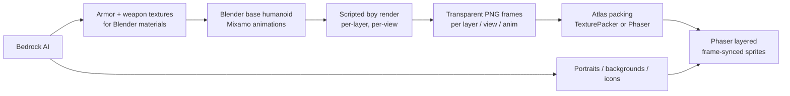

# Coliseum — Sprite Art Pipeline (pre-rendered 3D → 2D, layered paperdoll)

Status: **decided, scaffolding in progress** (2026-09-04).

This document replaces the pure-SVG art approach currently in
`frontend/src/pages/Projects/Coliseum/game/assets/art.ts` / `textures.ts` with a
pre-rendered 3D → 2D pipeline. The Phaser **integration architecture is
unchanged** — only the art source changes.

## Locked decisions

- **Target:** the Coliseum Phaser game (turn-based arena). Not a side-scroller engine.
- **Views:** **front** and **side** — two fixed orthographic render directions.
- **Shading:** **PBR** (Blender). PBR is only expensive at *render time*, never at
  runtime — the game just blits PNG frames exactly like it blits SVG today.
- **Animation:** real frame animation (not tweens): `idle`, `walk`, `attack`,
  `hit`, `death`.
- **Equipment matrix: unchanged from today.** Keep the existing tiers and
  distinctions, just overwrite the art:
  - 3 armor material groups (`armorGroup(tier)`: ≤2 bronze, ≤5 iron/steel, else gold)
    × 5 slots (`head`, `torso`, `leftArm`, `rightArm`, `legs`)
  - 9 weapon kinds: `gladius`, `axe`, `mace`, `spear`, `dagger`, `trident`,
    `greatsword`, `maul`, `halberd`
  - 4 shield kinds: `buckler`, `round`, `tower`, `net`
- **AI (AWS Bedrock) role:** portraits, backgrounds, panels, icons, and 3D
  *textures* — **not** animation and **not** the paperdoll compositing.

## The one structural consequence

`art.ts` currently synthesizes an arbitrary appearance (`skin × hair × robe`) as
SVG at runtime (`buildAppearanceSprite`, `ensureHumanAppearance`). Pre-rendered
3D cannot synthesize new variants at runtime, so the appearance system becomes a
**finite, pre-rendered catalog**:

- Bodies: **2 genders × 4 skin tones × 5 hairstyles = 40** pre-rendered base
  bodies. Robe color is applied as a runtime `setTint` on the body layer (or
  pre-render 8 robe colors and pick).
- The current 800-combo runtime synthesis is retired; `appearance.ts` keeps its
  data model but maps onto the finite catalog instead of generating geometry.

## Pipeline overview

## Phase plan

### Phase 0 — Lock fundamentals
- Two cameras in the `.blend`: `CamFront`, `CamSide` (orthographic, fixed,
  transparent film, matching scale — the two must render the character at the
  same pixel height).
- Animation set: `idle`, `walk`, `attack`, `hit`, `death`. Each stored as an
  Action/NLA strip with the same name so the render script can drive frame ranges.
- Frame budget (keep small, it's a management game):
  - `idle` 8–12, `walk` 8–12, `attack` 8–14, `hit` 4–6, `death` 8–12.
- Render size: **240×360** (2× the current 120×180 display) transparent RGBA PNG.

### Phase 1 — Base rig (Blender + Mixamo)
- One male + one female CC0/MakeHuman base mesh.
- Auto-rig via Mixamo and retarget the five animations onto a shared armature.
- Author collections named exactly (see **Naming convention** below).
- Full step-by-step `.blend` authoring checklist:
  **`docs/guides/Coliseum-Blender-Authoring.md`**.

### Phase 2 — Scripted render
- `scripts/blender/render_fighter_layers.py` (scaffolded) renders each layer
  pass with only that layer visible, body hidden where appropriate, weapon
  parented to the hand bone so it already carries the correct per-frame
  position/rotation.
- **Prototype first:** render *one* full combo (body + one armor set + one
  sword) and get the look approved before rendering the whole matrix.

### Phase 3 — Phaser integration (after first render approves)
- New `game/assets/sprites.ts`: `loadFighterSheets()`, an
  `addLayeredFighter` rewrite that returns a `Container` of **frame-synced
  `Sprite`s** (all layers `anims.play(sameKey)`, synced on the master sprite's
  frame index), and `addEquipmentIcon` for the rendered icon sheets.
- Wounds: re-author blood/severed as per-frame 3D renders (or screen-space
  overlays) so they stay aligned during motion.

### Phase 4 — Bedrock for static assets
- Portraits: Titan Image Generator v2 with **image conditioning** on one approved
  reference so every bust matches style (fixes the earlier style-drift revert).
- Backgrounds, panels, icons, title art — same conditioning workflow.
- Armor/weapon albedo + roughness + normal textures for the Blender materials.

### Phase 5 — Polish
- Drop shadows, texture atlases (memory), `reducedMotion` fallback (play fewer
  frames), responsive rescale.

## Naming convention (Blender → Phaser keys)

The render script emits frames whose folder names map 1:1 onto the existing
Phaser texture keys in `textures.ts`:

| Layer | Blender collection | Folder | Existing Phaser key prefix |
| --- | --- | --- | --- |
| Body | `Body.<variantId>` | `human/<variantId>/<view>/<anim>/` | `coliseum-human-` |
| Armor | `Armor.<slot>-<tier>` | `armor/<slot>-<tier>/<view>/<anim>/` | `coliseum-armor-` |
| Armor icon | `ArmorIcon.<slot>-<tier>` | `armor-icon/<slot>-<tier>/` | `coliseum-armor-icon-` |
| Weapon | `Weapon.<kind>` | `weapon/<kind>/<view>/<anim>/` | `coliseum-weapon-` |
| Off-hand weapon | `Offhand.<kind>` | `offhand-weapon/<kind>/<view>/<anim>/` | `coliseum-offhand-weapon-` |
| Weapon icon | `WeaponIcon.<kind>` | `weapon-icon/<kind>/` | `coliseum-weapon-icon-` |
| Shield | `Shield.<kind>` | `shield/<kind>/<view>/<anim>/` | `coliseum-shield-` |
| Shield icon | `ShieldIcon.<kind>` | `shield-icon/<kind>/` | `coliseum-shield-icon-` |

- `<view> ∈ {front, side}`, `<anim> ∈ {idle, walk, attack, hit, death}`.
- Icons are a single orthographic frame (no animation), like the current SVG icons.

## Rollout (prototype-first)

1. Author one base body + one sword + one armor set in Blender.
2. Run the render script for just those, approve the look + camera scale.
3. Render the full catalog, pack atlases.
4. Swap in `sprites.ts` behind a flag, delete the old SVG maps once stable.

## Gotchas

- `TextureManager.addBase64` is async (existing note) — the new pipeline loads
  raster files via `scene.load`, so preload + await in `BootScene` like
  `loadMapRaster`/`loadArenaRaster` already do.
- Keep the 2:3 frame ratio (240×360) so `SPRITE_W×SPRITE_H` (120×180) scaling
  is distortion-free.
- Front and side must render at the **same bounding height** or a view switch
  will visibly change the character's size.
- IP rule: original 3D models/materials only — no copied reference assets.
