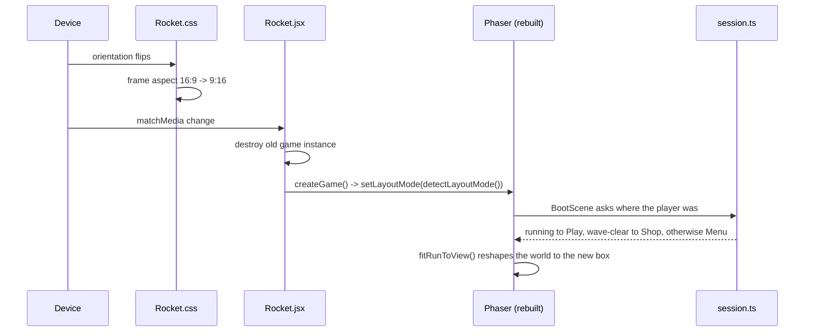

# Games — the build guide (canvas / Phaser)

How the canvas games in this repo are built, and the patterns to reuse when
building or repairing another one. **Rocket** (`/rocket`) is the reference
implementation — every example below is real code from it — and the centrepiece is
**§3, the two-layout system**, because that is the part Coliseum got wrong and the
part that is hardest to retrofit later. Coliseum itself is archived: see
[`../archive/coliseum/README.md`](../archive/coliseum/README.md).

- **Read this** before touching `frontend/src/pages/Projects/Rocket/`, or before
  starting another Phaser game — the layout pattern is game-agnostic (§10).
- **Sprites and music come from the asset pipelines** — see Part 3 (sheets → named
  transparent PNGs) and Part 5 (music/SFX rendered offline) of
  [`STATIC_ASSETS_AND_IMAGE_GENERATION.md`](./STATIC_ASSETS_AND_IMAGE_GENERATION.md).
- **Progress that follows the player** (profile-backed save + the public
  leaderboard) is §9.
- Verified working on desktop, Android and iPhone (portrait and landscape).

---

## 1. The stack and the file map

React owns the page; Phaser owns everything inside the frame. The route chunk does
not contain Phaser — it is fetched by dynamic import only after the player taps
through the gate.

```
frontend/src/pages/Projects/Rocket/
  Rocket.jsx              React shell: SEO, header/footer, launch gate, rotation rebuild
  Rocket.css              the frame's two shapes (the other half of the layout system)
  game/
    index.ts              public entry for the dynamic import
    main.ts               createGame(parent) -> { game, destroy }
    config.ts             Phaser config: Scale.FIT over the active design box
    assets.ts             sprite loading, magenta placeholder, runtime glow
    save.ts               rocket.save.v1   (permanent: coins, upgrades, ships, bests)
    settings.ts           rocket.settings.v1 (muted, reducedMotion, parallax)
    session.ts            THE RUN singleton (world + save + seed) — survives a rebuild
    accessibility.ts      announce() -> window.__rocketAnnounce
    audio/sfx.ts          100% synthesized WebAudio, zero audio assets
    core/                 PURE TypeScript, zero Phaser imports
      types.ts  constants.ts  rng.ts  tables.ts  ships.ts  upgrades.ts  waves.ts  engine.ts
    ui/
      theme.ts            palette + type + THE LAYOUT BOXES   <-- §3
      button.ts           addText / createButton / createIconButton / createBar
      backdrop.ts         addSpaceBackdrop / addPanel
    scenes/               Boot, Menu, Play, Shop, GameOver
```

**The rule that makes this testable:** `game/core/` never imports Phaser. The
simulation is a pure function of `(world, dtMs, input) -> WorldEvent[]`, so it runs
in jsdom with no WebGL. Scenes are *renderer + input adapter*: read input, call
`stepWorld`, map the returned events to sound/shake/announce, paint the world.
Nothing in a scene can corrupt game state.

```
React shell ──mounts──> Phaser.Game ──scenes──> { render, input }
                                            │
                                            └──calls──> core/engine.ts (pure)
                                                            ▲
                                            session.ts ─────┘ owns the World
```

---

## 2. Rendering model: pool by entity id, never rebuild the display list

Every frame, groups of entities are synced into `Map<id, Image>` pools: create on
first sight, reuse while alive, `destroy()` + delete when gone (`syncGroup` in
`PlayScene`). Sprites are normalised to a target on-screen size so a 160px source
and a 384px source read the same (`SIZE = { player: 66, bullet: 26, … }`), with
`scaleTo()` doing `target / max(width, height)`.

Depth is a small fixed ladder: backdrop `-20`, stars `-19`, entities `1`, player `4`,
HUD `9`–`11`, banner `15`, pause overlay `60`.

**Gotcha:** the parallax starfield must read `VIEW_WIDTH`/`VIEW_HEIGHT` live (§3) or
stars will drift outside a portrait arena.

---

## 3. The two-layout system (the important part)

### 3.1 The decision

**Two fixed design boxes, chosen once at boot from the device orientation. Nothing
reflows, ever.**

| | Landscape | Portrait |
|---|---|---|
| Design box | `1280 × 720` (16:9) | `720 × 1280` (9:16) |
| Chosen when | viewport is wider than tall | viewport is taller than wide |
| Phaser scale | `FIT` + `CENTER_BOTH` | `FIT` + `CENTER_BOTH` |

Why not `Scale.RESIZE` (which Coliseum uses): with RESIZE the canvas *is* the
viewport, so every scene needs a resize path — and each one is a bug you only ever
see on a device you don't own. It also silently changes the game: a shooter's
difficulty is a function of how much room there is to dodge, so a wider window makes
it easier. With fixed boxes the arena shape is authoritative and FIT letterboxes the
remainder with bars the *page* paints, so **no scene contains a single resize
handler**.

The second payoff: because the game is rebuilt rather than reflowed on rotation,
scene layout code only ever runs once per game instance. `create()` reads the box
and lays out; nothing has to re-run.

### 3.2 The API — `game/ui/theme.ts`

```ts
export type LayoutMode = 'landscape' | 'portrait';

export const LANDSCAPE = { width: 1280, height: 720 } as const;
export const PORTRAIT  = { width: 720, height: 1280 } as const;

// LIVE BINDINGS. setLayoutMode() reassigns these and every importer sees it.
export let VIEW_WIDTH: number = LANDSCAPE.width;
export let VIEW_HEIGHT: number = LANDSCAPE.height;

export function setLayoutMode(next: LayoutMode): void;   // call BEFORE new Phaser.Game
export function detectLayoutMode(): LayoutMode;          // matchMedia, defaults landscape
export function isPortrait(): boolean;
export function layoutMode(): LayoutMode;
```

`main.ts` performs the switch exactly once:

```ts
export function createGame(parent: HTMLElement): GameHandle {
  // The design box is chosen once, here, before Phaser exists. Every scene reads
  // it while laying out, so it must not change while a game instance is alive.
  setLayoutMode(detectLayoutMode());
  const game = new Phaser.Game(createGameConfig(parent));
  …
}
```

**RULE — never capture the box in a module-level constant.**

```ts
const W = VIEW_WIDTH;            // ✗ frozen at import time, wrong after a switch
const PANEL = { w: W - 60 };     // ✗ same
scene.add.rectangle(VIEW_WIDTH / 2, …)   // ✓ read at call time
```

Module-level values must not derive from the box. Per-scene *cell sizes* and layout
constants are fine, but they belong in `create()` (or a private field set there), not
at module scope. `layout.test.ts` asserts the live-binding behaviour, so a module
that copies the values will fail.

### 3.3 One signal, three places — they must agree

The media query `(orientation: portrait)` is the *only* orientation signal used, and
three layers depend on it. If they disagree, the page paints a 16:9 frame around a
9:16 canvas (or vice versa).

| Layer | File | What it does with the signal |
|---|---|---|
| Page frame | `Rocket.css` | `@media (orientation: portrait)` swaps `aspect-ratio` to `9 / 16` and shrinks the vertical gutter |
| Game box | `game/ui/theme.ts` | `detectLayoutMode()` → `setLayoutMode()` |
| Rebuild | `Rocket.jsx` | `matchMedia('(orientation: portrait)')` change listener → rebuild |

`Rocket.css`, abridged — **the frame must be the same shape as the canvas**, or the
letterboxing reappears *inside* the canvas:

```css
.rocket-frame {
  --rocket-aspect: 16 / 9;
  --rocket-gutter: 96px;
  width: min(100%, calc((100vh - var(--nav-size) - var(--rocket-gutter)) * 16 / 9));
  aspect-ratio: var(--rocket-aspect);
}

@media (orientation: portrait) {
  .rocket-frame {
    --rocket-aspect: 9 / 16;
    /* A phone can't spare 96px of vertical padding the way a desktop can. */
    --rocket-gutter: 56px;
    width: min(100%, calc((100vh - var(--nav-size) - var(--rocket-gutter)) * 9 / 16));
  }
}
```

`width: min(100%, …)` is the whole trick: the frame takes the full width when that is
the binding constraint (portrait) and the height-derived width when *that* is
(landscape). No JS measures anything.

### 3.4 Laying out a scene

Add the four getters, then branch only where the arrangement genuinely differs:

```ts
private get w(): number  { return VIEW_WIDTH; }
private get h(): number  { return VIEW_HEIGHT; }
private get cx(): number { return VIEW_WIDTH / 2; }
private get portrait(): boolean { return isPortrait(); }
```

Things that **never** need a branch, because they are anchored to an edge:

```ts
addText(this, 26, 22, 'SCORE 0', …)                       // top-left HUD
createIconButton(this, VIEW_WIDTH - 32, 32, '❚❚', …)      // top-right
addText(this, this.cx, this.h - 32, hint, …)              // bottom centre
this.hullSlot = { x: 26, y: VIEW_HEIGHT - 34 };           // bottom-left, computed in create()
```

Things that **do** need a branch:

| Screen | Landscape | Portrait | Why |
|---|---|---|---|
| Menu ship panel | panel `860×214` at y=320, ship at x=410 **beside** stats at x=560 | panel `660×350` at y=470, ship centred at y=420 **above** stats at y=552 | 860 doesn't fit in 720 |
| Menu footer | one row: hint + mute + RESET + note | **two rows**: hint on its own line at `h-84`, controls at `h-34` | three items collide in 720px |
| Menu actions | PLAY y=528, HOW TO PLAY y=598 | PLAY y=930, HOW TO PLAY y=1014, bigger buttons | vertical budget |
| Shop grid | 4×2 cells `284×158`, startY 196 | 2×4 cells `326×158`, startY 240 | 4 columns = 1190px, doesn't fit in 720 |
| Shop actions | side by side at `cx ∓ 130`, y=636 | stacked at `cx`, y=1050 / 1130 | width |
| Game over | short card: panel `620×220` at y=300, rows from y=222 every 34 | tall card: panel `620×320` at y=510, rows from y=390 every 44, block centred | vertical budget |
| Controls overlay | body text unwrapped at 18px | same text wrapped to `w - 80` at 16px | long lines overflow 720 |
| Boot bar | 440 wide | 440 wide (already fits) | — |

Everything else is edge-anchored and identical in both boxes — the arena HUD, the
pause overlay (centred on `cx/cy`), the shop header, the banner (`VIEW_HEIGHT * 0.28`).

### 3.5 Reviewing a portrait layout (what actually broke)

Portrait bugs are almost always **collisions and clipping**, not wrong scale. Check:

1. **Text width at 720px.** A 40-character centred line at 15px is ~470px — fine, but
   two of them in one row are not. Wrap (`wrap: this.w - 60, align: 'center'`) and/or
   move to its own row.
2. **Rows that were one row in landscape.** Footer control strips are the usual
   offender (§3.4).
3. **Panels wider than 720** (menu panel was 860; 860 − 2×40 margin > 720).
4. **Bottom-anchored text over a bright backdrop.** The space backdrop is a nebula
   and it is bright in patches; `TEXT.dim` on top of it is unreadable. Either put the
   row on a scrim (`this.add.rectangle(cx, h - footerH/2, w, footerH, PALETTE.bg, 0.62)`,
   created **before** the text) or lift the colour to `TEXT.muted`.
5. **Sprite scale.** The ship sprite is up to 384px tall; at `scale 0.82` it is 315px.
   In portrait it is `0.55` (211px) so it fits inside a 350px-tall panel.

### 3.6 Rotation: rebuild, don't reflow

The shell watches the same media query and, if the game is running, destroys and
recreates it. That is the entire "responsive" story.

```jsx
const mountedLayoutRef = useRef(null);   // which box the LIVE instance was built for

const mountGame = useCallback(async () => {
  const { createGame } = await import('./game');
  handleRef.current?.destroy();
  handleRef.current = createGame(containerRef.current);
  mountedLayoutRef.current = detectLayout();   // read the source, not state
}, []);

useEffect(() => {
  if (phase !== 'playing') return;
  if (mountedLayoutRef.current === layout) return;   // also catches a flip during load
  mountGame().catch(…);
}, [phase, layout, mountGame]);
```

Three details that matter:

- **`mountedLayoutRef`, not `phase` alone.** The guard prevents a double mount when
  the phase changes from `idle` → `playing`, and it still catches a rotation that
  happened *while the chunk was loading* (the phase change brings us back here, and
  the ref no longer matches).
- **Read the layout back from `detectLayout()` after mounting** rather than from React
  state: `createGame` detects it internally, so this records what the instance
  actually got, with no stale-closure risk.
- **Only rebuild while `playing`.** At the gate there is nothing to rebuild — the CSS
  alone reshapes the frame.



### 3.7 The run survives the rebuild

The run is **not** in the scene tree — it is a module singleton in `session.ts`, which
is why rebuilding is cheap and lossless.

```ts
startRun(seed?)      // fresh world at the ACTIVE box size
currentWorld()       // the world, or null
fitRunToView()       // the world reshaped to the active box, or null if there's nothing to resume
advanceWave()        // shop -> next wave
bankCoins(n)         // called on every coin pickup: coins are banked the instant they're collected
purchase(key)        // permanent upgrade, applied to the live run immediately
finishRun()          // record the run AND end the world
```

`BootScene.create()` routes on the world's status — this is what makes rotation feel
like nothing happened:

```ts
const run = currentWorld();
if (run?.status === 'running') this.scene.start('Play');
else if (run?.status === 'wave-clear') this.scene.start('Shop');
else this.scene.start('Menu');
```

**Two rules this depends on:**

1. `finishRun()` must **end** the world (`status = 'dead'`), not just record it.
   Otherwise quitting to the menu and then rotating resurrects the abandoned run.
   `fitRunToView()` refuses a dead world, so the next PLAY starts fresh.
2. `resizeWorld(world, w, h)` must bring **everything in flight** inside the new bounds
   — player, enemies (and their `anchorX`, which weave/strafe steer back toward),
   bullets, pickups. A wave that was mid-spawn in a 1280-wide arena otherwise leaves
   enemies parked off the right edge of a 720-wide one, where they can be neither shot
   nor shot at, and the wave can never complete.

Known cosmetic gap: rotating while on the game-over card lands on the menu. Nothing is
lost (coins banked, run recorded); only the ★ NEW BEST ★ badge is skipped.

---

## 4. Verifying your work

### 4.1 The commands

```powershell
# from the repo root — the CANONICAL jest config is the ROOT package.json
& 'C:\Program Files\nodejs\node.exe' node_modules\jest\bin\jest.js --ci `
    --config package.json frontend/src/pages/Projects/Rocket

cd frontend; npx tsc --noEmit      # must be silent
npm run build                      # must end with "built in Ns" + sitemap 24 routes
```

`node`/`npx` intermittently vanish from `PATH` in this workspace; the absolute-path
form above always works. Full frontend suite should be green too (1273 tests / 42
suites as of this writing).

### 4.2 Testing a game in the browser (the technique that made this possible)

The canvas is opaque to the accessibility tree — there is nothing to click or read.
Two things solve it:

1. **The game narrates itself.** `accessibility.ts` `announce()` writes to
   `window.__rocketAnnounce`, which the shell wires to a visually hidden
   `role="status"` region. So the *status text is a test signal*:

   ```js
   await page.evaluate(() => document.querySelector('[role=status]').textContent)
   // "Wave 1 begins. Hull 3 of 3." / "Shop open. …" / "Run over. Score 540, wave 3 …"
   ```

   `BootScene` also `console.warn`s the names of any sprites that failed to load —
   check the console, because a missing sprite degrades to a magenta box silently
   otherwise.

2. **Canvas coordinates map to the CSS box**, so tests click by game coordinate:

   ```js
   const box = await page.locator('canvas').boundingBox();
   await page.mouse.click(
     box.x + 360 * (box.width / 720),      // design-box x
     box.y + 930 * (box.height / 1280),    // design-box y
   );
   ```

3. **Testing portrait without a phone**: resize the viewport, which flips the media
   query and therefore the whole system:

   ```js
   await page.setViewportSize({ width: 430, height: 932 });
   // the canvas must report width 720 / height 1280
   await page.evaluate(() => { const c = document.querySelector('canvas');
     return `${c.width}x${c.height}`; });
   ```

**Checklist for any screen you touch** — do it in both boxes:

- [ ] console has no `[rocket]` sprite warning and no page error
- [ ] exactly **one** `<canvas>` (a double mount means the shell effect fired twice)
- [ ] menu: carousel changes sprite/stats, HOW TO PLAY and RESET overlays open/close
- [ ] arena: keys **and** pointer drag both steer, auto-fire, HUD, hull/shield icons
- [ ] pause: Escape / p toggles, and it is inert on every other screen
- [ ] shop: buy changes coins + pips, cost grows 1.8×, MAXED disables, coins persist
- [ ] wave clear → shop → NEXT WAVE resumes the same run
- [ ] death → RUN OVER with stats and PLAY AGAIN
- [ ] rotate mid-wave: the same wave resumes, one canvas, Escape still works

### 4.3 What is worth a unit test

Unit tests cover the **pure** layer and the layout switch — not the canvas:

| File | Covers |
|---|---|
| `core/engine.test.ts` | movement/clamp, firing + cooldown + barrels + dt cap, kills, shield-vs-hull, invuln, pickups, wave clear, boss, resize |
| `core/waves.test.ts` | wave composition, unlock schedule, determinism, escalation |
| `core/upgrades.test.ts` | cost curves, no-mutation, `deriveStats` per axis |
| `core/sprites.test.ts` | every required sprite exists in the shipped manifest; ships + shop icons are in the load set |
| `layout.test.ts` | the box switch, detection + fallback, run built in the active box, reshape preserves progress, finished run refused |

**`engine.test.ts` convention:** `emptyWorld()` holds a far-future `pending` spawn so
the wave cannot clear mid-assertion; `finishWave(world)` releases it. Without that,
score and coin assertions get a wave-clear bonus mixed in and fail mysteriously.

**`sprites.test.ts` is a tripwire, not decoration.** Verify it fails when you break it
(temporarily remove a table from `requiredSprites()` and watch it name the sprite).

---

## 5. Gotchas that cost real time

Ordered by how much time they cost.

1. **Sprite load set.** `assets.queueGameSprites` loads *exactly* `requiredSprites()`
   and nothing else. Ships and shop icons are drawn only on the menu / between-wave
   screen, so they were missing from that aggregation and Phaser silently drew its own
   **green "missing texture" box** on the first screen. Add new sprites to the relevant
   table in `core/tables.ts` (or `SHIPS`/`UPGRADES`), never as a literal in a scene.
   `sprites.test.ts` enforces it.
2. **Events must carry the data the renderer needs to apply.** `checkWaveEnd` credited
   `world.coins`, but the `wave-clear` event only carried `wave` — and coins are banked
   *from events*, so every wave-clear bonus was silently thrown away. The event now
   carries `coins`. Rule: if the renderer acts on it, put it on the event.
3. **Phaser Key objects did not fire for Escape here** (Coliseum hit this first). Use a
   plain `window.addEventListener('keydown')` and switch on `event.key`.
4. **A leaked DOM listener + a torn-down scene throws
   `Cannot read properties of null (reading 'add')`.** Release the listener on scene
   `SHUTDOWN` **and `DESTROY`** (the shell destroys the whole game on rotation, which
   fires DESTROY — not SHUTDOWN), *and* guard the handler with
   `if (!this.scene.isActive()) return;`. The nasty symptom: `announce()` runs before
   the crash, so the only visible sign is a wrong status line.
5. **Never let a scene write `this.add` after it is gone.** Both layers above are
   required; either alone leaves a hole.
6. **A missing texture must be loud.** Scenes resolve textures through a `tex()` helper
   that falls back to the magenta `PLACEHOLDER_KEY`, never `'__MISSING'`; `BootScene`
   lists the failures. `generateTexture` is wrapped in try/catch (a headless
   environment has no renderer).
7. **Scrim before text.** The footer band is a rectangle; if you create it *after* the
   text it paints over the text.
8. **The page cannot be prettier/lint clean.** `npm run lint` cannot run at all in this
   repo: `.eslintrc.json` extends `@typescript-eslint/recommended`, which is not a
   resolvable shareable-config name (it needs `plugin:@typescript-eslint/recommended`).
   The tree is also not prettier-clean. Match the neighbours by hand; don't reformat
   unrelated files.
9. **Dev HMR leaves the canvas blank** after editing anything under `game/` — Vite
   invalidates the dynamically imported module and React's mount effect does not re-run.
   Reload the page. Production is unaffected.
10. **Audio is gesture-gated.** `main.ts` attaches `pointerdown`/`keydown` to unlock the
    `AudioContext`; `config.ts` sets `audio: { noAudio: true }` because all sound is
    synthesized in `audio/sfx.ts`.

---

## 6. Adding content

1. **Sprite** — extract it (see Part 3 of `docs/guides/STATIC_ASSETS_AND_IMAGE_GENERATION.md`), then add the
   name to the relevant table in `core/tables.ts` / `core/ships.ts` / `core/upgrades.ts`.
   The extractor names each PNG after its asset, so **the manifest name is the texture
   key** — no lookup table.
2. **Enemy** — add an `EnemyDef` to `ENEMY_DEFS` (hp, radius, speed as a *fraction of
   world height*, score, coins, `fireMs`, `shotDamage`, sprite variants, death effect),
   then schedule it in `waves.ts` via `TUNING.unlockWave`.
3. **Upgrade** — add to `UPGRADES` (name, blurb, sprite, `maxLevel`, cost curve) *and*
   to `deriveStats()` if it changes stats. The shop grid rebuilds itself from
   `UPGRADE_ORDER`.
4. **Tune difficulty** in `core/constants.ts` (all speeds are fractions of the world
   height, so they behave identically in both boxes).
5. Run `sprites.test.ts` — it fails if you forget the load set.

---

## 7. Accessibility and audio (cheap, and easy to lose)

- `announce(message)` → `window.__rocketAnnounce` → hidden `aria-live` region. Call it
  on every state change a sighted player would notice: wave start/clear, hit, hull
  remaining, purchase, pause/resume, death summary, ship selection.
- The launch gate is a real `<button>`; once the canvas mounts, no DOM is layered over
  the game.
- Mute lives on the menu and in the arena HUD; `reducedMotion` is seeded once from
  `prefers-reduced-motion` and then player-owned, and it suppresses screen shake and
  banner fades.
- **Audio is two layers**: synthesized WebAudio effects (`game/audio/sfx.ts`, no
  assets) and rendered music/cues (`game/audio/music.ts`, assets produced by
  `scripts/rocket/generate-audio.js`). Phaser's sound manager is disabled
  (`audio: { noAudio: true }`), so both ride one shared `AudioContext` and one master
  gain — which is what makes a single mute instant and lets the music loop
  sample-exactly. Music also has its own switch (`settings.music`). See
  `docs/guides/STATIC_ASSETS_AND_IMAGE_GENERATION.md` Part 5 (music/SFX).

---

## 8. Mobile specifics

- **Auto-fire is always on** — there is no fire button. On touch all attention goes to
  dodging, and the game is playable one-handed. Pointer drag steers when
  `pointer.isDown` with a 10px dead zone, so a tap that wobbles doesn't yank the ship.
- **`FIT` gives touch coordinates for free** — Phaser maps them through the same
  transform as rendering, so drag steering needs no manual scaling.
- **Portrait is the primary phone experience** (a shmup reads naturally tall), which is
  why the layout work was worth doing rather than shipping landscape-only.
- Verified on Android and iPhone in both orientations. What to re-check after any
  layout change: no element clipped at the frame edge, no text over the bright parts of
  the backdrop, and the arena HUD clear of the pause/mute buttons.

---


## 9. Progress that follows the player — cloud save and leaderboards

Rocket's progress (coins, upgrades, unlocked ships) and its public
farthest-wave board, both built on the app's generic, schema-less `/api/data`
routes — **no backend code**. The whole game stays offline-first: signed out, an
unreachable backend, or a garbage response all degrade to local-only play.

- **Read this** before touching `game/cloud.ts`, `game/save.ts`'s merge policy, or
  the menu's leaderboard overlay.
- Progress only — never run state. A run in flight is *not* synced; that is what
  `session.ts` deliberately keeps in memory.
- Any game can do this the same way (`Game2048.jsx` does); the three traps in §9.1
  are the part that costs time.

Files:

| File | Role |
|---|---|
| `game/save.ts` | Local save, `migrate` (clamping), `mergeSaves` (the policy), `updatedAt`/`submittedWave` |
| `game/cloud.ts` | Transport + row formats + ranking + status. Pure helpers are exported for tests |
| `game/cloud.test.ts` | 18 tests over the merge policy, parsing and ranking |
| `game/session.ts` | Decides *when* to sync (`syncCloud`, `whenCloudSynced`, debounced push, submit on new best) |
| `game/scenes/MenuScene.ts` | LEADERBOARD overlay, cloud-status line, refresh-after-sync |
| `game/scenes/BootScene.ts` | Kicks the boot sync; does not wait for it |
| `game/scenes/GameOverScene.ts` | One line saying whether/why this run went to the board |

(Paths are relative to `frontend/src/pages/Projects/Rocket/`.)

---

### 9.1 The API contract (and the three traps)

| Operation | Call | Body / query |
|---|---|---|
| Read my progress | `GET /api/data?data={"text":"RocketSave"}` | auth (returns **only my rows**) |
| Write my progress | `POST /api/data` | `{ text: "RocketSave\|{...}" }` — backend prepends `Creator:<id>\|` |
| Replace my progress | `DELETE /api/data/:id` per existing row, then POST | keeps exactly one row |
| Read the board | `GET /api/data/public?data={"text":"RocketLeaderboard"}` | no auth |
| Publish a wave | `POST /api/data` | `{ text: "RocketLeaderboard\|Public:true\|..." }` |

**Trap 1 — the private and public controllers read different field names.** The
private routes read `req.body.text`; `postData.js` reads `req.body.data.Text`. Send
`{ text }` to `/api/data/public` and you get a **500** (`Cannot read properties of
undefined (reading 'Text')`), not a validation error. This cost a debugging cycle;
the symptom looks like a broken client.

**Trap 2 — response rows use `data` and `_id`, not `text` and `id`.** Reading the
wrong fields filters every row away (saves never load) and makes the delete a
no-op (every write duplicates).

**Trap 3 — never `PUT /api/data/:id`.** It is coupled to unrelated payment-method
gating. Write a fresh row, delete the old ones.

#### Why the leaderboard writes through the authenticated route

The board is public, but entries are published with `POST /api/data` (auth) rather
than `POST /api/data/public`. `postData` does **not** stamp `Creator:`, and
`deleteHashData` refuses rows with no creator (`Data creator not found`) — so an
entry posted through the public route can **never be deleted by anyone**, including
the player who posted it. That was verified, not assumed: deleting such a row
returns **500**, while the same delete against an authenticated row returns **200**.

The row stays publicly discoverable either way, because the anonymous scan is
`contains(text, 'RocketLeaderboard') AND contains(text, 'Public:true')`, which
matches regardless of the `Creator:<id>|` prefix. (`parseLeaderboardRow` locates the
marker rather than assuming it is at the start — there is a test for the prefix.)

### 9.2 Row formats

Flat `Key: value` pairs joined by `|`, with JSON only where the value is structured:

```
Creator:<userId>|RocketSave|{"updatedAt":1789261093466,"bestScore":4200,"bestWave":13,
  "coins":89,"levels":{...},"unlockedShips":["scout"],"ship":"scout","runs":5,
  "kills":50,"submittedWave":13}

Creator:<userId>|RocketLeaderboard|Public:true|Wave:7|Score:2210|Name:Tanne|
  At:2026-09-13T01:04:51.497Z|UserId:<userId>
```

Saves are JSON because an upgrade map and a ship list are not flat values; the
marker and `Public:true` stay flat so the row is greppable and the two row kinds
can never be confused. `parseDelimitedFields` rejoins everything after the first
colon in a field, or ISO timestamps would truncate to `2026-09-13T01`.

### 9.3 Merge policy (`mergeSaves`)

Merging is driven by what each field *means*, because the two obvious policies are
both wrong: "newest wins" loses real progress, and "add everything up" mints coins.

| Field | Rule | Why |
|---|---|---|
| `levels`, `unlockedShips` | per-key `max`, union | Nothing in the game sells upgrades back, so "best of both" is exact and can only go up |
| `bestScore`, `bestWave`, `runs`, `kills` | `max` | Undercounting a run played elsewhere beats losing the record |
| `coins`, `ship` | the **newer `updatedAt`** wins | Coins are the one value that genuinely moves: `max` mints coins when a newer save has spent them, summing duplicates them |
| `updatedAt`, `submittedWave` | `max` | Monotonic |

Consequences worth knowing:

- **Permanent progression is guaranteed to merge.** "Same upgrades on any device"
  is not a heuristic.
- Only a wallet that changed on **two devices at once** can lose the older side's
  coins — the least-bad of the three outcomes.
- A save that was **never written has `updatedAt: 0`**, deliberately not
  `Date.now()`. A fresh install must lose the wallet comparison, or signing in on a
  new device would keep its zero coins. Verified: an empty profile adopted
  `coins: 89, damage: 2` from the cloud.
- **A wipe stamps `Date.now()`** (`resetSave`), so a deliberate reset wins the merge
  — otherwise signing in again would resurrect deleted progress.
- `merged.ship` is re-validated against the merged unlock list, so a merge can never
  leave the selected ship locked.

### 9.4 Lifecycle

```
BootScene.create()
  └─ void syncCloud()            (does not block the loading screen)
        ├─ read profile save ──► mergeSaves(local, cloud) ──► adopt + persist
        └─ (nothing stored) ────► push, but only if this device has written
MenuScene.create()
  ├─ onCloudChange(refresh)       status changes while the menu is open
  └─ whenCloudSynced().then(refresh)   ← closes the race below
Play / Shop
  └─ commit(save)  ──► stamp updatedAt, persistSave, schedule push
                          └─ 4s debounce ──► cloudPushSave
GameOverScene (via finishRun)
  └─ wave > submittedWave && signed in ──► submitScore ──► persist submittedWave
```

**The debounce is not optional.** Coins are banked on every pickup, so a single
wave would otherwise fire dozens of writes.

**The race, and why `whenCloudSynced()` exists.** The menu shows before the sync
finishes (so a slow network never delays play). Refreshing only from a change
notification is not enough: if the sync settles *before* the scene exists, the
notification is missed and the menu renders pre-merge numbers — a new device showed
`COINS 0` while the cloud save said 89. The scene therefore also awaits the settled
sync promise, which resolves immediately if it already finished. The listener is
kept for changes that arrive later (a push completing while the menu is open).

Both `SHUTDOWN` **and** `DESTROY` detach the listener: the shell destroys the whole
game on rotation, so `SHUTDOWN` alone leaves a callback writing into dead text.

**A failed read must never become a write.** `fetchOwnRows` throws on a non-ok
response instead of returning `[]`, so "no rows" and "could not ask" cannot be
confused — otherwise a transient 500 would push this device's stale save over a
good one. For the same reason the boot sync pushes nothing when `updatedAt === 0`
(a fresh install has no progress worth publishing).

### 9.5 UI

- **Cloud-status line** under `BEST / WAVE / RUNS` (y 196 landscape, 224 portrait,
  `TEXT.dim`): guest / syncing / saved / unreachable. A guest sees one muted line,
  never a nag.
- **LEADERBOARD button** beside HOW TO PLAY in landscape (`cx ∓ 140`, y 598, both
  260 wide — a 20px gap) and below it in portrait (y 1014 / 1090, 280 wide). The
  two-layout rules in §3 above apply: no resizing, a plain ternary
  between the two arrangements.
- **Overlay** (720×560 landscape, `w-40`×760 portrait): header columns `#`, `PILOT`,
  `WAVE`, `SCORE` with right-aligned numbers, up to 10 rows, then a footer. The
  current player's row is gold and bold. States: loading / rows / empty ("no runs on
  the board yet") / signed out ("Sign in to appear here. Your best so far: wave N.")
  / own entry ("Your best: wave N · rank #1").
- The fetch is fired *after* the overlay is on screen, so the button feels instant
  and an unreachable backend explains itself instead of freezing the menu. Rows are
  added to the overlay container on arrival, and the callback re-checks that the
  overlay is still that same container before drawing.

### 9.6 Verification

Proven against the **live local backend** while building this:

- Boot sync wrote a real row; the profile round trip matched local state exactly
  (`coins: 89`, `levels.damage: 2`, identical `updatedAt`).
- Replacing progress left **exactly one** row (delete-then-post works; no
  duplicates).
- A brand-new browser profile with empty local storage **adopted** the profile save
  — 89 coins, damage level 2, and a `bestWave` it had never held locally.
- The published wave appeared on the anonymous board scan and was **deletable by its
  author** (`DELETE` → 200).
- Both orientations render correctly (screenshots taken in landscape 1280×720 and
  portrait 720×1280), plus the signed-out board state.
- 100 Rocket tests / 7 suites pass; `tsc --noEmit` clean.

The merge tripwire was verified the reliable way: loosening the wallet rule to
`Math.max` makes exactly one test fail (`takes the wallet from the most recent write,
and never mints coins`). A test that cannot fail is not a test.

**Note the jest working directory.** The jsdom default lives in the **root**
`package.json`; running `npx jest` from `frontend/` silently uses the node
environment and breaks any test touching `window` (2 failures in `layout.test.ts`).
Run suites from the repo root: `npx jest frontend/src/pages/Projects/Rocket`.

### 9.7 Known limitations

- **No server-side plausibility check on a submitted wave.** The client clamps wave
  and score, which is a soft guard only; real anti-cheat needs a dedicated backend
  controller. (Same caveat as the 2048 board.)
- **Rows published before this change** (via the public route, no `Creator:`) cannot
  be deleted through the API by anyone. One such test row remains on the board.
- A run that ends while offline is still recorded locally, but its wave is only
  published on a later boot if it still beats `submittedWave` — a failed publish is
  retried by the next qualifying run, not by a queue.
- The leaderboard is fetched fresh on each open; there is no polling or cache.


## 10. Reusing this for another game (or retrofitting Coliseum)

The layout system is deliberately game-agnostic. To adopt it:

1. Copy `ui/theme.ts` and change only the two box sizes.
2. Make `main.ts` call `setLayoutMode(detectLayoutMode())` before `new Phaser.Game`.
3. Switch the Phaser scale to `FIT` + `CENTER_BOTH` and delete every `resize`/editor
   handler a `RESIZE` setup needed. A scene computes its layout in `create()` and
   nothing else.
4. Point the page CSS at the same media query (one `aspect-ratio` swap).
5. Have the React shell rebuild the game when the query flips, and keep the run in a
   module singleton so the rebuild is lossless.
6. Add the four getters (`w/h/cx/cy/portrait`) per scene and branch only where the
   arrangement differs — resist branching anything else.

Expect the deletion of resize handlers to be the biggest win: Coliseum's per-scene
reflow logic is exactly the surface this pattern removes.

---


---

## Related docs

- [`STATIC_ASSETS_AND_IMAGE_GENERATION.md`](./STATIC_ASSETS_AND_IMAGE_GENERATION.md) — Part 3
  (sprite sheets → named transparent PNGs), Part 5 (music/SFX rendered offline), Part 2
  (generating a new source image with Bedrock), Part 1 (serving assets from the CDN).
- [`FRONTEND_UI_STANDARD.md`](./FRONTEND_UI_STANDARD.md) — the page around the canvas:
  layout, motion, and the service-page rules a game page follows.
- [`../implementation/agent.md`](../implementation/agent.md) → *The repo, in one screen* —
  where `frontend/`, `backend/` and the addon meet.
- `frontend/src/pages/Projects/Rocket/` — the reference implementation, and
  `frontend/src/pages/Projects/Quizzes/` / `Coliseum` for the older shapes.
