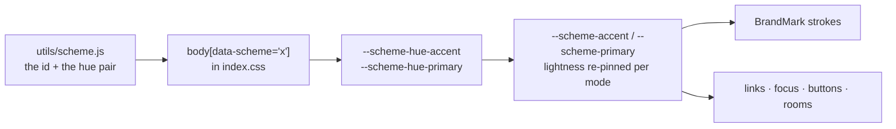

# The brand mark — a scheme-aware logo

> **How the logo is built, why two of its colours follow the visitor's colour scheme, and
> which surfaces deliberately do not.**
>
> Read this before touching the mark, the favicon or the addon's icons. Three of the four
> answers below are "paint it from tokens" and one is "you can't, and you don't want to".

Status: ✅ shipped 2026-09-14. The mark is live in the header, the chat empty state and the
default avatar; every raster surface is generated from one master.

---

## 0. The answer, per surface

| Surface | Follows the scheme? | Where it lives |
| --- | --- | --- |
| Site header (38px) | ✅ **Yes** | `components/BrandMark/` inline SVG |
| Chat empty state (64px) | ✅ **Yes** | same component |
| Default avatar | ⚠️ **No — the `plate` variant** | `components/ProfilePicture/ProfileAvatar.jsx` |
| Browser tab / PWA icon | ⬜ **Static** | `public/Checkmark192.ico` |
| Apple-touch icon, OG card | ⬜ **Static** | `public/STHlogo192.png` |
| Addon tray icon | ⬜ **Static** | `simple-addon/resources/icon.png` |
| Addon window icon, installer, desktop + Start-menu shortcuts | ⬜ **Static** | `simple-addon/resources/icon.ico` |

**The split is not a compromise, it is the shape of the problem.** Everything we render
ourselves is an element, and an element can take a token. Everything the OS or a crawler
reads is a *file*, and a file cannot. Those are also exactly the surfaces where nobody
would benefit: a favicon is a 16px glyph in a tab the visitor is not looking at, and an
installer icon is baked into an `.exe` at build time and cached by the Windows shell.

---

## 1. Why this works at all: the logo already *is* Ocean

The default scheme is `ocean` — accent `#06b6d4` (cyan), primary `#3b82f6` (blue)
(`frontend/src/utils/scheme.js`). The mark is a cyan check in a royal-blue ring.

So with the two strokes mapped the right way round (§2), **a first-time visitor sees the
logo exactly as it was drawn.** Recolouring is something a visitor opts into by picking a
scheme; it is never a tax on the default. That property is what makes the whole idea safe —
and it is why the mapping is not a style preference. Flip it and every default visitor gets
a cyan ring around a blue tick: a logo that is wrong out of the box.

---

## 2. The mark: three strokes, and where each colour comes from

One inline SVG with four elements, drawn back to front.

| Element | Token | On Ocean | Why |
| --- | --- | --- | --- |
| Field (inner disc) | `--bg-1` | white / dark panel | The canvas — see §3.1 |
| Frame (ring) | `--scheme-primary` | `#3b82f6` — the ring as designed | The identity's *partner* hue |
| Keyline | `--bg-1`, wider than the glyph | white / dark | The gap — see §3.3 |
| Glyph (check) | `--scheme-accent` | `#06b6d4` — the check as designed | The identity's *dominant* hue |

**Both scheme strokes come from *derived* tokens, and that is deliberate.** It means the
mark adds **no fourth copy of the scheme list.** The hue table already lives in three
places — `utils/scheme.js`, the `body[data-scheme='…']` block in `frontend/src/index.css`,
and `simple-addon/renderer/appearance/appearance.js` — with `appearance.test.js` asserting
agreement. Binding to `--scheme-accent` / `--scheme-primary` keeps "adding a scheme is one
line" true. Twelve hand-tinted SVG files would break that promise and drift the first time
somebody added a scheme.



### Geometry lives in JS, colour lives in CSS

`components/BrandMark/geometry.js` holds the viewBox, radii, stroke weights and the check
path — and **no colour at all**. `BrandMark.css` holds the four `fill`/`stroke`
declarations and nothing else.

That split is load-bearing in both directions:

- A `fill`/`stroke` **attribute** in the JSX would out-rank the stylesheet and silently pin
  the mark to one colourway. `BrandMark.test.jsx` asserts the markup contains none.
- Geometry in JS is what the parity test can compare against the master artwork (§4).

---

## 3. The four traps

### 3.1 The field is not decoration — it is what makes the mark readable

The header is not on a plain page. On `/net` the room paints a **scheme-tinted backdrop**
(`--scheme-backdrop-*`), and `SimpleCtaBand` sits on `--scheme-accent-bg` →
`--scheme-primary-bg`, a 38% mix of the mark's *own two hues* into the page colour.

A mark drawn entirely in scheme hues, on a tint of those same hues, is **one colour on a
lighter version of itself**. A solid `--bg-1` field fixes it: it separates the strokes from
any backdrop and inverts with light/dark for free. It is the same recipe §5.7 of the UI
standard gives a control sitting on a tinted plane. Do not replace it with `transparent`.

Measured, against the field: ring 5.0–10.9:1 and glyph 4.9–5.9:1 in light; ring 6.0–9.0:1
and glyph 6.0–6.8:1 in dark, across all twelve schemes.

### 3.2 The scheme hues are re-pinned, so the mark will not match the picker swatch

`--scheme-accent` is not the identity hex:

```css
--scheme-accent: oklch(from var(--scheme-hue-accent) var(--scheme-l) var(--scheme-c) h);
/* --scheme-l: 0.52 light / 0.76 dark     --scheme-c: 0.125 light / 0.13 dark */
```

That pinning is measured, not picked — 0.52 is the highest lightness at which the worst of
the identity hues still clears 4.5:1 as text on a light page. **The mark inherits that
guarantee for free**, which is the strongest argument for using the tokens at all.

The visible cost is that in **dark mode the mark goes pastel**: at L 0.76 the royal blue
becomes a light periwinkle. That is not a bug to fix — a deep royal blue on a near-black
page is a smudge, and the lift is exactly why the mark is visible there. Light mode is
where the mark looks nearest the artwork.

⚠️ **Do not "fix" it by reaching for `--scheme-hue-accent`.** Those are *identity hues*,
calibrated for what they look like, not for what they read like as ink. A raw USA navy or
Midnight blue on a dark page disappears.

### 3.3 ⚠️ The keyline exists because the ring and the glyph are the same lightness

This is the finding that changed the implementation, and the numbers are the whole argument.

**A scheme pins BOTH of its identity hues to the same lightness** and differs only in hue —
so where the ring and the check overlap, they are very nearly the same tone. Measured by
painting each scheme and reading the pixel back:

| | ring vs field | glyph vs field | **ring vs glyph** |
| --- | --- | --- | --- |
| Light, 11 coloured schemes | 5.0 – 10.9 | 4.9 – 5.9 | **1.01 – 1.20** |
| Dark, 11 coloured schemes | 6.0 – 9.0 | 6.0 – 6.8 | **1.01 – 1.11** |
| `neutral` (roles split by lightness) | 10.9 / 9.0 | 5.5 / 6.4 | 1.98 / 1.40 |

A 1.1:1 edge is carried by **hue alone**, and in the schemes whose two hues are close the
glyph genuinely fuses into the ring — Forest's green against its lime is 16° of hue apart
at 1.02:1, Emerald's teal against its green 50° at 1.02:1, Crimson's pink against its
salmon 1.01:1.

The artwork solved this with a **black keyline**. A themed mark has to solve it with a
*tone*, and the tone that is always right is the field's own colour: invisible against the
field, and a clean gap where the glyph crosses the ring band. In CSS that is one extra
`<path>` and one declaration (`--bg-1`, stroke `9.71` = the glyph's `8.51` plus 0.6 of gap
each side).

- **Do not delete it.** Without it the crossing is unreadable in a third of the schemes.
- **Do not make it `transparent`.** A transparent stroke paints nothing.
- **Do not use a neutral grey.** It has to track the field in both modes.
- Known cost: where the glyph's tip leaves the mark there is no field behind it, so the
  keyline shows as a hairline fringe. At 0.6 units a side that is **0.36px at the header's
  38px** — which is why it is accepted rather than clipped away.

### 3.4 `neutral` renders as two greys, and that is correct

`neutral` sets `--scheme-hue-accent` **and** `--scheme-hue-primary` to `#808080` and
separates the roles by *lightness* instead (`--scheme-l-primary` 0.36 light / 0.86 dark).
The mark therefore renders as a darker/lighter grey pair. **That is the scheme working.**
Never special-case it — an `if (scheme === 'neutral')` in the component means something
upstream is wrong.

### Two pre-existing behaviours the mark inherits

- **The one-frame fallback.** A visitor with nothing stored has no scheme id, so the
  pre-paint script in `frontend/index.html` paints no `data-scheme` and `initScheme()` only
  lands the default on mount. For that frame the whole site's accents are the theme's own
  mint/pink, and the mark matches them. That is consistency, not a new bug — do not
  "fix" it by hardcoding a hue.
- **`--text-color-inv` is not for this.** It is inverted ink for a filled gradient button
  and resolves *dark* in dark mode. If the field ever needs a different treatment, use
  `--bg-1`.

---

## 4. The component

`frontend/src/components/BrandMark/` — `BrandMark.jsx`, `geometry.js`, `BrandMark.css`,
`BrandMark.test.jsx`.

| Variant | Rendered as | Used by |
| --- | --- | --- |
| `full` | field + ring + keyline + glyph, inline SVG | header, chat empty state |
| `plate` | the static PNG | `ProfileAvatar` only |

```jsx
<BrandMark />                                  {/* decorative, header size */}
<BrandMark title="Simple" size="64px" />       {/* named, explicit size */}
<BrandMark variant="plate" size="100%" />      {/* static colourway */}
```

- **`size`** takes any CSS length; the default is `calc(var(--nav-size) * 0.8)`, which is
  what the old 512px PNG was drawn at, so no existing layout moved. The header renders at
  38px, the chat empty state passes `64px`.
- **`title`** decides the accessibility contract: named → `role="img"` + `aria-label`;
  omitted → `aria-hidden="true"`. Omit it wherever adjacent text already names the
  product (the header does: the mark sits next to "Simple by STHopwood").
- **`compact` is deliberately NOT a variant.** Below ~24px the `full` mark is three
  elements fighting over 256 pixels — and the thing that makes it at 38px is exactly what
  breaks it at 16: its tick crosses the ring band and overshoots it, so the two read as
  one smudge. The small surfaces therefore get a **badge** instead: the same ring, field
  and tick, but chunkier (a 5.5-unit ring against the `full` mark's 4.25) and with the
  tick **confined inside the field**. It is only ever a raster — the favicon and the
  addon's two icons — so it lives as `assets/brand-mark-compact.svg` and nowhere in JS;
  a fourth component variant would mean a second copy of the geometry for zero callers.

### The geometry exists twice, and a test pins it

`geometry.js` (rendered by the component) and `assets/brand-mark.svg` (rasterised into the
static surfaces) hold the same numbers. They cannot be merged: a raster surface needs a
real file, and the live mark needs inline elements so CSS can reach its strokes. So
`BrandMark.test.jsx` parses the SVG and asserts every number matches — retune the mark in
one place and the suite refuses to let the other drift. It also asserts the colour mapping,
the element order, the absence of colour attributes, and that the master has no background
rect.

---

## 5. The raster surfaces

⚠️ **One command regenerates all of them:**

```bash
node scripts/generate-logo-assets.js            # dry run — reports only
node scripts/generate-logo-assets.js --apply    # writes
```

| Output | Master | Size | Read by |
| --- | --- | --- | --- |
| `frontend/public/Checkmark192.ico` | compact | 16/24/32/48/64/128/256 | the tab, `manifest.json` |
| `frontend/public/STHlogo192.png` | full | 192 | `apple-touch-icon`, OG + Twitter cards, `SEO.jsx`, `About.jsx` |
| `frontend/src/assets/brand-mark.png` | full | 256 | the `plate` variant (default avatar) |
| `simple-addon/resources/icon.png` | compact | 256 | the tray (resized to 16 at runtime) and the window |
| `simple-addon/resources/icon.ico` | compact | 16…256 | `win.icon` + all three `nsis.*Icon` entries |

**Every output is transparent.** The masters have no background rect and `sharp` is asked
for RGBA throughout — a logo does not get a white plate behind it.

**Why the icons use the compact master.** Verified by rendering both masters at 16/24/32/48
and upscaling with nearest-neighbour side by side. The badge is the bolder read at every
size, and at 16px it is the difference between a mark and a suggestion: there the `full`
mark's ring is 1.06px against the badge's 1.38px, and that 1px ring is the one its tick
crosses. The `full` mark is comfortable from about 24px.

**The badge is monochrome — black on white — and that is a decision about chrome it does not
control.** A coloured pair only ever looks right on the palette it was drawn for, and every
one of these surfaces sits on something we cannot see: a dark tab strip, a light taskbar, an
accent-tinted title bar, the user's wallpaper. Black and white holds up on all of them — and
better, it reads the *same* on all of them. On a light surface the field disappears into the
chrome, so the mark is a hollow black circle with a tick; on a dark one the field reads as a
solid white disc and the ring becomes that disc's edge. Verified by rendering every size
below 64px on both a light and a dark strip and magnifying the result pixel for pixel.

What makes that work is that the ring and the tick are always drawn against the **field**,
never against the surface behind the mark. A coloured pair cannot promise that: the blue and
teal this badge first used were chosen for a light page, and on a dark taskbar the teal field
and the blue ring collapsed toward each other.

That these surfaces cannot follow the scheme is the whole reason the colourway has to be
pinned at all: a browser tab and the Windows shell cannot read `data-scheme` (§6).

### Two gotchas in that script, both of which cost a debugging round

- **Pass `sharp` a buffer, not a path.** Handing this build a `.svg` *path* fails with
  `Input file contains unsupported image format` even though `sharp.format.svg.input.file`
  reports `true` — while the byte-identical *buffer* renders. Nothing is wrong with the
  artwork; the same file fails as a path and succeeds as a buffer.
- **No doubled hyphen inside the SVG comments.** XML forbids `--` in a comment, and librsvg
  reports the violation as `corrupt header` rather than as a syntax error. Naming a CSS
  custom property in the master's comments breaks the raster build with a message that says
  nothing about comments. Write "the bg-1 token", not the property.

### What deliberately still does not change

**The addon's OS-level identity is one fixed colourway.** `win.icon` and the three
`nsis.*Icon` entries are compiled into the `.exe` at build time and Windows caches shell
icons; there is no runtime hook and no CSS reaches them. The tray *could* follow — the main
process reads the same `settings.json` the appearance module uses — but at 16×16 the
two-tone distinction is mostly gone, Electron cannot rasterise an SVG (so it would need
pre-tinted PNGs, i.e. a fourth copy of the scheme list), and it would need a `setImage` hook
on every scheme change. Not worth it.

They ship on the **default (Ocean) pair**, so the desktop shortcut and the site agree for a
fresh install and diverge only for someone who chose a scheme on purpose.

---

## 6. Verifying a change to the mark

Scoped run — three files cover everything the swap touched:

```bash
node node_modules/jest/bin/jest.js --config package.json --watchAll=false \
  frontend/src/components/BrandMark \
  frontend/src/components/ProfilePicture/ProfileAvatar.test.jsx \
  frontend/src/front.test.js
```

⚠️ Run it from the **repo root**. From inside `frontend/`, `--config package.json` picks up
the frontend's own config instead of the root one and the run collapses to zero tests.

Then look at it, because no unit test can see colour:

- [ ] Both modes, and at least `ocean`, `neutral`, `forest`, `crimson` and `custom` — the
      mark is two distinct tones in every one, and `neutral` is a grey pair.
- [ ] **`custom` with a grey pair picked** — stays grey (the chroma cap in `index.css`
      guarantees it; a raw-hue implementation paints it pink).
- [ ] On `/net` (scheme-washed room backdrop) and on `/` (animated gradient) — the field
      keeps the mark separated in all four mode × backdrop combinations.
- [ ] On the CTA band, whose background is a 38% mix of the mark's own hues.
- [ ] **The header mark is still the theme toggle**, keyboard-operable, with a visible focus
      ring. It is a real `<button>` now, not an `` — which means
      `.planit-header-logo-btn` has to hand back the global button chrome (`index.css`
      paints `button` with the action ramp, a 2px border and `min-height: 44px`), and its
      hover reset must be written `:hover:not(:disabled)` or `button:hover:not(:disabled)`
      at `(0,2,1)` out-ranks it.
- [ ] **⚠️ Click the mark and confirm no ring appears; Tab to it and confirm one does.**
      `index.css` opens with `*:focus { outline: var(--focus-outline) }`, which matches on a
      **mouse click** as well as on Tab — invisible on the old ``, because an ``
      cannot take focus. On a `border-radius: 50%` button it renders as a circle floating
      around the artwork, which reads as a stray selection rather than as focus. The fix is
      a pair of rules in `Header.css` (`:focus { outline: none }` then `:focus-visible`),
      and they must stay a pair — collapsing them to one `outline: none` silently removes
      the only keyboard affordance the theme switch has.
- [ ] **The default avatar does not change colour** with the scheme; an uploaded photo still
      renders, and `.profile-avatar__mark` uses `contain`, not `cover`.

---

## 7. Changing the mark

1. Retune `geometry.js` **and** `assets/brand-mark.svg` together (the test enforces this).
   If the check's path changes, retune the compact master's `transform` too — it is the same
   path, recentred and scaled.
2. `node scripts/generate-logo-assets.js --apply`.
3. Run the scoped suite in §6 and eyeball both modes.
4. **Bump `CACHE` in `frontend/public/sw.js`.** It is cache-first for same-origin static
   assets, and iOS caches `apple-touch-icon` aggressively — an un-bumped cache is how a new
   logo ships and nobody sees it.
5. The addon's icons are files in `simple-addon/resources/`; nothing in the addon's code
   changes, but it does need a new build to ship them.

### Files this replaced

`Checkmark512.png`, `Checkmark192.png`, `Checkmark.png`, `Checkmark192.svg`, `STHlogo192.png`,
`STHlogo512.png`, `STHlogo.ico` (all under `frontend/src/assets/`) and
`frontend/public/simple_logo.png` were **deleted, not renamed** — nothing imports a raster
logo any more. `Checkmark192.svg` was an auto-traced conversion (**93 paths carrying 95
distinct hardcoded hex fills**, one per anti-aliasing step) with no element for "the ring"
or "the check"; it could never have been themed and is worth deleting on sight if it
reappears.

`scripts/optimize-art.js` no longer carries the `Checkmark512: 256` override — its
`brand-mark` entry exists only to keep that script's hands off a file
`generate-logo-assets.js` already writes at final size.

---

## 8. Still open

- ⬜ **The addon's dashboard has no logo.** Its renderer has never displayed a mark; if it
  ever should, it can use the tokens the addon already derives (`--accent-solid` for the
  ring, `--accent-solid-2` for the glyph) and follow the addon's own scheme with no new work.
- ⬜ **The keyline's fringe outside the mark.** Sub-pixel at every current display size, but
  it would be visible if the mark were ever rendered above ~200px. Clipping the keyline to
  `RING_RADIUS + RING_STROKE/2` would remove it, at the cost of a `useId()`-generated
  `clipPath` in the component.
- ⬜ **`/plans` and the addon dashboard still link to the old artwork in copy** — worth a
  sweep if any marketing text references a specific logo file.
