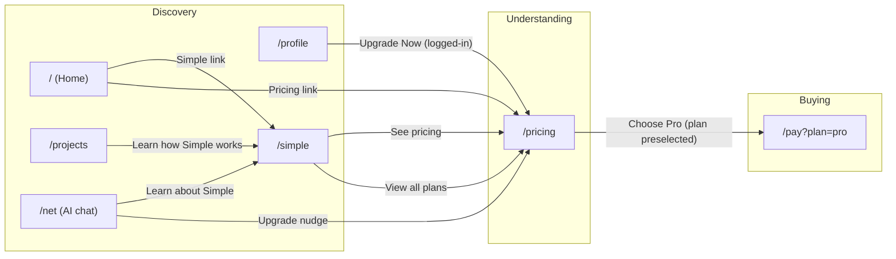

# Sales Funnel

A machine-readable map of how a visitor becomes a paying Pro subscriber, for
Simple. This is the funnel to *optimize* — keep it in sync with the actual
routes/CTAs as they change, and log every change at the bottom.

Three stages: **Discovery → Understanding → Buying**.

## 1. Discovery

Entry pages where a visitor first lands and starts learning. The goal here is
to route them toward Understanding without friction.

| Page | Route | Role |
|------|-------|------|
| Home | `/` | Primary landing page |
| Projects | `/projects` | Project catalog (surfaces Simple as a project) |
| Net (AI chat) | `/net` | Try the AI chat directly |
| Profile | `/profile` | Account page (upgrade CTA when logged in) |
| Simple | `/simple` | Product explainer |

**CTAs leaving Discovery (all → Understanding `/pricing`):**

| CTA | From | Notes |
|-----|------|-------|
| Pricing link | any | Skips straight to plan selection |
| See pricing | `/simple` | Moves to plan comparison |
| View all plans | `/simple` | Plan comparison |
| Upgrade Now (logged-in) | `/profile` | Signed-in users only |
| Upgrade nudge | `/net` (usage meter) | In-app nudge |

**CTAs that stay within Discovery:**

| CTA | To | Notes |
|-----|-----|-------|
| Simple link | `/simple` | Main nav / hero CTA |
| Learn how Simple works | `/simple` | Educational link |
| Learn about Simple | `/simple` | Educational link |

## 2. Understanding

The visitor compares plans and evaluates whether the price matches the value.

| Page | Route | Role |
|------|-------|------|
| Pricing | `/pricing` | Plan selection / comparison (Free vs Pro) |

**CTAs within Understanding:**

| CTA | To | Notes |
|-----|-----|-------|
| Upgrade to Pro / plan select | plan select on `/pricing` | Choosing the paid plan |
| Choose Pro (plan preselected) | `/pay?plan=pro` | Preselects Pro on the checkout URL — leaves Understanding |

## 3. Buying

Checkout — the final step that closes the sale.

| Page | Route | Role |
|------|-------|------|
| Checkout | `/pay?plan=pro` | Payment page, Pro preselected |

## Flow diagram

## Full CTA reference

| CTA | From stage | From page | To | To stage |
|-----|-----------|-----------|-----|----------|
| Simple link | Discovery | any | `/simple` | Discovery |
| Learn how Simple works | Discovery | `/projects` | `/simple` | Discovery |
| Learn about Simple | Discovery | `/net` | `/simple` | Discovery |
| Pricing link | Discovery | any | `/pricing` | Understanding |
| See pricing | Discovery | `/simple` | `/pricing` | Understanding |
| View all plans | Discovery | `/simple` | `/pricing` | Understanding |
| Upgrade Now (logged-in) | Discovery | `/profile` | `/pricing` | Understanding |
| Upgrade nudge | Discovery | `/net` (usage meter) | `/pricing` | Understanding |
| Upgrade to Pro / plan select | Understanding | `/pricing` | plan select on `/pricing` | Understanding |
| Choose Pro (plan preselected) | Understanding | `/pricing` | `/pay?plan=pro` | Buying |

## What to measure & improve

For each stage transition, the question is where people drop off and why.

- **Discovery (internal)** — do visitors click "Learn how Simple works" and
  reach `/simple`? This is a leading indicator of intent, not a revenue step.
- **Discovery → Understanding** — do visitors reach `/pricing` at all (via
  Pricing link, See pricing, View all plans, Upgrade nudge, or Upgrade Now)?
  If not, the positioning/hook isn't earning the click.
- **Understanding → Buying** — of the people on `/pricing`, how many reach and
  complete `/pay?plan=pro`? If it drops here, the price/plan comparison is the
  blocker, not the product.

Suggested metrics to add per transition: unique visitors, CTA click-through,
and step-to-step conversion. Instrument the CTAs above with a `data-*` or UTM
so the funnel can be rebuilt from analytics rather than guessed.

## Change log

| Date | Change |
|------|--------|
| 2026-09-07 | Initial text + mermaid capture of the funnel map (3 stages). |
| 2026-09-07 | Re-scoped stages: `/simple` moved to Discovery; `/pricing` is Understanding; `/pay` is Buying. |
