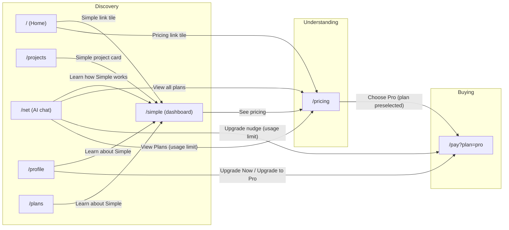

# Sales Funnel

A machine-readable map of how a visitor becomes a paying Pro subscriber, for
Simple. This is the funnel to *optimize* — keep it in sync with the actual
routes/CTAs as they change, and log every change at the bottom.

Three stages: **Discovery → Understanding → Buying**.

> **Note:** `/simple` is a **live dashboard** (mission control), not an
> explainer/ad page. It renders `SimpleDashboard` — four panels (Agent,
> Control mini-chat, Goals, Macros) wired to the local addon + cloud
> workspace. Its only outward funnel CTA is the hero "See pricing" button.

## 1. Discovery

Entry pages where a visitor first lands and starts learning. The goal here is
to route them toward Understanding without friction.

| Page | Route | Role |
|------|-------|------|
| Home | `/` | Primary landing page |
| Projects | `/projects` | Project catalog (surfaces Simple as a project card) |
| Net (AI chat) | `/net` | Try the AI chat directly (login-gated) |
| Profile | `/profile` | Account page (upgrade CTAs when logged in) |
| Simple | `/simple` | **Live dashboard** (agent status, goals, macros, mini chat) |

**CTAs leaving Discovery (all → Understanding `/pricing`):**

| CTA | From | Code |
|-----|------|------|
| See pricing | `/simple` (hero) | `frontend/src/pages/Simple/Simple/SimplePage.jsx:33-34` |
| Pricing link tile | `/` (Home, "around the site" band) | `frontend/src/pages/Home/Home.jsx:301-302` (rendered `:528-529`) |
| View all plans | `/net` (logged-out card) | `frontend/src/pages/Simple/Net/Net.jsx:186` |

**CTAs that stay within Discovery:**

| CTA | To | Code |
|-----|-----|------|
| Simple link tile | `/simple` | `frontend/src/pages/Home/Home.jsx:301` (rendered `:528-529`) |
| Simple project card | `/simple` | `frontend/src/constants/projects.js:30-32` (rendered by `frontend/src/pages/Projects/Projects/Projects.jsx:163-176`) |
| Learn how Simple works | `/simple` | `frontend/src/pages/Simple/Net/Net.jsx:187` (logged-out card) |
| Learn about Simple | `/simple` | `frontend/src/pages/Simple/Plans/Plans.jsx:429` (breadcrumb) |
| Learn about Simple | `/simple` | `frontend/src/pages/Profile/Profile.jsx:645` |

## 2. Understanding

The visitor compares plans and evaluates whether the price matches the value.

| Page | Route | Role |
|------|-------|------|
| Pricing | `/pricing` | Plan selection / comparison (Free vs Pro) |

**CTAs within Understanding:**

Selecting a plan card **leaves** `/pricing` immediately — there is no
stay-on-page selection step. Both plans route straight to checkout:

| CTA | To | Code |
|-----|-----|------|
| Choose Pro (plan card button) | `/pay?plan=pro` | `frontend/src/pages/Pricing/Pricing.jsx:162-172` (`handleSelectPlan`) + button `:265-274` |
| Get Started Free (plan card button) | `/pay?plan=free` | same handler |

## 3. Buying

Checkout — the final step that closes the sale.

| Page | Route | Role |
|------|-------|------|
| Checkout | `/pay?plan=pro` | Payment page, Pro preselected (login required) |

`Pay` reads the `plan` query param and passes it to `CheckoutForm` as the
initial plan. Unauthenticated visitors are redirected to `/login` with the
checkout URL preserved as `redirectTo`.

## Flow diagram

## Full CTA reference

| CTA | From stage | From page | To | To stage | Code |
|-----|-----------|-----------|-----|----------|------|
| Simple link tile | Discovery | `/` (Home) | `/simple` | Discovery | `Home.jsx:301` |
| Simple project card | Discovery | `/projects` | `/simple` | Discovery | `constants/projects.js:30-32` |
| Learn how Simple works | Discovery | `/net` (logged out) | `/simple` | Discovery | `Net.jsx:187` |
| Learn about Simple | Discovery | `/plans` | `/simple` | Discovery | `Plans.jsx:429` |
| Learn about Simple | Discovery | `/profile` | `/simple` | Discovery | `Profile.jsx:645` |
| Pricing link tile | Discovery | `/` (Home) | `/pricing` | Understanding | `Home.jsx:301-302` |
| See pricing | Discovery | `/simple` | `/pricing` | Understanding | `SimplePage.jsx:33-34` |
| View all plans | Discovery | `/net` (logged out) | `/pricing` | Understanding | `Net.jsx:186` |
| Upgrade Now / Upgrade to Pro | Discovery | `/profile` | `/pay?plan=pro` | Buying | `Profile.jsx:338-341, 413-425, 600-612` |
| Upgrade nudge (usage limit) | Discovery | `/net` (chat) | `/pay?plan=pro` | Buying | `SimpleChat.jsx:705-712, 1680-1687` |
| View Plans (usage limit) | Discovery | `/net` (chat) | `/pricing` | Understanding | `SimpleChat.jsx:712, 1687` |
| Choose Pro (plan preselected) | Understanding | `/pricing` | `/pay?plan=pro` | Buying | `Pricing.jsx:162-172, 265-274` |
| Get Started Free | Understanding | `/pricing` | `/pay?plan=free` | Buying | `Pricing.jsx:162-172, 265-274` |

## Code map (where each button lives)

> Paths are relative to the repo root. Line numbers are approximate — re-check
> them if the funnel docs and code drift.

- **Routes** — `frontend/src/App.js:106-159` (`/`, `/home`, `/projects`,
  `/net`, `/simple`, `/pricing`, `/pay`, `/profile`, `/plans`).
- **`/simple` dashboard** — `frontend/src/pages/Simple/Simple/SimplePage.jsx`
  (hero + "See pricing" `:33-34`) renders
  `frontend/src/pages/Simple/Simple/SimpleDashboard.jsx` — Agent, Control,
  Goals, Macros panels.
- **`/net` logged-out card** — `frontend/src/pages/Simple/Net/Net.jsx:179-189`
  ("View all plans" `:186`, "Learn how Simple works" `:187`).
- **`/net` chat upgrade nudge** — `frontend/src/components/SimpleAddon/SimpleChat.jsx`
  (`:705-712` and `:1680-1687`) — "Upgrade Now →" → `/pay?plan=pro`,
  "View Plans →" → `/pricing`, shown when the usage limit is reached.
- **`/profile` upgrade CTAs** — `frontend/src/pages/Profile/Profile.jsx`
  (`:338-341` over-limit "Upgrade to Pro", `:413-425` "Upgrade Now",
  `:600-612` "Upgrade to Pro"/"Upgrade Now", `:645` "Learn about Simple").
- **`/plans` breadcrumb** — `frontend/src/pages/Simple/Plans/Plans.jsx:429`
  ("Learn about Simple →" → `/simple`).
- **`/pricing` plan select** — `frontend/src/pages/Pricing/Pricing.jsx`
  (`handleSelectPlan` `:162-172`, card button `:265-274`).
- **`/pay` checkout** — `frontend/src/pages/Simple/Pay/Pay.jsx` (reads `plan`
  param, passes to `CheckoutForm`; redirects to `/login` when unauthenticated).
- **Home "around the site" tiles** — `frontend/src/pages/Home/Home.jsx:294-302`
  (array), rendered `:521-532`.
- **Projects catalog** — `frontend/src/constants/projects.js:30-32` (Simple
  entry), rendered by `frontend/src/pages/Projects/Projects/Projects.jsx:163-176`.

## What to measure & improve

For each stage transition, the question is where people drop off and why.

- **Discovery (internal)** — do visitors reach `/simple` via the Simple link
  tile (Home), the Simple project card (`/projects`), "Learn how Simple works"
  (`/net` logged-out), or "Learn about Simple" (`/plans`, `/profile`)? This is
  a leading indicator of intent, not a revenue step.
- **Discovery → Understanding** — do visitors reach `/pricing` at all (via
  Pricing link tile, See pricing, View all plans, or the View Plans link in the
  `/net` usage-limit nudge)? If not, the positioning/hook isn't earning the
  click. Note that the `/profile` upgrade CTAs and the `/net` "Upgrade Now"
  nudge skip `/pricing` and go straight to `/pay?plan=pro`.
- **Understanding → Buying** — of the people on `/pricing`, how many reach and
  complete `/pay?plan=pro`? If it drops here, the price/plan comparison is the
  blocker, not the product.

Suggested metrics to add per transition: unique visitors, CTA click-through,
and step-to-step conversion. Instrument the CTAs above with a `data-*` or UTM
so the funnel can be rebuilt from analytics rather than guessed.

## Change log

| Date | Change |
|------|--------|
| 2026-09-07 | Initial text + mermaid capture of the funnel map (3 stages). |
| 2026-09-07 | Re-scoped stages: `/simple` moved to Discovery; `/pricing` is Understanding; `/pay` is Buying. |
| 2026-09-07 | Validated against code: `/simple` is a live dashboard (not an explainer); corrected CTA sources/targets; added file:line code map. |
