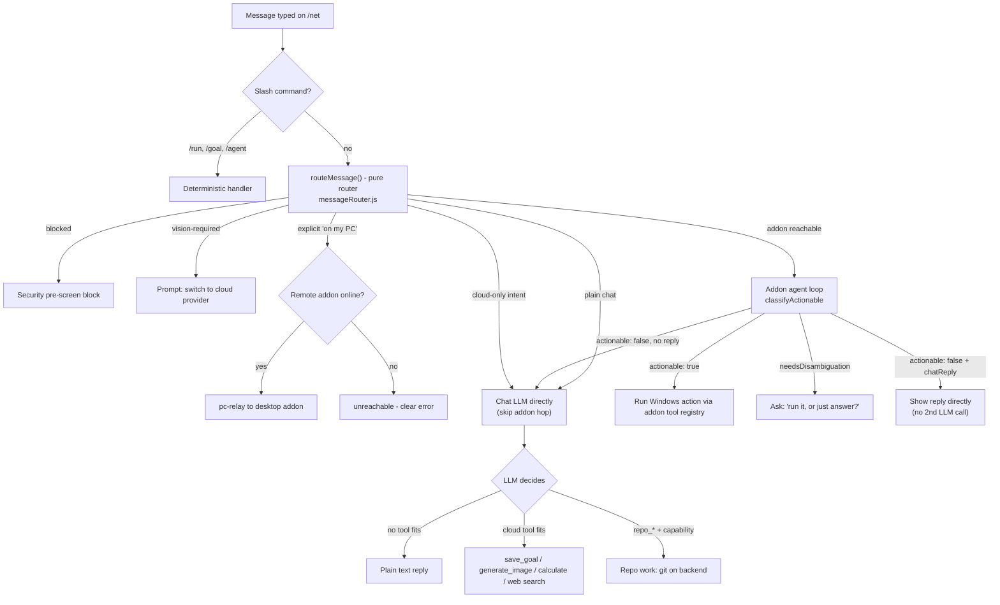

# `/net` chat — routing, the repo agent, and one app for people and AI

The chat surface as it actually behaves: how a message is routed across the browser,
the addon and the cloud, the repo agent that can change this repository from the chat,
and the pass that made a person's thread render in the assistant's pane.

> Moved out of the platform plan doc on 2026-09-16, when it became a pointer file for
> agents ([`agent.md`](agent.md)). Section names are the reference here — no chapter
> numbers.

---

## Repo agent via /net chat (DeepSeek) — goal & plan

Status: 🟡 in progress (2026-09-10).


### Goal

Let a signed-in administrator use the **/net chatbot (DeepSeek)** to make real
changes to this repository — end to end, without leaving the chat:

1. **Investigate** — the model reads the live repo (list files, read files) to
   find the right places to change.
2. **Implement** — the model writes edits into the working tree on the backend
   server (not the browser).
3. **Stage** — changes are `git add`-ed and committed locally on the backend
   server.
4. **Ask** — the model *always* summarizes what it changed and asks the user
   whether to push. It never pushes silently.
5. **Push** — only after the user replies with an explicit confirmation does the
   model `git push` to GitHub (using the server's `GITHUB_TOKEN` from AWS
   Secrets Manager).

The result is the "pretend you're my /net chatbot" workflow: user describes a
change → the chat investigates, implements, and stages it on the backend → the
chat asks "push?" → user says yes → pushed to GitHub.


### Plan (subtasks)

11. ⬜ **Live end-to-end pass** — one real signed-in admin run through /net chat
    that stages a trivial change, asks, and pushes (requires `GITHUB_TOKEN` on
    the server).


### Confirmation gate (safety)

`repo_push` refuses to run unless **all** of these hold:

- **Admin only** — `toolContext.isAdmin` is true (same `ADMIN_USER_ID` check the
  goal agent uses). Non-admins get a "restricted" message for every `repo_*`
  tool.
- **User confirmed** — the current-turn message matches a short confirmation
  pattern (`push`, `ship`, `confirm`, `proceed`, `yes`, `go ahead`, …).
- **Commit is from a previous turn** — HEAD's commit timestamp is strictly older
  than the turn start time, so the model can never stage-and-push in one shot,
  even if the user typed "…and push it" in the original request.
- **A feature branch exists** — `repo_push` only pushes the current `net/…`
  branch (recorded in the per-user proposal), never `master` and never an
  unrelated local commit.

Because the "ask → user confirms → push" round-trip spans two turns, the model's
own reply ("…want me to push?") becomes the user's cue; the next user message is
what unlocks `repo_push`.


### Security constraints

- Repo tools are never sent to non-admin chats (`toolsForContext()` filters
  `repo_*` out of the schema list).
- Paths are sanitized (`sanitizeRepoPath` — shared with `goalAgentService.js`
  via `repoShared.js`) — no `..`, absolute paths, or `.git`.
- File writes capped at 120 KB; reads/diffs truncated to a bounded size.
- Every change lands on an isolated `net/…` feature branch; `repo_push` can only
  push that branch, never the base branch.
- The GitHub token is passed to `git` via `http.extraHeader` (in the process
  env, never embedded in the remote URL or commit message), reusing the existing
  `GITHUB_TOKEN` secret already seeded via `backend/scripts/seed-secrets.js`.


### Two limits that stopped a repo edit mid-turn (fixed 2026-09-14)

A real run of *"remove the footer from the /net page"* died with a bare
`**Error:** The toolConfig field must be defined when using toolUse and
toolResult content blocks.` — no diff, no explanation. Two separate limits were
responsible; a repo edit now survives both.

**1. The streaming leg sent tool *history* with no tools.** `/net` streams via
`POST /api/compress/stream` → `streamCompressionRequest()`. That function
resolves tools with non-streamed calls, then deliberately drops them for the
final streaming call — the SSE reader only consumes text deltas, so a tool call
in that leg would be silently discarded. But `messages` still carried the loop's
`tool_calls`/`tool` turns, and Bedrock's Converse API rejects `toolUse`/
`toolResult` content blocks that arrive without a `toolConfig`. That is an AWS
`ValidationException`, so it reached the user verbatim, as-is.

Fixed in the adapter, where no call site can re-create it: `toBedrockMessages()`
takes `{ allowToolBlocks: false }` and renders those turns as `[tool call] …` /
`[tool result] …` text. Both `createBedrockCompletion` and
`streamBedrockCompletion` choose it automatically whenever the request offers no
tools, so tool blocks are only ever emitted alongside the matching `toolConfig`.

**2. Three tool rounds is fewer than a repo edit needs.** `MAX_TOOL_ROUNDS` was
3 in both the shared `runToolLoop()` and the streaming loop. The failing run
spent all three investigating (list files → read → read), then asked to write the
edit as round 4 — and was cut off there. Now 8, which fits investigate → write →
status/diff → commit → answer even at roughly one tool per round. A round is only
spent when the model actually asks for a tool, so ordinary chat turns are
unaffected.

Diagnostic: when the adapter flattens a history it logs `🪨 … flattened the
history's tool call/result turns to text`. That line means a tool-free call
arrived carrying tool history — i.e. a tool loop had just run.

**Verified live (2026-09-14).** Driving `POST /api/data/compress/stream` as the
`ADMIN_USER_ID` account: HTTP 200, `repo_write_file` executed, the file appeared in
the working tree, and the reply confirmed it — no `toolConfig` error, no branch
change (it was told not to commit). The same request as a non-admin session also
returns 200, with no repo tools offered at all and a model reply saying it has no
repository access — that is the admin gate described in *Security constraints* working as intended, not a bug.

Two operational notes worth knowing when testing this by hand:

- **Sign in as the admin account.** `/net` has no repo ability as a guest or any
  other account; `toolContext.isAdmin` is a strict `req.user.id === ADMIN_USER_ID`
  compare, so the failure mode there is "the model says it can't", not an error.
- **A connected desktop addon gets first refusal.** `messageRouter.js` sends
  anything the addon might act on to the addon's local agent (`kind: 'agent'`)
  before the cloud is considered — the addon's own classifier decides, and only a
  "not actionable" verdict falls through to the cloud repo agent. A repo-edit
  request typed with the addon running may therefore be handled (or mis-handled)
  locally. Call the endpoint directly, or test with the addon stopped, to
  exercise this section's workflow. Site/repo *source* requests are exempt:
  `isCloudOnlyIntent()` treats them as cloud-only, because the addon has no
  repository tools at all (a live run classified one `action` and spent 56 steps
  taking screenshots before it was stopped).


### Making a small change to a big file (fixed 2026-09-14, later that day)

The first real "improve the site" prompt — *"increase the context length for the
net goal description input …"* — still went wrong, for two more reasons.

**1. Tool arguments share the output-token budget.** `repo_write_file` takes a
whole file as one argument, and tool turns were capped at 4096 output tokens.
`GoalManager.jsx` is 17 KB ≈ 5K tokens, so the arguments came back truncated on
*every* attempt: invalid JSON, "arguments were empty or cut off", retry, repeat
until the rounds ran out. Two fixes:

- **`repo_edit_file`** (new, `repo:write`) — an exact `old_string` → `new_string`
  replacement for *existing* files. A small change now needs a small snippet
  instead of a whole-file re-emission. It refuses an ambiguous snippet (reports
  the occurrence count) or a snippet it cannot find, and `replace_all: true`
  opts into replacing every occurrence. The system prompt tells the model to
  prefer it; `repo_write_file` is now documented as "create, or rewrite
  completely".
- **`TOOL_TURN_MAX_TOKENS = 16384`** — the per-tier cap (1-4K) is sized for chat
  prose. Haiku 4.5 allows 64K output; 16K covers roughly a 60 KB file, and
  anything larger should go through `repo_edit_file`.

**2. The flattened fallback invited the model to continue its own text.** The
tool-free final leg rendered the history's tool turns as `[tool call] name(args)`
plus the results. The model treated that as its own last message and *continued*
it — a live reply was a wall of `repo_write_file` JSON, and even after switching
to a name-only `[used tool: …]` marker the reply still ended with
`[used tool: repo_git_diff]`. Fixes, in order of preference:

- **A wrap-up call instead of a tool-free leg.** When the rounds are spent while
  the model still wants tools, the streaming path now appends `TOOL_LIMIT_NOTICE`
  to the system prompt and makes one *non-streamed* call **with the tools still
  offered** — so the history stays structured tool blocks (legal, thanks to
  the `toolConfig` pairing from *Two limits that stopped a repo edit mid-turn*) and no flattening is needed. Its text is sent as
  a single `token` event, so the client renders it like any streamed reply. Only
  a wrap-up that *still* asks for a tool (i.e. no prose) falls through to the
  flattened leg.
- **Never re-emit arguments when flattening.** The last-resort path renders tool
  turns as `[used tool: <name>]` and `[tool result] <content>` — names only, no
  arguments, so there is no JSON for the model to continue.
- **`MAX_TOOL_ROUNDS` 8 → 12.** The first fixed run used all 8 rounds on
  legitimate work (list → read ×3 → two failed snippet edits → edit → diff) and
  was cut off before it could reply or verify. 12 matches the goal agent's loop.

Verified live with the user's exact prompt after these changes: `repo_edit_file`
landed a one-line change (`slice(0, 2000)` → `slice(0, 30000)` in the goal save
path — the textarea has no `maxLength`, so that was the only cap), and the reply
was plain prose. It cost 2 extra rounds re-reading after wrong snippet guesses,
which is why the round budget matters.


### Progress feedback while the agent works (added 2026-09-14)

Tool work happens BEFORE anything is streamed — `streamCompressionRequest()`
resolves every tool call first — so a repo task was an empty bubble for up to a
minute. Users read that as a freeze ("it is still stuck loading, no output"), and
on the desktop-agent path a stuck run took 56 screen captures before anyone
noticed. Both paths now say what they are doing.

- **Backend:** `services/toolProgress.js` (`describeToolActivity`) turns a tool
  call into a few words — "Editing Net.css…", "Checking git status…". Labels name
  a file's basename only and never include arguments. The streaming route emits
  `{type:'progress', label, tool, step, maxSteps}` over SSE *before* each tool
  runs, plus "Looking into it" when the turn starts and "Finishing up" when the
  round cap is hit. SSE headers are opened lazily, so usage-limit/tier failures
  (402/403) still come back as JSON with a real status code.
- **Cloud path (`/net` chat):** `Net.jsx` forwards `progress` →
  `SimpleChat` stores the label on the streaming placeholder message
  (`progressNote`) and clears it on the first token → `MessageBubble` renders a
  pulsing `role="status"` line inside the bubble.
- **Desktop-agent path:** no token stream exists there at all, so `SimpleChat`
  polls `getAgentStatus()` every 2 s while the addon works and shows
  "Step N — <tool>…" beside the typing dots (`ChatWindow`'s `progressNote` prop),
  cleared in a `finally` when the run returns.
- **Tests:** `backend/__tests__/unit/toolProgress.test.js`; the progress order and
  labels in `llmServiceStreamingTools.test.js`; four render cases in
  `frontend/src/components/SimpleAddon/MessageBubble.test.jsx`.

Verified live: the SSE sequence is `progress → progress → tools → content` with
labels `Looking into it` / `Reading GoalManager.jsx…`, and the desktop-agent note
("Working on it…") renders in the DOM while the addon runs.


### Two more /net chat-state bugs (fixed 2026-09-14)

Both were found while verifying *Progress feedback while the agent works* in the real UI.

**1. Questions about the user's own cloud data went to the desktop agent.** Asking
*"what goals do I have saved right now?"* was classified `action` by the addon and
started a local worker that took screenshots of the screen looking for the goals.
The desktop addon has no access to goals, notes, memory or tickets — the cloud
tools (`get_my_goals`, `get_my_notes`, `submit_support_ticket`) own all of it — so
`isCloudOnlyIntent()` now treats them as cloud-only via `isCloudDataIntent()`:
a question/read shape (`what`, `which`, `how many`, `list`, `show`, `tell me`,
`do i have`) plus a cloud-data noun, or a bug report / support request. Still
addon work: "open notepad", "open edge on my pc", "close all my browser windows".

**2. Cloud sync could delete a message the user had just sent.** The conversation
adoption replaced local state with the server's list, keeping only *empty* local
conversations. But the sync poll runs *while a turn is in flight*, and a
conversation's user message exists only locally until the backend saves the
finished turn — so the poll's (stale) snapshot dropped it. Worse, if the active
conversation's id vanished from the list, the "active conversation is missing"
effect fell back to `conversations[0]`, which is how the view appeared to jump to
an unrelated older chat. Reproduced: two sent messages disappeared from
`csimple_chats` entirely.

The merge now lives in `frontend/src/utils/simpleAddon/chatStore.js`
(`adoptSyncedConversations`, unit-tested): same-id conversations are **merged**
(messages unioned by id, longest body wins) instead of replaced, a local
conversation the server hasn't acknowledged yet is **kept** unless the tombstone
set says it was deleted, and `SimpleChat` passes the merge response's
`deletedIds` straight into it. Regression tests assert the exact failure shapes —
"keeps a local message the server has not saved yet", "keeps a locally-created
conversation that is not on the server yet", "a vanished active conversation is
the case this prevents".

Verified live after both fixes: the same goals question produced **no** desktop
worker (`workersRunning: 0`), the cloud call returned 200, and the user message
plus reply stayed in the same conversation with the active id unchanged.

**3. A `yes push it` confirmation was answered by the desktop agent.** The repo
flow ends with the agent asking *"reply `push a2e3` to confirm"*. That follow-up is
a short message, so the router handed it to the addon — which had never seen the
question — and its classifier answered *"I need more context … what would you like
me to push?"*. The confirmation never reached the cloud, so nothing pushed and the
whole exchange looked like the model had amnesia.

Two halves to the fix:

- `SimpleChat` records the tools each cloud turn used (`toolsUsed` on the assistant
  message; `mergeMessageLists` now unions message fields so a sync can't strip it).
- `routeMessage` sends a short confirmation to the cloud whenever the previous turn
  used `repo_*` tools — `isRepoFlowConfirmation()` accepts ≤4 words drawn from an
  affirmative set (`yes`, `ok`, `sure`, `go ahead`, `ship it`, …) or a literal
  `push <code>`, and the decision is reported as `repo-flow-confirmation`. Ordinary
  instructions are untouched: "open notepad" and "sure, but also fix the failing
  tests first" still go to the addon, and a confirmation with *no* repo workflow in
  flight still does too.

Verified live (harmless calculator turn): the assistant message carries
`toolsUsed: ['calculate']` in the local store, which is the same signal a
`repo_commit_changes` turn produces. The push itself was deliberately **not**
triggered during verification.


### The last-resort tool history must not look like the model's own words

A live reply came back as *"Let me check the current state of the file after my
edits`[used tool: repo_read_file]`"* — the flattened marker again (see *Making a small change to a big file*). The
cause is structural, not cosmetic: the flatten rendered the tool calls as text
inside an **assistant** turn, and a model continues its own last assistant
message. Naming the tool instead of dumping its arguments made the leak shorter;
it did not remove it.

`flattenToolHistory()` (in `bedrockService.js`) now rewrites a tool-free request's
history so **no assistant turn carries a tool trace at all**: assistant tool-call
turns are dropped (their prose is kept), and every call/result is folded into the
neighbouring **user** turn as a short log:

```
Tool activity so far:
- called repo_read_file
- repo_read_file result: File "GoalManager.jsx": …
```

That merges into the existing user turn rather than adding a second one, so the
roles still alternate. The model keeps everything the tools returned, and a user
turn is not something it continues. `llmService` also tags tool-result messages
with `name`, which is what labels each line.

`MAX_TOOL_ROUNDS` went 12 → **16** at the same time: the run that leaked the marker
had already edited the file and only wanted to re-read it to verify, i.e. it was cut
off during *checking*. (The wrap-up call and `TOOL_LIMIT_NOTICE` remain the graceful
exit when even that is not enough — they just can't be the thing that produces the
answer's text.)


## How /net chat messages are routed (reference)

Routing is a **layered cascade** across the browser, the desktop addon, and the
backend — but each layer's decision is now an explicit, named, testable unit
rather than an inline `if` chain. The client asks a pure function *where* a
message should go; the addon classifies *action vs. chat*; the cloud LLM picks
the tool. The final tie-breaker is still the LLM's own tool-calling choice.




### Layer 1 — client (`SimpleChat.jsx` `sendMessage`)

The decision of *where* a message goes is now a single pure function,
`routeMessage()` in `frontend/src/utils/simpleAddon/messageRouter.js`. It takes
only the facts the client already knows and returns a typed decision:

```js
{ kind, reason, confidence, skippedAddon?, cloudOnly? }
```

`kind` is one of `slash | blocked | vision-required | pc-relay | unreachable |
agent | chat-cloud | chat-local`. `sendMessage` just switches on it, so the
ordering is testable without mounting the component (see
`messageRouter.test.js`) and the declared transitions (`ROUTE_TRANSITIONS`) can
be asserted against the implementation — which keeps the diagram above honest.

Ordered checks, first match wins:

1. **Slash commands** (`/run`, `/goal`, `/agent`, `/help`, `/compare`, …) — handled before the router, deterministic, no LLM.
2. **Client security pre-screen** (blocked) — fast, offline UX block; the server re-checks (see *Observability & enforcement*).
3. **Vision required** — an attached image with a non-cloud provider.
4. **Explicit PC phrasing** (`isPcControlRequest`, e.g. "on my PC") → `pc-relay` (remote addon online) or `unreachable` (clear "can't reach your PC" error).
5. **Scan-to-connect guard** — a `?addon=` session with no reachable addon → `unreachable`.
6. **Cloud-only shortcut** — image generation / arithmetic / explicit web search skip the addon hop entirely (they're cloud tools the addon can't run anyway), saving a relay round-trip. Detected by `isCloudOnlyIntent()`.
7. **Logic mode** (`agent`) — let the addon's O-O-G-P-A loop try the message first.
8. **Plain chat** (`chat-cloud` / `chat-local`) — by the `provider` setting.


### Layer 2 — addon classifies "Windows action vs. chat"

Split into two small, unit-tested modules instead of inline regexes:

- **`routing-lexicon.js`** — the single source of truth for the action/chat
  word lists, Unicode-aware (lookarounds, not ASCII `\b`) and *weighted*
  (an imperative opening verb scores higher than a stray noun). Returns a
  `verdict` (`action` / `chat` / `ambiguous`) plus a `confidence`.
- **`routing-classifier.js`** — parses the LLM's strict JSON verdict
  (`{ actionable, confidence, reply }`), folds it with the heuristic, and caches
  results (TTL + bounded).

`simple-addon/server/automation/index.js` `POST /api/agent/run`:

- **Confident heuristic → no model call.** Only the genuinely *ambiguous*
  middle reaches the LLM.
- **Strict JSON verdict** replaces the old brittle single-word `ACT` sentinel
  (which mis-routed anything starting with "Act…" and truncated real replies).
  `reply` carries the conversational answer, so non-actionable messages still
  need only one LLM call.
- `actionable: true` → run the O-O-G-P-A loop with the real PC tool registry
  (`shell_run`, `uia_invoke`, `input_tap`, `browser_*`, …).
- **Low-confidence actionable → `needsDisambiguation`.** The addon refuses to
  act silently; the client shows "do you want me to run this on your PC, or were
  you asking a question?" and re-sends the original message with
  `forceAction: true` when the user confirms (a short "yes").
- `actionable: false` → `chatReply` (if the classifier produced one) is shown
  directly; otherwise the message falls through to the normal chat LLM.
- **`GET /api/agent/routing-stats`** exposes the decision counters/ring buffer
  for debugging (see *Observability & enforcement*).


### Layer 3 — cloud chat LLM decides "repo vs. cloud tool vs. reply" (`llmService.js`)

The cloud path sends the message to Bedrock **or DeepSeek** (the model picker is
orthogonal to the toolset) with `TOOL_SCHEMAS` and `tool_choice: 'auto'`. The LLM
chooses, per turn:

- **no tool call** → plain text reply;
- a **cloud tool** (`save_goal`, `save_note`, `generate_image`, `calculate`, `web_search_suggestion`, …);
- a **`repo_*` tool** → work on the repository via git (`repoAgentService.js`).

Guardrails shape this:

- **Capability-scoped tools** (`toolScopes.js`): every privileged tool declares
  the capability it needs (`repo:read` / `repo:write` / `repo:push`).
  `filterToolSchemas()` only *offers* tools the context can use, and
  `executeTool` refuses them server-side regardless — so a hallucinated tool
  name still can't run.
- **Proposal-bound push** (`repoAgentService.js`): `repo_commit_changes` records
  an expiring, branch-bound proposal with a one-time confirmation code;
  `repo_push` only pushes *that* branch, only before it expires, and only on an
  explicit confirmation (the code, a strong push phrase, or a bare short "yes" —
  never a vague "ok, but…").
- Shared plumbing — `buildToolContext()` (`netChatContext.js`) and
  `runToolLoop()` / `executeToolCall()` — is used by both the streaming and
  non-streaming paths so they can't drift.


### Key separation (who owns what)

| Capability | Where it lives | Endpoint / mechanism | Who decides |
|---|---|---|---|
| Where a message goes | Client | `messageRouter.js` (`routeMessage`) | pure function, unit-tested |
| Windows/PC actions (`shell_run`, `uia_invoke`, …) | Desktop addon tool registry + agent loop | `POST /api/agent/run` (addon) | addon `classifyActionable` (+ disambiguation) |
| Repo changes (`repo_*`) | Backend server (`repoAgentService.js`, git) | `/net` chat tool loop (`llmService.js`) | cloud LLM tool-call + capability gate |
| Cloud tools (`save_goal`, `generate_image`, math, search, …) | Backend `netTools.js` | `/net` chat tool loop | cloud LLM tool-call |
| Just reply | Any LLM | chat streaming path | no tool call |

The cloud `/net` chat has **no** Windows-action tools, and the addon has **no**
repo tools — so the two cannot be confused. "Repo or chat?" is an LLM tool-choice
on the backend; "Windows action or chat?" is the addon's actionability classifier
(now shared with the client only as a *routing* decision, not a second lexicon).


### Observability & enforcement

- **Routing telemetry** — the addon (`routing-telemetry.js` +
  `GET /api/agent/routing-stats`) and the backend (`routingTelemetry.js`) each
  record one bounded, low-cardinality event per decision: layer, intent, source
  (`heuristic` / `llm` / `cache` / `fallback`), confidence, tools offered/used,
  and latency. Log + in-memory only (no per-request DynamoDB writes — see the
  audit note in `AUTOMATION_SECURITY.md` → *Eighth audit pass*).
- **Server-side message pre-screen** — `backend/middleware/netMessageGuard.js` is
  the authoritative copy of the dangerous-command patterns. It runs on the
  compress (and stream) routes and returns a 403 *before* any LLM/tool
  processing. The browser copy is UX only and bypassable by design.

> **Code is the source of truth** — this section is a snapshot. The
> authoritative code lives in:
> `frontend/src/utils/simpleAddon/messageRouter.js` (the router),
> `SimpleChat.jsx` (`sendMessage`),
> `simple-addon/server/automation/routing-lexicon.js` +
> `routing-classifier.js` + `index.js` (`classifyActionable`, `/api/agent/run`),
> `backend/services/netChatContext.js`, `toolScopes.js`, `llmService.js`
> (the cloud tool loop), `repoAgentService.js` (the push gate), and
> `backend/middleware/netMessageGuard.js` (the server-side pre-screen).

---


## `/net` is ONE chat app — people in the rail, the AI's frame for both

Shipped 2026-09-15. The goal stated plainly: talking to a person should look identical to talking
to the assistant, with other users sitting in the conversation list — an LLM chat and a human
messenger that read as one app.


### One pane, two kinds of thread

`/net?with=<userId>` used to render a **different component** (`DirectChat` with its own
`.talk-dm-*` look) *instead of* the chat, so the rail vanished the moment you opened a person and
the page felt like a second app that happened to share the URL. Now the chat hosts it:

- **`SimpleChat` takes `peerId`** and swaps only the PANE — `{peerId ? <DirectChat/> : <ChatWindow/>}`
  — with the rail mounted in both modes. That is the whole architectural move: the rail IS the AI's
  (its conversation list, model picker, addon state, settings footer), so it cannot be rebuilt
  per mode; the transcript can.
- **The pane wears `ChatWindow`'s classes** (`chat-window`, `__header`, `__menu-btn`, `__messages`,
  `__input-form`, `__input-wrapper`, `__input`, `__send-btn`) and `MessageBubble`'s row markup
  (`message`, `message__row/avatar/content/bubble/meta/time`), so the two transcripts are the same UI
  by construction. Their colours come from `.simple-root` (`SimpleTheme.css`) — the chat's own theme
  scope, including its own `data-simple-theme` light/dark — which is exactly why the pane has to be
  rendered *inside* `SimpleChat` rather than beside it.
- **What is left out is the AI's tooling**: attach / mic / model controls, token and cost chips, the
  report menu. The messenger carries plain text, and a control this conversation cannot honour is a
  lie shaped like a button. The composer is the chat's own markup minus those three.
- **⚠️ The header is ONE line.** The first version put an "Encrypted · no AI in this conversation"
  sub-line under the name, which made the header **83.7px** against the assistant's **67.2px** — the
  kind of 16px difference that makes two panes read as two apps. It is a `title` attribute now (plus
  the empty state and the People row), and the measured heights match exactly.
- **The day dividers went with it.** A person's transcript had `── Today ──` bands the AI's does not;
  the stamp under each message now uses `MessageBubble`'s own format (time alone today, `Yesterday,
  …`, else `Mar 3, …`), so dates survive without a band that only one of the two panes has.
- The AI-only **mic-pause overlay is suppressed** while a person is open (`isInactive && !peerId`) —
  it is about the assistant's listening and has no business covering a conversation.
- 🐛 **The peer's face drew a 160px square over the transcript.** `TalkAvatar` renders its own
  ``, and the frame it was handed is `MessageBubble`'s
  `.message__avatar` — which sizes an image the AI chat renders *itself*
  (`.message__avatar--assistant-img`) and is `overflow: visible` because its usual content is a
  LETTER that cannot spill. So the picture kept its natural 160px, `object-fit: fill`, and covered the
  message beside it. The sizing now lives in the pane (`.talk-dm .talk-avatar__img`, scoped so the
  assistant's avatars are untouched) and the frame clips, so every face — header, transcript, empty
  state — is covered by construction rather than by remembering. **Lesson: a shared sub-component that
  renders its own `` does not inherit the host's sizing rules; size it from the container that
  owns the layout.**
- **A face is a CIRCLE; the assistant keeps its tile.** `.message__avatar--assistant` is a 28px tile
  with an 8px radius because it holds a *letter*. A person's picture is a circle everywhere else on the
  site (`Talk.css`'s `.talk-avatar`, the rail's People rows, `/u/…`, `/profile`), so the person's face
  uses that shape in all three of its places here — with size and spacing untouched, so the two
  transcripts still measure identically.
- Cost of one app: the addon-status probe (ports 3001/3002) now also runs while a person's thread is
  open, because `SimpleChat` is what owns the rail. Harmless, and it is what keeps the rail's addon
  row honest in both modes.


### People, in the rail

`Sidebar` gained a **People** section — the same row recipe as the AI history above it (`.sidebar__conv`),
with a face, the name, the last thing said and an unread count, each row a `Link` to
`/net?with=<userId>` and highlighted when it is the open thread.

- The messenger data is **handed in** (`messenger={{ token, activePeerId }}`) rather than fetched
  inside the rail: the addon renderer shares this component, and with no `messenger` prop the section
  does not render at all.
- The directory is polled every 30s (unread counts and previews are the only things that move while
  the rail sits open) and re-read when `activePeerId` changes, because opening a thread clears its
  unread server-side.
- People list the **left rail's own order**: `getMessengerDirectory` already sorts contacts by
  `lastAt`, so the most recent conversation is at the top, exactly like the AI history beside it.
- Faces come from `useAvatars` (cache-first, so a warm cache costs no request) and fall back to
  initials. `Connections on Talk →` is the way to the page that manages them, and an empty rail
  points at `/talk` rather than at nothing.
- **The rail is an ACCORDION — one section open at a time.** Conversations, People, Settings and
  Macros & Agent were four independent booleans, so every combination existed, including two lists
  competing for the same vertical space in a column this narrow; opening one pushed whatever you were
  reading off the bottom. They are now ONE piece of state — `openSection` with
  `toggleSection(name)` — so opening a section closes whichever was open, and the open one closes
  itself (the section set is closed by default, and nothing is open with no `messenger` prop, which is
  what the old `false` defaults gave the addon renderer).
- **`'people'` is the default section**: it is what `/net` is for and it is the short list, where the
  AI history is long and stays opt-in.
- **A CLOSED section is exactly its toggle row.** `.sidebar__conversations` was
  `flex: 1 1 auto` — "so the footer stays pinned to the bottom" — and People wears the SAME
  class (`sidebar__conversations sidebar__people`), so the rail's entire spare height was
  divided between two *collapsed* headers: measured on `/net`, a 33px toggle inside a 266px
  box, with a **238px dead band** under it and another under People. The grow is gone
  (`flex: 0 1 auto`; shrink stays, so an open list longer than the rail still gives way and
  scrolls inside itself) and the footer is pinned by its own `margin-top: auto`, which lands it
  at the *identical* y. The spare height now sits in one place, above the footer, instead of
  two. Verified in all four open/closed combinations: collapsed 41px + 46px with a 13px gap
  between the toggles, and the footer at the same top as before in every one.
- The two settings toggles gained `aria-expanded` / `aria-controls` in the same pass — the conversation
  toggles already had them, and exclusivity is invisible to a screen reader without them.
- **The account meters are OFF in the rail, for every account** — the AI credits meter (with the
  "upgrade for more credits" link that lives inside it) and the storage meter. They are behind ONE
  flag at the top of `Sidebar.jsx` (`SHOW_ACCOUNT_METERS = false`) rather than deleted, because this is
  a "for now": both components, their styles, their `/usage` poll and the upgrade control are
  untouched, so bringing them back is that one word. Nothing else in the rail reads either component,
  and they were the only callers of `/usage` in this tree — the only thing that changed with them is
  that the poll stopped. The rail is shared with the addon renderer, so this hides them there too,
  which is right: they show the same account's numbers on both surfaces.
- ℹ️ `/fit`'s sections deliberately stay multi-open: that page is a long form you fill in, not a rail.
  The accordion is a property of this column, not a house rule.


### The blocker underneath: opening a conversation was a 500

The pane rendered, the rail filled — and the thread came back
`Value provided in ExpressionAttributeNames unused in expressions: keys: {#createdAt}`.

- **`listMessages` declared `#createdAt`/`:since` on every call**, but the FIRST page's key condition
  is only `#id = :id` (the cursor is optional). DynamoDB rejects a request whose
  `ExpressionAttributeNames`/`Values` holds a placeholder the expression never uses, so **the call
  that opens a conversation always failed** while the 4s cursor poll — the only caller that uses
  them — worked. A thread could be appended to and never read.
- The names and values are now built with the key condition, so a first page declares neither. Fixed
  in `backend/services/messengerService.js`.
- **The test fake was half a fake, and that is why it shipped.** It modelled exactly this rule for
  WRITES (a previous bug taught it) but not for queries. It now enforces it for
  `KeyConditionExpression` too — names *and* values — which turns the existing first-page read in
  `messengerService.test.js` into a real assertion: **35/35 pass with the fix, and the suite fails
  without it.**
- ⚠️ The backend runs under `npm run server` / `npm start` (**no watcher**), so this fix needs a
  restart before the thread loads — `npm --prefix backend run dev` if you want reloads.
- ⚠️ **A `null` body from a bare `node -e` script is not evidence of a bug.** Proving the fix against
  the live table means calling `listMessages` directly, and that process decrypts nothing: the AES key
  comes from `MESSAGE_ENCRYPTION_KEY` / `JWT_SECRET`, which `backend/.env` does **not** carry — the
  running server fills them from Secrets Manager in its boot sequence (`server.js`). So a one-off
  script returns `body: null` for every row, including the `lastPreview` the drawer displays happily.
  Read the *count* from a script; read the *bodies* through the API.


### Verified

- **The two panes measured identical**, live, one navigation apart: theme scope, header height
  (67.207px both), header background/border/padding, messages container, input form, composer input
  and send button — every computed value equal.
- **The rail shows both kinds** while a person is open: `CONVERSATIONS 12` and `PEOPLE 1`
  (`tnnrhpwd`, highlighted, `/net?with=6770a067c725cbceab958619`), signed in as the guest account.
- `messengerService.test.js` **35/35**; frontend `llmProviderOptions.test.js` + `TalkAvatar.test.jsx`
  **31/31** (the former scans `Sidebar.jsx` and asserts it still offers cloud models through the
  shared picker — the section was added around it, not through it).
- **The rail's accordion was driven, not assumed**: People open on arrival; then Conversations →
  People closed; Settings → Conversations closed; Macros & Agent → Settings closed; clicking the open
  section → nothing open. Exactly one panel in the DOM at every step, and all four toggles report
  `aria-expanded`.
- **The meters are gone, measured rather than eyeballed**: `.usage-meter`, `.storage-meter` and
  `.usage-meter__upgrade` all absent from the rail, no "more credits" or storage wording in its text at
  all, and **zero `/api/data/usage` requests across 8s of watching** (the 60s poll the components own
  stops with them, since nothing else in this tree calls it).
- **The backend restart landed, so the read fix is confirmed end-to-end**: the `test` message the guest
  sent renders in the pane as a bubble with its 01:21 AM stamp and no error line — the same message the
  drawer had been previewing all along.
- **The faces were measured, not eyeballed**: header, transcript and rail avatars are 28/28/22px,
  `border-radius: 50%`, `overflow: hidden`, with the picture rendered at the frame's own size and
  `object-fit: cover` — and a sweep of every `` in the pane reports **0** that overflow their
  frame, against the **160×160 in a 28px box** the transcript had before.
- No test covers `DirectChat` or the rail's People section; neither had one before this change.

---

