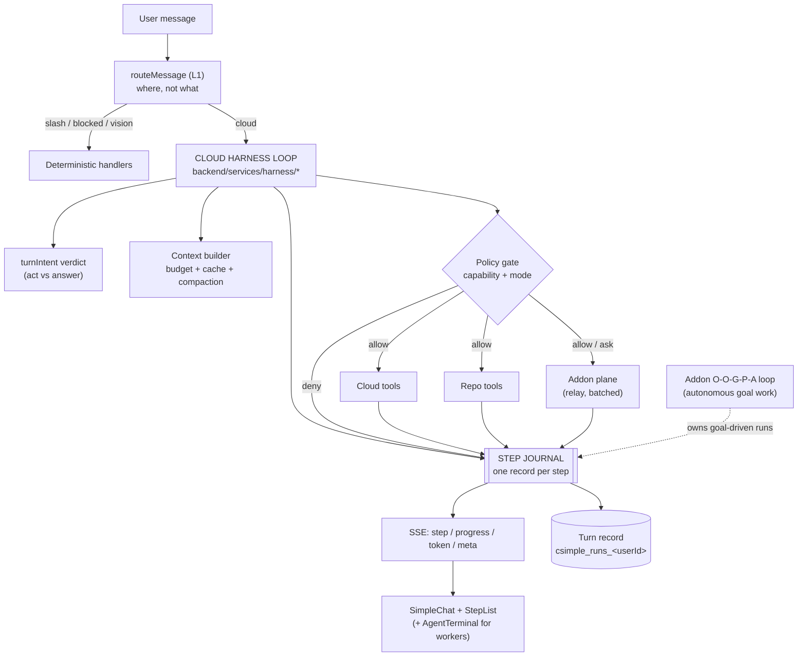

# `/net` as an agent harness — plan

**Status (updated 2026-09-18):** P0, P0b, P1, P3, P4, P5, P6 **shipped**, plus a
P0 follow-up (**continuity** — the previous turn carried into the next, which also
makes the journal readable); P2 **shipped** (steps 1–3, and the routing question
settled in Layer 3h); P7's scenario suite, its security pass and its **metrics**
**shipped**, leaving only the P4 prefix diet (`/net` turn telemetry is now readable
in aggregate — see §P7).
Written 2026-09-18.
**Scope:** the cloud `/net` chat becomes a real agent harness — one loop that can
answer, act on the site, change this repository, and drive the desktop addon —
with every step observable and controllable.

> Companion reading: [`NET_CHAT.md`](NET_CHAT.md) (how routing and the repo agent
> behave today, incl. *Layer 3b* act-vs-answer and *Layer 3c* token economics),
> [`agent.md`](agent.md) (what the product is, the four trust modes),
> [`Simple_Loop_Behaviour.md`](Simple_Loop_Behaviour.md) (the addon loop as the
> code really behaves — read before changing any loop),
> [`AUTOMATION_SECURITY.md`](AUTOMATION_SECURITY.md) (the permission floor).

---

## 0. Definition of done

"Strong harness" is not a feeling; it is six properties, each of which can be
falsified by a test or a driven run. Today `/net` has part of #1 and none of the
rest.

| # | Property | Falsified by |
|---|---|---|
| **1** | **Intent is decided, not hoped for** — act vs answer is an explicit verdict with a bounded recovery, on both the streaming and non-streaming paths | a turn that narrates an outcome instead of performing it |
| **2** | **Steps are observable** — every tool call is a structured record (name, redacted args, result status, duration, round) streamed live, renderable as a step list, and persisted with the turn | a user who cannot tell what the agent did or why it stopped |
| **3** | **The turn is controllable** — cancel and pause mid-turn; risky tools ask; the approval is *the same policy* the addon already enforces | a 90-second turn with no way out but a page reload |
| **4** | **Both hands work in one loop** — the same turn can use cloud tools, repo tools, and the user's PC, without the user picking a "mode" first | "I can't do that" when the addon is connected and could |
| **5** | **Verification closes** — a change can be *checked* (search, re-read, run the allowlisted build/test), not merely asserted | "done" with no evidence behind it |
| **6** | **Cost is governed** — the per-call prefix and every tool result are budgeted, cached where possible, and bounded by construction | a maxed turn whose input cost is dominated by re-sending the same bytes |

## 1. What exists today

Three layers already decide where a message goes; the plan must not fight them.

| Layer | Owner | What it decides | State |
|---|---|---|---|
| 1 — client | `frontend/src/utils/simpleAddon/messageRouter.js` | `slash \| blocked \| vision-required \| pc-relay \| unreachable \| agent \| chat-cloud \| chat-local` | shipped, pure, unit-tested |
| 2 — addon | `simple-addon/server/automation/routing-lexicon.js` + `routing-classifier.js` | Windows action vs chat, with a low-confidence disambiguation question | shipped, tested |
| 3 — cloud | `backend/services/llmService.js` + `turnIntent.js` | answer vs tool, and which tool | **act-vs-answer policy added 2026-09-18; no step protocol, no control, no PC tools** |

The cloud loop's actual tool planes:

| Plane | Tools | Latency | Gate |
|---|---|---|---|
| Cloud | 17 in `netTools.js` (goals, notes, memory, image, math, datetime, search, tickets…) | in-process, ms | `toolScopes.js` (public) |
| Repo | 9 `repo_*` incl. `repo_search` + paged reads | in-process, ms | `repo:read` / `repo:write` / `repo:push`, admin only |
| PC | ~40 registered tools in the addon (`shell_run`, `uia_*`, `input_*`, `browser_*`, skills, eye tracking, voice…) | **not reachable from the cloud loop at all** | `permissions.js` — category modes `allow/ask/deny/dry-run`, kill switch |

Measured facts that the plan is built on (2026-09-18):

- Fixed prefix ≈ **4,249 tokens of tool schemas + ~500 of system prompt**,
  re-sent on **every** model call; a repo turn spends up to **18** calls.
- `MAX_TOOL_ROUNDS = 16`; `TOOL_TURN_MAX_TOKENS = 16384`.
- The relay is a **polling queue**: addon polls every **3 s** idle, heartbeat
  30 s, command **TTL 5 min**, command kinds `['chat','chat_stream','confirm','agent_run']`
  (`backend/controllers/addonRelayController.js:282`,
  `simple-addon/server/cloud-relay.js`).
- The eval harness (`simple-addon/server/automation/eval/`) already runs real
  tool calls against scenarios, registered in `test:unit`.
- Addon events are **reported, not recorded**: `event-detail.js` is the one
  place that decides what an event may say — PII args are *absent*, not redacted,
  strings over 2 kB are dropped. Any new journal must obey that rule.

## 2. Gaps

| # | Gap | Consequence today |
|---|---|---|
| **G1** | No step protocol. `progress` carries one label; `tools` carries `{tool, args, success}` after the fact; `_toolsExecuted` is the summary | the UI cannot render a step list; a run cannot be reviewed; failures are invisible |
| **G2** | No cancellation. The client has "stop generation" for the token stream, but the backend tool loop keeps running model calls and executing tools | a wrong turn burns 18 model calls and can still write files |
| **G3** | No approval on the cloud side. `toolScopes.js` is capability gating (admin vs not), not policy (ask/allow/deny per tool) | `repo_commit_changes` runs because you are an admin, never because you were asked |
| **G4** | ~~The addon plane is unreachable from the cloud loop.~~ **Closed 2026-09-18** — `pc_status`/`pc_do` (P2) plus the routing split (Layer 3h): a relay-only addon hands the turn to the cloud harness, which can now act on both planes in one turn | "open notepad, then summarise the file you just read" works from a phone |
| **G5** | The relay's shape is wrong for per-tool dispatch (3 s poll × up to 16 rounds ≈ 48 s of pure polling) | fixed by the adaptive poll (P2 step 1): idle 3 s → hot 500 ms |
| **G6** | ~~No execution. `repo_*` can search/read/edit/commit but cannot run a build or a test~~ **Closed 2026-09-18** (P3) — `repo_run` with a frozen task map, no shell and a scrubbed child env; property #5 is met, and the output shaping now keeps the FAILURES in the middle of a failing run rather than only the verdict at the ends | the turn can verify itself instead of re-reading to check |
| **G7** | ~~No prompt caching (`cachePoint` appears nowhere in the backend); compaction is a 150-char-per-message truncation~~ **Closed 2026-09-18** (P4) — cache points on the system block + tool specs, and size-aware compaction that thins old tool results before dropping old steps | the cached prefix is charged once per turn, not 18×; a long chat keeps its tool evidence |
| **G8** | ~~No plan surface. Multi-step work is invisible until the reply~~ **Closed 2026-09-18** (P5) — `set_plan` publishes the plan as a checklist above the step list, live, and it is persisted with the turn | the user can see the *intent* and correct it mid-flight, not just review the steps |
| **G9** | ~~Recovery is a single nudge, with no failure taxonomy~~ **Closed 2026-09-18** (P6) — a failure is classified into five kinds, each with the next move its kind implies, and a transient failure of a read-only tool is retried by the harness itself | "why did it stop?" is answerable from the journal; a refusal is never retried |
| **G10** | ~~No harness-level evals — only addon scenarios and hand-written regression tests~~ **Scenario suite shipped 2026-09-18** (P7), **metrics shipped 2026-09-18** (`harnessStats.js` + the admin-only `GET /csimple/harness/stats`); only the P4 prefix diet remains | the six §0 properties are each falsifiable by a named test |

## 3. Target architecture



One loop, three planes, one journal, one policy gate. The addon's own
O-O-G-P-A loop is **not** replaced — it stays the autonomous worker for
goal-driven runs (`/plans`, tray, wakeword, triggers) and writes to the same
journal so one console shows both.

### Decisions, with the alternative rejected

**ADR-1 — the interactive harness loop lives in the cloud, not the addon.**
The addon loop is a background worker: it is goal-bound, sleeps between ticks,
runs for minutes, and has a stall detector tuned for that cadence
(`STALL_THRESHOLD`, `IDLE_SLEEP_MS`). An interactive turn needs sub-second
thinking, a token stream, and a hard stop. *Rejected:* making the addon loop
interactive — it would inherit goal semantics it does not need and put the
"where does my data live" question inside the user's machine for every chat.

**ADR-2 — the addon's tools are a capability plane of the cloud loop, not a
second router hop.** A tool call is a *step*, not a *message*: it has args, a
result, and a place in the plan. `routeMessage` keeps deciding where a *message*
goes; the harness decides which *plane* a *step* goes to. *Rejected:* extending
the L1 router to split a message across two loops — that is a scheduler, and it
cannot express "read the file, then open it".

**ADR-3 — the step journal is a first-class artifact.** Steps are written to the
SSE stream *and* to a per-turn record, because the questions that matter ("what
did it do?", "where did it stop?", "what did that cost?") are asked after the
turn, not during it. *Rejected:* expanding `routingTelemetry` into a journal —
telemetry is bounded, low-cardinality, and deliberately has no per-request
DynamoDB writes (see `AUTOMATION_SECURITY.md` → *Eighth audit pass*); a turn
record is high-cardinality and must persist.

**ADR-4 — approval stays on the machine that owns the resources.** The addon's
`permissions.js` remains the authority for PC tools, kill switch included. The
cloud gate decides *whether the loop may ask*; the addon decides *whether the
action happens*. *Rejected:* a cloud-side approval that then tells the addon to
run — that would be a second source of truth for the same policy, and the kill
switch would stop meaning anything.

**ADR-5 — execution is an allowlisted runner, never a shell.** See P3.

## 4. Phases

Each phase is shippable alone, ends with tests that fail if the property
regresses, and names the doc it updates.

### P0 — Step protocol and journal  *(foundation; everything else renders through it)* ✅ shipped 2026-09-18

**Goal:** every tool call becomes one structured record, streamed and persisted.

**What shipped:**

- `backend/services/harness/stepJournal.js` — `createRun`, `startStep`,
  `completeStep`, `finishRun`, `readRuns`, plus `journalHooks(run, {onStep,
  onAnnounce})` so both routes build a step identically.
- SSE `{type:'step', step}` emitted on **open (`running`) and close (`ok`/`error`)`** —
  a step has a lifecycle, so the client upserts one row rather than appending two.
  `progress` stays for clients that predate the event.
- `toolProgress.js` gained `toolPlane(name)` (`cloud | repo | addon`).
- Client: `StepList.jsx` (+ css, 9 tests) renders the run inside the assistant
  bubble — summarised as `6 steps · 1 failed · 2.4s`, expandable per row.
- Persisted as a **per-user ring** (`csimple_runs_<userId>`, newest 10) with ONE
  read-modify-write per turn, written *after* the client is unblocked. Chosen over
  one row per turn: bounded growth, self-cleaning, and the same shape
  `msg_index_<userId>` already uses for the Talk dashboard.
- Wired into **both** routes (`streamCompressionRequest` and `callLLMApi`).

**Redaction** reuses the addon's rule (an event reports, the log records):
strings over 2048 chars become their length, data URLs are named, arrays become
counts, leaves clip at 120 chars — and for the tools whose arguments ARE the
user's private writing (`save_note`, `submit_support_ticket`, `save_goal(s)`,
`log_action`, `update_memory`, `delete_memory`, `update_personality`,
`update_behavior`) the values are **withheld entirely**: keys only.

**Deliberate behaviour change:** a tool executor that THROWS is now fed back to
the model as that tool's result instead of rejecting the whole turn. Previously a
throw lost every step that had already succeeded and showed the user a bare
error. P6 will classify these into retry / re-plan / ask.

**Provable by:** `backend/__tests__/unit/stepJournal.test.js` (redaction,
lifecycle, ring bounds, store-down tolerance), `StepList.test.jsx` (9 cases incl.
"a private argument is never rendered"), and the existing streaming suite's SSE
assertions.

**Still owed:** ~~the chat history does not carry `steps` back on reload~~
**Resolved 2026-09-18, both ways round.** The steps DO come back on reload — they
ride on the message object, which persists through localStorage and the cloud
conversation merge, so no read path was ever needed (see the note in P5). What was
genuinely missing is that nobody could READ THE JOURNAL: `readRuns` had no
production caller, so a durable per-turn record existed that nothing could look at.
That is fixed by continuity (below) — the first reader, and a behavioural one.

**Risk:** touching both loops again — the two-tool-loop drift this repo has
already been bitten by twice. Mitigation: P0 *first* collapses them (see P0b).

### P0 follow-up — continuity: the previous turn, carried forward ✅ shipped 2026-09-18

The gap this closes is not archival, it is conversational. `/net` sends the model
the visible PROSE of the conversation and nothing else — plans, steps and failures
live on the assistant's message, not in the transcript — so this was impossible:

```
user: "raise the goal limit"   → plan published, 3 steps, edit + test run
user: "keep going"             → the model has never heard of any of it
```

A programming harness does not have that hole (its context window *is* the
session). This closes it the cheap way: one compact note describing only what is
**unfinished**, built from the most recent run in the journal.

Three rules decide what earns a place, and all three are about noise — a note that
appears on every turn is a note the model learns to skim past:

1. **Only an unfinished plan is news.** All-`done` is a completed task; saying so
   costs tokens to tell the model nothing. `blocked` counts as unfinished: it is
   waiting on someone.
2. **Only failures and a cancellation are news.** A turn whose steps all succeeded
   needs no narration — the user watched it happen.
3. **It is a prompt, not a log.** Two lines, bounded at 600 chars, in the second
   person: what is outstanding, and which step failed *by kind* (`pc_do
   (permission)`, not "it failed"). Never the steps that worked.

Two details worth knowing. A **stopped** turn is called out as the user's decision,
so the model does not re-plan work they deliberately cancelled. And a **refusal**
carries its instruction forward — "do not retry a refused step on your own" —
because by the next turn the previous turn's `permission` classification is the
only place that fact still exists.

`harness/continuity.js` is pure and total; the read is wrapped so an unreadable
journal degrades to no note rather than a failed turn, the same rule the journal
itself follows. Cost: one DynamoDB read on tool-capable turns only.

**Provable by:** `continuity.test.js` (17) — mostly asserting *silence* (a clean
turn, a chat turn, no previous run, an all-done plan), plus the resume phrasing, the
blocked case, the bounds, and malformed records; and 4 end-to-end scenarios driving
two real turns — turn 1 publishes a plan and leaves it unfinished, turn 2's system
prompt carries it forward with the resume instruction; a refusal comes forward with
its kind; a clean turn adds nothing; and an unreadable journal neither breaks the
turn nor adds a note.

**A real bug this found:** the first version read `req.user.id`, and
`callLLMApi` (the non-streaming route) has no `req` — caught by the existing
streaming-tools suite on the first run. Both routes now take the user from
`toolContext.userId`, which `buildToolContext` fills from `req.user.id` for both, so
the two paths cannot each invent their own source.

**P0b — collapse the duplicate loop.** ✅ shipped 2026-09-18

`runToolLoop()` and the inlined loop in `streamCompressionRequest()` were two
implementations of one idea; `turnIntent` had to be wired into both, and P0/P1/P3
would have needed the same again. The loop now lives in
`backend/services/harness/toolLoop.js` **injected with what it needs** —
`call(messages, options)` and `executeToolCall(toolCall, toolContext)` — because
that is what makes the sequence testable with fakes, with no provider, table or
capability map in scope. `llmService` passes `makeLLMCall` / `executeToolCall`;
`parseToolArguments` moved with it (the journal needs the same answer about a
truncated call).

The hook contract that replaced each caller's private copy: `onToolStart`,
`onToolEnd`, and a new `exhausted` flag meaning *"stopped on the round budget
while still wanting tools"* — which is exactly the distinction between "the
answer is already in hand" and "ask for a prose wrap-up".

**Provable by:** `backend/__tests__/unit/toolLoop.test.js` (12 cases: sequence,
round cap, `exhausted` both ways, nudge, throwing executor, hook ordering) plus the
pre-existing `llmServiceStreamingTools` assertions — the exact `18 converse calls`
for a maxed turn is the guard that the refactor changed nothing.

### P1 — Control: cancel and approve ✅ shipped 2026-09-18

**Goal:** property #3. **What shipped:**

- `backend/services/harness/turnControl.js` — one handle per run: `isCancelled`,
  `cancel(reason)`, `requestApproval({tool, question, options, heartbeat})` →
  `{id, promise}`, `close()`. Module-level maps, with the multi-instance caveat
  written down (the SSE connection *is* the turn, and it is pinned to one
  instance; scale-out moves these two maps to DynamoDB).
- **Cancel is cooperative and only ever at a safe boundary** — between rounds and
  before each tool, never mid-tool (a half-applied edit is worse than a completed
  one; same contract as the addon's kill switch). Skipped calls still get a
  synthetic `Cancelled: …` result, because the model's `tool_calls` turn is
  already in the history by then and every call in it needs a result or the next
  request is illegal. That invariant has its own test.
- **A disconnect cancels.** `res.on('close')` + `!res.writableEnded` → cancel.
  A closed tab used to keep paying for up to 16 more model calls and whatever
  tools they asked for.
- `POST /api/data/compress/cancel` and `/compress/approve`, both `200` on a race
  ("that turn already finished") because a double click and a late answer are
  normal, not errors.
- `toolScopes.js` gained `TOOL_POLICY` + `policyFor()` / `requiresApproval()`.
  **Only `repo_commit_changes` is `'ask'`.** `repo_push` keeps its existing
  message-bound gate (a one-time proposal code the user's own words satisfy and a
  button click cannot) — a prompt there would be friction that only looks like
  safety. The policy map is where P2's `pc_*` tools will land.
- A refusal is its own step status (`denied`) end to end: the journal, the SSE
  step, and `StepList` (`⊘`, summarised as "N not approved"). A tick beside a step
  that never ran would be a lie.
- Client: the run id arrives on `{type:'run'}`; Stop calls cancel; the approval
  reuses the chat's **existing** `ConfirmationPanel` (keys 1-9, Esc, focus) with
  `source: 'cloud-turn'`, and answering it does **not** synthesize a message —
  the turn is still streaming and its reply arrives on the same stream.

**⚠️ Deliberate gap, stated:** the non-streaming route (`callLLMApi`, the addon's
JSON path) passes no approval channel, so an `'ask'` tool runs unprompted there.
Arming it without a channel would *break* a working path (the tool would have to
be denied). The capability gate is the security boundary; this is a control gate.

**Provable by:** `turnControl.test.js` (15), `toolLoop.test.js` cancel/approval
cases incl. the history-pairing invariant, and four end-to-end cases in
`llmServiceStreamingTools.test.js` driven through the real route — deny, approve,
cancel mid-turn, and disconnect.

**Risk taken and closed:** the streaming route is one long `await`, so a parked
approval needs the connection to survive. Heartbeat SSE comments every 15 s plus
a 3-minute self-deny, both `unref`'d so neither holds the process open.

### P2 — The addon capability plane ⏳ steps 1–3 shipped 2026-09-18

**Goal:** property #4, without G5's latency disaster.

**Shipped:**

- **Step 1 — the adaptive poll (`simple-addon/server/cloud-relay.js`).** The
  relay polled on a fixed 3 s interval, so a 6-step PC task paid 6 × 3 s before
  anything happened. It is now a self-scheduling timeout with two inputs: a
  server hint (`pollMs`, returned by `/addon/pending` only when it actually
  handed work over) and a local 15 s hot window that opens whenever a command
  arrives or runs. Idle 3 s → hot 500 ms, and the hint is **clamped** both ways so
  a bad value cannot make an addon hammer the queue (or fall asleep for a
  minute).
- **Step 2 — the `tool` relay kind.** `dispatchToolToAddon()` (in
  `addonRelayController.js`) picks the freshest *online* device from the existing
  registry, enqueues one `tool` command on the queue the relay already drains,
  and waits for the result. The addon branch calls an injected tool handler which
  `mountAutomation` wires to **`registry.executeTool`** — the same call a local
  agent step makes, so `permissions.js` (category modes, per-tool overrides,
  dry-run, the shell allow/deny list, the kill switch, audit logging) applies
  unchanged. A refusal throws, which the relay posts as the command's `error`, so
  the model reads "Denied by permission policy…" and adapts.

**Deliberately not done yet:**

- **No batch of addon steps within a round**, and **no push channel**. The FIRST
  dispatch of a turn still waits up to one idle interval (≤3 s); every subsequent
  one in the burst is ~0.5 s. Deferred until it is the thing actually hurting.
- ~~**Routing is unsettled.**~~ **Settled 2026-09-18** — split by *how* the addon
  is reachable, so the answer is not "which brain wins" but "is there a hop".
  A locally connected addon keeps first refusal (step 8 of the cascade): reaching
  it costs no hop at all and its own classifier disambiguates without a round
  trip. An addon reachable **only through the relay** — the browser is on a
  phone or another machine — now routes to the **cloud harness** (step 7): it
  speaks the same relay, so it cannot be slower on the PC hop, but unlike the
  addon's loop it can also touch the user's cloud data and the repository, in the
  same turn. Being cloud-side it also streams, shows steps, offers Stop and puts
  approvals somewhere visible. Explicit "on my PC" phrasing is untouched — step 4
  sends it to the relay because naming the PC names the machine.

  **Trade-off taken:** a remote user no longer gets the addon's *local* model
  loop, so the answer to a PC-shaped message now costs a cloud round trip even
  when the addon could have handled it offline. Accepted because on that path the
  addon was never local to the *browser* anyway: it already had to reach the
  cloud to receive the message. Untested against a real phone + real addon — no
  addon was present. The next real remote session should confirm the `pc_do` hop
  lands inside the turn budget.

**Step 3 — the tool surface (`backend/services/pcTools.js`).** Two tools, not
forty: `pc_status` (what the PC offers, by category, **with the user's real
policy** — read from the addon's own `permissions.load()`, so nothing is
duplicated) and `pc_do` ({tool, args}, dispatched over the relay). The addon
publishes its catalog **on the heartbeat**, so the model never guesses a tool name
and can say "this will ask you on your PC" before promising anything; a name the
PC does not have is refused *before* a dispatch, so a typo cannot raise an
approval prompt for a tool that does not exist. A refusal and a timeout are
phrased differently on purpose — one is a decision, the other is an unknown, and
repeating a PC action is how it happens twice. The heartbeat payload is validated
and bounded server-side (it is a POST body that ends up in a prompt).

**Still owed for P2:** batching + the push channel (both optional) and a live
remote session to confirm the routing change (the split above is unit-tested, not
field-tested — no addon was present). The security pass is **done** (P7 below),
and it closed the approved-late hole this section used to leave open.

---

#### P2 historical notes (steps 1–2)

**Shipped:**

- **No `pc_*` tool is exposed to the model** — so nothing about `/net`'s
  behaviour has changed yet. The transport exists; the surface does not. That is
  the point of doing it in this order: the plumbing lands and is tested before
  anything can call it.
- **No push channel.** The FIRST dispatch of a turn still waits up to one idle
  interval (≤3 s); every subsequent one in the burst is ~0.5 s. Removing that
  last gap needs a long-poll or a cloud→addon push, and is deferred until it is
  the thing actually hurting.
- **The security pass** over the exposed surface (P7's gate) — it belongs with
  the tool schemas, not with the transport.

**Provable by:** `simple-addon/server/cloud-relay.test.js` (22 cases: cadence,
clamping, hint adoption, the hot window, the `tool` kind, a denied tool posting
as an error, re-delivery dedupe) and `backend/__tests__/unit/addonDispatch.test.js`
(10: device selection preferring online, clear answers for no-device/offline, the
full round trip, an `error` result read as failure, a timeout that does not hang
the turn, queue pruning, and an empty-string result being a real answer).

### P3 — Verification: an allowlisted runner ✅ shipped 2026-09-18

**Goal:** property #5. **What shipped:** `backend/services/repoRunner.js` + the
`repo_run` tool, `repo:run` capability (admin only, separate from `repo:write`),
and a rewritten verification instruction in `repoSystemInstructions()` — which
previously told the model, correctly at the time, that it *could not run
anything*.

The containment, and the reasoning, is written up as its own section in
[`AUTOMATION_SECURITY.md`](AUTOMATION_SECURITY.md) §14 — because the honest
framing is that `repo_edit_file` + `repo_run test:file` **is** arbitrary code
execution by proxy, and what makes it acceptable is everything around it: no
command parameter (a task map, not a string), no shell, **a scrubbed child
environment** (the backend holds `JWT_SECRET`/AWS/GitHub tokens; the child gets
an 18-key allowlist), per-task timeouts with `SIGKILL`, head+tail output shaping,
its own capability, and `REPO_RUNNER_DISABLED=1` as a kill switch.

One deliberate entry was REMOVED during implementation: an addon `test:addon`
task pointed at a runner script that does not exist. It was dropped rather than
written, because `test:file` already covers addon tests exactly as the addon runs
them (`node <target>`) — an allowlist entry that names a non-existent file is
worse than no entry.

**Provable by:** `repoRunner.test.js` (29, incl. REAL child processes: the secret
scrub, the timeout kill, the bounded output, the kill switch) plus `test:file`
target validation — which is the security boundary for that task and is tested
directly rather than only through a spawn.

**Still owed:** the whole-suite addon run, and a `repo_run` case driven live
against the real queue (tests only, so far).

#### Follow-up: keep the FAILURE, not just the verdict ✅ 2026-09-18

Head+tail shaping had a hole in exactly the case the runner exists for. The two
ends are where the *verdict* is — a build error near the top, `Test Suites:` /
`Tests:` at the very end — but **a failing Jest run prints its failure detail in
the middle**, between them: the `●` block, the assertion diff, the code frame. So
a run that failed 3 suites reached the model as *"3 failed, 12 passed"* with
nothing about what failed, and finding out meant going and reading the files —
precisely the "verification is re-reading" consequence that motivated `repo_run`
in the first place.

`shapeOutput` now keeps three regions instead of two: head, any **failure
excerpts** from the middle, and tail. Excerpts are found by an anchored signal
vocabulary (`FAILURE_SIGNALS` — Jest `●`/`✕`/`FAIL`, tsc `error TS####`, ESLint
`✖` and per-problem lines, Vite, and this repo's own `Error:`/`Denied:`), take a
little context after each so the diff travels with the header, merge overlapping
windows, and stop at a hard 40-line budget — reporting how many excerpts did not
fit so the model knows the extract is partial.

Two things the tests caught:

- **The budget was a lie.** The first version checked the ceiling before adding a
  window, so the last window could overshoot it (42 lines against a stated 40). It
  is now all-or-nothing per window — half an excerpt would stop at an arbitrary
  line, and the line it cut is usually the `Received:` that explains the failure.
- **The accounting is an invariant, so it is tested as one.**
  `head + tail + keptLines + omittedLines === totalLines`. The excerpts come *out*
  of the middle, so counting them as omitted as well would overstate what was
  dropped — and a model told "340 lines omitted" while the failures sit right there
  reads a truncated run as an empty one.

**Verified against real output, not just fixtures** — the lesson from the P6
taxonomy. A generated 268-line failing Jest run through the real `shapeOutput`:
all three failing tests named, assertion diffs and code frames intact,
`2` excerpts rescued from the middle with the third already visible in the tail,
and the accounting exact at `60 + 11 + 40 + 157 = 268`.

### P4 — Context and cost governance ⏳ shipped 2026-09-18 (except the prefix diet)

**Goal:** property #6.

**Shipped:**

- **`harness/contextBudget.js` — compaction that loses the least, in order.**
  The old rule (`compressConversationHistory`) counted *messages* (>30) and then
  chopped every middle message to 150 characters. Both halves were wrong: a turn
  with six tool rounds is fourteen tiny messages while a turn that read one 40 KB
  file is a single huge one, so the count was never a proxy for cost — and the
  chop hit the model's own prose and the tool evidence identically, oldest first,
  so the record of what *happened* went before the chatter. Replaced with, in
  order of least loss:
  1. **thin** an old tool result — keep the message, keep its `tool_call_id`,
     keep the first line ("Error: 3 of 40 assertions failed", "PASSED", a diff
     header) and drop the bulk. The model still knows what it knows.
  2. **drop** an old tool step — the assistant's `tool_calls` message and every
     result answering it go **together**, replaced by one line naming the tools.
  3. **stop**. Whatever is still over budget is reported, not mangled: a single
     enormous pasted message can only be resolved by the user, and silently
     truncating what they just sent is worse than saying so.

  The invariant is **never one half of a pair**: an `assistant.tool_calls` message
  must be followed by a `role:'tool'` message per call id, so breaking that is a
  hard provider error, not a degradation. A pair whose result is missing is left
  alone rather than half-removed. `system` messages, the last user message and the
  newest three results are never touched.
- **The governor, in `toolLoop.js`.** After each round adds its results and
  *before* the next call is paid for, the loop trims; only if trimming cannot win
  does it stop and hand back `overBudget: true`. It reports `exhausted`
  separately, so the caller can't tell the model the wrong reason — a model told
  "no rounds left" when rounds remain answers the wrong question. Hence a second
  notice, `CONTEXT_LIMIT_NOTICE`, used for the budget stop and only that.
- **Prompt caching (`bedrockPromptCache.js`, used by both entry points of
  `bedrockService.js`).** A `cachePoint` after the system block and after the last
  tool spec, so the ~4.2K tokens of schemas and the whole harness prompt stop being
  re-billed on every round (up to 18 of them). Cache reads cost 10% of input;
  writes cost 125%, so this is a ~8× cut on the dominant term of a long turn.
  Four guards, because a wrong cache point is a hard `ValidationException` on the
  user's turn: a **model allowlist**, a **minimum prefix size** (~2K tokens, below
  which nothing is cached anyway), an **env switch** (`BEDROCK_PROMPT_CACHE=0` off,
  `=1` on regardless of the allowlist), and a **latch** — a rejection retries the
  same request without the point, disables caching for the process, and logs it.
  So a wrong guess costs one doubled round trip once, not a broken turn.
  ⚠️ **Not verified live** — no model call was made. The latch is what makes that
  acceptable to ship; the first real turn either confirms the allowlist or
  self-disables and says so in the log.

**Still owed:**

- **The prefix diet** — auditing the 4,249 tokens of tool schemas for descriptions
  that can be shortened without losing the rule they encode. Still pending, and
  now *less* urgent than it was: with caching on, that prefix is charged once per
  turn instead of once per round, which is where most of the 18× multiplier came
  from. It reduces the cached-write cost, not the per-round cost.
- **The live check.** Made checkable rather than assumed: `fromBedrockResponse` now
  surfaces `usage.cached_tokens` and `usage.cache_write_tokens`, so round 2 of a
  tool turn should report a non-zero `cached_tokens` (≈the 4.7K prefix). A zero
  there means the guards declined or the latch fired — both of which log why.

**Provable by:** `contextBudget.test.js` (14) — the order of loss, the
no-half-pair invariant, idempotency, and the refusal to touch the user's own
message; `toolLoop.test.js` governor cases (5) — thins and continues, stops when
it must, keeps a legal history, a budget of `0` disables it, and a chat turn over
budget still gets its answer; `bedrockPromptCache.test.js` (13) — all four guards
and a retry driven through the real adapter.

### P5 — Plan surface ✅ shipped 2026-09-18

**Goal:** property #2's other half — the *plan*, not just the steps.

**Shipped.** `set_plan` (public, `netTools.js`) publishes
`{items: [{text, status}]}` with `pending | in_progress | done | blocked`, and the
plan renders above the step list as a checklist (`frontend/src/components/SimpleAddon/PlanChecklist.jsx`, CSS, and `Net.jsx` → `SimpleChat.jsx` → `MessageBubble`).

The design decision that shaped everything: **the plan is the model's own words
about its own work, so it must never be able to fail a turn.** A malformed plan is
normalised, not rejected — the realistic inputs are misspelled statuses, two steps
marked current, a list that is too long, and prose in the wrong field, and the
answer to all of them is a usable checklist plus a NOTE. Silently correcting the
model would teach it nothing and the same mistake would repeat next turn, so the
notes travel back in the tool result.

- `harness/planSurface.js` is pure and total — `normalisePlan`, `renderPlan`,
  `planChanged`, `summarisePlan`; no throws, no I/O, no clock. That is what lets the
  tool executor, the SSE emitter and the turn record agree on one shape without any
  of them owning validation.
- **Status spellings are coerced** (`In Progress`, `in-progress`, `completed`,
  `stuck`, …). A rejected plan teaches the model only that `set_plan` is
  unreliable, and the whole point of the tool is to make it *report* its intent.
  An unknown status becomes `pending` — never claim work that may not have happened.
- **Exactly one `in_progress`, enforced by keeping the LATER one.** The checklist is
  where the user looks to see where the agent is; two markers make that
  unanswerable. The later one wins because a model that marks two has moved on from
  the first.
- **The tool result is the only prompt about keeping it current**, and it arrives
  exactly when that reminder is worth having — including the failure the tool most
  needs to prevent: *"nothing is marked in progress, but steps remain"*.
- **The plan lives on the tool CONTEXT, not in a table.** It belongs to the turn: it
  is what this turn said it would do, and it means nothing apart from the steps that
  carried it out. A second `set_plan` in the same turn replaces the first, which is
  the update semantics the description promises.
- **Emitted only when it changed** (`planChanged`), so the checklist redraws three
  times in a three-revision turn rather than on every step — and it is emitted from
  inside the step hook rather than as a second `onToolEnd`, because the journal's
  hooks are spread in and a second one would silently replace them (taking the step
  records with it).
- Persisted with the run (`finishRun(run, { plan })`), stored *beside* the steps it
  explains. `MessageBubble` renders `PlanChecklist` above `StepList`, which is the
  order a user asks the two questions in: what is it doing, then what did it do.

**Rehydration: already works, and verifying that found a bug worth more than the
feature.** I had recorded "rehydrating the plan (or the steps) into a reopened
conversation" as owed. Checking instead of assuming showed it was already true: the
fields live on the MESSAGE object, and /net conversations persist wholesale through
localStorage *and* the cloud conversation merge (which stores whole message objects
with no field whitelist, so `steps` and `plan` ride along). Nothing was needed.

What the check did find is the cost of that: the sync store keeps one row per user,
compresses above 100 KB and **rejects above 380 KB** — and the agent trace is now
part of every tool turn (~300-500 bytes per step, up to 16 per turn, plus the plan).
The failure mode was the bad one: the save throws, the client logs a `console.warn`,
and the user's conversations quietly stop syncing between devices, with nothing on
screen to say so.

Fixed by degrading rather than failing (`frontend/src/utils/simpleAddon/conversationWeight.js`
+ the sync path in `SimpleChat.jsx`): send the full payload, and if the server
refuses it as too large, retry **once without the agent trace** and report a
`trimmed` status instead of a clean one. The trade-off is the same one the backend
journal already makes — **the agent trace is a live view, the conversation is the
record** — and the full record for the last 10 turns is in the run ring anyway. A
pre-emptive strip covers only the payload that cannot possibly fit; everything else
is left to the server's own answer, because guessing its compression ratio would
either lose detail for nothing or keep failing.

**Provable by:** `conversationWeight.test.js` (13) — that stripping removes *only*
`steps`/`plan`, that it never mutates the live conversation (which is still on
screen showing those steps), that odd shapes survive, and that a 413 is told apart
from a 500 so a real failure is never hidden behind a "successful" degraded sync.

**Provable by:** `planSurface.test.js` (25) — the coercions, the bounds, the
multiple-in-progress rule, the never-throws table, the warnings, and change
detection; `harnessScenarios.test.js` adds 4 end-to-end cases driving the **real**
`set_plan` executor through the real route — a plan published, updated and finished
with nothing in progress, one `plan` event per change, the checklist handed back to
the model, and no plan at all for a one-tool or chat turn; `PlanChecklist.test.jsx`
(9) plus 2 `MessageBubble` cases, one of which pins the WIRING (a plan that arrived
but was never passed down would render nothing and fail silently).

### P6 — Failure taxonomy and recovery ✅ shipped 2026-09-18

**Goal:** G9 — make a failure a decision, not a string.

- Classify a tool result into `transient | invalid-input | not-found |
  permission | fatal` in `backend/services/harness/toolOutcome.js`, and act:
  `invalid-input` → re-read and retry once with a corrective note (the
  `ACT_NUDGE` pattern, generalised); `transient` → one bounded retry;
  `permission` → stop and ask; `fatal` → stop and report.
- Every classification lands in the journal, so "why did it stop?" is answerable
  from the record.

**Shipped, with three changes to the above:**

1. **The taxonomy's job is the INSTRUCTION, not the label.** Five kinds need five
   different next moves, and a bare `Error: …` carries none of them. So every
   failure leaves the loop with its kind and a one-line instruction written for
   that kind ("do not retry it and do not rephrase it"; "Do NOT repeat the same
   name: establish the correct one first"; "Fix them and retry once"). The label
   is an implementation detail — the instruction is the feature.
2. **Retrying is a decision, not a reflex.** Only a `transient` failure of a
   **read-only** tool is retried by the harness, once, below the model (a flaky
   read should not cost a model round). Nothing else is ever repeated silently:
   *transient* describes the error, *safe to repeat* describes the TOOL. The list
   is explicit and conservative — `repo:read` tools plus `pc_status`,
   `calculate`, `get_current_datetime`, `get_my_goals`, `get_my_notes` — and a
   test asserts that no entry could write, spend or drive the PC.
3. **`invalid-input` and `permission` are told, not auto-acted.** A corrective
   retry of a bad argument would need the model to think of a better argument, so
   the instruction is handed back rather than a step being spent on a guess. A
   refusal must never be retried at all — that is the difference between a
   refusal and a glitch, and it is the single most useful thing the taxonomy says.

**A real bug it found on the way.** `pc_do`'s refusal and timeout were returned as
unprefixed prose (`pc_do shell_run was refused on the PC: …`). Every consumer
decides failure by prefix — the classifier, the journal's status, and the client's
`tools` event (`success: !result.startsWith('Error')`) — so **a refusal on the PC
was rendered as a ✓ and counted as a success**. Both now announce themselves
(`Denied:` for a refusal, `Error:` for the timeout), which is also why the journal
sorts a refusal into its own `denied` state rather than a red error.

**Journal and UI.** A step now carries `outcome` (the kind) and `retried`, so the
record answers "why did it stop?" without re-reading the transcript, and the step
list shows a muted `↻ retried` badge and the failure reason in plain words. The
journal preview strips the harness instruction — it is written for the model and is
identical for every failure of a kind, so leaving it in would make every failed row
look the same and hide what the tool actually said.

**Provable by:** `toolOutcome.test.js` (21) — every case copied verbatim from the
strings `netTools.js`, `repoAgentService.js`, `repoRunner.js`, `pcTools.js` and
`toolScopes.js` actually emit, plus the signal ordering (an environment fault reads
as fatal although it says "invalid"; a missing snippet reads as not-found although
it says "was not found in"). `toolLoop.test.js` adds 8 cases: the instruction
reaches the model, a refusal is classified as a decision, a success carries no
note, a flaky **read** is retried below the model in one round, a **write** is
never silently repeated, and a retry that fails again says so honestly instead of
inviting a third attempt.

#### The "ask" half ✅ shipped 2026-09-18

The gap: the taxonomy tells the model not to retry a refused step and the loop
carries a `reaskable` cause, but the USER had no way to say "actually, go ahead".

**The shape, and why not a re-dispatch endpoint.** The obvious implementation is
`POST …/steps/:id/retry` re-running the step. It is wrong three ways:

1. **The cloud cannot do it.** A `pc_do` step's arguments are redacted in the
   journal on purpose, so the server does not hold what it would need.
2. **It would bypass the model.** A refusal is often a cue to *change* the request
   — the tool may be gone, the name wrong, the intent stale. Re-running blindly
   repeats the exact thing that was refused.
3. **It would move the consent.** The decision belongs on the machine that owns the
   resource (ADR-4). So the button **asks; it does not approve** — it sends an
   ordinary user turn, the addon prompts again, and the user may still decline.

That last point is the whole design. `frontend/src/utils/simpleAddon/retryMessage.js`
builds the message; `StepList.jsx` renders a quiet "Try again" on a step whose
`reaskable` is true, and nothing on the rest.

**Three details that are not incidental:**

- **The wording carries an explicit override.** By the time a retry is clicked,
  TWO instructions saying "do not retry" are already in the model's context — the
  refusal's own `HARNESS: REFUSED — do not retry it and do not rephrase it`, and
  continuity's `Do not retry a refused step on your own`. A bare "try again" reads
  as noise beside those, and the model stonewalls a legitimate request. So every
  phrasing says *"I'm asking you to"* — the same words continuity uses for the
  exception — and continuity now names the mechanism too.
- **The message NAMES the step.** Continuity only knows the most recent run, and a
  user can click the button on a step from ten turns ago. Without the name the
  button works in the one case everyone tests and quietly targets nothing in the
  case nobody does.
- **The wording depends on the cause.** "I'll answer the prompt this time" is true
  after an expiry and false after a decline — there the user *did* answer. The
  retry message says "anyway" instead, rather than rewriting their own transcript
  back at them.

**`reaskable` is decided server-side, once.** `harness/refusalCause.js` holds the
vocabulary and its `reaskable` flag; the journal puts the answer on the step, and
the UI reads the field. A frontend keeping its own list would drift, and the
failure mode is a button promising something the machine has already refused. A
stale or unknown cause can only *fail to show* a button — the safe direction.

**Provable by:** `retryMessage.test.js` (13) — what is offered (fail closed: no
`reaskable`, no message), the override clause, the per-cause wording, naming and
its bounds, and that the arguments are never read to build a name;
`StepList.test.jsx` (+7) — shown only for a re-askable refusal with a handler
wired, hands the whole step over, and the retry button is a SIBLING of the row
button because a button inside a button is invalid HTML that browsers re-parent;
`MessageBubble.test.jsx` (+2) — the WIRING, since a prop that arrives and is never
passed on fails silently and looks identical to "not re-askable"; and
`pcToolsRefusal.test.js` (+3) — the `reaskable` field itself, including that an
unlabelled or unknown refusal is never re-askable and a `running` step is not
either.

#### Follow-up: the cause, not just the kind ✅ 2026-09-18

**The taxonomy was not specific enough to act on.** `permission` says *a gate
refused*, which is one kind covering six different situations — and two of them
needed the opposite instruction to the one the model received:

| PC refusal | Before | Why that was wrong |
|---|---|---|
| Emergency kill switch | `Error:` (a fault) | A deliberate hard stop, presented as a crash. Nothing in the message said not to retry. |
| Approval prompt expired | `Error:` → kind **`FATAL`** | Nothing matched, so the model was handed `HARNESS: FAILED — this is not retryable … do not repeat it` for a user who was simply away from their desk for two minutes. |
| Policy denial | `Denied:` | Right prefix, but indistinguishable from a human's refusal — so "ask them again" and "they must change a setting" read the same. |
| User declined | `Denied:` | — |

The cloud was inferring all of this from the reason TEXT
(`/denied|not approved|permission policy/i`), so any improvement to a message
silently reclassified a refusal as a fault.

**Shipped.** The permission gate returns a `cause` (`kill-switch`,
`policy-deny`, `user-declined`, `expired`, `no-requester`, `prompt-failed`); it
crosses the relay in an anchored token (`DENIED[<cause>]: …` —
`simple-addon/server/automation/refusal-wire.js`, read by
`backend/services/pcTools.js`); `pcTools` maps it to a prefix, a reason and a next
move; and the step record carries it (`step.cause`), so the UI can offer a retry
only where one is honest. The old regex remains solely as a fallback for addon
builds already in the field.

Three design points worth keeping:

1. **`reaskable`, not `retryable`.** "A person can be asked again" and "the
   harness may repeat this by itself" are different questions that disagree on the
   same refusal, and `toolOutcome.js` already owned the second word. The first
   draft reused it and a spread operator silently swapped the meanings — the
   rename is the fix, and a test now pins both on one result.
2. **A hard stop is never re-askable.** `deny` is documented as a hard stop, so a
   retry affordance for one would be a lie; only a human's answer or absence is.
3. **An unknown cause means unknown.** A version skew must not be read as "false"
   or "true" by default — it is a refusal with no stated semantics.

**Two bugs this surfaced** (both were unseen because the old wording implied the
opposite): the deadline's `approved: false` covered a human's "no" *and* nobody
answering, so **an unanswerd prompt was reported to the user as a decision they
made**; and a prompt that *threw* resolved the same way, blaming the user for a
wiring fault. Both are now distinct causes (`expired`, `prompt-failed`).

**Provable by:** `pcToolsRefusal.test.js` (15) — each cause's prefix, kind and
guidance, the re-askable/hard-stop split asserted as policy, an unknown cause, a
malformed token falling through, and four legacy-shape cases covering what the
field is actually running; plus `permissions.test.js` (23 → **37**), which pins
each refusal branch to its cause, the wire encoder, and the registry hop that
would otherwise drop the cause *silently*.

### P7 — Evals, metrics and hardening ⏳ scenario suite shipped 2026-09-18

**Goal:** G10 — the plan becomes falsifiable.

- Extend the scripted-model pattern from `llmServiceStreamingTools.test.js` into a
  **harness scenario suite** (`backend/__tests__/harness/`): a fake LLM plays a
  transcript, the real loop runs, and the journal is the assertion target. One
  scenario per property in §0, so a regression in "acts instead of narrating" or
  "verifies before claiming" fails a named test.

  **Shipped** as `backend/__tests__/harness/harnessScenarios.test.js` — 11
  scenarios driving the REAL `streamCompressionRequest`, with Bedrock's own
  validation as the oracle and an in-memory journal store
  (`setRunStoreForTests`) as the assertion target. Each one is named after the
  property it falsifies:

  | Scenario | Asserts |
  |---|---|
  | 1 acts instead of narrating | the `ACT_NUDGE` reaches the SECOND call's system prompt, the tool runs, `save_note:ok` is in the journal, and the answer is the confirmation rather than the preamble |
  | 1 no infinite nudging | the model believed on the second decline: no tool, an empty-steps run, and the answer still delivered |
  | 2 steps observable | four `step` events (`running`/`ok` ×2) reach the client, and the turn is persisted with ONE write carrying both steps, their durations and the round count |
  | 2 redaction | a note body is `argsRedacted` with `argKeys: ['text']`, and the word does not appear anywhere in the persisted run |
  | 3 cancel | a cancel mid-turn finishes the step in flight, runs nothing else, and persists `outcome: 'cancelled'` |
  | 3 refusal | a denied `repo_commit_changes` never reaches its executor and is recorded `status: 'denied'` / `outcome: 'permission'` |
  | 4 both hands | ONE turn using `repo_*`, `pc_do` and a cloud tool yields all three planes in the journal |
  | 5 verification | `repo_edit_file` then `repo_run`, with the PASS output in the step's `resultPreview` |
  | 6 cost | a runaway turn stops on the budget, the wrap-up carries `CONTEXT LIMIT REACHED` and NOT `TOOL LIMIT REACHED`, and fewer than 16 rounds were spent |
  | failure guards | a refusal is executed once and comes back with `HARNESS: REFUSED`; a flaky READ is retried below the model and persists as ONE `ok` step with `retried: true` |

  **It found a latent flaw in the older oracle on its first run:**
  `llmServiceStreamingTools.test.js` validated `toolConfig.tools.map(t =>
  t.toolSpec.name)`, which throws once P4 appends a `cachePoint` entry to that
  list. Its own fixtures were too small to trigger caching, so the crash was
  waiting for the first test whose prefix crossed the minimum. Both oracles now
  filter to real specs. (It also confirms the cache points are actually being
  attached to live-shaped requests, which is more than the unit suite could say.)

- **Metrics** — ✅ Done 2026-09-18. `backend/services/harness/harnessStats.js`
  reads the two sources that already existed and were read by nothing:
  the durable per-user run ring (`stepJournal.readRuns`, which until now only
  continuity ever touched, and it used one line of it) and the in-process
  `routingTelemetry` counters. `GET /api/data/csimple/harness/stats`
  (admin-only) serves one object: `runs.{byOutcome,byFailureKind,steps,plans,rounds,
  durationMs}` + `telemetry.{turns,byIntent,toolCalls,toolsPerTurn,deniedToolCalls,
  adminTurns}` + `notes` + `failureKinds`.

  Three decisions worth keeping:

  1. **Admin-only, and not because the runs are dangerous.** The run ring is
     per-user, but the telemetry counters are **process-wide**. Served as a normal
     per-user read, the join would tell any account how much *everyone else* had
     been doing — a leak neither source has alone. `isAdminRequest` is the boundary.
  2. **The caveats travel with the numbers.** `notes` and `telemetry.since` state
     that the counters reset on deploy and that a denied step counts as failed.
     A "turns: 12" with no lifetime invites the wrong conclusion, which is the
     failure mode this whole section exists to avoid.
  3. **Both halves are best-effort.** An unreadable journal or a throwing counter
     shrinks the answer instead of 500-ing: an operator asking "how is it going"
     should get whatever is readable.
- **Security review pass** over P2 + P3 with `AUTOMATION_SECURITY.md` updated in
  the same commit. **✅ Done 2026-09-18** — and redone over the PC surface, because
  Layer 3h widened it. What it found and fixed:

  | Question | Outcome |
  |---|---|
  | Can one user's turn dispatch to another user's device? | **No** — queue and device registry are both keyed by the caller's id |
  | Is the addon's published catalog safe to render into a prompt? | **Fixed** — `category` was only length-bounded (24 chars is room for an instruction); it is now charset-filtered, like the tool name already was |
  | Does the cloud path bypass the PC's policy? | **No** — it reaches `registry.executeTool` → `permissions.js`; the kill switch still wins |
  | Is `pc_do` admin-gated? | **Deliberately not** — the resource is the user's own PC and its policy lives on that machine; a second cloud-side boundary would be weaker and could drift |
  | Can an unanswered approval run later? | **Closed** — `approvalTimeoutMs` (relay path only, 110 s) expires the prompt as a refusal, and a late answer changes nothing. Before this, an `ask` prompt with no deadline could be approved after the cloud turn had given up. |

## 5. The hard problems, stated plainly

1. **Relay latency is the gating risk for P2.** 3 s idle poll × 6 steps ≈ 18 s of
   pure waiting before any execution. The adaptive poll is not an optimisation,
   it is a precondition; P2 should not ship without it.
2. **Approval across devices.** The turn is on a phone; the action is on a
   desktop. "Ask the addon and relay the answer" is one more round trip through
   the same 3 s queue. Decision: the *cloud* approval prompt is what the user
   answers (it is where the turn is), and the addon's own prompt is only reached
   for tools whose category demands it — which means a relayed `tool` command
   must carry the cloud's approval as *evidence*, never as a bypass.
3. **Two agents, one account.** The addon worker and the cloud loop can both act
   on the PC. Ownership must be explicit and enforced: a goal-bound worker claims
   the device; an interactive turn refuses `pc_*` steps while a worker is running
   and says so. Without this rule, they interleave keystrokes.
4. **Execution is the security decision**, not a feature. P3 is gated on an
   explicit sign-off, an allowlist, and a review; it is deliberately last among
   the capability phases.
5. **Cost.** P4's caching is the single biggest lever on the numbers in §1, and
   it is also the change most likely to surface as a `ValidationException` if
   placed wrongly — hence a flag, a model allowlist, and a fallback.

## 6. Non-goals

- Replacing the model or the provider abstraction (`LLM_PROVIDERS.md` owns that).
- Making the addon's O-O-G-P-A loop interactive (ADR-1).
- Auto-committing or auto-pushing. The push gate (`repo_push`, two-turn
  confirmation) stays exactly as hard as it is.
- A general shell. P3 is an allowlist or it is nothing.
- Multi-user/multi-tenant harness parity — this is a single-operator tool
  today, and the admin gate is load-bearing.

## 7. Metrics

| Metric | Source | Target |
|---|---|---|
| Turns that act when a tool owns the request | harness scenarios (P7) | 100% of the "should act" set |
| Turns that claim success without a verifying tool result | journal check | 0 |
| Median steps/turn; tool mix by plane | turn records (P0) | visibility first, then cost work |
| Input tokens per turn, cached share | turn records + `cachePoint` | ≥50% of prefix cached (P4) — **wired and measurable**: `usage.cached_tokens` on round 2+, not yet measured on a live turn |
| Wall-clock of a PC-touching turn | journal + relay stats | <5 s for a 3-step turn (P2) |
| Turns cancelled vs completed | control events (P1) | tracked; cancellations should be *possible*, not frequent |

## 8. Sequencing

```
P0 (steps+journal, collapse the loops)   ← everything renders through this
 └─ P0b implicit
P1 (control: cancel / approve)           ← needs runId from P0
P3 (allowlisted runner)                  ← independent; unblocks verification
P4 (context & cost)                      ← independent; the cachePoint live check
P2 (addon plane)                         ← biggest risk; needs the security pass
P5 (plan surface)                        ← small, high legibility
P6 (failure taxonomy)                    ← refines the loop's edges
P7 (evals + hardening)                   ← continuous, and the gate for P2/P3
```

Recommended first three commits, in order: **(1)** P0b loop collapse with the
existing 18-call assertion as the guard, **(2)** P0 step journal + SSE + StepList,
**(3)** P1 cancel. Those three deliver property #2 and #3 and make every later
phase cheaper to build and verify.

**Where the first session landed (2026-09-18):** P0b + P0, then P1, then P3, then
P2 (steps 1–3) with the routing split, then P4, then P6, then P7's scenario
suite. That session's plan for what came next — the security pass over the PC
surface, P5's plan surface, the metrics dashboards, then the prefix diet — is
recorded here only so the sequencing that followed is legible; all but the last
of them is now done (see next paragraph).

**Where it landed by the end of 2026-09-18:** everything above and then some —
P7's security pass over the PC surface, P5, a P0 follow-up (**continuity**) whose
by-product was the first real reader of the run ring, a conversation-sync weight
guard, and P7's **metrics** (`harnessStats.js` + the admin-only
`GET /csimple/harness/stats`). What remains is the **P4 prefix diet** and, in the
"ask half" of a refusal, an in-chat way to allow a step that was refused — today the
model is told not to retry it, but the user has no button that changes its mind.

Those two, plus the gaps between a working tool and an **operable** one (turn state
across instances, the run-ring's write path, the client-wiring tests, counters that
survive a deploy), are itemized in [`BACKLOG.md`](BACKLOG.md) → *Production
readiness — the /net harness as an operable tool*.

**⚠️ Carried risk at this point:** two behaviours are shipped but unverified
against a live model — prompt caching (P4) and the relay-only routing split
(Layer 3h). Both are guarded (a latch that self-disables and logs; a rule that
leaves same-machine behaviour untouched) and both are unit-tested, but neither
has seen a real turn. They are the first things to check when the app is run.
