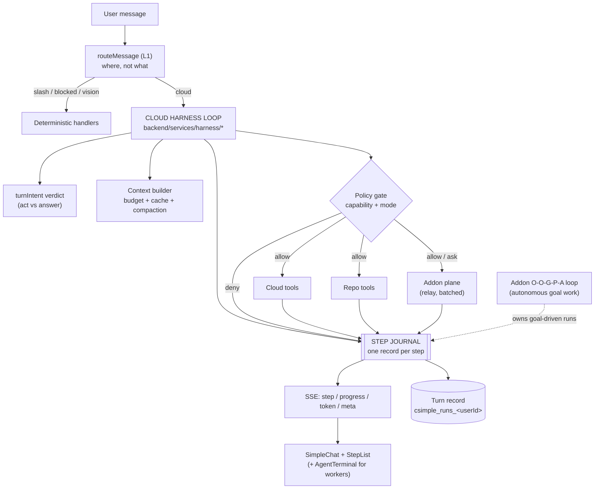

# `/net` as an agent harness — plan

**Status:** P0 + P0b **shipped** 2026-09-18 (see the notes in those phases); P1–P7 not started.
Written 2026-09-18.
**Scope:** the cloud `/net` chat becomes a real agent harness — one loop that can
answer, act on the site, change this repository, and drive the desktop addon —
with every step observable and controllable.

> Companion reading: [`NET_CHAT.md`](NET_CHAT.md) (how routing and the repo agent
> behave today, incl. *Layer 3b* act-vs-answer and *Layer 3c* token economics),
> [`agent.md`](agent.md) (what the product is, the four trust modes),
> [`Simple_Loop_Behaviour.md`](Simple_Loop_Behaviour.md) (the addon loop as the
> code really behaves — read before changing any loop),
> [`AUTOMATION_SECURITY.md`](AUTOMATION_SECURITY.md) (the permission floor).

---

## 0. Definition of done

"Strong harness" is not a feeling; it is six properties, each of which can be
falsified by a test or a driven run. Today `/net` has part of #1 and none of the
rest.

| # | Property | Falsified by |
|---|---|---|
| **1** | **Intent is decided, not hoped for** — act vs answer is an explicit verdict with a bounded recovery, on both the streaming and non-streaming paths | a turn that narrates an outcome instead of performing it |
| **2** | **Steps are observable** — every tool call is a structured record (name, redacted args, result status, duration, round) streamed live, renderable as a step list, and persisted with the turn | a user who cannot tell what the agent did or why it stopped |
| **3** | **The turn is controllable** — cancel and pause mid-turn; risky tools ask; the approval is *the same policy* the addon already enforces | a 90-second turn with no way out but a page reload |
| **4** | **Both hands work in one loop** — the same turn can use cloud tools, repo tools, and the user's PC, without the user picking a "mode" first | "I can't do that" when the addon is connected and could |
| **5** | **Verification closes** — a change can be *checked* (search, re-read, run the allowlisted build/test), not merely asserted | "done" with no evidence behind it |
| **6** | **Cost is governed** — the per-call prefix and every tool result are budgeted, cached where possible, and bounded by construction | a maxed turn whose input cost is dominated by re-sending the same bytes |

## 1. What exists today

Three layers already decide where a message goes; the plan must not fight them.

| Layer | Owner | What it decides | State |
|---|---|---|---|
| 1 — client | `frontend/src/utils/simpleAddon/messageRouter.js` | `slash \| blocked \| vision-required \| pc-relay \| unreachable \| agent \| chat-cloud \| chat-local` | shipped, pure, unit-tested |
| 2 — addon | `simple-addon/server/automation/routing-lexicon.js` + `routing-classifier.js` | Windows action vs chat, with a low-confidence disambiguation question | shipped, tested |
| 3 — cloud | `backend/services/llmService.js` + `turnIntent.js` | answer vs tool, and which tool | **act-vs-answer policy added 2026-09-18; no step protocol, no control, no PC tools** |

The cloud loop's actual tool planes:

| Plane | Tools | Latency | Gate |
|---|---|---|---|
| Cloud | 17 in `netTools.js` (goals, notes, memory, image, math, datetime, search, tickets…) | in-process, ms | `toolScopes.js` (public) |
| Repo | 9 `repo_*` incl. `repo_search` + paged reads | in-process, ms | `repo:read` / `repo:write` / `repo:push`, admin only |
| PC | ~40 registered tools in the addon (`shell_run`, `uia_*`, `input_*`, `browser_*`, skills, eye tracking, voice…) | **not reachable from the cloud loop at all** | `permissions.js` — category modes `allow/ask/deny/dry-run`, kill switch |

Measured facts that the plan is built on (2026-09-18):

- Fixed prefix ≈ **4,249 tokens of tool schemas + ~500 of system prompt**,
  re-sent on **every** model call; a repo turn spends up to **18** calls.
- `MAX_TOOL_ROUNDS = 16`; `TOOL_TURN_MAX_TOKENS = 16384`.
- The relay is a **polling queue**: addon polls every **3 s** idle, heartbeat
  30 s, command **TTL 5 min**, command kinds `['chat','chat_stream','confirm','agent_run']`
  (`backend/controllers/addonRelayController.js:282`,
  `simple-addon/server/cloud-relay.js`).
- The eval harness (`simple-addon/server/automation/eval/`) already runs real
  tool calls against scenarios, registered in `test:unit`.
- Addon events are **reported, not recorded**: `event-detail.js` is the one
  place that decides what an event may say — PII args are *absent*, not redacted,
  strings over 2 kB are dropped. Any new journal must obey that rule.

## 2. Gaps

| # | Gap | Consequence today |
|---|---|---|
| **G1** | No step protocol. `progress` carries one label; `tools` carries `{tool, args, success}` after the fact; `_toolsExecuted` is the summary | the UI cannot render a step list; a run cannot be reviewed; failures are invisible |
| **G2** | No cancellation. The client has "stop generation" for the token stream, but the backend tool loop keeps running model calls and executing tools | a wrong turn burns 18 model calls and can still write files |
| **G3** | No approval on the cloud side. `toolScopes.js` is capability gating (admin vs not), not policy (ask/allow/deny per tool) | `repo_commit_changes` runs because you are an admin, never because you were asked |
| **G4** | The addon plane is unreachable from the cloud loop. `routeMessage` sends a message to *either* the addon's own loop *or* the cloud | "open notepad, then summarise the file you just read" is impossible in one turn |
| **G5** | The relay's shape is wrong for per-tool dispatch (3 s poll × up to 16 rounds ≈ 48 s of pure polling) | naive G4 implementation would make every PC-touching turn feel broken |
| **G6** | No execution. `repo_*` can search/read/edit/commit but cannot run a build or a test | property #5 cannot be met; verification is re-reading |
| **G7** | No prompt caching (`cachePoint` appears nowhere in the backend); compaction is a 150-char-per-message truncation | the prefix is re-billed 18×; long chats lose tool results first |
| **G8** | No plan surface. Multi-step work is invisible until the reply | the user cannot see or correct a plan mid-flight |
| **G9** | Recovery is a single nudge, with no failure taxonomy | a failed tool call is described to the model as a string, not classified into retry / re-plan / ask |
| **G10** | No harness-level evals — only addon scenarios and hand-written regression tests | phases below cannot be proven, only asserted |

## 3. Target architecture



One loop, three planes, one journal, one policy gate. The addon's own
O-O-G-P-A loop is **not** replaced — it stays the autonomous worker for
goal-driven runs (`/plans`, tray, wakeword, triggers) and writes to the same
journal so one console shows both.

### Decisions, with the alternative rejected

**ADR-1 — the interactive harness loop lives in the cloud, not the addon.**
The addon loop is a background worker: it is goal-bound, sleeps between ticks,
runs for minutes, and has a stall detector tuned for that cadence
(`STALL_THRESHOLD`, `IDLE_SLEEP_MS`). An interactive turn needs sub-second
thinking, a token stream, and a hard stop. *Rejected:* making the addon loop
interactive — it would inherit goal semantics it does not need and put the
"where does my data live" question inside the user's machine for every chat.

**ADR-2 — the addon's tools are a capability plane of the cloud loop, not a
second router hop.** A tool call is a *step*, not a *message*: it has args, a
result, and a place in the plan. `routeMessage` keeps deciding where a *message*
goes; the harness decides which *plane* a *step* goes to. *Rejected:* extending
the L1 router to split a message across two loops — that is a scheduler, and it
cannot express "read the file, then open it".

**ADR-3 — the step journal is a first-class artifact.** Steps are written to the
SSE stream *and* to a per-turn record, because the questions that matter ("what
did it do?", "where did it stop?", "what did that cost?") are asked after the
turn, not during it. *Rejected:* expanding `routingTelemetry` into a journal —
telemetry is bounded, low-cardinality, and deliberately has no per-request
DynamoDB writes (see `AUTOMATION_SECURITY.md` → *Eighth audit pass*); a turn
record is high-cardinality and must persist.

**ADR-4 — approval stays on the machine that owns the resources.** The addon's
`permissions.js` remains the authority for PC tools, kill switch included. The
cloud gate decides *whether the loop may ask*; the addon decides *whether the
action happens*. *Rejected:* a cloud-side approval that then tells the addon to
run — that would be a second source of truth for the same policy, and the kill
switch would stop meaning anything.

**ADR-5 — execution is an allowlisted runner, never a shell.** See P3.

## 4. Phases

Each phase is shippable alone, ends with tests that fail if the property
regresses, and names the doc it updates.

### P0 — Step protocol and journal  *(foundation; everything else renders through it)* ✅ shipped 2026-09-18

**Goal:** every tool call becomes one structured record, streamed and persisted.

**What shipped:**

- `backend/services/harness/stepJournal.js` — `createRun`, `startStep`,
  `completeStep`, `finishRun`, `readRuns`, plus `journalHooks(run, {onStep,
  onAnnounce})` so both routes build a step identically.
- SSE `{type:'step', step}` emitted on **open (`running`) and close (`ok`/`error`)`** —
  a step has a lifecycle, so the client upserts one row rather than appending two.
  `progress` stays for clients that predate the event.
- `toolProgress.js` gained `toolPlane(name)` (`cloud | repo | addon`).
- Client: `StepList.jsx` (+ css, 9 tests) renders the run inside the assistant
  bubble — summarised as `6 steps · 1 failed · 2.4s`, expandable per row.
- Persisted as a **per-user ring** (`csimple_runs_<userId>`, newest 10) with ONE
  read-modify-write per turn, written *after* the client is unblocked. Chosen over
  one row per turn: bounded growth, self-cleaning, and the same shape
  `msg_index_<userId>` already uses for the Talk dashboard.
- Wired into **both** routes (`streamCompressionRequest` and `callLLMApi`).

**Redaction** reuses the addon's rule (an event reports, the log records):
strings over 2048 chars become their length, data URLs are named, arrays become
counts, leaves clip at 120 chars — and for the tools whose arguments ARE the
user's private writing (`save_note`, `submit_support_ticket`, `save_goal(s)`,
`log_action`, `update_memory`, `delete_memory`, `update_personality`,
`update_behavior`) the values are **withheld entirely**: keys only.

**Deliberate behaviour change:** a tool executor that THROWS is now fed back to
the model as that tool's result instead of rejecting the whole turn. Previously a
throw lost every step that had already succeeded and showed the user a bare
error. P6 will classify these into retry / re-plan / ask.

**Provable by:** `backend/__tests__/unit/stepJournal.test.js` (redaction,
lifecycle, ring bounds, store-down tolerance), `StepList.test.jsx` (9 cases incl.
"a private argument is never rendered"), and the existing streaming suite's SSE
assertions.

**Still owed:** the chat history does not carry `steps` back on reload — the
record is in the run ring, not the conversation. Reading it back into a reopened
conversation is a small follow-up (`readRuns` + a route).

**Risk:** touching both loops again — the two-tool-loop drift this repo has
already been bitten by twice. Mitigation: P0 *first* collapses them (see P0b).

**P0b — collapse the duplicate loop.** ✅ shipped 2026-09-18

`runToolLoop()` and the inlined loop in `streamCompressionRequest()` were two
implementations of one idea; `turnIntent` had to be wired into both, and P0/P1/P3
would have needed the same again. The loop now lives in
`backend/services/harness/toolLoop.js` **injected with what it needs** —
`call(messages, options)` and `executeToolCall(toolCall, toolContext)` — because
that is what makes the sequence testable with fakes, with no provider, table or
capability map in scope. `llmService` passes `makeLLMCall` / `executeToolCall`;
`parseToolArguments` moved with it (the journal needs the same answer about a
truncated call).

The hook contract that replaced each caller's private copy: `onToolStart`,
`onToolEnd`, and a new `exhausted` flag meaning *"stopped on the round budget
while still wanting tools"* — which is exactly the distinction between "the
answer is already in hand" and "ask for a prose wrap-up".

**Provable by:** `backend/__tests__/unit/toolLoop.test.js` (12 cases: sequence,
round cap, `exhausted` both ways, nudge, throwing executor, hook ordering) plus the
pre-existing `llmServiceStreamingTools` assertions — the exact `18 converse calls`
for a maxed turn is the guard that the refactor changed nothing.

### P1 — Control: cancel and approve ✅ shipped 2026-09-18

**Goal:** property #3. **What shipped:**

- `backend/services/harness/turnControl.js` — one handle per run: `isCancelled`,
  `cancel(reason)`, `requestApproval({tool, question, options, heartbeat})` →
  `{id, promise}`, `close()`. Module-level maps, with the multi-instance caveat
  written down (the SSE connection *is* the turn, and it is pinned to one
  instance; scale-out moves these two maps to DynamoDB).
- **Cancel is cooperative and only ever at a safe boundary** — between rounds and
  before each tool, never mid-tool (a half-applied edit is worse than a completed
  one; same contract as the addon's kill switch). Skipped calls still get a
  synthetic `Cancelled: …` result, because the model's `tool_calls` turn is
  already in the history by then and every call in it needs a result or the next
  request is illegal. That invariant has its own test.
- **A disconnect cancels.** `res.on('close')` + `!res.writableEnded` → cancel.
  A closed tab used to keep paying for up to 16 more model calls and whatever
  tools they asked for.
- `POST /api/data/compress/cancel` and `/compress/approve`, both `200` on a race
  ("that turn already finished") because a double click and a late answer are
  normal, not errors.
- `toolScopes.js` gained `TOOL_POLICY` + `policyFor()` / `requiresApproval()`.
  **Only `repo_commit_changes` is `'ask'`.** `repo_push` keeps its existing
  message-bound gate (a one-time proposal code the user's own words satisfy and a
  button click cannot) — a prompt there would be friction that only looks like
  safety. The policy map is where P2's `pc_*` tools will land.
- A refusal is its own step status (`denied`) end to end: the journal, the SSE
  step, and `StepList` (`⊘`, summarised as "N not approved"). A tick beside a step
  that never ran would be a lie.
- Client: the run id arrives on `{type:'run'}`; Stop calls cancel; the approval
  reuses the chat's **existing** `ConfirmationPanel` (keys 1-9, Esc, focus) with
  `source: 'cloud-turn'`, and answering it does **not** synthesize a message —
  the turn is still streaming and its reply arrives on the same stream.

**⚠️ Deliberate gap, stated:** the non-streaming route (`callLLMApi`, the addon's
JSON path) passes no approval channel, so an `'ask'` tool runs unprompted there.
Arming it without a channel would *break* a working path (the tool would have to
be denied). The capability gate is the security boundary; this is a control gate.

**Provable by:** `turnControl.test.js` (15), `toolLoop.test.js` cancel/approval
cases incl. the history-pairing invariant, and four end-to-end cases in
`llmServiceStreamingTools.test.js` driven through the real route — deny, approve,
cancel mid-turn, and disconnect.

**Risk taken and closed:** the streaming route is one long `await`, so a parked
approval needs the connection to survive. Heartbeat SSE comments every 15 s plus
a 3-minute self-deny, both `unref`'d so neither holds the process open.

### P2 — The addon capability plane

**Goal:** property #4, without G5's latency disaster.

- **Transport:** new relay command kind `tool` in
  `addonRelayController.js`'s `VALID_TYPES`, handled in `cloud-relay.js` beside
  `agent_run`, executing through `tool-registry.js` `executeTool` — i.e. through
  the **real** permission gate, never around it.
- **Latency, honestly:** the idle poll is 3 s. Three mitigations, in order:
  1. **Adaptive poll.** While the backend reports an active turn for this
     device, the addon polls at 500 ms (the `POLL_INTERVAL_ACTIVE = 1000`
     constant already exists, unused). This alone takes a 6-step turn from ~18 s
     of polling to ~3 s.
  2. **Batch within a round.** The loop groups independent addon steps from one
     model response into one relay command and gets back an array of results.
  3. **Push channel when present.** The addon already streams
     `GET /api/agent/events` (SSE) to the browser; a cloud→addon push needs the
     reverse. Deferred to P2c, and only if 1+2 do not suffice.
- **Tool exposure:** the cloud loop offers a **capability-shaped** subset, not
  all 40 tools — exposing `shell_run` schema-by-schema would add ~3–4K tokens to
  the prefix that is already the dominant cost. The addon advertises its
  *capability summary* (it already computes one:
  `capability-summary.js` → categories + tool counts) and the cloud offers one
  coarse tool per category it needs (`pc_read`, `pc_input`, `pc_browser`,
  `pc_skill`), whose args include the concrete tool name, validated addon-side
  against the same registry. **Token cost: ~4 schemas instead of 40.**
- **Disambiguation is preserved:** if the addon's classifier says
  `needsDisambiguation`, the harness surfaces the question as an approval-style
  step rather than guessing.

**Provable by:** addon-side test that a relayed `tool` command goes through
`requestApproval` (a category set to `deny` must refuse a relayed call exactly
as it refuses a local one); a cloud-side test that a `pc_*` step with no addon
online produces a clear "your PC isn't connected" step, not a retry storm.

**Risk:** this is the one phase that widens the attack surface. It must be
drafted against `AUTOMATION_SECURITY.md` and reviewed as its own document before
merge (P7).

### P3 — Verification: an allowlisted runner ✅ shipped 2026-09-18

**Goal:** property #5. **What shipped:** `backend/services/repoRunner.js` + the
`repo_run` tool, `repo:run` capability (admin only, separate from `repo:write`),
and a rewritten verification instruction in `repoSystemInstructions()` — which
previously told the model, correctly at the time, that it *could not run
anything*.

The containment, and the reasoning, is written up as its own section in
[`AUTOMATION_SECURITY.md`](AUTOMATION_SECURITY.md) §14 — because the honest
framing is that `repo_edit_file` + `repo_run test:file` **is** arbitrary code
execution by proxy, and what makes it acceptable is everything around it: no
command parameter (a task map, not a string), no shell, **a scrubbed child
environment** (the backend holds `JWT_SECRET`/AWS/GitHub tokens; the child gets
an 18-key allowlist), per-task timeouts with `SIGKILL`, head+tail output shaping,
its own capability, and `REPO_RUNNER_DISABLED=1` as a kill switch.

One deliberate entry was REMOVED during implementation: an addon `test:addon`
task pointed at a runner script that does not exist. It was dropped rather than
written, because `test:file` already covers addon tests exactly as the addon runs
them (`node <target>`) — an allowlist entry that names a non-existent file is
worse than no entry.

**Provable by:** `repoRunner.test.js` (22, incl. REAL child processes: the secret
scrub, the timeout kill, the bounded output, the kill switch) plus `test:file`
target validation — which is the security boundary for that task and is tested
directly rather than only through a spawn.

**Still owed:** the whole-suite addon run, and a `repo_run` case driven live
against the real queue (tests only, so far).

### P4 — Context and cost governance

**Goal:** property #6.

- **Prompt caching (`cachePoint`)** on `system` + `toolConfig.tools` in
  `bedrockService.js`, gated on a model allowlist and an env flag, with a
  fallback to the current shape on any validation error. Deferred from the
  token-economics pass precisely because it needs a live check; this phase is
  where that check happens.
- **Compaction with tool-awareness:** replace `compressConversationHistory`'s
  150-char truncation. New rule: drop *older tool results first* (they are the
  large, stale items) and keep user/assistant prose; a tool result survives
  summarisation as one line (`repo_read_file src/x.js → 1200 lines`).
- **Per-turn budget governor:** before each round, compute an input estimate
  (prefix + history) and stop *early* with a prose wrap-up instead of hitting
  `MAX_TOOL_ROUNDS` at maximum context. `TOOL_LIMIT_NOTICE` already exists as the
  graceful exit; this makes it a budget decision rather than a round counter.
- **Prefix diet:** audit the 4,249 tokens of schemas for descriptions that can
  be shortened without losing the rule they encode (the long ones encode hard-won
  behaviour — `save_goal`, `update_memory` — so this is a surgical pass with the
  prompt tests as the guard, not a bulk trim).

**Provable by:** cost/latency telemetry per turn before/after (the harness
records `inputTokens`, `rounds`, `cachedTokens`); a test that compaction keeps
the last user turn verbatim and drops only tool results.

### P5 — Plan surface

**Goal:** property #2's other half — the *plan*, not just the steps.

- New cloud tool `set_plan` (public), mirroring the harness's own todo list:
  `{items: [{id, text, status}]}` with statuses `pending | in_progress | done |
  blocked`. The loop is instructed to set a plan before a multi-step task,
  update it as it goes, and keep **exactly one** `in_progress`.
- Rendered as a compact checklist above the step list; on a long turn this is
  what makes the agent legible.
- Persisted with the turn record (P0) so a reopened conversation shows the plan
  it ran.

**Provable by:** a scripted test that a 4-step task emits a plan, updates it, and
ends with no `in_progress`; a UI test for the blocked state.

### P6 — Failure taxonomy and recovery

**Goal:** G9 — make a failure a decision, not a string.

- Classify a tool result into `transient | invalid-input | not-found |
  permission | fatal` in `backend/services/harness/toolOutcome.js`, and act:
  `invalid-input` → re-read and retry once with a corrective note (the
  `ACT_NUDGE` pattern, generalised); `transient` → one bounded retry;
  `permission` → stop and ask; `fatal` → stop and report.
- Every classification lands in the journal, so "why did it stop?" is answerable
  from the record.

**Provable by:** a table-driven test over the taxonomy with a fake tool layer;
plus one live scenario per class.

### P7 — Evals, metrics and hardening

**Goal:** G10 — the plan becomes falsifiable.

- Extend the scripted-model pattern from `llmServiceStreamingTools.test.js` into a
  **harness scenario suite** (`backend/__tests__/harness/`): a fake LLM plays a
  transcript, the real loop runs, and the journal is the assertion target. One
  scenario per property in §0, so a regression in "acts instead of narrating" or
  "verifies before claiming" fails a named test.
- Dashboards from what already exists: `routingTelemetry` (backend) +
  `GET /api/agent/routing-stats` (addon) + the turn records from P0 →
  steps/turn, tool mix by plane, cancels, approvals, cost per turn.
- **Security review pass** over P2 + P3 with `AUTOMATION_SECURITY.md` updated in
  the same commit.

## 5. The hard problems, stated plainly

1. **Relay latency is the gating risk for P2.** 3 s idle poll × 6 steps ≈ 18 s of
   pure waiting before any execution. The adaptive poll is not an optimisation,
   it is a precondition; P2 should not ship without it.
2. **Approval across devices.** The turn is on a phone; the action is on a
   desktop. "Ask the addon and relay the answer" is one more round trip through
   the same 3 s queue. Decision: the *cloud* approval prompt is what the user
   answers (it is where the turn is), and the addon's own prompt is only reached
   for tools whose category demands it — which means a relayed `tool` command
   must carry the cloud's approval as *evidence*, never as a bypass.
3. **Two agents, one account.** The addon worker and the cloud loop can both act
   on the PC. Ownership must be explicit and enforced: a goal-bound worker claims
   the device; an interactive turn refuses `pc_*` steps while a worker is running
   and says so. Without this rule, they interleave keystrokes.
4. **Execution is the security decision**, not a feature. P3 is gated on an
   explicit sign-off, an allowlist, and a review; it is deliberately last among
   the capability phases.
5. **Cost.** P4's caching is the single biggest lever on the numbers in §1, and
   it is also the change most likely to surface as a `ValidationException` if
   placed wrongly — hence a flag, a model allowlist, and a fallback.

## 6. Non-goals

- Replacing the model or the provider abstraction (`LLM_PROVIDERS.md` owns that).
- Making the addon's O-O-G-P-A loop interactive (ADR-1).
- Auto-committing or auto-pushing. The push gate (`repo_push`, two-turn
  confirmation) stays exactly as hard as it is.
- A general shell. P3 is an allowlist or it is nothing.
- Multi-user/multi-tenant harness parity — this is a single-operator tool
  today, and the admin gate is load-bearing.

## 7. Metrics

| Metric | Source | Target |
|---|---|---|
| Turns that act when a tool owns the request | harness scenarios (P7) | 100% of the "should act" set |
| Turns that claim success without a verifying tool result | journal check | 0 |
| Median steps/turn; tool mix by plane | turn records (P0) | visibility first, then cost work |
| Input tokens per turn, cached share | turn records + `cachePoint` | ≥50% of prefix cached (P4) |
| Wall-clock of a PC-touching turn | journal + relay stats | <5 s for a 3-step turn (P2) |
| Turns cancelled vs completed | control events (P1) | tracked; cancellations should be *possible*, not frequent |

## 8. Sequencing

```
P0 (steps+journal, collapse the loops)   ← everything renders through this
 └─ P0b implicit
P1 (control: cancel / approve)           ← needs runId from P0
P3 (allowlisted runner)                  ← independent; unblocks verification
P4 (context & cost)                      ← independent; the cachePoint live check
P2 (addon plane)                         ← biggest risk; needs the security pass
P5 (plan surface)                        ← small, high legibility
P6 (failure taxonomy)                    ← refines the loop's edges
P7 (evals + hardening)                   ← continuous, and the gate for P2/P3
```

Recommended first three commits, in order: **(1)** P0b loop collapse with the
existing 18-call assertion as the guard, **(2)** P0 step journal + SSE + StepList,
**(3)** P1 cancel. Those three deliver property #2 and #3 and make every later
phase cheaper to build and verify.
