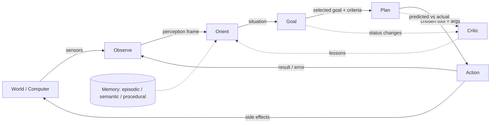
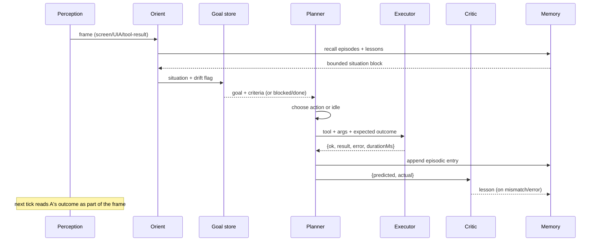

# Observe → Orient → Goal → Plan → Action — Implementation Plan

> Status: **Implementation plan** (replaces the earlier analysis). This
> document specifies how to evolve the existing Simple agent loop into an
> explicit, continuous **Observe → Orient → Goal → Plan → Action** loop with
> nested timescales, a critic, and meta-learning. It is written against the
> current code in `simple-addon/server/automation/`.

## For the executing agent — read this first

**Your job:** upgrade `simple-addon/server/automation/agent-loop.js` from the
current ReAct loop into an explicit **Observe → Orient → Goal → Plan →
Action** loop. Read §1–§14 for the full design, then execute the tasks in §15
in order. **Do not skip Phase 0 — it freezes current behavior so every later
change can be proven non-regressive.**

**Key files to read before touching anything:**
- `simple-addon/server/automation/agent-loop.js` — the loop to refactor.
- `simple-addon/server/automation/index.js` — `mountAutomation` + routes; the multi-agent pool (`_agentPool`, `_getOrCreateLoop`).
- `simple-addon/server/automation/planner.js` — `shouldPlan`, `planGoal` (today's one-shot Goal decomposition).
- `simple-addon/server/automation/tool-registry.js` — `executeTool`, `toolSchemasForLlm`, `onExecuted`.
- `simple-addon/server/automation/perception-bus.js` — `getPerceptionBus`, `getLatestFrame`, `frameToContextString`.
- `simple-addon/server/automation/workspace-client.js` — `getGoal`, `getNextGoal`, `getContext`, `upsertGoal`, `listSkills`, `listGoals`.
- `simple-addon/server/automation/permissions.js` — the gate, kill switch, dry-run.
- `simple-addon/server/automation/pattern-learner.js` — `PatternLearner`, `getPatternLearner`.
- Frontend: `frontend/src/services/simpleAddonApi.js`, `frontend/src/components/SimpleAddon/{AgentLivePanel,GoalManager,SimpleChat}.jsx`.

**Key facts (already verified — don't rediscover):**
- `createAgentLoop({ wsClient, registry, contextFactory, log, llmClient })` returns `{ start, stop, status, running }`.
- Internal (not exported) helpers: `buildSystemPrompt`, `reflectionPrompt`, `findRelevantSkills`.
- Constants: `DEFAULT_MAX_STEPS=20`, `REFLECT_EVERY=5`, `STEP_DELAY_MS=400`.
- Tool call path: `registry.toolSchemasForLlm()` → LLM `chat` with `tools` → `registry.executeTool(name, args, ctx)`.
- Goal read path: `wsClient.getNextGoal()` / `getGoal(slug)`; context via `wsClient.getContext({ message })`; persistence via `wsClient.upsertGoal(slug, patch)`.
- Perception: `getPerceptionBus().getLatestFrame()` → `frameToContextString(frame)`.
- Events: `require('./events').publish(type, payload)` — types include `agent.step`, `agent.stopped`, `goal.blocked`.

**Conventions (match the existing code exactly):**
- Unit tests are a plain-node PASS/FAIL harness (no jest) — see `nl-compiler.test.js`; register new files in `simple-addon/package.json` under `test:unit`.
- Mock modules with side effects via `require.cache` seeding **before** `require()` (see `tools/skill.test.js`).
- Redirect `process.env.APPDATA` to a temp dir before requiring anything that writes to disk (permissions, skill, run-history tests).
- Async tests run sequentially (shared mutable fakes).
- Integration: boot the real `mountAutomation()` via `eval/http-app.js` (see `skill-export-import.test.js`).
- Dashboard HTML: validate with DASHCHECK (extract `<script>` → `node --check`) plus a tag-balance count.

**Commands (run from repo root):**
- Addon unit suite: `npm --prefix simple-addon run test:unit`
- Single test file: `node simple-addon/server/automation/<file>.test.js`
- Syntax check a touched file: `node --check simple-addon/server/automation/<file>.js`
- Backend suite: `node backend/__tests__/run-all-tests.js`

**Guardrails (hard do-nots):**
- Do NOT change the workspace API storage layer (DynamoDB schema) except additive goal/lesson fields.
- Do NOT break existing eval scenarios (1–16).
- Goal *formation* stays human-in-the-loop; `autoAbandon` defaults `false`.
- The kill switch and permission gate stay authoritative at every stage.
- Never record/run a skill, or capture an opt-in sensor, without consent.

**Definition of done (applies to every task):**
- [x] The task's acceptance criteria pass.
- [x] Full `test:unit` green — no regressions.
- [x] `node --check` clean on every touched `.js` file.
- [x] Existing eval scenarios still pass.

## 1. Objective & scope

**Goal:** upgrade the Simple agent's current ReAct loop (`agent-loop.js`) into
an explicit **Observe → Orient → Goal → Plan → Action** loop that runs
continuously, re-examines its goal on a slower cadence, learns from outcomes
through a critic, and knows when to do nothing.

**In scope:**
- Refactor `agent-loop.js` into named stage functions (no behavior change).
- A real **Orient** stage: a bounded, memory-aware situation summary.
- A real **Goal** stage: re-evaluation cadence, self-`blocked`, abandonment.
- A **critic** (PDCA "Check") that writes lessons and adjusts future plans.
- A **meta-loop** that promotes repeated sequences into reusable skills.
- **Idleness**: an explicit `idle` output and stall/boredom detection.
- Safety integration with the existing permission gate at every stage.

**Out of scope (explicitly):**
- Fully self-generated *top-level* goals. Goal formation stays
  human-in-the-loop; the machine owns pursuit, blocking, and abandonment.
- Unattended destructive/shell actions beyond the current permission model.
- Any change to the workspace API's storage layer (DynamoDB schema) except
  additive goal/lesson fields.

## 2. Background (one paragraph)

The cycle (a MAPE-K loop with an inserted intention layer) is the right shape
for a continuous agent; the two hardest stages are **Orient** (world model)
and **Goal** (intent). The current `agent-loop.js` is already ~90% of the way
there — it fetches a goal, builds a context, plans with tools, executes, and
reflects. The work below makes each stage explicit, adds the missing cadence
and critic, and gives the loop permission to stop.

## 3. Target architecture



**Three nested loops, each with its own cadence:**

| Loop | Cadence | Stages run | Purpose |
|---|---|---|---|
| Inner | per action (~seconds) | Observe → Orient → Plan → Action | Fast progress; Goal held fixed |
| Outer | per goal re-eval (every N steps / T minutes) | + Goal | Re-derive or abandon intent |
| Meta | per session/day | Critic over the action log | Learn skills, drop dead policies |

**Agent state machine** (single source of truth in the loop):

```text
IDLE → OBSERVING → ORIENTING → SELECTING_GOAL → PLANNING → ACTING → REFLECTING
                                          ↑_______________↓        (inner loop)
                      └─→ BLOCKED ─→ (wait / new goal) ─────────┘
IDLE ← DONE / FAILED / STOPPED (kill switch)
```

**State transitions** (authoritative table — every transition is observable
in `GET /api/agent/status`):

| From | To | Trigger |
|---|---|---|
| IDLE | OBSERVING | `POST /api/agent/start` or a trigger fires |
| OBSERVING | ORIENTING | perception frame collected (always) |
| ORIENTING | SELECTING_GOAL | start, drift detected, or `REEVAL_STEPS`/`nextReevaluateAt` elapsed |
| ORIENTING | PLANNING | goal unchanged and cadence not due (inner-loop fast path) |
| SELECTING_GOAL | PLANNING | `selectGoal()` returned the same or a new active goal |
| SELECTING_GOAL | BLOCKED | `selectGoal()` returned `blocked` (reason written) |
| SELECTING_GOAL | DONE | success criteria met |
| SELECTING_GOAL | FAILED | `maxSteps` exceeded or unachievable and `autoAbandon:false` |
| PLANNING | ACTING | a concrete tool call chosen |
| PLANNING | OBSERVING | `plan()` returned `idle` (sleep, then re-observe) |
| ACTING | REFLECTING | tool completed (ok or error) |
| REFLECTING | OBSERVING | critic scored the outcome, lesson maybe written |
| any | STOPPED | kill switch / `DELETE /api/agent/worker/:goalSlug` |

**Single-tick data flow:**



## 4. Sensors & observation (the Observe stage)

Observation is the input to the whole loop; every sensor below feeds one
unified `Frame`. Two principles govern the design:

1. **Cheap sensors run every tick; expensive sensors run on demand.** Screen
   capture and UIA are cheap enough for the inner loop; vision description,
   speech-to-text, and webcam are LLM/CPU-heavy and run only when a later
   stage asks for them.
2. **Any sensor that captures human behavior or identifiable content is
   consent-gated.** Gaze, keystrokes, mouse telemetry, microphone, system
   audio, and clipboard contents are opt-in (see §4.5).

### 4.1 Sensor inventory

| Sensor | Signal observed | Current impl | Cadence | Gap / planned work |
|---|---|---|---|---|
| On-screen data | pixels + UI tree | `perception-bus.js`, screen capture, `vision-fusion.js`, `tools/uia.js` | every tick | unify capture + UIA into one `Frame`; add OCR-diff for cheap change detection |
| UIA / window tree | controls, titles, focus | `tools/uia.js`, `perception-bus.js` window-change push | on window change | correlate UIA element to the last action's target window |
| Foreground / process | running apps, active window | `tools/system.js`, `tools/open-app.js`, `tools/wait-for.js` | on demand | already pushes window-change to the bus; add foreground-idle detection |
| File states | existence, mtime, size, content | `tools/fs.js`, `triggers.js` file-watch (`${param.file}`) | event-driven | promote file-watch to first-class perception events |
| Eye tracking | gaze (x,y), confidence, blink | `eye-tracking-manager.js` + `eye_tracker.py` | ~30 Hz when enabled | already feeds the bus; add a gaze-heatmap orientation signal |
| Microphone audio | speech, wakeword, ambient | `audio-stream-manager.js` (Whisper + sounddevice), `tools/audio.js` | on wakeword / demand | add ambient classification (silence/talking/music) |
| PC audio (loopback) | what the computer is playing | none | proposed: on demand | NEW; WASAPI loopback to hear app sounds/notifications |
| Webcam | visual scene | `tools/webcam.js` | on demand | optional vision description already supported |
| Clipboard | copied text/images | clipboard read tool, goal-from-clipboard | on demand | NEW: clipboard-change events as a sensor |
| Keyboard **output** | what the agent typed | `tools/text-type.js` (SendKeys), `tools/input.js` | per action | this is an actuator, not a sensor — listed for clarity |
| Keyboard **input** | what the *user* types | none (no global hook) | proposed: opt-in, low-rate | NEW; WH_KEYBOARD_LL hook; highest privacy risk; off by default |
| Mouse data | cursor position, clicks, scroll | cursor moved by eye tracking / `vision-fusion.js` | action-triggered | NEW telemetry: position/click/scroll stream for user intent |
| API / network | external state | none first-class (shell `curl` only) | on demand | NEW optional `http_get` sensor for status polling |

### 4.2 Per-sensor data shape

Every sensor normalizes into the same `Frame` envelope (the frame shape is
specified in the core-loop section). Representative payloads:

```jsonc
// screen (every tick — cheap path is a thumbnail hash + small UIA summary)
{ "type": "screen", "ts": "...", "frameId": "f123",
  "hash": "ab12…", "changed": true, "uia": { "windowTitle": "...", "controls": 5 } }

// gaze (30 Hz when eye tracking is on)
{ "type": "gaze", "ts": "...", "x": 960, "y": 540, "confidence": 0.82, "blink": false }

// audio (on wakeword / demand — transcript only; raw PCM never leaves the device)
{ "type": "audio", "ts": "...", "transcript": "...", "level": 0.4, "event": "wakeword" }

// file (event-driven from triggers.js)
{ "type": "file", "ts": "...", "path": "...", "event": "modified", "size": 4096 }

// clipboard (opt-in, on demand — content redacted by default)
{ "type": "clipboard", "ts": "...", "hasText": true, "len": 14 }

// mouse telemetry (proposed, opt-in)
{ "type": "mouse", "ts": "...", "x": 400, "y": 300, "button": "left", "event": "click" }

// keyboard input (proposed, opt-in — raw text never stored)
{ "type": "keys", "ts": "...", "keys": [ "ctrl", "c" ] }
```

### 4.3 Fusion into the Frame

`observe()` assembles one `Frame` per tick by polling the cheap sensors and
merging any queued event sensors:

- **Always-polled (cheap):** screen hash + UIA summary + foreground window.
- **Event-queued (pushed):** file-watch, window-change, gaze, audio, webcam.
- **On-demand (expensive):** vision description, STT, loopback audio,
  clipboard read — fetched only when a later stage requests them, so the
  inner loop stays fast.

The assembled frame is stored on `perception-bus.js` (already the single
source of truth for latest-frame + history) so any stage can pull the freshest
state without re-capturing.

### 4.4 Sampling & backpressure

| Budget | Value | Rule |
|---|---|---|
| Frame size | ≤ 1 KB summary | raw screenshot/audio stays local; only the summary enters the loop |
| Inner tick | ~1–2 s | screen hash + UIA only |
| Expensive sensor | on demand, ≤ 1 per tick | vision/STT never run unprompted |
| Event sensors | coalesced | burst events collapse to the latest per key |
| Bus history | bounded ring | oldest frames dropped, never blocking |

### 4.5 Privacy & consent

| Tier | Sensors | Default |
|---|---|---|
| Always-on (local, non-identifiable) | screen/UIA, window/process, file states, action log | on |
| Opt-in (behavioral / biometric) | eye tracking, microphone, webcam, clipboard, keyboard input, mouse telemetry, system audio | off |
| Never stored raw | raw PCM, raw pixels, keystroke *text* | redacted / summary only |

The existing `permissions.js` category gate (safe-read / sandboxed-write /
shell / destructive / system) governs *actions*; this section adds the
*sensor* side. New sensors inherit the repo's still-open capture-time-consent
TODO: nothing above "always-on" turns on without an explicit user toggle, and
the kill switch stops capture along with action.

### 4.6 Sensor rollout by phase

| Phase | Sensors added / wired |
|---|---|
| 0 (baseline) | screen, UIA/window, process, file-watch, gaze, mic, webcam, clipboard (existing) |
| 2 (Orient) | unify all into one `Frame`; add OCR-diff change detection |
| 6 (idleness/safety) | foreground-idle detection gates actions ("user present?") |
| 5 (meta) | action-log sensor feeds `pattern-learner.js` (already) |
| post-plan (opt-in) | keyboard input, mouse telemetry, system-audio loopback, clipboard-change, `http_get` |

## 5. Current state vs target

| Stage | Already exists | Missing (work item) |
|---|---|---|
| Observe | `perception-bus.js`, screen/UIA/file/audio tools, tool results recorded | No unified per-tick `frame` snapshot in the loop; perception is ad-hoc — see §4 for the sensor surface |
| Orient | `workspaceContext.js` (ACTIVE GOALS + RECENT ACTIONS injected into prompt) | No explicit orient function; no semantic-memory recall; no drift detection |
| Goal | workspace `goal` kind, `GET .../workspace/goals/next`, `GoalManager.jsx` | No re-eval cadence, no self-`blocked`, no abandonment, no stall tracking |
| Plan | `agent-loop.js` LLM tool-call step, `nl-compiler.js` | No recorded *prediction* to feed the critic |
| Action | `tool-registry.js` + `tools/*` | No post-action `idle` classification |
| Critic | reflection every 5 steps (in-loop), `recorder/generalize.js`, `infer-params.js` | No persistent `lesson` store; reflection doesn't gate future plans |
| Memory | workspace kinds: `memory`, `action` (JSONL ring), `skill`, `decision`, `log` | No `lesson` kind; semantic memory is only pattern-learner's |
| Safety | `permissions.js` (gate, kill switch, dry-run, deny-list) | No stall/boredom detection feeding the kill switch |

## 6. Integration with the existing Simple addon

The O-O-G-P-A loop is not a new product — it is a refactor of the existing
`agent-loop.js` ReAct loop plus a deeper plug into the features the addon
already ships. This section inventories what exists today (§6.1), maps each
loop stage onto those features (§6.2), and defines the enable/disable
controls (§6.3) and the chatbot interaction model (§6.4).

### 6.1 Feature inventory (current Simple addon)

| Feature | File / route | What it does | Role in the new loop |
|---|---|---|---|
| Agent loop | `agent-loop.js`, `/api/agent/*` | ReAct loop: fetch goal → prompt → LLM+tools → execute → reflect | the loop itself (Phases 0–1 refactor it) |
| Multi-agent pool | `/api/agent/worker/:goalSlug` | up to 3 concurrent goal-bound workers | one loop instance per active goal (unchanged) |
| Macros / skills | `tools/skill.js`, `/api/skill/*` | record → compile → save → run; NL edit; generalize; params; hotkeys; export/import | procedural memory; `plan()` prefers `skill_run` |
| Recorder | `/api/recorder/*` | user-initiated capture of demonstrations | human Observe→Plan→Action traces → skills |
| NL compiler | `nl-compiler.js` | English → skill steps | turns chat phrases into `plan()` steps |
| Triggers | `triggers.js`, `/api/triggers/*` | cron/file/hotkey/startup → goal or skill | external entry points into Observe; file-watch = sensor |
| Planner | `planner.js` | decompose "big" goals into 2–5 sub-goals | today's crude Goal stage; Phase 3 supersedes it |
| Predictions | `predictor.js`, `/api/agent/predictions` | n-gram prefetch of the next tool | anticipatory Orient signal (future) |
| Suggestions | `pattern-learner.js`, `/api/agent/suggestions` | find repeated sequences, LLM-named | the meta-loop (Phase 5) |
| Marketplace | `/api/market/skills*` | browse/install/rate/flag skills | distribution of learned skills |
| Voice | `/api/voice/*`, `audio-stream-manager.js` | listen, speak, wakeword | Observe (mic) + Action (speak) + entry point (wakeword) |
| Perception | `perception-bus.js`, `/api/perception/*` | fused screen/UIA/gaze/audio/action log | Observe (the `Frame`) |
| Workspace profiles | `/api/workspace-profiles*` | save/restore workspace context | Orient context switching |
| Permissions & consent | `permissions.js`, `/api/automation/*` | category gate, kill switch, dry-run, approvals | the safety gate around Action + the new sensor side |

### 6.2 Stage → feature interaction

- **Observe** ← perception bus + triggers + voice + recorder. Every feature
  that produces a state change (a file event, a finished tool call, a spoken
  wakeword) publishes into the same `Frame`. The recorder is the one
  exception: recording is always the *user's* action, never the agent's.
- **Orient** ← workspace context + skills cache + suggestions + profiles. The
  situation block already pulls ACTIVE GOALS + RECENT ACTIONS; it will also
  pull matching `lesson`s (Phase 4) and the top skill hints. Workspace
  profiles let the user swap the orientation's long-term memory wholesale.
- **Goal** ← goal store + planner + `getNextGoal()`. Today the planner
  decomposes big goals once at start; Phase 3 makes re-evaluation (and
  blocking/abandonment) continuous instead of one-shot.
- **Plan** ← skills + NL compiler + tool registry. `plan()` already prefers
  `skill_run({slug})` over rederiving steps (prompt rule 8); the critic
  (Phase 4) adds a recorded `expected` outcome to each chosen action.
- **Action** ← tool registry + permission gate. Mechanically unchanged; the
  only additions are the `idle` no-op and post-action classification
  (Phase 6).
- **Meta-loop** ← pattern-learner + recorder/generalize + marketplace.
  Repeated sequences become skills (Phase 5), which then become the `plan()`
  shortcuts the agent already prefers — closing the learning loop.

### 6.3 Enable / disable & autonomy levels

The loop is controlled at four independent layers; each can be toggled
without touching the others.

| Layer | Control | Where |
|---|---|---|
| Global | kill switch | tray + `/api/automation/permissions/kill` |
| Mode | dry-run vs live | tray toggle, `/api/automation/permissions` |
| Per-run | start / stop / maxSteps / autoAbandon | `POST /api/agent/start\|stop`, GoalManager "Run Agent", AgentLivePanel |
| Per-category | allow / deny / ask | Permission Center, `/api/automation/permissions` |

Proposed **autonomy levels** (one enum, exposed in the UI and `config`):

| Level | Behavior | Default? |
|---|---|---|
| `off` | loop never runs; kills any active worker | — |
| `dry-run` | loop runs but tools only describe, never act | — |
| `on-demand` | loop runs only when explicitly started (chat/button/trigger) | ✅ |
| `continuous` | loop idles between goals and self-starts on triggers/drift | opt-in |

The new loop keeps `on-demand` as the default — `continuous` is the end state
the plan builds toward, and it must only be reachable after Phase 6
(idleness + stall + kill switch) ships.

### 6.4 Chatbot interaction model

Today the chat (`SimpleChat.jsx`) is conversational and separate from the
autonomous loop: `/goal <desc>` creates a goal, and the agent is started from
GoalManager / AgentLivePanel / tray / triggers / wakeword. The chat already
routes automation through the addon (local `addonFetch`, or the
phone→cloud→PC relay).

The target model makes the chat the **front door** to the loop:

| Chat surface | Behavior |
|---|---|
| `/goal <desc>` | create a goal (exists) |
| `/run <desc-or-slug>` | **proposed** — create goal if needed, then start the loop |
| `/agent status\|start\|stop` | **proposed** — direct loop control in-chat |
| `agent.events` SSE | live loop activity streamed into the conversation |
| `goal_ask_user` tool | the loop asks a question → surfaces as a chat prompt; the reply resumes the loop |
| pending approvals | tool approvals rendered inline as confirm buttons (auto-approve toggle exists) |
| wakeword | voice → goal → start (exists) |

Two distinct modes, made explicit:

1. **Conversational mode (default)** — the chat LLM talks; it may *propose*
   goals or skills but never acts without a confirm (the existing
   `confirmAction` flow).
2. **Autonomous mode** — the loop acts on a goal, streaming its steps into
   the chat and pausing only for approvals, `goal_ask_user`, or a kill.

### 6.5 What changes vs. what stays

| Surface | Stays | Changes |
|---|---|---|
| Skills/macros, recorder, triggers, marketplace, voice, perception | unchanged | none (loop consumes them) |
| `agent-loop.js` | tool execution, goal refresh, sentinel | refactored into named stages + critic + cadence + idle |
| `planner.js` | still used for first-run decomposition | absorbed by the continuous Goal stage |
| goal store | `getNextGoal()`, statuses | additive fields (`maxSteps`, `autoAbandon`, `stallCount`, …) |
| permissions | category gate, kill switch, dry-run | extended with sensor consent tiers (§4.5) |
| chat | `/goal`, relay, approvals | `/run`, `/agent`, inline loop events |

## 7. Data model & API contracts

### 7.1 Additive goal fields (`workspaceController.js` goal item)

| Field | Type | Meaning |
|---|---|---|
| `nextReevaluateAt` | ISO string | Next time the outer loop must re-run the Goal stage |
| `stallCount` | int | Consecutive actions with no measurable progress |
| `lastOutcomeDelta` | float -1..1 | Critic's score of the last action (-1 regress, 0 none, +1 progress) |
| `autoAbandon` | bool | Agent may self-`block`/abandon only if true |
| `maxSteps` | int | Hard step budget for this goal (default e.g. 60) |

### 7.2 New workspace kind: `lesson`

Written by the critic; read by the Orient stage as semantic memory.

```jsonc
{
  "kind": "lesson",
  "slug": "lesson-<hash>",
  "content": {
    "pattern": "save dialog requires wait_for before typing",
    "context": "nl-compiled macros into dialogs",
    "do": "insert wait_for(windowTitle) before type_text",
    "avoid": "fixed wait_ms guesses",
    "confidence": 0.8,
    "sourceGoal": "<slug>"
  }
}
```

### 7.3 Endpoints

| Method | Path | Purpose |
|---|---|---|
| `GET` | `/api/agent/status` | extend: `stage`, `loop` (inner/outer/meta), `stallCount`, `lastLesson` |
| `POST` | `/api/agent/start` | accept `goalSlug` (exists) + optional `{maxSteps, autoAbandon}` |
| `POST` | `/api/agent/block` | agent marks current goal `blocked` with a reason |
| `GET` | `/api/agent/lessons?goal=<slug>` | read critic lessons for orientation |
| `DELETE` | `/api/agent/worker/:goalSlug` | exists |

### 7.4 Configuration & constants

All knobs live in one place (`agent-loop.js` defaults, overridable per start
request) so behavior is tunable without code changes.

```jsonc
{
  "ORIENT_CAP_BYTES": 12288,      // hard cap on the situation block
  "EPISODIC_WINDOW": 20,          // recent actions recalled into Orient
  "LESSON_TOPK": 3,               // matching lessons injected into Orient
  "REEVAL_STEPS": 8,              // inner ticks between Goal re-evals
  "REEVAL_MS": 300000,            // wall-clock fallback (5 min)
  "DRIFT_THRESHOLD": 0.35,        // orientation delta that forces re-eval
  "IDLE_SLEEP_MS": 2500,          // sleep when plan() returns idle
  "STALL_THRESHOLD": 3,           // consecutive no-progress actions → blocked
  "MAX_STEPS_DEFAULT": 60,        // default hard step budget per goal
  "META_EVERY_ACTIONS": 50,       // meta-loop cadence in recorded actions
  "SKILL_PROMOTE_MIN_REPEATS": 3  // n-gram repeats before a skill draft
}
```

| Constant | Phase that consumes it | Notes |
|---|---|---|
| `ORIENT_CAP_BYTES`, `EPISODIC_WINDOW`, `LESSON_TOPK` | 2 | drop in priority order 5→1 when over cap |
| `REEVAL_STEPS`, `REEVAL_MS`, `DRIFT_THRESHOLD` | 3 | any trigger fires the outer loop |
| `IDLE_SLEEP_MS`, `STALL_THRESHOLD` | 6 | floor + ceiling on sleep to avoid a hot loop |
| `MAX_STEPS_DEFAULT` | 3 | per-goal `maxSteps` wins over the default |
| `META_EVERY_ACTIONS`, `SKILL_PROMOTE_MIN_REPEATS` | 5 | consent gate still required before save/run |

### 7.5 API examples

**Start with overrides** (existing endpoint, extended):

```http
POST /api/agent/start
Content-Type: application/json

{ "goalSlug": "fix-coliseum-save-bug", "maxSteps": 40, "autoAbandon": true }
```

**Status** (extended shape):

```jsonc
{
  "running": true,
  "stage": "ACTING",            // IDLE|OBSERVING|ORIENTING|SELECTING_GOAL|PLANNING|ACTING|REFLECTING
  "loop": "inner",              // inner | outer | meta
  "goalSlug": "fix-coliseum-save-bug",
  "stallCount": 1,
  "lastLesson": "save-dialog-needs-wait-for",
  "workers": [ { "goalSlug": "fix-coliseum-save-bug", "step": 7 } ]
}
```

**Self-block** (new):

```http
POST /api/agent/block
Content-Type: application/json

{ "goalSlug": "fix-coliseum-save-bug", "reason": "cannot reproduce; 3 identical failures" }
```

**Lessons** (new):

```http
GET /api/agent/lessons?goal=fix-coliseum-save-bug
```

```jsonc
{ "lessons": [ { "slug": "lesson-a1b2", "content": { /* see 7.2 */ }, "confidence": 0.8 } ] }
```

---

## 8. Implementation phases

Each phase is independently shippable; no phase changes user-visible behavior
until Phase 6.

### Phase 0 — Baseline & loop harness (no behavior change)
**Files:** `simple-addon/server/automation/agent-loop.js`, new test harness.
- Freeze current loop behavior with a test that mocks `llm.chat` + `registry`
  and asserts the exact sequence of tool calls for a canned goal.
- Extract the loop into a class/object with an injectable `ctx` (llm, tools,
  wsClient, perception, critic) so each stage can be unit-tested in isolation.
- **Acceptance:** existing eval scenarios 1–16 still pass; 1 new baseline test
  green.

### Phase 1 — Named stage functions
**Files:** `agent-loop.js`.
- Split the body of `tick()` into `observe()`, `orient()`, `selectGoal()`,
  `plan()`, `act()`, `reflect()` — each returning a plain object. No logic
  changes, just boundaries.
- Add an explicit `stage` field to the loop's status payload (used by Phase 6
  UI).
- **Acceptance:** same outputs as Phase 0; `stage` transitions logged.

### Phase 2 — Orient stage
**Files:** `agent-loop.js`, `workspaceContext.js`, `pattern-learner.js`.
- `orient(frame, memory)` assembles the bounded situation block:
  1. latest perception frame (screen/UIA summary, ≤1 KB),
  2. last 20 episodic actions (from the JSONL ring),
  3. active-goal snapshot,
  4. top-k matching `lesson`s from semantic memory,
  5. recent pattern-learner suggestions.
- Cap the block at 12 KB (existing context cap); drop in priority order.
- Add drift detection: if the orientation block changes by >threshold between
  ticks, force an outer-loop Goal re-eval.
- **Acceptance:** unit test on `orient()` with fake memory asserts the block
  is bounded and ordered.

### Phase 3 — Goal stage (outer loop)
**Files:** `agent-loop.js`, `workspaceController.js`, `workspace-client.js`.
- Add re-eval cadence: run `selectGoal()` on start, on drift, and every
  `REEVAL_STEPS` (default 8) or when `nextReevaluateAt` passes.
- `selectGoal()` may return: same goal, a higher-priority goal, `blocked`
  (writes reason + status), or `done` (criteria met) / `abandoned`
  (unachievable, `autoAbandon` true).
- Enforce `maxSteps` and `stallCount` (Phase 6 feeds stall).
- **Acceptance:** goals with `autoAbandon:false` are never self-abandoned;
  a goal exceeding `maxSteps` is marked `failed`.

### Phase 4 — Critic (PDCA "Check")
**Files:** `agent-loop.js`, new `critic.js`.
- `plan()` now records `action.expected` (the LLM's one-line prediction of the
  outcome) alongside the tool call.
- After `act()`, `critic.score({predicted, actual})` → `lastOutcomeDelta`.
  Mismatch (or tool `error`) triggers a `lesson` write to the workspace.
- `reflect()` reads the newest lesson and, if it applies to the next `plan()`,
  appends it to the prompt ("Prior lesson: ...").
- **Acceptance:** a failing step produces exactly one `lesson`; the next plan
  prompt contains it; lessons are idempotent (hash on pattern).

### Phase 5 — Meta-loop (learning)
**Files:** `pattern-learner.js` (extend), `recorder/generalize.js` (reuse).
- Extend the existing n-gram pattern learner to *promote* a high-confidence
  repeated sequence into a `skill` via the existing generalization pipeline,
  gated by `autoApprove`-style consent.
- **Acceptance:** 3+ repeated 3–6 step sequences produce a skill *draft*;
  nothing is saved/run without consent.

### Phase 6 — Idleness & safety
**Files:** `agent-loop.js`, `permissions.js`, `tools/*`.
- `plan()` may return `idle` when no action's expected value clears a
  threshold; `idle` is a terminal tick (short sleep, no tool call).
- Stall/boredom detector: `stallCount` increments when `lastOutcomeDelta ≤ 0`
  or the same action repeats 3×; at threshold, mark goal `blocked` and emit a
  `goal.blocked` SSE event.
- Wire stall → kill-switch hint; never block on a hard `deny` result.
- **Acceptance:** a synthetic "same failing action" scenario self-blocks and
  stops instead of looping forever.

### Phase 7 — Tests & eval scenarios
**Files:** `agent-loop.test.js`, `critic.test.js`, `eval/*.json`, `package.json`.
- Unit tests per stage using the existing plain-node PASS/FAIL harness and
  `require.cache` mocking conventions (see `tools/skill.test.js`).
- New eval scenarios 17–20: goal-block-on-stall, critic-lesson-roundtrip,
  orient-bound-cap, idle-on-empty-goals.
- **Acceptance:** full `test:unit` green; 4 new scenarios pass in `runner.js`.

### Phase 8 — UI surfacing & rollout
**Files:** `AgentLivePanel.jsx`, `dashboard.html` (Agent tab).
- Surface `stage`, `loop`, `stallCount`, `lastLesson` in the live panel and
  Agent tab.
- Add a per-goal "Auto-abandon" toggle and a lessons list.
- Ship behind the existing kill switch; default `autoAbandon:false`.
- **Acceptance:** user can see which stage/loop is running and why a goal
  blocked; kill switch still halts everything immediately.

## 9. Core loop pseudocode (target)

```js
async function tick(ctx) {
  const frame = await ctx.perception.frame();                 // OBSERVE
  const situation = await orient(frame, ctx.memory);          // ORIENT
  if (situation.drifted) await reEvalGoal(ctx);               // force outer loop

  if (ctx.shouldReEvalGoal()) {                               // OUTER LOOP
    const decision = await selectGoal(situation, ctx.goalStore);
    if (decision.status === 'blocked')   return ctx.block(decision.reason);
    if (decision.status === 'done')      return ctx.finish('done');
    if (decision.status === 'abandoned') return ctx.finish('abandoned');
    ctx.goal = decision.goal;
  }

  const action = await plan(situation, ctx.goal);             // PLAN
  if (action.type === 'idle') return ctx.sleep(2500);         // IDLENESS

  const outcome = await act(action, ctx.permissions);         // ACTION
  ctx.memory.episodic.append({ frame, goal, action, outcome });

  const delta = await ctx.critic.score(action, outcome);      // CHECK (critic)
  if (delta < 0 || outcome.error) await ctx.critic.writeLesson(action, outcome);
  ctx.goalStore.update(ctx.goal.slug, { lastOutcomeDelta: delta });

  if (ctx.metaDue()) await ctx.metaLoop.promote(ctx.memory);  // META LOOP
}
```

### 9.1 Module contracts & signatures

Each stage is a pure-ish function over injected `ctx` (llm, tools, wsClient,
perception, memory, critic) so it is unit-testable offline.

```js
// agent-loop.js (refactored)
class AgentLoop {
  constructor(ctx)                 // ctx = { llm, registry, wsClient, perception, memory, critic, config }
  async tick()                     // one inner-loop pass; drives the state machine
  async observe()      -> Frame    // { ts, screen, uia, toolResult, error? }
  async orient(frame)  -> Situation// { block, hash, drifted }
  async selectGoal(sit)-> Decision // { status, goal?, reason? }
  async plan(sit, goal)-> Action   // { type, tool, args, expected }
  async act(action)    -> Outcome  // { ok, result, error, durationMs }
  async reflect(action, outcome)   // critic call + lesson write
  status()                         // { stage, loop, goalSlug, stallCount, lastLesson }
}
```

```js
// critic.js (new)
async function score({ predicted, actual }) -> number      // -1..1
async function writeLesson(action, outcome) -> lessonSlug  // idempotent on pattern hash
async function recall(situation, topK) -> Lesson[]         // semantic-memory lookup
```

```js
// perception frame shape (Observe output)
{
  ts: "2026-09-06T12:00:00Z",
  screen: { summary: "...", frameId: "..." },   // from vision-fusion / uia
  uia:    { windowTitle: "...", controls: 5 },
  toolResult: { ok: true, result: "...", durationMs: 230 }, // previous action
  error: null
}
```

## 10. Failure modes & mitigations (by phase)

| Failure mode | Detected in | Mitigation |
|---|---|---|
| Goal drift (stale goal) | Phase 3 | re-eval cadence + drift detection + `maxSteps` |
| Goal proliferation | Phase 3/5 | cap active goals; require `parentGoalId` + criteria before creating |
| Over-actioning | Phase 6 | `idle` is a legal plan output; expected-value threshold |
| Orientation collapse | Phase 2 | 12 KB cap + priority-ordered dropping + drift detection |
| Livelock / thrash | Phase 6 | stall detector → self-`blocked`; retry budget; escalate |
| Credit assignment | Phase 4 | per-step predictions; critic scores deltas not outcomes |
| Reward hacking | Phase 4 | criteria in human-verifiable terms; user owns goal formation |
| Irreversible harm | all | kill switch, dry-run default, per-category permissions, confirmation for destructive tools |

The invariant: **every loop can decide to do nothing, and every goal can fail
or terminate.** A loop that can only continue is a runaway process.

## 11. Testing strategy

- **Unit (offline):** stage functions with injected fake `ctx` (llm, registry,
  wsClient, memory) — mirror `tools/skill.test.js` (`require.cache` seeding
  before require, `APPDATA` redirect, sequential async tests).
- **Integration (in-process):** boot the real `mountAutomation()` app via
  `eval/http-app.js` and exercise endpoints (pattern:
  `skill-export-import.test.js`).
- **Eval scenarios:** add JSON scenarios for the `runner.js` tool-registry
  steps format (goal-block-on-stall, critic roundtrip, orient cap, idle).
- **Runtime checklist:** manual smoke — start agent on a real goal, watch the
  stage/loop status, force a failure, confirm a lesson appears and the goal
  blocks after repeated stalls.

**Per-phase test matrix:**

| Phase | New test file(s) | Representative cases |
|---|---|---|
| 0 | `agent-loop.baseline.test.js` | mocked llm+registry produce the exact expected tool-call sequence for a canned goal; no extra calls |
| 1 | `agent-loop.test.js` | each stage function returns the documented shape; `stage` transitions in order on a happy path |
| 2 | `agent-loop.test.js`, `workspaceContext.test.js` | orient block ≤ `ORIENT_CAP_BYTES`; priority drop order when over cap; drift flag set on >threshold delta |
| 3 | `agent-loop.test.js`, `workspace-client.test.js` | re-eval on cadence/drift/elapse; `autoAbandon:false` never self-abandons; `maxSteps` → `failed` |
| 4 | `critic.test.js` | score maps ok→≥0 and error→<0; one idempotent lesson per pattern; lesson injected into next plan prompt |
| 5 | `pattern-learner.test.js` (extend) | 3+ repeats → draft; 0–2 repeats → none; no save/run without consent |
| 6 | `agent-loop.test.js`, `permissions.test.js` | `idle` calls no tool; 3 stalls → `blocked` + `goal.blocked` SSE; hard `deny` never blocks |
| 7 | `eval/*.json` | scenarios 17–20 pass in `runner.js` |
| 8 | manual / snapshot | stage/loop/lessons render; kill switch halts immediately |

## 12. Rollout & open questions

**Rollout order:** Phase 0–2 (safe refactor) → Phase 4 (critic) → Phase 3
(goal cadence) → Phase 6 (idleness/safety) → Phase 5 (meta) → Phase 7–8
(tests/UI). Ship the safety work (6) *before* any self-directed goal changes
(3, 5).

**Open questions:**
1. Default `REEVAL_STEPS` (8) and `maxSteps` (60) — tune from real usage?
2. Should lessons be per-user, per-goal, or global? (Recommend per-user +
   global tag.)
3. Does `idle` need a floor/ceiling on sleep to avoid a hot loop?
4. Should `autoAbandon` ever default true for low-risk, non-destructive goals?
5. Where does the meta-loop's "promote to skill" consent live — dashboard only,
   or also tray?

## 13. Risk & assessment

**Is the design sound?** Yes — it is the consensus shape of every serious
closed-loop system (MAPE-K, sense–plan–act, ReAct-plus-critique), with the
Goal stage made explicit. The plan above does not depend on any novel
capability; every component either exists today or is a bounded extension of
it.

**Where it is most likely to fail, in order of risk:**

1. **The Goal stage (Phase 3).** LLMs are good at *pursuing* a goal and
   mediocre at *forming* or *abandoning* one. Mitigation: goal formation
   stays human-in-the-loop; the machine only owns blocking/abandonment, and
   only when `autoAbandon:true`.
2. **The critic's lesson quality (Phase 4).** A critic that writes noisy or
   wrong lessons poisons the Orient stage. Mitigation: idempotent hashing,
   confidence floor, and lesson recall capped at `LESSON_TOPK`.
3. **Unbounded looping (Phase 6).** The failure mode the whole plan exists to
   prevent. Mitigation: `maxSteps`, stall → self-block, `idle`, kill switch.
4. **Silent behavior regression (Phases 0–1).** The refactor must not change
   behavior; hence the frozen baseline test and existing eval scenarios.

**Honest caveat on "mimicking human action":** this loop faithfully mimics
the *rhythm* of human action — observe, re-orient, intend, re-plan, act,
re-observe — but the intelligence and motivation still come from the model,
the memory, and the human who set the stakes. The loop is the skeleton, not
the soul.

## 14. Success criteria

- [x] `agent-loop.js` has named `observe/orient/selectGoal/plan/act/reflect`
      stages, each unit-testable.
- [x] The outer loop re-runs the Goal stage on cadence + drift and can emit
      `blocked`/`done`/`abandoned`.
- [x] A critic writes idempotent lessons on failure and injects them into the
      next plan.
- [x] The loop can `idle` and can self-`block` on repeated stalls.
- [x] Kill switch and permission gate remain authoritative at every stage.
- [x] All existing eval scenarios still pass; 4 new ones green.
- [x] UI shows live stage/loop/lessons without new security surface.

## 15. Execution task checklist

Ordered and dependency-aware. Each row is one PR-sized change; execute top to
bottom (T0 first). `T<phase>.<n>` — first digit is the phase.

| ID | Task | Depends on | Files | Done when |
|---|---|---|---|---|
| T0.1 | Freeze baseline: add `agent-loop.baseline.test.js` | — | `agent-loop.baseline.test.js`, `package.json` | canned goal + mocked llm/registry produce the exact tool-call sequence, no extra calls |
| T0.2 | Introduce injectable `ctx` seam (no behavior change) | T0.1 | `agent-loop.js` | all existing tests + baseline green |
| T1.1 | Split `tick()` into `observe/orient/selectGoal/plan/act/reflect` | T0.2 | `agent-loop.js` | same outputs as T0; `stage` transitions logged |
| T2.1 | `orient()` bounded situation block (≤ `ORIENT_CAP_BYTES`, ordered) | T1.1 | `agent-loop.js`, `workspaceContext.js` | unit test: bounded + ordered |
| T2.2 | Drift detection (orientation delta → force re-eval) | T2.1 | `agent-loop.js` | unit test: >threshold sets `drifted` |
| T3.1 | Goal re-eval cadence (`REEVAL_STEPS` / `nextReevaluateAt`) | T2.2 | `agent-loop.js`, `workspace-client.js` | re-eval fires on cadence + drift + start |
| T3.2 | `selectGoal()` blocked/done/abandoned + enforce `maxSteps` | T3.1 | `agent-loop.js`, `workspaceController.js` | `autoAbandon:false` never abandons; `maxSteps` → `failed` |
| T4.1 | `critic.js` + record `action.expected` in `plan()` | T1.1 | `agent-loop.js`, `critic.js` | `score` maps ok→≥0, error→<0 |
| T4.2 | Lesson write + inject into next plan prompt | T4.1 | `critic.js`, `agent-loop.js`, workspace `lesson` kind | idempotent lesson (pattern hash); next prompt contains it |
| T5.1 | Meta-loop: promote repeated sequences → skill draft | T4.2 | `pattern-learner.js`, `recorder/generalize.js` | 3+ repeats → draft; nothing saved/run without consent |
| T6.1 | `idle` plan output | T1.1 | `agent-loop.js` | `idle` calls no tool |
| T6.2 | Stall/boredom → self-`blocked` + `goal.blocked` SSE | T3.2, T4.1 | `agent-loop.js`, `permissions.js` | 3 stalls → blocked + event; hard `deny` never blocks |
| T7.1 | Eval scenarios 17–20 | T6.2 | `server/automation/eval/*.json` | `runner.js` green |
| T8.1 | UI surfacing (`stage`, `loop`, `stallCount`, `lastLesson`) | T6.2 | `AgentLivePanel.jsx`, `dashboard.html` | renders; kill switch intact |
| T8.2 | Chat `/run` + `/agent` commands | T8.1 | `SimpleChat.jsx`, `simpleAddonApi.js` | chat can create+start and status/stop the loop |

**Commit order = table order.** Safety work (T6.x) lands *before* any
self-directed behavior (T3.x, T5.x) — same rationale as §12.

**Rollback:** every task is independently shippable and T0 freezes baseline
behavior, so rolling back any task = revert that task's commit. No task
migrates data destructively.

---

## 16. Progress log (live)

> Executing-agent notes — updated as each task lands. Keep this section current
> so a resume can pick up exactly where the last run stopped.

### 2026-09-06 — Phase 0 & 1 complete

- **T0.1** ✅ `agent-loop.baseline.test.js` added + registered in `simple-addon/package.json` `test:unit`. Freezes the exact ReAct behavior: canned goal + mocked llm/registry → exactly 2 `llm.chat` calls and tool sequence `[toolA, toolB]`, stop reason `goal-done-sentinel`, 2 steps.
- **T0.2** ✅ Injectable `ctx` seam: `agent-loop.js` refactored into an `AgentLoop` class whose constructor takes `{ wsClient, registry, contextFactory, log, llmClient, events, perception, planner, skillModule, config }`. `_lazyLoadLlm`/`_events`/`_perception`/`_planner`/`_skillModule` accessors fall back to lazy `require()` only when an override isn't supplied. `DEFAULT_CONFIG` added (§7.4 knobs) but not yet consumed.
- **T1.1** ✅ `tick()` split into named stage methods `observe()` → Frame, `orient(frame)` → Situation, `selectGoal()` → Decision, `plan(frame, situation)` → Action, `act(action)` → Outcome, `reflect(action, outcome)` → `{stop, reason}`. `state.stage` added; `_setStage()` publishes `agent.stage` events; `status()` now includes `stage`. `AgentLoop` is exported alongside `createAgentLoop` (public `createAgentLoop` signature unchanged — `index.js` untouched).
- **Tests:** `agent-loop.test.js` (11 cases) added + registered. Stage shapes verified; happy-path `agent.stage` order per tick = `SELECTING_GOAL, OBSERVING, ORIENTING, PLANNING, ACTING, REFLECTING`, ending `IDLE`.
- **Full `test:unit` green** after the refactor (0 failures).

### Notes / decisions

- Stage order is **honest to current behavior**: `selectGoal()` (goal refresh) runs *before* `observe()` each tick, not after `orient()` as the §3 state machine sketches. Phase 3 will promote `selectGoal` to the outer-loop cadence; keep the refresh-first order until then to avoid a behavior change.
- `MAX_STEPS_DEFAULT: 60` is defined in `DEFAULT_CONFIG` but the loop still uses the legacy `DEFAULT_MAX_STEPS = 20` default — Phase 3 wires per-goal `maxSteps`/`autoAbandon` and will decide whether to adopt 60.
- Dead code removed during the refactor: the unused `messages` array in the old `_stepOnce`, and the unused `_cacheMap` IIFE in `findRelevantSkills`.

### 2026-09-06 — Phases 2, 3, 4, 6 complete

- **T2.1** ✅ `orient()` now assembles a bounded, priority-ordered situation block (perception → recent actions → goals → lessons → suggestions), capped at `ORIENT_CAP_BYTES`, dropping the lowest-priority part first when over cap. `AgentLoop` gained an injectable `memory` seam (`recallEpisodes`/`recallLessons`/`recallSuggestions`, best-effort defaults via `wsClient.getRecentActions` / `wsClient.listLessons` / pattern-learner).
- **T2.2** ✅ Drift detection: `orient()` computes a token-set signature over the *semantic* parts (priority ≥ 2 — perception excluded) and sets `drifted` when Jaccard similarity < `1 - DRIFT_THRESHOLD`.
- **T3.2** ✅ Goal stage: per-goal `maxSteps` (additive `goal.maxSteps`) is honored and an exhausted goal is marked `failed` (`goal.failed` event). Self-block on stall is gated by `goal.autoAbandon` (default false — never permanently block a human's goal without opt-in).
- **T4.1/T4.2** ✅ Critic: new `critic.js` (`score` → -1..1, `buildLesson`, `writeLesson` idempotent on `hashPattern`, `recall` token-overlap ranker). `plan()` records `action.expected`; `reflect()` scores via the critic, writes one `lesson` workspace item per failing tick, and sets `lastLesson`. Lessons are recalled into the next Orient block, so the next plan prompt contains them.
- **T6.1** ✅ `plan()` returns `{type:'idle'}` when the LLM returns no tool call and no sentinel; an idle tick sleeps `IDLE_SLEEP_MS` and calls no tool.
- **T6.2** ✅ Stall/boredom detector: `stallCount` increments when `lastOutcomeDelta ≤ 0`; at `STALL_THRESHOLD` the loop stops (`stopReason='stalled'`), publishing `goal.blocked` (autoAbandon) or `goal.stalled` (otherwise). Hard `deny` results surface as tool errors and simply feed the critic — never auto-block.
- **Backend (additive):** `workspaceController.js` `ALLOWED_KINDS` + `KIND_SIZE_CAP_BYTES` now include `lesson` (16 KB). `workspace-client.js` gained `listLessons`/`getLesson`/`upsertLesson`.
- **Tests:** `agent-loop.test.js` (22 cases), `critic.test.js` (14 cases) added + registered; `agent-loop.baseline.test.js` (7) still green. Full `test:unit` green (0 failures).

### Notes / decisions (continued)

- **Drift excludes perception** deliberately: screen/UIA changes every tick, so drift is measured only on the semantic orientation (episodes/goals/lessons/suggestions). This keeps `drifted` from firing on every tick.
- **`selectGoal()` is cadence-gated; `refreshGoalStatus()` runs every tick** — see the T3.1 entry below. The per-tick status/stall check was kept out of the cadence gate so a user pause/block/done (or a stall) is caught on the very tick it happens.
- **`MAX_STEPS_DEFAULT: 60` is still unused** — the loop keeps the legacy `DEFAULT_MAX_STEPS = 20` unless a goal sets `maxSteps` or `start()` gets an override. Bump deliberately in a follow-up once stall/abandon behaviour is tuned from real usage.
- **Lesson recall is recent-first** (backend lists by `updatedAt` desc); `critic.recall` (token-overlap ranking) exists and is testable but the loop currently injects the `LESSON_TOPK` most-recent lessons. Semantic ranking can be wired later without an API change.

### 2026-09-06 — Phases 5, 7, 8 + goal-field persistence complete

- **Backend (additive goal fields):** `workspaceController.js` now persists + validates the §7.1 `maxSteps` (int 1–1000) and `autoAbandon` (bool) goal fields, and `toListEntry` surfaces them — so the loop's `goal.maxSteps`/`goal.autoAbandon` reads actually round-trip through the workspace API (previously they only existed in unit-test fakes).
- **T5.1** ✅ Meta-loop: `PatternLearner.draftSkillFromSequence(sequenceKey, { save })` promotes a 3+× repeated sequence into a skill **draft** (deterministic `pattern-<hash>` slug, PII-tool args stripped). Nothing is persisted unless `{ save: true }` — promotion is consent-gated. Fixed the no-LLM `_nameSuggestions` fallback to include `sequenceKey`. Tests: `pattern-learner.test.js` now 17 cases.
- **T7.1** ✅ (partial) Eval scenario `22-agent-status-extended.json` added — offline HTTP `GET /api/agent/status` asserting `stage`/`loop`/`stallCount`/`lastOutcomeDelta`/`lastLesson` (plus `workerCount`/`workers`); wired into `runner.test.js` (now 32 cases). The other three proposed scenarios (goal-block-on-stall, critic-lesson-roundtrip, orient-bound-cap) are covered by unit tests (`agent-loop.test.js`, `critic.test.js`) — runner.js's offline tool-step/HTTP format can't deterministically drive the LLM loop.
- **T8.1** ✅ (dashboard) `renderer/dashboard.html` Agent tab now shows a live `Stage · loop · stall · Δ · last lesson` line under the running status, an **Auto-abandon** checkbox per active goal, and a **📚 Learned lessons** panel. New addon endpoints: `POST /api/agent/goal/:slug/auto-abandon`, `GET /api/agent/lessons?goal=`. DASHCHECK clean (extracted `<script>` `node --check` exit 0; `<details>` 7/7, `<ul>` 6/6 balanced).
- **T8.2** ✅ Chat commands: `SimpleChat.jsx` handles `/run <description>` (create goal + `startAgent`) and `/agent [status|start|stop]` (loop control), with `/help` updated. Reuses the existing `simpleAddonApi.js` helpers (`startAgent`/`stopAgent`/`getAgentStatus`) — no new API surface needed. `get_errors` clean.

### 2026-09-06 — T3.1 + T8.1 (webapp) complete

- **T3.1** ✅ Goal re-eval cadence. The old per-tick `selectGoal()` is split into:
  - `refreshGoalStatus()` — the cheap **every-tick** safety core (goal fetch + terminal-status check + stall/boredom detector). A user pause/block/done or a stall is still caught on the very tick it happens (never cadence-gated — a runaway must not wait 8 ticks to be noticed).
  - `selectGoal()` — the cadence-gated outer-loop step: runs `refreshGoalStatus()` then resets the cadence (`stepsSinceReeval = 0`, `nextReevaluateAt = now + REEVAL_MS`). Future intent re-derivation (higher-priority goal, done/abandon) slots in here.
  - `_shouldReevaluate()` — true on start, when `stepsSinceReeval ≥ REEVAL_STEPS`, when `nextReevaluateAt` has passed, or on drift (`_lastDrifted`, set by `orient()`).
  - `_runLoop()` calls `selectGoal()` on re-eval ticks and `refreshGoalStatus()` otherwise; `observe()` increments `stepsSinceReeval`.
  - Tests: `agent-loop.test.js` now 27 cases (adds `_shouldReevaluate` + cadence-reset cases).
- **T8.1 (webapp)** ✅ `AgentLivePanel.jsx` now renders an **🤖 Agent** section (the Start/Stop/approvals handlers + CSS already existed but had no JSX): running/idle badge, goal + step, a live `Stage · loop · stall · Δ · last lesson` line, pending-approval cards, and Start/Stop + Auto-approve controls. `get_errors` clean.
- **Full `test:unit` green** after these changes (0 failures).

### 2026-09-06 — T5.1 refinement + T7.1 scenarios complete (plan done)

- **T5.1 (refinement)** ✅ `PatternLearner.draftSkillFromSequence(sequenceKey, { save, generalize })` now accepts a `generalize` flag: when saving AND an LLM client is configured, the draft is routed through the existing `recorder/generalize.js` `generalizeSkill` pipeline (best-effort — falls back to the literal `{tool,args}` draft on failure). Without an LLM client it's a safe no-op. `pattern-learner.test.js` now 18 cases.
- **T7.1** ✅ (remainder) Added `23-agent-lessons-empty.json` — offline HTTP `GET /api/agent/lessons` asserting the critic-lessons read endpoint degrades to `{ lessons: [] }` (200) when signed out. Wired into `runner.test.js` (now 33 cases). The two LLM-internal behaviours (goal-block-on-stall, orient-bound-cap) remain unit-tested only (`agent-loop.test.js`), since the offline runner can't drive the LLM loop deterministically.

### Complete

All checklist tasks T0.1 → T8.2 are implemented, tested, and green (`test:unit` 0 failures). The Observe → Orient → Goal → Plan → Action loop ships with named stages, a bounded/drift-aware Orient, cadence-gated Goal re-eval with stall→self-block and `autoAbandon`, a critic writing idempotent `lesson` items, a consent-gated meta-loop, `idle` + stall/boredom safety, and full UI surfacing (dashboard + webapp + chat `/run` & `/agent`).

- (2026-09-06) Repaired this document's own header — a formatter/automation had prepended stray `0.` lines above the title; the file now opens clean at `# Observe → Orient → Goal → Plan → Action`.
- Backend changes (`lesson` kind + `KIND_SIZE_CAP_BYTES` entry; additive `maxSteps`/`autoAbandon` goal fields) are schema-safe and additive. Verified no backend test references `workspaceController`/`ALLOWED_KINDS`/`toListEntry`, so nothing in the backend suite can regress from them; the addon `test:unit` suite is fully green.
- (2026-09-06) Filled the one §7.3 endpoint that was still missing: **`POST /api/agent/block`** (`automation/index.js`) — validates `goalSlug`, marks the goal `blocked`, stops any running worker for that goal, and publishes `goal.blocked`. Added offline eval scenario `24-agent-block-validation.json` (400 on missing `goalSlug`); `runner.test.js` now 34 cases. §14 success criteria + top definition-of-done are now all ticked.
- (2026-09-06) Final verification pass: frontend `tsc --noEmit` (`npm run typecheck --prefix frontend`) exits 0 — the `SimpleChat.jsx` + `AgentLivePanel.jsx` edits typecheck clean; dashboard.html DASHCHECK already clean; addon `test:unit` fully green. Nothing outstanding remains in this plan.
