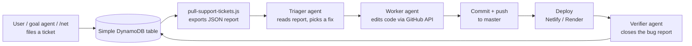

# Support Tickets & Bug Reports

> How the app collects, stores, and exports support requests — and where it's heading.

Last updated: 2026-08-30

---

## 1. Overview

Support and bug reports are the app's feedback loop. Users, the goal agent, and the
`/net` AI chat tool all file records into a single DynamoDB table (`Simple`) using a
consistent **pipe-delimited `Key:value` text format**. A standalone script
(`backend/scripts/pull-support-tickets.js`) scans that table and exports a
**machine-readable JSON report** designed to be handed to another agent for triage
and fixing.

There are three record types, distinguished by their `text` pattern:

| Type | Text pattern | Created by | Close workflow |
|---|---|---|---|
| **Bug report** | `Bug:…|Status:…|Creator:…` | Support → Bug Report form, goal agent `submit_bug_report` tool, CSimple chat auto-reports | ✅ Admin/user can close (`Status:Closed`) |
| **Support ticket** | `Creator:<id>\|Memory:action\|{"title":"Support ticket: …","source":"net-tool"}` | `/net` AI chat tool (`submit_support_ticket`) | ❌ No close workflow — always open |
| **Contact message** | `Contact:…|Message:…` | Support → Contact form | ❌ No close workflow — always open |

All three are "effectively open" unless a bug report has been explicitly closed, which
is why the export treats contact messages and `/net` tickets as perpetually open.

---

## 2. How tickets are created

### 2.1 Bug reports

1. **Support → Bug Report form** in the web UI — users fill in title, severity,
   steps, expected/actual behavior.
2. **Goal agent** (`backend/services/goalAgentService.js`) — the `submit_bug_report`
   tool lets an autonomous agent file a report directly to `Support → My Reports`
   instead of editing the repo for a reporting/idea goal.
3. **CSimple chat auto-reports** — the CSimple chat client auto-files "LLM Error"
   reports. As of 2026-08-01, these are de-duplicated and no longer fired for
   known, user-actionable errors (payload-too-large, auth/PAT, rate-limit,
   addon-not-running), so they don't flood the report list.

### 2.2 Support tickets (`/net` tool)

The `/net` AI chat tool (`backend/services/netTools.js`) exposes a
`submit_support_ticket` executor. It:

1. Saves a memory item of type `action` with
   `{ title: "Support ticket: <subject>", source: "net-tool", category, priority, timestamp }`.
2. Emails the admin via AWS SES (`FROM_EMAIL` → `FROM_EMAIL`, optional
   `SES_CONFIGURATION_SET`).

### 2.3 Contact messages

Filed via the Support → Contact form as `Contact:<subject>|…|Message:<body>` records.

---

## 3. Storage

All three record types live in the **`Simple` DynamoDB table** (env var
`DYNAMODB_TABLE`, default `"Simple"`). Each item is:

```json
{ "id": "<hex>", "text": "Creator:…|Bug:…|Severity:…|…", "createdAt": "…", "updatedAt": "…" }
```

The `text` field is the single source of truth — parsing is done on read by
splitting on `|` and `:` and matches the same regex the app itself uses
(`adminController.js`'s `parseField()`), so the export stays consistent with how the
Support page renders records.

---

## 4. Pulling tickets (`pull-support-tickets.js`)

`backend/scripts/pull-support-tickets.js` scans the table, classifies each row, and
writes a JSON report (plus a console summary).

### 4.1 Usage

```bash
# from repo root
npm --prefix backend run pull-support-tickets

# or directly
node backend/scripts/pull-support-tickets.js
node backend/scripts/pull-support-tickets.js --open-only
node backend/scripts/pull-support-tickets.js --types bug,support_ticket
node backend/scripts/pull-support-tickets.js --out ./tickets.json
node backend/scripts/pull-support-tickets.js --stdout
```

### 4.2 Flags

| Flag | Effect |
|---|---|
| `--open-only` | Only include open bug reports (contact messages and `/net` tickets are always included — they have no close workflow). |
| `--types <csv>` | Comma list of categories to include: `bug,support_ticket,contact` (default: all three). |
| `--out <path>` | Output JSON path. Default: `backend/reports/support-tickets-<timestamp>.json`. |
| `--stdout` | Also print the full JSON to stdout. |
| `--help` / `-h` | Print help. |

### 4.3 Requirements

- `AWS_ACCESS_KEY_ID`, `AWS_SECRET_ACCESS_KEY` (and `AWS_REGION`) in `backend/.env`.
- The script loads `backend/.env` regardless of the working directory it's run from.

### 4.4 Output format

```jsonc
{
  "generatedAt": "2026-08-30T22:58:23.905Z",
  "table": "Simple",
  "bugReports":  { "open": [ /* … */ ], "closed": [ /* … */ ] },
  "supportTickets": [ /* … */ ],
  "contactMessages": [ /* … */ ],
  "open": [ /* flat, newest-first list of everything needing attention */ ],
  "summary": {
    "bugReports":      { "open": 10, "closed": 63, "total": 73 },
    "supportTickets":  { "open": 0,  "total": 0 },
    "contactMessages": { "open": 0,  "total": 0 },
    "openTotal": 10
  }
}
```

Every record keeps its **`rawText`** field so no detail is lost to parsing. A parsed
bug report exposes: `id`, `type`, `title`, `severity`, `description`, `steps`,
`expected`, `actual`, `browser`, `device`, `status`, `isOpen`, `creator`,
`creatorIds`, `resolution`, `resolvedBy`, `resolvedAt`, `reportedAt`, `createdAt`,
`updatedAt`, `rawText`.

---

## 5. Closing bug reports

Bug reports are the only record type with a close workflow. Closing is done through
the app:

- `backend/controllers/putHashData.js` — `close_bug_report` handler appends
  `|Resolution:…|ResolvedBy:…|ResolvedAt:…` and flips `Status:Closed`.
- `backend/controllers/getHashData.js` — returns `resolution`, `resolvedBy` for the
  Support → My Reports view.
- `backend/controllers/adminController.js` — admin dashboard open/closed counts.

---

## 6. Related files

| Area | Files |
|---|---|
| Export script | `backend/scripts/pull-support-tickets.js` |
| npm entry point | `backend/package.json` → `"pull-support-tickets"` |
| Bug report creation (goal agent) | `backend/services/goalAgentService.js` (`submit_bug_report`) |
| Support ticket creation (`/net`) | `backend/services/netTools.js` (`submit_support_ticket`) |
| Close workflow | `backend/controllers/putHashData.js` (`close_bug_report`) |
| Report listing | `backend/controllers/getHashData.js` |
| Admin dashboard | `backend/controllers/adminController.js` |
| Export output | `backend/reports/support-tickets-*.json` |

---

## 7. Future state — autonomous issue resolution

> **Vision:** as the admin, I want to enlist LLM agents to autonomously fix issues
> and push the changes to the live repo — so I can implement features from my phone
> remotely while I'm away from home.

### 7.1 The loop to close



### 7.2 Building blocks already in place

The goal agent (`backend/services/goalAgentService.js`) **already has** the raw
capabilities this needs:

| Capability | Tool | Status |
|---|---|---|
| Inspect the repo | `list_repo_tree`, `read_repo_file` | ✅ shipped |
| Edit the repo (commit via GitHub API) | `write_repo_file` (requires a GitHub token) | ✅ shipped |
| File / close reports | `submit_bug_report`, `propose_plan`, `deliver_result` | ✅ shipped |
| Export tickets for an agent | `pull-support-tickets.js` | ✅ shipped |
| Enlist an agent from the admin panel | `POST /api/data/admin/agent-fix` + `🤖 Auto-fix` button | ✅ shipped (2026-08-30) |

What remains is the **verification glue**: a verifier agent that smoke-checks a
deploy and auto-closes the originating bug report after a successful fix.

### 7.3 Proposed pipeline

1. **Schedule / trigger** — run `pull-support-tickets.js` on a cron or on-demand
   from the phone.
2. **Triage** — an LLM agent reads `payload.open`, de-duplicates, ranks by severity,
   and emits a shortlist of "safe to auto-fix" vs "needs admin approval".
3. **Fix** — a worker agent uses the goal agent's GitHub tools (`list_repo_tree`,
   `read_repo_file`, `write_repo_file`) to make the change on a branch or directly
   on `master`.
4. **Approve (phone)** — a push notification / web confirmation to the admin's
   phone gates any commit (or any commit touching risky paths).
5. **Deploy & verify** — Netlify/Render deploy hooks fire; a verifier agent runs a
   smoke check and closes the originating bug report via the close workflow.

### 7.4 Safety gates

- **Approval model** — nothing pushes to `master` without admin sign-off (mobile
  approval, reusing the automation security model in `AUTOMATION_SECURITY.md`).
- **Scoped GitHub token** — the agent's token is limited to the repo, fine-grained,
  and rotated; never granted direct secrets access.
- **Path allowlist** — auto-merge only for low-risk paths (e.g. docs, UI text);
  backend/config/DynamoDB changes always require explicit approval.
- **Audit trail** — every agent action is logged (mirroring the workspace audit
  log pattern), so any autonomous change can be traced and reverted.

### 7.5 Milestones

| Phase | Outcome |
|---|---|
| **1 — Triage only** | Scheduled export + an agent that labels/ranks open tickets and texts/emails a daily digest to the phone. |
| **2 — Read-only proposals** | Agent drafts the code diff and files it as a PR; admin merges from the phone. |
| **3 — Approve-to-merge** | Agent commits to a branch; a mobile approval triggers merge + deploy. |
| **4 — Full auto-pilot** | Trusted, low-risk fixes auto-merge with post-deploy verification; everything else still gates on approval. |

### 7.6 Shipped — admin "Auto-fix" button

The core loop is now live on the admin page (`/admin` → **Bug Reports**):

- Each open bug report has a **🤖 Auto-fix** button that enlists the Goal Agent.
- `POST /api/data/admin/agent-fix` builds a fix goal (owned by the admin) from the
  bug's title/description/steps/expected/actual, then fire-and-forgets
  `runGoalAgent` — which inspects the repo and commits a fix via `write_repo_file`.
- The run's progress (thoughts, tool calls, result) is polled live through the
  existing `GET /api/data/goal-agent/status/:goalId` endpoint and shown inline
  under the bug report.

This corresponds to **Milestone 3** (agent commits to the default branch), with
one difference: there is no pre-merge approval gate yet — the agent commits
directly, relying on the Goal Agent's scoped GitHub token. Milestones 1, 2, and 4
(and the phone-approval gate from §7.4) remain future work.
