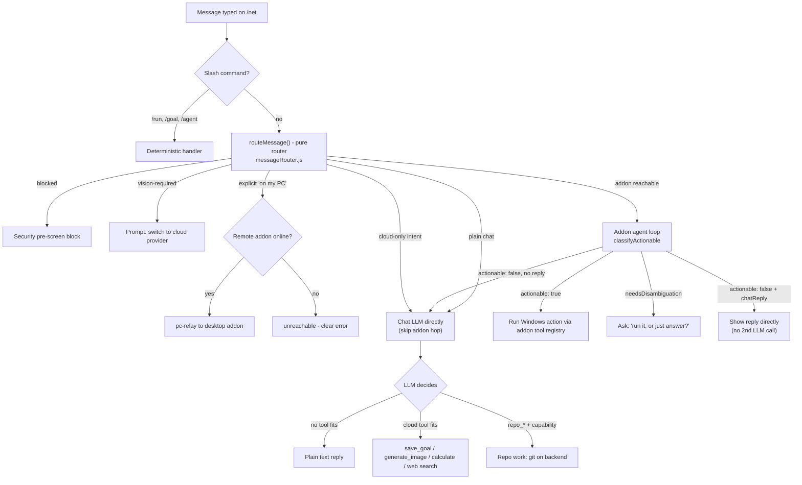

# Simple — Consumer PC Automation Platform (Plan & Architecture)

Single source of truth for the Simple platform: vision, architecture, current
state, the core agent loop, and the living roadmap/to-do. This merged the former
`simple-agent-prompt.md`, `ACTION_PLAN.md`, `AUTOMATION_ROADMAP.md`, and
`OBSERVE-ORIENT-GOAL-PLAN-ACTION.md` (2026-09-07). Security/threat model stays
in [`AUTOMATION_SECURITY.md`](AUTOMATION_SECURITY.md).

## Status legend

- ✅ **Implemented** — landed in code with tests.
- 🟡 **Partially implemented** — backend seam exists, integration/UI/guardrails still open.
- ⬜ **Planned** — not yet implemented.

---

## 0. Debugging & dogfooding (for agents)

**Agents working in this repo are welcome to sign in to the shared demo account and
click through the real UI + APIs.** Use **"Continue as Guest"** on `/login`, or the
credentials `guest@gmail.com` / `guest` (see `backend/constants/guestAccount.js`).

- Prefer it over inventing throwaway accounts — it already holds workspace items
  (goals, plans, actions, notes), so list / filter / sort / empty states are
  exercised for real instead of only in theory.
- It is a **shared, public** account: assume anything you write is visible to
  everyone. Treat test data as disposable, **delete what you create when you're
  done**, and never put real secrets, tokens, or personal data in it.
- It is deliberately **excluded from paid/powerful paths** (§13.2) — don't rely on
  it for credit-gated cloud LLM calls or admin-only surfaces such as the `repo_*`
  tools (§14.3), which require a real admin session.
- It's the account the read-only image-gen smoke test uses
  (`docs/guides/STATIC_ASSETS_AND_IMAGE_GENERATION.md`), so leaving junk behind
  degrades that test too.

---

## 1. Vision

Turn the existing `simple-addon` (currently a personal/dev-focused Electron+Node
addon) into a **consumer-facing PC automation platform** where any user can:

1. **Show, don't tell** — demonstrate a task once (mouse, keyboard, webcam, mic,
   screen — any PC input) by just doing it normally.
2. Have the system **generalize** that demonstration into a reusable, robust
   "skill" — not a brittle exact-replay macro.
3. **Share and discover** skills through a public marketplace, so the community
   builds the automation library together.

The product should feel like "recording a Loom, except the result is a robot
that can do the thing for you."

## 2. Target user & platform

- **Audience:** general consumers (not just developers/power users) — onboarding and UI must not require technical knowledge.
- **First wedge:** focus messaging/onboarding on **enthusiast/tinkerer** users first (fastest path to the first 100 paying users), then grow into **solo professionals** as the product gets more reliable. Don't market to "everyone."
- **Platform:** Windows only for v1 (matches current addon's PowerShell/UIA/Win32 dependencies).
- **Distribution:** desktop installer (NSIS, as today) + a lightweight companion web frontend (`sthopwood.com/net` integration pattern).

## 3. Core interaction model

Three complementary flows, all need to exist and interoperate:

- **Demonstration → generalized skill**: user performs a task once (or a few
  times) while the recorder captures mouse, keyboard, focus, screen state (see
  `server/automation/recorder/`). The compiler (`recorder/compiler.js`) currently
  does literal coalescing — the generalization pipeline is Section 5.
- **Natural language / agent-driven**: user describes a goal in text or voice,
  and the agent loop (`server/automation/agent-loop.js`) + tool registry
  (`server/automation/tool-registry.js`) plans and executes it directly, optionally
  invoking a matching skill (`findRelevantSkills`). The loop itself is the
  Observe → Orient → Goal → Plan → Action loop (Section 11).
- **Proactive observation → one-tap suggestion**: the agent passively watches
  everyday use, spots repeated patterns (`pattern-learner.js` + `predictor.js`),
  and offers to automate them — "I noticed you sort your downloads every
  morning. Want me to do that for you?" No recording, no scripting; the agent
  just notices and asks. This watch-and-learn path is the product's biggest
  differentiator from macro recorders (see [`BUSINESS_PLAN.md`](../guides/BUSINESS_PLAN.md)).

These three flows feed each other: agent-loop runs are recordable, recorded
skills are describable/searchable, and patterns the agent notices become new
skills the user can confirm, edit, and share.

### 3.1 The always-on assistant (four modes)

The same agent runs in four escalating modes, each with its own consent and
permission posture (§6). The promise is "a second set of eyes and hands on your
machine" that only escalates as far as the user trusts it.

| Mode | What it does | Guardrails | Trigger |
|---|---|---|---|
| **Watch** | Observes and reports — never acts. "Tell me when the printer dialog appears." | Read-only; notification only | User-set monitor |
| **Suggest** | Spots repeated patterns and proposes one-tap automations ("I noticed you sort your downloads every morning — automate it?"). | Nothing runs without a click | `pattern-learner.js` confidence |
| **Assist** | Runs a skill on demand (voice / NL / shortcut) with per-step permission, dry-run-first, and visual repair (§5.3). | Per-category/tool approval | User command |
| **Autopilot** | Runs scheduled or trigger-driven automations unattended under the saved permission profile. | Explicit opt-in per skill + global kill switch | Schedule / event trigger |

Design rule: a skill can never silently jump up a mode. Moving a skill from
Suggest → Assist → Autopilot is always an explicit user action, never automatic.

**Status: ✅ surfaced in the UI.** `/simple` opens with the four-mode ladder
(`components/Simple/AgentModes/AgentModes.jsx`). The current mode is *derived* from
the live permission state rather than stored separately — `continuousMode` +
`autoApproveAll` = Autopilot, `continuousMode` = Suggest, neither = Assist, and
`globalKillSwitch` overrides everything as **Paused** — so the ladder can never
disagree with what the addon actually permits. **Watch** is shown but not
selectable: read-only monitoring is a per-monitor posture, not a global permission,
and offering a toggle that enforces nothing would be dishonest.

### 3.2 Why users choose Simple (differentiation)

- **No scripting** — describe it or demonstrate it; the agent works out the steps
  (AutoHotkey / Power Automate / Zapier require thinking like a programmer).
- **Watches and learns** — proactive suggestions from observed behavior, not just
  user-authored macros.
- **Acts, doesn't just explain** — the chat is wired to the same agent that can
  perform actions on the PC, unlike a generic ChatGPT-style tool.
- **Local-first, cloud-assisted** — automation runs on the user's machine; cloud
  is for sync + AI metering, not a dependency for running skills.

## 4. Marketplace — 🟡 mostly shipped (backend, /market frontend, and pre-run capability + dry-run-first enforcement done; eval scenario + live-DynamoDB pass remain)

> ⚠️ **Scope note:** the marketplace is *not* "extend the existing skill
> endpoints." Today's skill endpoints (`/api/data/csimple/workspace/skill/*`)
> store **private, per-user** items keyed `csimple_ws_{userId}_{kind}_{slug}`.
> The marketplace needs a **new shared/public namespace** with its own read path
> (anyone can discover) and controlled write path (publish/fork).
> Link to it on the addon dashboard, /net, and /simple UIs

### 4.1 Data model (new backend surface)

- **Published skill record** (public, immutable per version): `marketId`, `authorUserId`, `name`, `slug`, `version` (semver), `steps` (scrubbed — see §6.1), `declaredCategories`, `toolSchemaVersion`, `naturalLanguageDescription`, `createdAt`.
- **Versioning + fork:** publishing creates a new immutable version; downloaders pin a version. A user can *fork* a published skill into their private workspace, edit, and re-publish.
- **Ratings:** `{ marketId, version, raterUserId, stars, ranAt, outcome }` — one rating per user per version, only from users who actually downloaded/ran it.
- **Counters (server-side, the KPI source):** `downloads`, `installs`, `creations` incremented atomically on the backend — NOT derived from the per-user action log.
- **Compatibility:** every published skill stores `toolSchemaVersion`; on download the client compares against its own registry and degrades gracefully (§5.4).

### 4.2 API surface — ✅ shipped

> Mounted at `/api/data/market/skills*` on the backend (`routeData.js` is mounted
> at `/api/data`). The addon's local server exposes bare `/api/market/skills*` proxies.

| Route (backend: prefix with `/api/data`) | Purpose | Status |
|---|---|---|
| `POST /api/market/skills` | Publish skill (server-side re-scrub before persisting — §4.5) | ✅ Shipped |
| `GET /api/market/skills?q=<nl>&sort=trust\|downloads\|recent` | NL search + ranking | ✅ Shipped |
| `GET /api/market/skills/:marketId[/:version]` | Fetch a specific version | ✅ Shipped |
| `POST /api/market/skills/:marketId/install` | Increment `downloads`/`installs`, return installable scrubbed steps | ✅ Shipped |
| `POST /api/market/skills/:marketId/rate` | Submit run-gated rating | ✅ Shipped |
| `POST /api/market/skills/:marketId/flag` | Community flagging | ✅ Shipped |

**Implemented in:** `backend/controllers/marketplaceController.js` (DynamoDB
`Simple` table, `csimple_market_*` namespace), `backend/services/marketplaceRanking.js`
(pure trust/ranking helpers), `backend/services/marketplaceScrub.js` (§6.1 scrub
port), `backend/services/marketplaceCapabilities.js` (§6.2 mismatch-check port),
routes in `backend/routes/routeData.js`, addon proxies in `server/automation/index.js`,
and `workspace-client.js` wrappers.

### 4.3 Trust model

- **Reputation/rating-based, no manual moderation/code-review queue** (matches Non-goals).
- Ranking signal = rating × volume × author reputation × recency × outcome-reliability (`outcomeFailRate`, derived from `successCriteria` outcomes); community flags deprioritize.
- **Cold-start mitigation:** the *real* safety floor is the execution layer (§6) — every downloaded skill runs through the permission gate, shell allow/deny-list, and protected-path blocking regardless of what it claims. In addition:
  - New/low-trust skills default to **dry-run-first** on first execution.
  - The pre-run capability summary (§6.2) is mandatory for any marketplace install.
- Marketplace success metric: **skill downloads and creations** are the primary KPI; `/telemetry/summary` folds in the marketplace counters.

### 4.4 Web frontend — ✅ shipped

- Route `sthopwood.com/market` (`frontend/src/pages/Simple/Market/`): NL search, sort by trust/downloads/recent, detail modal with the pre-run capability summary, install → rate → flag, publish modal with scrub review, and save-to-addon (or JSON download).

### 4.5 Marketplace implementation checklist

- 🟡 Backend contract tests for pagination/sort stability/install-rate constraints (offline tests cover these; a live-DynamoDB integration pass, `back.test.js`-style, remains).

### 4.6 Ranking weights as explicit config

Ranking weights (`services/marketplaceRanking.js`) are still inline constants; make them config so trust tuning doesn't need a deploy.

### 4.7 Shared GOALS — ✅ shipped (2026-09-12)

The marketplace carries **goals alongside skills**: a user can share one of their own
goals, and anyone else can save a copy of it into their workspace.

**Design: one namespace, two kinds.** A goal rides the exact same machinery as a
skill — the same `csimple_market_*` meta/version/install/rating/flag items, the same
trust ranking and `lowTrust` classification, the same install-attestation gate — with
`kind: 'goal'` on the meta item (absent means `'skill'`, so every pre-existing entry
is read correctly) and the goal's **text** in place of a compiled `steps` array:
`content`, `successCriteria`, `constraints`, `priority`.

- **A goal's `marketId` is its slug.** A slug is the thing someone can share, so
  `POST /market/goals` defaults `marketId` to the slugified name and refuses a slug
  already taken by a *skill* (the two would be indistinguishable in search) or by
  another author's goal (409). Publishing a new version of your own goal passes its
  `marketId` explicitly, exactly like a skill.
- **The goal's text is scrubbed** with the same PII/secret pass a skill's steps get
  (`scrubForPublish`, §6.1) before it is persisted — the reported `scrubReport`
  doubles as the pre-publish review data.
- **"Install" means "save a copy into my workspace"**, not "put it on my PC".
  `POST /market/goals/:marketId/install` writes an ordinary goal via
  `services/workspaceGoals.upsertGoal` under a *free* slug (a second save becomes
  "… (2)", never a clobber), bumps `downloads`/`installs`, and records the install
  attestation — so a saved goal can be rated through the existing rate endpoint.
- **Endpoints** (all `protect`ed; mounted next to the skill routes):

| Route (prefix `/api/data`) | Purpose |
|---|---|
| `GET /market/goals?q=&sort=trust\|downloads\|recent&page=&perPage=` | Browse shared goals |
| `POST /market/goals` | Share a goal (or publish a new version of your own) |
| `GET /market/goals/:marketId` | One shared goal |
| `POST /market/goals/:marketId/install` | Save it into my workspace |
| `POST /market/skills/:marketId/rate` / `/flag` | Shared route — a goal's marketId works here too |

**Frontend:** `/market` is now a **service page** (§5.7 of the UI standard — flat
surface, a row carrying the name + a **Skills | Goals** switch + the search, nothing
pinned, dense panel grid) and the
fourth room in the header switcher (`SIMPLE_NAV_SURFACES`). Sharing is picked from
the user's own goals (`listWorkspace(kind:'goal')`); saving shows the goal text, its
"done when" criteria, and one **＋ Save to my goals** button.

**Still open:** a live-DynamoDB pass, ratings that reflect a *run* of the saved goal,
and `/market` in the addon dashboard (`renderer/dashboard.html` still links skills
only).

## 6. Safety & permissions — 🟡 partially implemented (backend seams + consent UI shipped; deny-path audit + future multimodal wiring open)

Keep and extend the existing permission model (`server/automation/permissions.js`,
`security-guard.js`) — do not weaken it for consumer onboarding. Category-based
approval, shell allow/deny-list, protected-path blocking, and the
`globalKillSwitch`/dry-run mechanisms all stay.

### 6.1 Privacy / PII scrubbing — ✅ implemented

### 6.2 Inspect-before-run capability summary — ✅ implemented

### 6.3 Cloud-vision consent — ✅ implemented

### 6.4 Remaining safety checklist

- 🟡 Require cloud-vision consent before any multimodal upload path (`vision-fusion.js` + `screenshot_check` gated; future paths need wiring).

## 7. Architecture — ✅ provider seam shipped

- **Keep the existing stack**: Electron + Node.js main process/server, Python subprocesses for ML (Whisper STT, MediaPipe eye tracking, webcam/vision). Do not rewrite.
- **Cloud-first AI, with a local/offline option**: default to AWS Bedrock (Claude Haiku 4.5) proxied through the portfolio backend; preserve the ability to swap in local models. Define a small **LLM provider interface** (`chat`, `chatMultimodal`) and route all callers through it.
- Reuse existing subsystems: tool registry, permission gate, event bus, recorder, agent loop, predictor/pattern-learner.

### Architecture overview

```
┌─────────────────────────────────────────────────────────────────────────────┐
│  INPUT (Perception): Webcam · Audio/Mic · Screen · Key/Mouse                │
│                          → PERCEPTION BUS (perception-bus.js)               │
├─────────────────────────────────────────────────────────────────────────────┤
│  INTERPRETATION: Vision (multimodal LLM) · Audio (Whisper) · Predictor      │
├─────────────────────────────────────────────────────────────────────────────┤
│  SYNTHESIS: AGENT LOOP (Observe → Orient → Goal → Plan → Action, §11)       │
│             Voice · NL Macro Compiler · Vision-Action Predictor             │
├─────────────────────────────────────────────────────────────────────────────┤
│  OUTPUT: shell_run · fs_write · uia_invoke · input_tap · browser_* · skill_run│
└─────────────────────────────────────────────────────────────────────────────┘
```

### Current state (shipped)

The end-to-end loop **signed-in user → cloud memory → local PC actions** works.

| Area | Files |
|---|---|
| Per-user workspace memory (memory/project/agent/skill/goal/action/log/decision) | `backend/controllers/workspaceController.js`, `backend/services/workspaceContext.js` |
| Workspace REST API mount | `backend/routes/routeData.js` (`/api/data/csimple/workspace/*`) |
| Electron addon + tray / local server | `simple-addon/main.js`, `simple-addon/tray.js`, `simple-addon/server/index.js` |
| Tool registry + permission gate | `server/automation/tool-registry.js`, `server/automation/permissions.js` |
| Agent loop (O-O-G-P-A) | `server/automation/agent-loop.js` (see §11) |
| Recorder + skill compiler/runner | `server/automation/recorder/*`, `server/automation/tools/skill.js` |
| Perception / UIA / browser / OCR tools | `server/automation/tools/*`, `server/automation/perception*.js` |
| Cloud audit + workspace client | `server/automation/workspace-client.js` |
| Live web panel + chat `/run` `/agent` | `frontend/src/components/SimpleAddon/*`, `SimpleChat.jsx` |
| Eval harness | `server/automation/eval/` |

### 7.1 LLM provider seam — ✅ implemented

## 8. Monetization — 🟡 provider-boundary credit gate shipped (UX copy + full integration matrix remain)

Freemium, gated at one seam (the LLM provider interface, §7.1) — not scattered
through feature code. Downgrade/expiry falls back to the free path without
breaking an installed skill's core replay.

### Decided tier model

| What | Free | Pro |
|---|---|---|
| Price | $0 | $15/mo (or $144/yr) |
| AI chat — cheapest configured cloud model (today DeepSeek-V3; Claude Haiku 4.5 also available), metered | $0.50/mo credit | $10/mo credit |
| OCR — platform-funded, metered | same credit allowance | same credit allowance |
| Local automation & addon | Unlimited (fair use) | Unlimited (fair use) |
| Cloud storage | 100 MB | 50 GB |
| Live phone viewing | — | Included |
| Support | Community | Email |

Locked decisions: **no BYOK** (all cloud AI is operator-funded and metered);
**OCR platform-funded**; **cancellation deferred to period end**; **annual billing**;
**no automation command cap**. (The admin `Special` flag can grant a specific user
unlimited credits — see [`special-user-flag.md`](special-user-flag.md); it's an admin
tool, not a documented tier.)

### 8.1 Monetization checklist — 🟡 partially implemented (provider-boundary gate shipped)

The meter already lived in `backend/utils/apiUsageTracker.js`
(`MEMBERSHIP_LIMITS` / `getMembershipLimit` / `canMakeApiCall` / `trackApiUsage`).
The gap was **enforcement at the provider boundary** — `agent-chat`/`agent-vision`
invoked Bedrock without checking it. That gate now exists.

- ✅ Enforce the credit limit at the provider boundary only — `agentChatProxy` /
  `agentVisionProxy` (`backend/controllers/workspaceController.js`) call
  `canMakeApiCall` before Bedrock, return a structured 402 (`planRequired`,
  `membership`, `limit`, `creditsRemaining`, `upgradeUrl`) when blocked, then
  `trackApiUsage` with the real token counts after success.
- ✅ Per-tier limits in one config table — `MEMBERSHIP_LIMITS` (Free $0.50 / Pro
  $10) in `backend/utils/apiUsageTracker.js`; local automation stays unmetered.
- 🟡 Downgrade immediately reflects in the limit — `getMembershipLimit(userRank)`
  resolves the rank from Stripe per call, so a downgrade/cancel drops the
  allowance on the next cloud-LLM call. (Grace-period copy and the local-path
  fallback for chat remain.)
- ✅ Blocked-call UX copy — `SimpleChat.jsx` already renders an "Usage Limit
  Reached → Upgrade" message for 402/credit/limit errors in both chat paths
  (and `dataService.js` shows upgrade toasts). The structured fields
  (`planRequired`/`membership`/`limit`/`creditsRemaining`/`upgradeUrl`) now also
  flow through `workspace-client.js` for richer copy later.
- 🟡 Integration tests — route gate covered in
  `backend/controllers/workspaceAgentGate.test.js`; the free/paid/expired/
  grace state machine now has unit coverage in
  `backend/utils/apiUsageTracker.test.js` (`getMembershipLimit`,
  `needsMonthlyReset`, `performMonthlyReset`). A full route-layer pass against
  real DynamoDB/Stripe fixtures remains.

### 8.2 Example marketable use cases

Concrete "show don't tell" scenarios for marketing/onboarding — each a plausible
single-demo recording in plain language with the payoff up front.

1. **Never organize your downloads again** — show it once; every messy file sorts itself forever.
2. **Grind your video game while you live your life** — show it the repetitive part; it keeps playing.
3. **Fill out the same form a hundred times** — it repeats your exact answers.
4. **Turn 10,000 photos into an organized album overnight** — it renames your collection.
5. **Copy information between programs** — it does the rest of your list.
6. **Get your daily report before you sit down** — it builds, saves, and emails it.
7. **Post once, appear everywhere** — it shares to all your accounts.
8. **Wake up to a clean inbox** — it keeps email tidy around the clock.
9. **Turn a shoebox of receipts into a budget** — it reads and totals them.
10. **Keep your game character stocked 24/7** — it handles shopping/crafting/cleanup.
11. **Make a folder of photos look professional** — it applies your edit to every photo.
12. **Never miss a sold-out item** — it watches and grabs it on restock.
13. **Turn messy notes into something you'd send** — it hands back a clean summary.
14. **Set up a new computer in minutes** — it repeats your setup.
15. **A tireless assistant for your files** — it flags what needs attention.
16. **Keep your media collection organized** — new downloads sort themselves.
17. **Apply to dozens of jobs while you do something else** — it repeats your info.
18. **Never build an expense report again** — it gathers, sorts, submits.
19. **Back up what matters, automatically** — copies on a schedule.
20. **Run your livestream like a one-person crew** — it switches scenes and saves clips.

### 8.3 Growth & conversion levers — ⬜ planned (from [`BUSINESS_PLAN.md`](../guides/BUSINESS_PLAN.md))

The biggest revenue lever is converting the existing Free → Pro funnel, not
inventing new tiers. Ordered by effort/risk.

**Tier 1 — do first (extends existing Stripe + usage-tracking code):**

- ⬜ In-app usage meter for storage ("82 MB/100 MB used") so free users see the
  ceiling before they hit it, plus a "you're at 90% of your daily limit —
  upgrade or wait" banner instead of a hard block. **Never silently fail a request.**
- ⬜ Annual billing discount — "$15/mo or $144/yr (2 months free)".
- ⬜ One-time storage top-up packs (~$3 for +5 GB/month) for users who are 90%
  happy on Free but occasionally need more — captures price-sensitive churn
  without a full subscription. (Automation commands stay ungated: local runs
  cost nothing.)

**Tier 2 — validate demand first, then build:**

- ⬜ One-time lifetime unlock of *one* Pro feature (e.g. "live phone viewing,
  $39 once") for users who dislike recurring billing — survey current Pro users
  first; skip if there's no signal.
- ⬜ Scheduled automation — start with a local reminder ("time to run your
  automation"), graduate to real background/remote execution only when paying
  demand for the cheap version exists.
- ⬜ "Supporter" tier ($3–5/mo patronage: badge, credits page, beta toggle) —
  only pursue with real goodwill signals (support mail, reviews, community).

## 9. Non-goals for this phase

- No cross-platform (Mac/Linux) support yet.
- No manual marketplace moderation/review queue.
- No enterprise/B2B features (SSO, team management, audit export) — consumer product.
- No fixed deadline — ongoing, iterative build; structure work as a prioritized backlog.

## 10. Roadmap & backlog

Ordered by value-per-risk. Ship the core "show don't tell" loop before the
marketplace, and ship privacy scrubbing before *any* publish path.

1. ✅ **Generalization MVP** — LLM re-derivation (5.1) + multi-demo parameter inference (5.2).
2. 🟡 **Privacy scrub pass** (6.1) — scrub engine + preview endpoint + consent gate shipped. ⬜ Remaining: scrub-report confirmation in pre-publish UI.
3. 🟡 **Pre-run capability summary** (6.2) — summarizer + preview endpoint shipped. ⬜ Remaining: mandatory pre-run confirmation UX.
4. ✅ **Marketplace backend** (4.1–4.2) — public namespace, versioning, install-gated ratings, atomic counters.
5. ✅ **Marketplace web frontend** (4.4) + trust ranking + dry-run-first — `/market` page, ranking + `lowTrust`, and dry-run-first enforcement all shipped.
6. ✅ **Vision re-targeting on replay** (5.3) — recovery path + UI messaging + broadened coverage (uia_invoke / click_at / browser_click) all shipped.
7. 🟡 **Monetization seam** (8) — provider-boundary credit gate + blocked-call UX copy + state-machine unit tests shipped; a full route-layer DynamoDB/Stripe fixture pass remains.
8. 🟡 **Onboarding/UX polish** for non-technical users — the three Simple surfaces are bound by one switcher that lives inside the site header (no extra row), `/simple` leads with the four-mode trust ladder, and `/net` opens as just the chat with the conversation rail a collapsed drawer. ⬜ Starter templates, a first-run guided demo, and the funnel gaps listed in §16.4 remain.
9. ✅ **Goal ↔ chat link** (§16.1) — a goal has its own `/net` conversation (id derived from the slug), enlisting from `/plans` runs the goal *in* that thread, the card flips to **View agent** once a run exists, and runs started from either surface are mirrored onto the goal. ⬜ Seeding a legacy goal's recorded run into a still-empty thread.

Each milestone ships with Jest unit tests and, where it touches the loop, an
`automation/eval/scenarios/` scenario.

### 10.1 Next implementation slices (file-targeted)

3. **Capability/scrub UI confirmations** — frontend route(s) following the `/net` integration pattern.
4. **Recorder consent gate** — `server/automation/permissions.js` + recorder capture pipeline.
5. **Vision replay repair fallback** — `server/automation/tools/skill.js` (`repairStep`) + `server/automation/vision-fusion.js`.

### 10.2 Sprint-ready backlog of not-done items

#### P0 — do now

- 🟡 Recorder sensitive-capture consent: frontend consent UX polish.

#### P2 — after core loop is stable

- 🟡 Trust-ranking tuning + low-trust dry-run-first hardening (formula + classifier shipped; tune against real usage).
- 🟡 LLM provider local adapter quality pass (deterministic stub shipped; a real local model backend remains).
- ⬜ Consumer onboarding polish and starter templates.

### 10.4 Future capability plans

Longer-horizon capabilities, listed by the roadmap.

- **Audio / voice pipeline** — mic → Whisper STT → intent → goal → TTS. (`scripts/voice_pipeline.py`, `server/audio-stream-manager.js`, `tools/audio.js`; endpoints `/api/voice/*`.)
- **Natural Language Macro Compiler** — English → structured skill steps (`nl-compiler.js`; `POST /api/skill/compile-natural`).
- **Continuous perception bus** — unified event stream (`perception-bus.js`) fed into the agent context.
- **Behavioral predictor** — n-gram model over action log; safe-read actions can execute speculatively (`predictor.js`).
- **Frontend integration** — NL macro textarea, perception status, voice input, predictions panel across `SimpleAddon/*`.
- **Proactive pattern detection** — surface repeated action patterns as one-tap
  "automate this?" suggestions (the watch-and-learn path from §3); built on
  `pattern-learner.js` + `predictor.js`.
- **Watch-and-alert** — user sets a monitor ("tell me when X appears/changes");
  the agent polls perception and notifies, acting only on confirmation.
- **Scheduled & unattended automation** — run a skill on a schedule or trigger;
  start with local reminders, graduate to background/remote execution only if
  paid demand validates the infra cost (§8.3).
- **Remember-and-repeat** — recall how a task was done before and offer to
  repeat it (memory over the action log → reusable skills).
- **Routines (skill composition)** — compose multiple skills into a sequence
  with minimal control flow (if/then, repeat N×, wait-for X, on-error) so users
  build multi-app workflows ("open spreadsheet → copy → paste into email")
  without scripting; reuses `skill_run` + per-step `successCriteria`.
- **Event-driven triggers (when → then)** — run a skill or routine automatically
  when something happens (a window opens, a file lands in a folder, an app
  launches, a time passes); built on the perception bus + predictor, every
  trigger opt-in and permission-gated.
- **Cloud continuity** — skills, settings, history, and consents sync across a
  user's machines (the same workspace items already do this), so a reinstall or
  new PC restores the agent in minutes.

## 11. The O-O-G-P-A loop (design reference)

The agent loop was upgraded from ReAct to an explicit **Observe → Orient → Goal →
Plan → Action** loop with a critic and meta-learning. **Status: ✅ complete** —
every task (T0.1 → T8.2) is implemented, tested, and green. This section is the
design reference; the code is the source of truth.

### 11.1 Three nested loops

| Loop | Cadence | Stages | Purpose |
|---|---|---|---|
| Inner | per action (~seconds) | Observe → Orient → Plan → Action | Fast progress; Goal held fixed |
| Outer | per goal re-eval (every N steps / T minutes) | + Goal | Re-derive or abandon intent |
| Meta | per session/day | Critic over the action log | Learn skills, drop dead policies |

### 11.2 State machine

```text
IDLE → OBSERVING → ORIENTING → SELECTING_GOAL → PLANNING → ACTING → REFLECTING
                                              ↑_______________↓        (inner loop)
                          └─→ BLOCKED ─→ (wait / new goal) ─────────┘
IDLE ← DONE / FAILED / STOPPED (kill switch)
```

Every transition is observable in `GET /api/agent/status`. Stages:

- **Observe** — sensors (screen, UIA, audio, gaze, keyboard patterns) fuse into a `Frame`; the last action's outcome is part of the next frame.
- **Orient** — assemble a bounded, priority-ordered situation block (perception → recent actions → goals → lessons → suggestions), capped at `ORIENT_CAP_BYTES`; drift detection (token-set Jaccard similarity over the *semantic* parts) sets `drifted`.
- **Goal** — cadence-gated re-eval: `refreshGoalStatus()` runs every tick (terminal-status + stall check, never cadence-gated); `selectGoal()` re-derives intent on cadence/drift and can emit `blocked`/`done`/`abandoned` (self-block gated by `autoAbandon`, default false).
- **Plan** — choose a concrete tool call or `idle`.
- **Act** — execute the tool; record the outcome.
- **Reflect / Critic** — `critic.js` scores the action (−1..1), writes an idempotent `lesson` workspace item on failure, and injects lessons into the next Orient block.

### 11.3 Data model & endpoints

**Additive goal fields** (`workspaceController.js`): `nextReevaluateAt`, `stallCount`, `lastOutcomeDelta` (−1..1), `autoAbandon` (bool), `maxSteps` (int).

**New workspace kind `lesson`** — written by the critic, read by Orient as semantic
memory: `{ kind:"lesson", slug:"lesson-<hash>", content:{ pattern, context, do, avoid, confidence, sourceGoal } }`.

**Endpoints:**

| Method | Path | Purpose |
|---|---|---|
| `GET` | `/api/agent/status` | `stage`, `loop` (inner/outer/meta), `stallCount`, `lastLesson` |
| `POST` | `/api/agent/start` | accept `goalSlug` + optional `{maxSteps, autoAbandon}` |
| `POST` | `/api/agent/block` | mark current goal `blocked` with a reason |
| `GET` | `/api/agent/lessons?goal=<slug>` | read critic lessons |
| `DELETE` | `/api/agent/worker/:goalSlug` | stop a worker |

**Configuration knobs** (in `agent-loop.js` defaults): `ORIENT_CAP_BYTES`, `EPISODIC_WINDOW`, `LESSON_TOPK`, `REEVAL_STEPS`, `REEVAL_MS`, `DRIFT_THRESHOLD`, `IDLE_SLEEP_MS`, `STALL_THRESHOLD`, `MAX_STEPS_DEFAULT`, `META_EVERY_ACTIONS`, `SKILL_PROMOTE_MIN_REPEATS`.

### 11.4 Success criteria (all met)

- Named `observe/orient/selectGoal/plan/act/reflect` stages, each unit-testable.
- Outer loop re-runs the Goal stage on cadence + drift and emits `blocked`/`done`/`abandoned`.
- A critic writes idempotent lessons and injects them into the next plan.
- The loop can `idle` and self-`block` on repeated stalls.
- Kill switch and permission gate remain authoritative at every stage.
- All existing eval scenarios pass; new ones green.
- UI shows live stage/loop/lessons without new security surface.

### 11.5 Open follow-ups

- **Offline runner coverage** — goal-block-on-stall and orient-bound-cap are unit-tested only; the offline eval runner can't drive the LLM loop deterministically.
- **Server-side `goalAgentService`** — kept as the offline fallback for `/plans`; the addon O-O-G-P-A loop is now the primary path.

## 12. Readiness & validation

The reliability bar before turning purchasing/visibility back on.

**Readiness bar:**
1. **Hard gate** — key simulation, perception, and auto-execution each work in ≥2 common apps.
2. **Reliability gate** — each of the 11 validation scenarios passes 9/10 across sessions/days; fix and restart on any consistent failure.
3. **Account plumbing gate** — purchase confirmation and password reset confirmed end-to-end with a real account.
4. Re-run the whole check after any significant change to the perception/action pipeline.

**Validation scenarios** (executable in `simple-addon/server/automation/eval/validate-core-functionality.js`, driven from `simple-addon/` via `npm run validate:core`):

| # | Scenario | Passes when… |
|---|---|---|
| 1 | Type + save a note in Notepad | saved file matches the typed string byte-for-byte |
| 2 | Calculator arithmetic by clicking | displayed result is `19` |
| 3 | Rename a file in File Explorer | old name gone, new name exists, content intact |
| 4 | Alt-Tab between two windows | foreground window is expected (both directions) |
| 5 | Detect human-typed input (interactive) | logged events reconstruct the sentence |
| 6 | Read UI state via perception | reported toggle states match ground truth |
| 7 | Record → compile → auto-replay | replay reproduces the same end state, no manual input |
| 8 | Planner-driven NL execution | final state matches the instruction's intent |
| 9 | Drag-and-drop with a moving path | the file/slider actually moved |
| 10 | Held input releases on focus loss | the key released after the focus switch |
| 11 | Workspace profile save → move → restore | window returns to its saved position/size |

## 13. Living action items

The remaining checklist — check items off as they land, add new gaps as found.

- ⬜ **Reliability tally** — run each validation scenario ≥10 times and require 90%+ per scenario (see §12).
- ⬜ **Perception loop** — scenario 5 needs one real `--interactive` run with a human.
- ⬜ **Auto action execution** — scenario 8 needs one real signed-in run (all LLM calls proxy through the backend).
- ⬜ **Scenario 11** — needs a live desktop run before it counts toward the tally.
- ⬜ **`input_hold`** — held keys/buttons lack a real-desktop regression test; add one.
- ⬜ **Existing Pro subscribers** — tell them plainly what works and what doesn't.
- ⬜ **Account/transactional email plumbing** — verify purchase confirmation + forgot/reset-password loop with a real account.
- ⬜ **Single installer** — consolidate "download, trust cert, configure" into one flow if feasible.

### 13.1 New findings (repo audit, 2026-09-09)

Issues surfaced while auditing the repo beyond the original plan. Ordered by
impact; none are Simple-core blockers, but several are user-visible or DRY/security-adjacent.

- 🟡 **Plaintext secret fallback outside Electron** — `simple-addon/server/secret-storage.js` stores secrets in plaintext when `safeStorage` is unavailable (documented + one-shot warning; fine for CLI/Jest). Confirm the packaged addon always runs under Electron, and consider refusing to persist (instead of plaintext) in non-Electron contexts.
- 🟡 **Derive admin-ness server-side** — the backend now attaches an `isAdmin` flag to the register/login/guest responses (`postData.js`), and the frontend reads it via shared `isAdminUser()`/`isMuseVisitor()` helpers in `constants/admin.js` (`AdminLayout`/`HeaderDropper`/`DeepStorage`/`Home`/`Muse`). Remaining: the hardcoded ID + `'girlfriend'` gate still ship as a legacy fallback until every active session re-logs in — then the constants can be deleted.
- ⚠️ **Committed user PII still in git history** — `backend/reports/support-tickets-*.json` was deleted from the working tree and added to `.gitignore`, but the file is still in git history; full removal needs a history rewrite (e.g. `git filter-repo`/BFG) + force-push.

### 13.2 New findings (second audit pass, 2026-09-09)

- 🟡 **Experimental `signal-bridge` predates the Bedrock-only decision** — marked ⚠️ DEPRECATED/UNWIRED in its header. Actual deletion (or re-implementation via the Bedrock proxy) is still a product decision.
- 🟡 **Public guest account with a known password** — `backend/constants/guestAccount.js` hardcodes `guest@gmail.com` / `guest` for "Login as Guest" (and `createGuestUser.js` logs the password). A deliberate demo feature, but a shared account with a known credential should stay strictly read-only/rate-limited and excluded from paid/powerful paths.

### 13.3 New findings (third audit pass, 2026-09-09)

- 🟡 **S3 upload file-type validation trusts the client MIME type** — *post-upload
  content check added (2026-09-12).* `validateFile` rejects known-dangerous
  extensions (.html/.svg/.exe/…) and extension/content-type mismatches, but those
  only constrain what the client *claims* — the bytes travel client → S3 via the
  presigned URL, so the server never sees them. `confirmUpload` now reads the
  object's leading 512 bytes (a Range GET) and refuses content that contradicts
  its extension, deleting the object so a rejected upload is neither recorded nor
  billed. See `utils/fileSignature.js` + `__tests__/unit/uploadSignatureGate.test.js`.
  Two deliberate properties: the rule is **contradiction-only** (content that can't
  be identified is accepted, because failing a real user's file is worse than the
  marginal gain) and it **fails open** on an S3 read error, with
  `UPLOAD_SIGNATURE_CHECK=false` as the operator kill-switch. ⬜ Remaining: content
  with no known signature is still accepted, so this narrows the gap rather than
  closing it — closing it needs real scanning (AV/content-inspection service).
- 🟡 **JWT persisted in `localStorage`** — `frontend/src/features/data/dataSlice.js` stores the auth token in localStorage, so any XSS could exfiltrate it. Combined with the loose CSP above, prefer an `httpOnly` session cookie (or at least tighten CSP).

### 13.5 New findings (fifth audit pass, 2026-09-09)

- 🟡 **HIGH — the addon's local HTTP API is unauthenticated and CORS-allows the production site + LAN origins** — hardened: `simple-addon/server/index.js` now rejects requests whose `Host` header isn't loopback/private (anti DNS-rebinding) and 403s non-allowlisted cross-site `Origin`s before any handler runs, so a drive-by `fetch('http://127.0.0.1:3001/...')` from an arbitrary site no longer executes. Remaining: the production site is still allowlisted, so a per-install random secret on every request (and tightening CORS to the Electron app's own origin) is still needed to close the allowlisted-origin path.

### 13.7 New findings (seventh audit pass, 2026-09-09)

- ⬜ **Addon is distributed unsigned (no code-signing certificate)** — `simple-addon/` is built without `CSC_LINK`/`CSC_KEY`/`win.certificateSubjectName`, so (a) Windows SmartScreen flags the installer/portable exe, and (b) `electron-updater` can't verify update authenticity against a publisher certificate — update trust rests on TLS + the blockmap hash alone (a compromised GitHub repo could ship a malicious update that installs silently). Sign the build and set `publisherName` so updates are authenticated.
- ✅ **CI actions pinned by mutable tags** — *fixed for immutability (2026-09-12).* All
  21 `uses:` references across the three workflows are pinned to full 40-character commit
  SHAs (version kept in a trailing comment), each verified against its repo's real
  tag→commit mapping with `git ls-remote`. Two traps worth knowing for next time:
  `github/codeql-action@v4` is an **annotated** tag, so the pin must be the *dereferenced*
  commit (`b96794f0…`, i.e. `refs/tags/v4^{}`) — pinning the tag object's own SHA fails
  the job; and `trufflesecurity/trufflehog@main` was a **moving branch**, now frozen to
  the commit `main` pointed at on 2026-09-12 (latest release: v3.97.4). Pins won't rot
  silently: `dependabot.yml` already carries a weekly `github-actions` ecosystem.
  ⬜ **Still open: the mixed versions.** `actions/checkout` and `actions/setup-node` are
  `@v4` in the two *Windows* jobs (`build-addon.yml`, `ci.yml`'s `test-simple-addon`) and
  `@v6` in every other job. Each was pinned to the version it already used rather than
  bumped: a major bump inside the addon **release** pipeline is a behaviour change that
  can't be exercised locally, so it wants a deliberate, watched change.
- ⬜ **CI can't be run locally** — the workflow changes above were validated by parsing
  each file as YAML and asserting every `uses:` resolves to a pinned SHA (plus the
  `ls-remote` mapping check), not by executing the pipelines. Worth one watched run
  before relying on it.

### 13.8 New findings (eighth audit pass, 2026-09-10)

- 🟡 **Unbounded per-request access-log writes** — *addressed for growth (2026-09-12).*
  Both per-request writers (`checkIP` in `utils/accessData.js` and `recordPageView` in
  `controllers/pageViewsController.js`) now stamp an `expiresAt` DynamoDB **TTL**,
  derived from `ANALYTICS_RETENTION_DAYS` (default 90) in the new
  `utils/analyticsRetention.js`. TTL only deletes items that *carry* the attribute, so
  durable rows (users, workspace items, goals, tickets) are never expired by it.
  **Remaining: the attribute is inert until table TTL is turned on once** —
  `node backend/scripts/configure-analytics-ttl.js` (dry run by default, `--apply` to
  change it). The per-request *write* cost itself is unchanged; sampling or a separate
  analytics table would address that, at the cost of changing what the dashboard counts.
- ✅ **`checkIP` put a third-party HTTP call on every request's critical path**
  (found 2026-09-12 while fixing the above) — it called `ipinfo` directly, and its
  callers `await` it *before* responding, so each request paid an ipinfo round-trip and
  a slow/hung ipinfo could stall the response. It now goes through
  `utils/geoLookup.getGeoForIp`, which caches per IP (1 h, 5 min for a miss) and bounds
  every lookup with a timeout. That helper also had a latent bug: `logger` was declared
  *inside* `cleanupCache`, so its `catch` threw `ReferenceError` instead of resolving
  `null` on any lookup failure — fixed, with regression tests. `extractIp` now also
  takes `req.ip` (trust-proxy aware) over the spoofable leftmost `X-Forwarded-For`.

### 13.9 New findings (ninth audit pass, 2026-09-12)

- ✅ **The 1 MB scan-truncation family was not actually finished** — the repo had fixed
  the worst offenders (storage tracking, search, delete) but five *list* endpoints in
  `controllers/csimpleController.js` still ran a single `ScanCommand` with a
  `begins_with(id, :prefix)` FilterExpression. A filter is applied only **within** the
  scanned page, so once the table passed 1 MB those endpoints returned *some* of a
  user's files — or none — with no error. That includes `getSimpleUserContext`, which
  is what the LLM is handed as the user's memory (the assistant would quietly
  "forget"), plus the memory / personality / behavior lists behind the addon's file
  browsers. The same unpaginated read sat in `llmService.loadUserContextFromDB`
  (chat memory), `workspaceContext.fetchAllOfKind` (agent context), and
  `marketplaceController` (browse + author KPI totals).
  All of it now goes through **one** importable helper, `utils/paginatedScan.js`,
  which also replaces the six copy-pasted private copies of it (`getData`,
  `getHashData`, `postData`, `profileController`, `passwordReset` — each had its own
  paragraph explaining the same mistake, which is how a seventh copy got written).
  The helper is bounded by `SCAN_MAX_PAGES` (default 200) and **warns** when it stops
  early: a partial result must never look like a complete one.
  Tests: `paginatedScan.test.js`, `csimpleListPagination.test.js` (asserts items from
  the *second* page are returned). Not verified against live DynamoDB.
- ✅ **`getUserDataCached` fetched one user with a full-table Scan** (found in the same
  pass) — `FilterExpression: "id = :userId"` filters on the partition key *after*
  scanning a page, so a user whose row sat past the first page read back as **"no
  record"**. That call decides a user's plan and credit allowance, so the failure mode
  is a paying subscriber being metered as a brand-new free account; it also billed a
  whole-table scan to fetch one row. Now a partition-key `QueryCommand`, matching the
  `getRawUserRecord` precedent. Tests: `__tests__/unit/userDataLookup.test.js`.
- ✅ **The rest of the single-page scans** (same pass) — `musicService.listSongs`,
  `stripeService.updateUserRank` (a Stripe event whose customer row sat past page 1
  never updated that subscriber's rank), `refererAnalytics` ×2 (the dashboard
  under-reported), and `testFunnelController.findUserByEmail` now use
  `utils/paginatedScan`. `putHashData`'s bug-reporter lookup was an **id-filtered
  Scan** and is now a partition-key Query — the resolution email had no recipient when
  the reporter's row sat past page 1.
- ✅ **`ocrService.updateItemWithOCR` rejected the record's real owner** (found in the
  same pass). The ownership check sliced the creator id to a fixed 24 characters
  (`substring(i + 8, i + 32)`) and compared *that* to the caller's id; ids in this
  table are 32-char crypto hex, so the comparison always failed and the actual owner
  was told "User not authorized to update this item". It also skipped the check
  entirely when a record carried no `Creator:` tag, so an untagged record was writable
  by anyone who knew its id. It now reads by partition key, matches the id up to the
  next `|` (`/(?:^|\|)Creator:([^|]+)/`) and **denies by default**, mirroring
  `fileUploadController.creatorIdOf`. Tests: `__tests__/unit/ocrItemUpdate.test.js`.
- ⚠️ **Do NOT query `userEmail-index` for email lookups** — the table carries a GSI on
  `userEmail`, but nothing in the codebase ever *writes* that attribute: every email
  read parses it out of the pipe-delimited `text` field. The index is therefore empty,
  and "optimising" the login / password-reset email scans onto it would break sign-in
  for every user. Populate + backfill the attribute first if that's ever wanted.
- ⬜ **Still outstanding** (verified, not yet fixed): `utils/guestUserManager.js` (dev
  script — single-page lookup, and its delete uses `Key: { id }` alone, which throws
  against the composite key), `utils/createGuestUser.js` (near-duplicate of it), and
  `testFunnelController`'s `GetCommand({ Key: { id: testUserId } })` (~line 304, also
  missing the sort key — it is inside a try/catch, so the funnel status endpoint just
  always reports "no live user"). Everything under `backend/scripts/` is unaudited.

### 13.10 New findings (tenth audit pass, 2026-09-12)

First pass over `backend/scripts/` — the one area §13.9 left unaudited. The
mutating scripts turned out to be mostly well-behaved (dry-run by default, and
`Key: { id, createdAt }` on every delete/update); two things were not.

- ✅ **`migrate-images-to-s3.js` defaulted to writing.** Its dry run was a
  hand-edited constant that shipped as `const DRY_RUN = false`, so
  `node backend/scripts/migrate-images-to-s3.js` uploaded inline base64 images to
  S3 and rewrote the DynamoDB `files` arrays on live data — no flag, no prompt, no
  dry-run pass, unlike every sibling script. It is now `--apply`-gated, and the dry
  run reports "Images that WOULD be migrated" separately instead of incrementing
  the `imagesMigrated` counter (a dry run could be read as "N images migrated").
  Verified by running it: the migration is already complete — 6 items with files,
  **0 images pending**. Tests: `__tests__/unit/migrateImagesDryRun.test.js`
  (pins "no arguments issues no writes").
- ✅ **`.gitignore` protected the wrong directory.** The rule was
  `backend/storage/migration-backups/*`, but `backup-dynamodb.js` writes next to
  itself — `path.join(__dirname, 'migration-backups')`, i.e.
  `backend/scripts/migration-backups/` — which nothing ignored, so its export of
  user records (text + file metadata) was committable. (`merge-duplicate-users.js`
  is fine: it writes under `backend/logs/`, already ignored.) Added the missing
  rule; `git check-ignore` now matches. Note the *existing* tracked dump at
  `backend/storage/migration-backups/dynamodb-backup-2025-10-12T*Z.json` — 2 items,
  no `Password:` (so no credential leak), but a data export that should not be in
  the repo; untracking it is a call for the repo owner, and it stays in history
  either way (see §13.1).
- ✅ **`migrate-images-to-s3.js` could not run at all.** It built its clients at
  module load from `process.env`, but `backend/.env` holds only the access keys, so
  it died with the SDK's opaque "Region is missing" (and `S3 Bucket: undefined`)
  before doing anything. It now bootstraps through `loadAllSecrets()` — the same
  path `server.js` and the other scripts use — and, when config is still missing,
  fails with the names of the missing variables instead of the SDK's message.
- ⚠️ **Other scripts may share that missing bootstrap.** `migrate-images-to-s3.js`
  was found by running it; the rest of `backend/scripts/` was read, not executed, so
  any of them that builds AWS clients at module load has the same latent failure.
  Worth a run-through before the next time one of them is needed.

### 13.11 New findings (eleventh audit pass, 2026-09-12)

Surfaced while building the Dream board (§17), which is the first frontend feature
to actually *use* the upload surface. Two real bugs, both in code nothing had
called since the feature that used it was removed — which is exactly why nobody
had noticed.

- ⚠️ **The presigned upload path is unusable from a browser — S3 has no CORS rule
  for the app's origin.** `POST /upload-url` mints a signed PUT correctly, but the
  browser then refuses it: `Response to preflight request doesn't pass access
  control check: No 'Access-Control-Allow-Origin' header`. So *any* browser upload
  via `upload-url` → PUT → `upload-confirm` fails, and `frontend/src/features/data/dataService.js`
  had already noted that no client calls that path today. Dream-board covers
  therefore go through a new server-side endpoint (`POST /api/data/upload-cover`,
  multer → S3) instead: one request, no CORS dependency, and the server sees the
  bytes it stores rather than a declared content type. **The presigned path is
  still broken** and needs a bucket CORS rule before it can be used by anything
  else.
- ✅ **`DELETE /api/data/file/:s3Key` 500'd on every bodyless request** — it read
  `const { dataId } = req.body`, and `express.json` leaves `req.body` *undefined*
  when there is nothing to parse. A DELETE with no body is the natural way to call
  it, so the endpoint deleted nothing and reported a 500. Now `req.body || {}`.
  (The s3Key also has to be percent-encoded: it contains slashes, and `:s3Key`
  matches one path segment, which is why the handler calls `decodeURIComponent`
  on it.)
- ⚠️ **Deleting a cover object is not the same as releasing the storage it used.**
  `uploadImageBuffer` writes the object; the *counted* bytes live in a separate
  `files[].size` record (that is how `getUserStorageUsage` sees them at all).
  Removing only the object leaves those bytes on the user's quota forever, so the
  upload returns its `recordId` and the delete passes it back as `dataId`.
  Two gaps remain: replacing a cover leaves the **previous** object behind (its
  key isn't recoverable from the URL the goal stored), and deleting a *goal* never
  touches its cover at all.

### 13.12 New findings (twelfth audit pass — responsive & colour modes, 2026-09-12)

Found by measuring the Dream board across 280→1920px in light + dark and under
`prefers-reduced-motion` / `prefers-contrast`. Every one of these is a *page-wide*
defect that had nothing to do with the board.

- ✅ **`prefers-contrast: high` was dead code — everywhere on the site.**
  `prefers-contrast` accepts `no-preference | less | more | custom`; **`high` is not
  a valid value** (it was a draft value that shipped). So all five blocks that were
  meant to provide high-contrast support — `index.css`'s token overrides and its
  `--focus-outline: 4px solid`, plus `App.css`, `ErrorBoundary.css`, `Pay.css`,
  `Support.css` — had never applied for anyone. Verified in Chrome:
  `matchMedia('(prefers-contrast: high)').matches === false` while `more` matches.
  All six blocks (incl. DreamBoard's) now use `more`, and the effect is confirmed:
  `--text-color-accent` darkens (`#4a4a4d` → `#2d2d2e`), the focus outline becomes
  `4px solid`, `--bg-1` snaps to `--white0`.
- ✅ **`.plans-shell` overflowed** every viewport under ~364px. It used
  `repeat(auto-fit, minmax(320px, 1fr))`, and a bare px inside `minmax()` is a hard
  track **minimum** — so on a 320px phone the shell's track (320px) was wider than
  the 276px it had, and the whole page spilled ~44px sideways. Now
  `minmax(min(320px, 100%), 1fr)`. Note the failure mode: it *clipped* rather than
  scrolled, so `document.scrollWidth === clientWidth` and a normal overflow check
  reported "fine". The probe that catches it compares every descendant's
  `rect.right` against its container's.
- ✅ **The three-tab view switcher didn't fit a phone** — `.plans-switch` is an
  inline-flex stadium pill whose three tabs need ~300px, so adding the 🌟 Board tab
  pushed the page sideways below ~344px. Below 400px it now drops the enclosing pill
  and the tabs become separate pills in a wrapping row, the same shape `.plans-tabs`
  already used.
- ℹ️ **Verified, not changed:** text contrast is AA-or-better in all four
  combinations for every text-on-plane pair on the board (light 16.1 / dark 11.4 for
  the title; the accent-tinted vision line is the tightest at 4.98 in dark, and
  high-contrast lifts it to 12.8). The footer's primary button is the house
  `--text-color-inv`-on-gradient pattern and reads correctly, but a contrast checker
  cannot measure it — the background is a gradient, so it must be judged by eye.

### 13.13 New findings (thirteenth audit pass — the Goals tab, 2026-09-12)

Same treatment applied to the Goals list (and the Library list, which shares its
shell). Measured 240→1920px, both themes, all four `prefers-*` combinations.

- ✅ **`.plans-controls { grid-column: span 2 }` created an implicit grid column.**
  `.plans-shell` is a single-column grid, so `span 2` made the browser invent a
  second track; the shell's *content* ended up 655px wide inside a 386px box — 269px
  of spill on the Goals and Library views at 430px. It **clipped**, so
  `document.scrollWidth > clientWidth` was `false` and a normal overflow check said
  "fine". Base rule is now `grid-column: 1 / -1`, with
  `@media (min-width: 769px) { .plans-switch { grid-column: 1 } .plans-controls { grid-column: 2 / -1 } }`.
- ✅ **Same `minmax()` px-floor bug as the shell, second and third instances.**
  `.plans-goal-grid` used `minmax(300px, 1fr)` (+24px spill at 320px). Both grids now
  use `minmax(min(<n>px, 100%), 1fr)`. **Rule: never put a bare px inside `minmax()`
  in a grid template that has to fit a phone.**
- ✅ **Tap targets were 22×22px** — `.plans-goal-check` and `.plans-icon-btn`, below
  WCAG 2.5.8's 24×24 minimum, and at that size genuinely awkward with a thumb. New
  `--plans-ctl-size: calc(var(--nav-size) * 0.66)` (≈32px) declared on `.plans-page`.
- ✅ **Goal titles were crushed to 12–24px wide (1325px tall) at 280px.** The title
  is a flex item with `overflow-wrap: anywhere`, so its min-content is ~0 and it
  shrinks past the point of legibility while the `flex-shrink: 0` chip and buttons
  hold their size. Fixed with `flex-wrap: wrap` on `.plans-goal-head` plus
  `min-width: min(100%, 14ch)` on the title; `.plans-lib-head` / `.plans-lib-title`
  got the same treatment.
- ✅ **On a phone the header is reordered into a deliberate two-row layout** (✓ ·
  status · ✎/× on row 1, full-width title on row 2) instead of a squeeze. Two traps
  here: (1) relying on the generic wrap alone left the two icon buttons dangling
  alone on their own row, which reads as a bug; (2) `order` won the cascade from
  where the media query sat, but **`flex-basis`/`min-width` did not** — they are
  same-specificity declarations, so the block had to be moved *below*
  `.plans-goal-title`'s base rule. Before the move, ≤420px got the two-row layout and
  430–480px got a third layout with the title squeezed to ~161px.
- ✅ **The reduced-motion block stopped animations but not transitions.** It set
  `animation: none` on the animated selectors, so hover/focus/state transitions still
  ran at full speed for motion-sensitive users. Added `transition: none` for 16
  selectors.
- ✅ **Dark-mode muted text on hue-washed panels was 3.89:1** (AA needs 4.5) — it sat
  on `--text-color-accent`, which is tuned for a *plain* page background, and the
  goal/library cards are tinted. New `--plans-muted` token on `.plans-page`
  (defaults to `var(--text-color-accent)`) overridden by
  `.dark-theme .plans-page { --plans-muted: color-mix(in srgb, var(--text-color-accent) 70%, var(--text-color)); }`.
  13 rules switched to it. 3.89 → **5.12**. **Rule: a token tuned for the page
  background needs a lift before it lands on a tinted panel.**
- ✅ **Light-mode group headings were 2.08:1 (mint) and 3.13:1 (pink)** — the raw
  `--fg-mint`/`--fg-pink` are display colours, not text colours. Now mixed toward
  `--text-color`: `color-mix(in srgb, var(--fg-mint) 35%, var(--text-color))` →
  7.95, and `... var(--fg-pink) 40% ...` → 9.38.
- ℹ️ **Measurement gotcha, worth keeping:** Chrome returns `color(srgb r g b)` with
  0–1 floats for `color-mix()` results but `rgb()` with 0–255 for plain values, so
  the probe must handle both — and translucent layers must be **composited with
  alpha** before the ratio is computed, or it reports false failures
  (`.plans-info-note` measured 2.29 this way, actually 6.26).
- ⚠️ **Found and reported, deliberately not fixed: goal descriptions never render on
  `/plans`.** `workspaceController.toListEntry` omits `content` (only `toFullEntry`
  has it) while `workspaceGoalToItem` maps `description: entry.content`, so the field
  is permanently `''`. Confirmed by round-trip: a PUT with `content` returns
  `contentLen: 0` from the list endpoint. Including it would change the list payload
  contract (size + shape), so it needs a decision rather than a drive-by edit. Cheap
  fix if approved: include `content` truncated to ~200 chars in `toListEntry`.
- ⚠️ **Cover orphans (known, not fixed):** replacing a goal's cover leaves the
  previous S3 object behind, and deleting a goal never touches its cover. The upload
  path returns a `recordId` so a future cleanup job (or delete hook) can release the
  counted bytes.
- ⚠️ **Presigned upload is still broken:** the bucket has no CORS rule allowing the
  app origin, so the preflight fails and the browser `PUT` never happens — which is
  why cover upload uses `POST /api/data/upload-cover` instead. Restoring the presigned
  path needs a bucket CORS rule.

---

## 14. Repo agent via /net chat (DeepSeek) — goal & plan

Status: 🟡 in progress (2026-09-10).

### 14.1 Goal

Let a signed-in administrator use the **/net chatbot (DeepSeek)** to make real
changes to this repository — end to end, without leaving the chat:

1. **Investigate** — the model reads the live repo (list files, read files) to
   find the right places to change.
2. **Implement** — the model writes edits into the working tree on the backend
   server (not the browser).
3. **Stage** — changes are `git add`-ed and committed locally on the backend
   server.
4. **Ask** — the model *always* summarizes what it changed and asks the user
   whether to push. It never pushes silently.
5. **Push** — only after the user replies with an explicit confirmation does the
   model `git push` to GitHub (using the server's `GITHUB_TOKEN` from AWS
   Secrets Manager).

The result is the "pretend you're my /net chatbot" workflow: user describes a
change → the chat investigates, implements, and stages it on the backend → the
chat asks "push?" → user says yes → pushed to GitHub.

### 14.2 Plan (subtasks)

11. ⬜ **Live end-to-end pass** — one real signed-in admin run through /net chat
    that stages a trivial change, asks, and pushes (requires `GITHUB_TOKEN` on
    the server).

### 14.3 Confirmation gate (safety)

`repo_push` refuses to run unless **all** of these hold:

- **Admin only** — `toolContext.isAdmin` is true (same `ADMIN_USER_ID` check the
  goal agent uses). Non-admins get a "restricted" message for every `repo_*`
  tool.
- **User confirmed** — the current-turn message matches a short confirmation
  pattern (`push`, `ship`, `confirm`, `proceed`, `yes`, `go ahead`, …).
- **Commit is from a previous turn** — HEAD's commit timestamp is strictly older
  than the turn start time, so the model can never stage-and-push in one shot,
  even if the user typed "…and push it" in the original request.
- **A feature branch exists** — `repo_push` only pushes the current `net/…`
  branch (recorded in the per-user proposal), never `master` and never an
  unrelated local commit.

Because the "ask → user confirms → push" round-trip spans two turns, the model's
own reply ("…want me to push?") becomes the user's cue; the next user message is
what unlocks `repo_push`.

### 14.4 Security constraints

- Repo tools are never sent to non-admin chats (`toolsForContext()` filters
  `repo_*` out of the schema list).
- Paths are sanitized (`sanitizeRepoPath` — shared with `goalAgentService.js`
  via `repoShared.js`) — no `..`, absolute paths, or `.git`.
- File writes capped at 120 KB; reads/diffs truncated to a bounded size.
- Every change lands on an isolated `net/…` feature branch; `repo_push` can only
  push that branch, never the base branch.
- The GitHub token is passed to `git` via `http.extraHeader` (in the process
  env, never embedded in the remote URL or commit message), reusing the existing
  `GITHUB_TOKEN` secret already seeded via `backend/scripts/seed-secrets.js`.

### 14.5 Two limits that stopped a repo edit mid-turn (fixed 2026-09-14)

A real run of *"remove the footer from the /net page"* died with a bare
`**Error:** The toolConfig field must be defined when using toolUse and
toolResult content blocks.` — no diff, no explanation. Two separate limits were
responsible; a repo edit now survives both.

**1. The streaming leg sent tool *history* with no tools.** `/net` streams via
`POST /api/compress/stream` → `streamCompressionRequest()`. That function
resolves tools with non-streamed calls, then deliberately drops them for the
final streaming call — the SSE reader only consumes text deltas, so a tool call
in that leg would be silently discarded. But `messages` still carried the loop's
`tool_calls`/`tool` turns, and Bedrock's Converse API rejects `toolUse`/
`toolResult` content blocks that arrive without a `toolConfig`. That is an AWS
`ValidationException`, so it reached the user verbatim, as-is.

Fixed in the adapter, where no call site can re-create it: `toBedrockMessages()`
takes `{ allowToolBlocks: false }` and renders those turns as `[tool call] …` /
`[tool result] …` text. Both `createBedrockCompletion` and
`streamBedrockCompletion` choose it automatically whenever the request offers no
tools, so tool blocks are only ever emitted alongside the matching `toolConfig`.

**2. Three tool rounds is fewer than a repo edit needs.** `MAX_TOOL_ROUNDS` was
3 in both the shared `runToolLoop()` and the streaming loop. The failing run
spent all three investigating (list files → read → read), then asked to write the
edit as round 4 — and was cut off there. Now 8, which fits investigate → write →
status/diff → commit → answer even at roughly one tool per round. A round is only
spent when the model actually asks for a tool, so ordinary chat turns are
unaffected.

Diagnostic: when the adapter flattens a history it logs `🪨 … flattened the
history's tool call/result turns to text`. That line means a tool-free call
arrived carrying tool history — i.e. a tool loop had just run.

**Verified live (2026-09-14).** Driving `POST /api/data/compress/stream` as the
`ADMIN_USER_ID` account: HTTP 200, `repo_write_file` executed, the file appeared in
the working tree, and the reply confirmed it — no `toolConfig` error, no branch
change (it was told not to commit). The same request as a non-admin session also
returns 200, with no repo tools offered at all and a model reply saying it has no
repository access — that is §14.4's admin gate working as intended, not a bug.

Two operational notes worth knowing when testing this by hand:

- **Sign in as the admin account.** `/net` has no repo ability as a guest or any
  other account; `toolContext.isAdmin` is a strict `req.user.id === ADMIN_USER_ID`
  compare, so the failure mode there is "the model says it can't", not an error.
- **A connected desktop addon gets first refusal.** `messageRouter.js` sends
  anything the addon might act on to the addon's local agent (`kind: 'agent'`)
  before the cloud is considered — the addon's own classifier decides, and only a
  "not actionable" verdict falls through to the cloud repo agent. A repo-edit
  request typed with the addon running may therefore be handled (or mis-handled)
  locally. Call the endpoint directly, or test with the addon stopped, to
  exercise this section's workflow. Site/repo *source* requests are exempt:
  `isCloudOnlyIntent()` treats them as cloud-only, because the addon has no
  repository tools at all (a live run classified one `action` and spent 56 steps
  taking screenshots before it was stopped).

### 14.6 Making a small change to a big file (fixed 2026-09-14, later that day)

The first real "improve the site" prompt — *"increase the context length for the
net goal description input …"* — still went wrong, for two more reasons.

**1. Tool arguments share the output-token budget.** `repo_write_file` takes a
whole file as one argument, and tool turns were capped at 4096 output tokens.
`GoalManager.jsx` is 17 KB ≈ 5K tokens, so the arguments came back truncated on
*every* attempt: invalid JSON, "arguments were empty or cut off", retry, repeat
until the rounds ran out. Two fixes:

- **`repo_edit_file`** (new, `repo:write`) — an exact `old_string` → `new_string`
  replacement for *existing* files. A small change now needs a small snippet
  instead of a whole-file re-emission. It refuses an ambiguous snippet (reports
  the occurrence count) or a snippet it cannot find, and `replace_all: true`
  opts into replacing every occurrence. The system prompt tells the model to
  prefer it; `repo_write_file` is now documented as "create, or rewrite
  completely".
- **`TOOL_TURN_MAX_TOKENS = 16384`** — the per-tier cap (1-4K) is sized for chat
  prose. Haiku 4.5 allows 64K output; 16K covers roughly a 60 KB file, and
  anything larger should go through `repo_edit_file`.

**2. The flattened fallback invited the model to continue its own text.** The
tool-free final leg rendered the history's tool turns as `[tool call] name(args)`
plus the results. The model treated that as its own last message and *continued*
it — a live reply was a wall of `repo_write_file` JSON, and even after switching
to a name-only `[used tool: …]` marker the reply still ended with
`[used tool: repo_git_diff]`. Fixes, in order of preference:

- **A wrap-up call instead of a tool-free leg.** When the rounds are spent while
  the model still wants tools, the streaming path now appends `TOOL_LIMIT_NOTICE`
  to the system prompt and makes one *non-streamed* call **with the tools still
  offered** — so the history stays structured tool blocks (legal, thanks to
  §14.5's `toolConfig` pairing) and no flattening is needed. Its text is sent as
  a single `token` event, so the client renders it like any streamed reply. Only
  a wrap-up that *still* asks for a tool (i.e. no prose) falls through to the
  flattened leg.
- **Never re-emit arguments when flattening.** The last-resort path renders tool
  turns as `[used tool: <name>]` and `[tool result] <content>` — names only, no
  arguments, so there is no JSON for the model to continue.
- **`MAX_TOOL_ROUNDS` 8 → 12.** The first fixed run used all 8 rounds on
  legitimate work (list → read ×3 → two failed snippet edits → edit → diff) and
  was cut off before it could reply or verify. 12 matches the goal agent's loop.

Verified live with the user's exact prompt after these changes: `repo_edit_file`
landed a one-line change (`slice(0, 2000)` → `slice(0, 30000)` in the goal save
path — the textarea has no `maxLength`, so that was the only cap), and the reply
was plain prose. It cost 2 extra rounds re-reading after wrong snippet guesses,
which is why the round budget matters.

### 14.7 Progress feedback while the agent works (added 2026-09-14)

Tool work happens BEFORE anything is streamed — `streamCompressionRequest()`
resolves every tool call first — so a repo task was an empty bubble for up to a
minute. Users read that as a freeze ("it is still stuck loading, no output"), and
on the desktop-agent path a stuck run took 56 screen captures before anyone
noticed. Both paths now say what they are doing.

- **Backend:** `services/toolProgress.js` (`describeToolActivity`) turns a tool
  call into a few words — "Editing Net.css…", "Checking git status…". Labels name
  a file's basename only and never include arguments. The streaming route emits
  `{type:'progress', label, tool, step, maxSteps}` over SSE *before* each tool
  runs, plus "Looking into it" when the turn starts and "Finishing up" when the
  round cap is hit. SSE headers are opened lazily, so usage-limit/tier failures
  (402/403) still come back as JSON with a real status code.
- **Cloud path (`/net` chat):** `Net.jsx` forwards `progress` →
  `SimpleChat` stores the label on the streaming placeholder message
  (`progressNote`) and clears it on the first token → `MessageBubble` renders a
  pulsing `role="status"` line inside the bubble.
- **Desktop-agent path:** no token stream exists there at all, so `SimpleChat`
  polls `getAgentStatus()` every 2 s while the addon works and shows
  "Step N — <tool>…" beside the typing dots (`ChatWindow`'s `progressNote` prop),
  cleared in a `finally` when the run returns.
- **Tests:** `backend/__tests__/unit/toolProgress.test.js`; the progress order and
  labels in `llmServiceStreamingTools.test.js`; four render cases in
  `frontend/src/components/SimpleAddon/MessageBubble.test.jsx`.

Verified live: the SSE sequence is `progress → progress → tools → content` with
labels `Looking into it` / `Reading GoalManager.jsx…`, and the desktop-agent note
("Working on it…") renders in the DOM while the addon runs.

### 14.8 Two more /net chat-state bugs (fixed 2026-09-14)

Both were found while verifying §14.7 in the real UI.

**1. Questions about the user's own cloud data went to the desktop agent.** Asking
*"what goals do I have saved right now?"* was classified `action` by the addon and
started a local worker that took screenshots of the screen looking for the goals.
The desktop addon has no access to goals, notes, memory or tickets — the cloud
tools (`get_my_goals`, `get_my_notes`, `submit_support_ticket`) own all of it — so
`isCloudOnlyIntent()` now treats them as cloud-only via `isCloudDataIntent()`:
a question/read shape (`what`, `which`, `how many`, `list`, `show`, `tell me`,
`do i have`) plus a cloud-data noun, or a bug report / support request. Still
addon work: "open notepad", "open edge on my pc", "close all my browser windows".

**2. Cloud sync could delete a message the user had just sent.** The conversation
adoption replaced local state with the server's list, keeping only *empty* local
conversations. But the sync poll runs *while a turn is in flight*, and a
conversation's user message exists only locally until the backend saves the
finished turn — so the poll's (stale) snapshot dropped it. Worse, if the active
conversation's id vanished from the list, the "active conversation is missing"
effect fell back to `conversations[0]`, which is how the view appeared to jump to
an unrelated older chat. Reproduced: two sent messages disappeared from
`csimple_chats` entirely.

The merge now lives in `frontend/src/utils/simpleAddon/chatStore.js`
(`adoptSyncedConversations`, unit-tested): same-id conversations are **merged**
(messages unioned by id, longest body wins) instead of replaced, a local
conversation the server hasn't acknowledged yet is **kept** unless the tombstone
set says it was deleted, and `SimpleChat` passes the merge response's
`deletedIds` straight into it. Regression tests assert the exact failure shapes —
"keeps a local message the server has not saved yet", "keeps a locally-created
conversation that is not on the server yet", "a vanished active conversation is
the case this prevents".

Verified live after both fixes: the same goals question produced **no** desktop
worker (`workersRunning: 0`), the cloud call returned 200, and the user message
plus reply stayed in the same conversation with the active id unchanged.

**3. A `yes push it` confirmation was answered by the desktop agent.** The repo
flow ends with the agent asking *"reply `push a2e3` to confirm"*. That follow-up is
a short message, so the router handed it to the addon — which had never seen the
question — and its classifier answered *"I need more context … what would you like
me to push?"*. The confirmation never reached the cloud, so nothing pushed and the
whole exchange looked like the model had amnesia.

Two halves to the fix:

- `SimpleChat` records the tools each cloud turn used (`toolsUsed` on the assistant
  message; `mergeMessageLists` now unions message fields so a sync can't strip it).
- `routeMessage` sends a short confirmation to the cloud whenever the previous turn
  used `repo_*` tools — `isRepoFlowConfirmation()` accepts ≤4 words drawn from an
  affirmative set (`yes`, `ok`, `sure`, `go ahead`, `ship it`, …) or a literal
  `push <code>`, and the decision is reported as `repo-flow-confirmation`. Ordinary
  instructions are untouched: "open notepad" and "sure, but also fix the failing
  tests first" still go to the addon, and a confirmation with *no* repo workflow in
  flight still does too.

Verified live (harmless calculator turn): the assistant message carries
`toolsUsed: ['calculate']` in the local store, which is the same signal a
`repo_commit_changes` turn produces. The push itself was deliberately **not**
triggered during verification.

### 14.9 The last-resort tool history must not look like the model's own words

A live reply came back as *"Let me check the current state of the file after my
edits`[used tool: repo_read_file]`"* — the flattened marker again (§14.6). The
cause is structural, not cosmetic: the flatten rendered the tool calls as text
inside an **assistant** turn, and a model continues its own last assistant
message. Naming the tool instead of dumping its arguments made the leak shorter;
it did not remove it.

`flattenToolHistory()` (in `bedrockService.js`) now rewrites a tool-free request's
history so **no assistant turn carries a tool trace at all**: assistant tool-call
turns are dropped (their prose is kept), and every call/result is folded into the
neighbouring **user** turn as a short log:

```
Tool activity so far:
- called repo_read_file
- repo_read_file result: File "GoalManager.jsx": …
```

That merges into the existing user turn rather than adding a second one, so the
roles still alternate. The model keeps everything the tools returned, and a user
turn is not something it continues. `llmService` also tags tool-result messages
with `name`, which is what labels each line.

`MAX_TOOL_ROUNDS` went 12 → **16** at the same time: the run that leaked the marker
had already edited the file and only wanted to re-read it to verify, i.e. it was cut
off during *checking*. (The wrap-up call and `TOOL_LIMIT_NOTICE` remain the graceful
exit when even that is not enough — they just can't be the thing that produces the
answer's text.)

### 14.10 Which cloud models the UI offers — one source of truth (2026-09-14)

The backend has served **two** cloud providers since DeepSeek landed (`7890f23`), and
`/net` still offered **one**: the sidebar rendered the resolved *current* model as
static text ("Claude Haiku 4.5"). Nothing was broken server-side — the chat would
have used DeepSeek if asked — but there was no way to ask from the surface the chat
user actually looks at. Advanced Settings had a real picker; the rail did not.

The lesson is that *sharing the data wasn't enough*: the list was already central
(`buildCloudModelList`), and a surface still showed a subset by rendering it
differently. So the fix has three layers, in the order they matter:

| Layer | Owns | File |
|---|---|---|
| Server | which providers/models exist at all | `backend/utils/llmProviders.js` `PROVIDERS` → `GET /api/data/llm-providers` |
| Data | payload → option list, labels, fallback | `frontend/src/utils/llmProviderOptions.js` |
| Rendering | the `<select>` itself | `frontend/src/components/SimpleAddon/CloudModelSelect.jsx` |

- **`cloudModelOptions(payload)`** is the option list: everything the live payload
  reports, or the always-on default when it is empty (before the fetch lands, or if
  it failed) — a picker is never empty and never a stale id.
- **`cloudProviderSummary(payload)`** is the provider label
  ("☁️ Cloud (AWS Bedrock + DeepSeek)"). The option used to read
  `providerLabel(DEFAULT_CLOUD_PROVIDER)`, i.e. it named one vendor while a second
  one was answering. The always-on provider leads, so the label doesn't reorder
  itself with the server's JSON key order.
- **`CloudModelSelect`** renders them and is used by *both* surfaces that offer a
  cloud model — the `/net` rail and `AIWorkflowSettings` (Advanced Settings **and**
  `/settings`, one component). Options are provider-qualified, because two providers
  can serve models whose plain names collide.

**Guards, so this cannot silently regress** (the point of the exercise):

- `frontend/src/utils/llmProviderOptions.test.js` — the payload→options mapping,
  plus two source-level checks: **no file outside the two allowed ones builds its
  own cloud model list**, and both surfaces render `<CloudModelSelect>`. A future
  surface that hand-rolls a subset fails the suite rather than shipping.
- `frontend/src/components/SimpleAddon/CloudModelSelect.test.jsx` — a payload with
  two providers offers every model from both, provider-qualified; the control is
  never empty; a retired stored id is never shown as selected.
- `backend/__tests__/unit/llmModelSync.test.js` — a drift guard on the same pattern
  as `pricingSync.test.js`: it reads the real `PROVIDERS`, so **adding a provider
  server-side fails the build until the frontend is triaged** (allowlist it, or
  list it in `NON_CLOUD_PROVIDERS` with a reason in the test), and it catches
  `MODEL_LABELS` entries for models the backend no longer serves — the exact class
  of stale name that survived the GitHub Models → Bedrock migration.

Verified live on `/net` with both providers configured: the rail and the Advanced
Settings modal each list DeepSeek-V3 (Chat), DeepSeek-R1 (Reasoner) and Claude
Haiku 4.5, and selecting one updates the stored `portfolioModel`. Both chat paths
honour it — `makeLLMCall`/`streamLLMCall` route a non-Bedrock provider through the
OpenAI-compatible `createCompletion`/`streamCompletion`, and
`parseCompressionRequest` honours `provider: 'deepseek'` when the server has a key.

### 14.11 The default model is the cheapest one, until the user picks (2026-09-14)

With two providers live, "the default model" stopped being a fact and became a
policy. It used to mean Bedrock's Claude Haiku 4.5 *by construction* — the only
model the app had — so adding DeepSeek (cheaper on both input **and** output)
left every user who never opened the picker on the dearest model. The policy is
now explicit: **the default is the cheapest cloud model the server is configured
to serve.**

| Where | What it decides | File |
|---|---|---|
| Server | which model is cheapest, and therefore default | `utils/llmProviders.js` `getDefaultModel()` |
| Payload | flags it (`isDefault`) + numeric `inputRate`/`outputRate` | `getAvailableProviders()` |
| Request | a body that names no model uses it | `llmService.parseCompressionRequest` |
| Client | pre-selects it for a user who hasn't chosen | `utils/llmProviderOptions.js` `defaultCloudModel()` |

- **Ranked on cost, from the metering table** (`API_COSTS`, input + output per
  1M), not on a hand-written order: `deepseek-chat` $0.27/$1.10 beats
  `deepseek-reasoner` $0.55/$2.19 beats Claude Haiku 4.5 $1.00/$5.00. Unknown
  models rank last (`Infinity`), so an unpriceable one can never win. Ties break
  on provider then model id, so a deployment always resolves to the same model.
  Today that means **DeepSeek-V3 (Chat)**; with no DeepSeek key the cheapest
  configured model is Claude, and nothing needs changing.
- **`parseCompressionRequest` got the general rule** instead of a second special
  case: a client-requested provider/model is honoured when the server can serve
  it, and anything else (retired `github`, unknown id, provider without
  credentials) resolves to the default. The old code hardcoded
  `bedrock`/`BEDROCK_MODEL_ID` and special-cased DeepSeek, which would have
  ignored an explicit Bedrock request once the default moved.
- **The request layer stopped naming a model it hadn't resolved.** `dataService`
  and `Net.jsx`'s handlers used to default to `bedrock` + `DEFAULT_CLOUD_MODEL_ID`;
  sending that would override the server's default and bill the dearer provider.
  They now omit both unless the chat resolved them.

**"Unless a user changes it" needed a record of the choice.** A stored model id
cannot say whether it is a preference or the app's own default — and every
existing account holds the old default (Claude). So the picker writes the model
**and** `portfolioModelChosen` together (`cloudModelChoicePatch`), and resolution
is:

1. the recorded choice, while the server still offers it;
2. otherwise a stored id that is *not* a legacy default
   (`LEGACY_DEFAULT_CLOUD_MODEL_IDS`) — a pick made before the record existed;
3. otherwise the cheapest configured model.

A stored copy of a legacy default therefore reads as "never chosen", which is
correct for every account in existence: while that id was the default it was
either the only option in the picker or the value the app seeded settings with,
so it cannot carry a preference. A user who picks it *now* records a real choice
and keeps it. `portfolioModelChosen` syncs like any other setting (registered in
`/settings`' cloud pull list — where new keys have to be).

Verified live on `/net` with both providers configured: the rail — which holds the
old Claude id and no choice record — now pre-selects **DeepSeek-V3 (Chat)** and
shows `☁️ Cloud (AWS Bedrock + DeepSeek)`, with `Claude Haiku 4.5` one click away.
**Trade-off, deliberately taken:** the default model is also the model that runs
`/net`'s repo-agent tool loop, and Claude 4.5 is the stronger one at long tool
sequences. DeepSeek does support `tools`/`tool_choice` through the
OpenAI-compatible path (`createCompletion` forwards both), so the workflow still
functions — picking Claude in the rail restores the previous behaviour.

Tests: `backend/__tests__/unit/llmModelSync.test.js` holds the ranking to the real
`API_COSTS` table, asserts the payload flags exactly that one model, and — the one
that matters most — asserts the **frontend resolves the same default from the real
payload**, so the two languages cannot drift. It also covers the request rule
(nameless → default, servable → honoured, retired → default). The client side is
covered in `utils/llmProviderOptions.test.js` and `CloudModelSelect.test.jsx`
(never-chosen → cheapest, legacy default → cheapest, recorded choice → kept).

---

## 15. How /net chat messages are routed (reference)

Routing is a **layered cascade** across the browser, the desktop addon, and the
backend — but each layer's decision is now an explicit, named, testable unit
rather than an inline `if` chain. The client asks a pure function *where* a
message should go; the addon classifies *action vs. chat*; the cloud LLM picks
the tool. The final tie-breaker is still the LLM's own tool-calling choice.



### 15.1 Layer 1 — client (`SimpleChat.jsx` `sendMessage`)

The decision of *where* a message goes is now a single pure function,
`routeMessage()` in `frontend/src/utils/simpleAddon/messageRouter.js`. It takes
only the facts the client already knows and returns a typed decision:

```js
{ kind, reason, confidence, skippedAddon?, cloudOnly? }
```

`kind` is one of `slash | blocked | vision-required | pc-relay | unreachable |
agent | chat-cloud | chat-local`. `sendMessage` just switches on it, so the
ordering is testable without mounting the component (see
`messageRouter.test.js`) and the declared transitions (`ROUTE_TRANSITIONS`) can
be asserted against the implementation — which keeps the diagram above honest.

Ordered checks, first match wins:

1. **Slash commands** (`/run`, `/goal`, `/agent`, `/help`, `/compare`, …) — handled before the router, deterministic, no LLM.
2. **Client security pre-screen** (blocked) — fast, offline UX block; the server re-checks (see §15.5).
3. **Vision required** — an attached image with a non-cloud provider.
4. **Explicit PC phrasing** (`isPcControlRequest`, e.g. "on my PC") → `pc-relay` (remote addon online) or `unreachable` (clear "can't reach your PC" error).
5. **Scan-to-connect guard** — a `?addon=` session with no reachable addon → `unreachable`.
6. **Cloud-only shortcut** — image generation / arithmetic / explicit web search skip the addon hop entirely (they're cloud tools the addon can't run anyway), saving a relay round-trip. Detected by `isCloudOnlyIntent()`.
7. **Logic mode** (`agent`) — let the addon's O-O-G-P-A loop try the message first.
8. **Plain chat** (`chat-cloud` / `chat-local`) — by the `provider` setting.

### 15.2 Layer 2 — addon classifies "Windows action vs. chat"

Split into two small, unit-tested modules instead of inline regexes:

- **`routing-lexicon.js`** — the single source of truth for the action/chat
  word lists, Unicode-aware (lookarounds, not ASCII `\b`) and *weighted*
  (an imperative opening verb scores higher than a stray noun). Returns a
  `verdict` (`action` / `chat` / `ambiguous`) plus a `confidence`.
- **`routing-classifier.js`** — parses the LLM's strict JSON verdict
  (`{ actionable, confidence, reply }`), folds it with the heuristic, and caches
  results (TTL + bounded).

`simple-addon/server/automation/index.js` `POST /api/agent/run`:

- **Confident heuristic → no model call.** Only the genuinely *ambiguous*
  middle reaches the LLM.
- **Strict JSON verdict** replaces the old brittle single-word `ACT` sentinel
  (which mis-routed anything starting with "Act…" and truncated real replies).
  `reply` carries the conversational answer, so non-actionable messages still
  need only one LLM call.
- `actionable: true` → run the O-O-G-P-A loop with the real PC tool registry
  (`shell_run`, `uia_invoke`, `input_tap`, `browser_*`, …).
- **Low-confidence actionable → `needsDisambiguation`.** The addon refuses to
  act silently; the client shows "do you want me to run this on your PC, or were
  you asking a question?" and re-sends the original message with
  `forceAction: true` when the user confirms (a short "yes").
- `actionable: false` → `chatReply` (if the classifier produced one) is shown
  directly; otherwise the message falls through to the normal chat LLM.
- **`GET /api/agent/routing-stats`** exposes the decision counters/ring buffer
  for debugging (see §15.5).

### 15.3 Layer 3 — cloud chat LLM decides "repo vs. cloud tool vs. reply" (`llmService.js`)

The cloud path sends the message to Bedrock **or DeepSeek** (the model picker is
orthogonal to the toolset) with `TOOL_SCHEMAS` and `tool_choice: 'auto'`. The LLM
chooses, per turn:

- **no tool call** → plain text reply;
- a **cloud tool** (`save_goal`, `save_note`, `generate_image`, `calculate`, `web_search_suggestion`, …);
- a **`repo_*` tool** → work on the repository via git (`repoAgentService.js`).

Guardrails shape this:

- **Capability-scoped tools** (`toolScopes.js`): every privileged tool declares
  the capability it needs (`repo:read` / `repo:write` / `repo:push`).
  `filterToolSchemas()` only *offers* tools the context can use, and
  `executeTool` refuses them server-side regardless — so a hallucinated tool
  name still can't run.
- **Proposal-bound push** (`repoAgentService.js`): `repo_commit_changes` records
  an expiring, branch-bound proposal with a one-time confirmation code;
  `repo_push` only pushes *that* branch, only before it expires, and only on an
  explicit confirmation (the code, a strong push phrase, or a bare short "yes" —
  never a vague "ok, but…").
- Shared plumbing — `buildToolContext()` (`netChatContext.js`) and
  `runToolLoop()` / `executeToolCall()` — is used by both the streaming and
  non-streaming paths so they can't drift.

### 15.4 Key separation (who owns what)

| Capability | Where it lives | Endpoint / mechanism | Who decides |
|---|---|---|---|
| Where a message goes | Client | `messageRouter.js` (`routeMessage`) | pure function, unit-tested |
| Windows/PC actions (`shell_run`, `uia_invoke`, …) | Desktop addon tool registry + agent loop | `POST /api/agent/run` (addon) | addon `classifyActionable` (+ disambiguation) |
| Repo changes (`repo_*`) | Backend server (`repoAgentService.js`, git) | `/net` chat tool loop (`llmService.js`) | cloud LLM tool-call + capability gate |
| Cloud tools (`save_goal`, `generate_image`, math, search, …) | Backend `netTools.js` | `/net` chat tool loop | cloud LLM tool-call |
| Just reply | Any LLM | chat streaming path | no tool call |

The cloud `/net` chat has **no** Windows-action tools, and the addon has **no**
repo tools — so the two cannot be confused. "Repo or chat?" is an LLM tool-choice
on the backend; "Windows action or chat?" is the addon's actionability classifier
(now shared with the client only as a *routing* decision, not a second lexicon).

### 15.5 Observability & enforcement

- **Routing telemetry** — the addon (`routing-telemetry.js` +
  `GET /api/agent/routing-stats`) and the backend (`routingTelemetry.js`) each
  record one bounded, low-cardinality event per decision: layer, intent, source
  (`heuristic` / `llm` / `cache` / `fallback`), confidence, tools offered/used,
  and latency. Log + in-memory only (no per-request DynamoDB writes — see the
  audit note in §13.8).
- **Server-side message pre-screen** — `backend/middleware/netMessageGuard.js` is
  the authoritative copy of the dangerous-command patterns. It runs on the
  compress (and stream) routes and returns a 403 *before* any LLM/tool
  processing. The browser copy is UX only and bypassable by design.

> **Code is the source of truth** — this section is a snapshot. The
> authoritative code lives in:
> `frontend/src/utils/simpleAddon/messageRouter.js` (the router),
> `SimpleChat.jsx` (`sendMessage`),
> `simple-addon/server/automation/routing-lexicon.js` +
> `routing-classifier.js` + `index.js` (`classifyActionable`, `/api/agent/run`),
> `backend/services/netChatContext.js`, `toolScopes.js`, `llmService.js`
> (the cloud tool loop), `repoAgentService.js` (the push gate), and
> `backend/middleware/netMessageGuard.js` (the server-side pre-screen).

---

## 16. Customer funnel — Discovery → Understanding → Pay

How a cold visitor becomes a paying user, mapped from the code (audited 2026-09-11).
The stages are deliberately narrow: **one job per page**, so each stage has a single
job to do well.

| Stage | Pages | The job of the page |
|---|---|---|
| **Discovery** | `/home` (+`/`), `/projects` | Establish what Simple is and route the visitor into the product or the story |
| **Product entry** | `/simple`, `/net`, `/plans`, `/profile` | Let the visitor *use* Simple for real |
| **Understanding** | `/pricing` | Explain what it costs and what each tier buys |
| **Conversion** | `/pay` | Take payment |
| **Retention** | `/profile` | Self-serve plan/usage management (the post-purchase home base) |

### 16.1 The three Simple surfaces are one journey

This is the part that used to be missing: `/net`, `/simple` and `/plans` are three
rooms of one product, but nothing in the UI said so, and `/net` and `/simple` didn't
link to each other at all. They are now bound by a shared
`components/Simple/SimpleNav/SimpleNav.jsx` switcher — **Chat → Control → Goals → Market** —
that appears on all of them plus `/plans/goal/:id`, carries the live addon
badge (so "is my PC agent reachable?" has one answer everywhere), and marks the
current surface with `aria-current`.

⚠️ **The pills are text only** (2026-09-14). They used to lead with an emoji, and in a
48px band four glyphs beside four words read as decoration arguing with the type — the
words were doing the work on their own. `SIMPLE_NAV_SURFACES` still carries an `icon`
field, but that belongs to the closing CTA band on `/home` and `/projects`, where a card
has room for one; the band kept its marks. What the two surfaces must share is the
**words** — `SimpleCtaBand.test.jsx` asserts they match — because that parity is the whole
reason the switcher reads as a landmark rather than as a fourth thing to learn.

⚠️ **The current room is a PLACE, not an action** (2026-09-14, `SimpleNav.css`). It used
to wear the action ramp — `linear-gradient(scheme-accent, scheme-primary)` — the fill the
house style reserves for "press this", so the page you were already standing on looked
like the button that takes you there. It is now a 40% tint of `--scheme-primary` over
`--bg-1`, inked with plain `--text-color`, which is the recipe `/plans` had already
settled for its own switcher. The rooms you are *not* in carry `--text-color-accent`, so
full ink is a second cue — the fill alone is faint in light mode. See §13.29.

It renders **inside the fixed site header** via `<Header center={<SimpleNav compact />} />`,
so it costs zero vertical space. Do not stack it as its own row: that adds ~57px on
every page and reads as a second header.

```
Chat    (/net)     say what you want, in words (or voice)
Control (/simple)  watch it work · decide how far it may go · stop it
Goals   (/plans)   where intent lives — goals, plans, actions, notes, lessons
Market  (/market)  skills and goals other people shared, ready to save
```

A goal is the object that flows between all three: you *describe* it on `/net`, it
is *stored* on `/plans`, you *watch* it run on `/simple`, and `/plans/goal/:id`
hand-off links send you back to either surface.

**A goal has its own conversation.** Enlisting an agent is not a page you visit — it
hands the goal to a chat thread, because that is where the output is legible and
where iterating on it is natural ("now do the same for the screenshots folder").
The thread's id is *derived* from the goal slug (`goal-<slug>`, see
`frontend/src/utils/simpleAddon/goalChat.js`), so /plans, /net and every device
compute the same conversation with no pointer to keep in sync — and it merges
through the normal cloud conversation sync like any other chat. Concretely:

- `/plans` **🤖 Enlist agent** → `/net?goal=<slug>&enlist=1`: the thread is created,
  seeded with the goal's own words (title, description, success criteria,
  constraints, step budget), and the run starts in it.
- `/plans` **👁 View agent** (shown once the goal has a recorded run) and
  `/plans/goal/:id`'s **💬 Agent chat on /net** hand-off → `/net?goal=<slug>`: open
  the thread and keep iterating.
- The run's result is mirrored onto the goal either way, so the `/plans` card, the
  goal page's timeline and the thread never disagree about what happened; a run
  started on the goal page is also written back into the thread.
- Goal threads wear a 🎯 badge in the conversation rail and a goal bar in the chat
  header (which is the route back to the goal's record). They keep the goal's
  title — never the LLM's auto-title.

Known edge: a goal whose run predates this link (or was mirrored without it) opens
an empty thread; its run is still on `/plans/goal/:id`, and the goal bar points there.

The **closing CTA band teaches this vocabulary before the visitor signs in**, and it
is now *one component* shared by every Discovery page
(`frontend/src/components/Simple/SimpleCtaBand/`): three cards — 💬 Chat → `/net`,
🎛️ Control → `/simple`, 🎯 Goals → `/plans` — plus the addon download and a single
quiet price note. The card titles come from
`frontend/src/constants/simpleSurfaces.js`, which `SimpleNav` reads too, so the
switcher's words and the band's words cannot drift apart into a fourth thing to
learn. See §16.6 for the CTA policy this band exists to enforce.

### 16.2 Funnel graph (as built)

```
Home ──hero "See it work"────────────▶ /simple     (explains the loop signed-out, then LoginGate)
Home ──hero "Browse my work"─────────▶ /projects ──▶ project pages

Home ──closing CTA band ─┐
/projects ──same band ───┴───────────▶ SimpleCtaBand — product first, price last (§16.6)
        ├── "Start chatting" ────────▶ /net
        ├── "Download the addon" ────▶ GitHub release (ADDON_DOWNLOAD_URL)
        ├── Chat / Control / Goals ──▶ /net · /simple · /plans ──▶ LoginGate ──▶ /login?redirectTo=… | /register?redirectTo=…
        └── note "See pricing" ──────▶ /pricing ──plan card──▶ /login?redirectTo=/pay?plan=pro ──▶ /pay ──▶ /profile
/net ──header switcher───────────────▶ /simple | /plans
/simple ──header switcher────────────▶ /net | /plans
/plans ──header switcher─────────────▶ /net | /simple
/plans ──goal card───────────────────▶ /plans/goal/:id ──handoff──▶ /net?goal=<slug> | /simple
/plans ──"Enlist agent"──────────────▶ /net?goal=<slug>&enlist=1   (run starts in the goal's thread)
/plans ──"View agent"────────────────▶ /net?goal=<slug>            (reopen the goal's thread)
/net ──🎯 conversation───────────────▶ /plans/goal/:id             (chat goal bar)
/net ──UsageMeter / chat 402 actions──▶ /pay?plan=pro        (gated: /support?tab=contact)
/profile ──"Upgrade Now" ×3──────────▶ /pay?plan=pro
/pricing ──plan card─────────────────▶ /pay?plan=<id>  (free | pro)
```

### 16.3 Per-page contract

| Route | Gate | Primary CTA → target |
|---|---|---|
| `/home` | public | hero CTAs → `/simple` ("See it work"), `/projects`; closing `SimpleCtaBand` → `/net` ("Start chatting"), the addon download, three surface cards → `/net`, `/simple`, `/plans`, one quiet "Free to start… See pricing" note |
| `/projects` | public | project cards; the **same** `SimpleCtaBand` as `/home` |
| `/simple` | public shell, gated dashboard | the four-mode ladder; header switcher → `/net`, `/plans` |
| `/net` | gated (LoginGate) | the chat itself; `UsageMeter` → `/pay?plan=pro` |
| `/plans` | soft-gated (login prompt inline) | "+ New goal"; header switcher → `/net`, `/simple` |
| `/plans/goal/:id` | soft-gated | "Enlist agent"; hand-offs → `/net`, `/simple` |
| `/profile` | login-gated (redirects) | storage/credit meters; "Upgrade Now" ×3 → `/pay?plan=pro` |
| `/pricing` | public | plan cards → `/pay?plan=<free\|pro>` (via `/login` when signed out) |
| `/pay` | login-required | plan → payment method → "Confirm & Subscribe" → `/profile` |

Plan IDs are the canonical strings `free` / `pro` (`frontend/src/constants/pricing.js`);
tier limits live backend-side in `MEMBERSHIP_LIMITS`
(`backend/utils/apiUsageTracker.js`). `/pricing` reads plan data from
`getMembershipPricing()` with a static fallback, and every conversion CTA is inert
while `purchasesEnabled` is false.

### 16.4 Funnel gaps (audited — status as of 2026-09-11)

Fixed in this pass:

- ✅ **`/net` imported `Footer` but never rendered it, and had no way to reach the
  other surfaces.** It now renders the footer and the shared switcher.
- ✅ **`/plans` sent logged-out users to `/login` with no `redirectTo`**, so signing
  in dumped them on `/` instead of back on their goals. Same bug on
  `/plans/goal/:id`. Both now pass `state.redirectTo` (`LoginGate` already did this
  correctly on `/net` and `/simple`).
- ✅ **`/simple` hero sent its two CTAs to `/pricing` and `/market`** — exit points
  from a logged-in product surface, and both already reachable from the header.
- ✅ **The four trust modes (§3.1) were unreachable from the UI.** `/simple` now
  opens with the Watch → Suggest → Assist → Autopilot ladder, derived from the live
  permission state so it can't disagree with what the addon actually allows.
- ✅ **Neither `/pricing` nor `/simple` was in `HeaderDropper.jsx`** — the two
  highest-intent pages were unreachable from the nav. Both are now listed (Pricing
  always; Simple when signed in, where it is also the phone route into Control).
- ✅ **`/net` opened as "conversation rail + chat" and lost a quarter of the
  window to history whether you wanted it or not.** The **Conversations list**
  inside the rail is now a collapsed disclosure (`showConversations`, off by
  default) with a count badge. The rail *itself* stays open on desktop — an earlier
  pass turned the whole rail into a drawer and that was the wrong read.
- ✅ **Home's closing CTA taught a four-step "download the addon" flow** whose steps
  no longer matched the product (`/simple` was labelled "Show it once" — it is
  Control) and which never mentioned Goals at all. It is now three surface cards
  mirroring the switcher, plus a single low-key funnel exit to `/pricing`. It is
  also now the shared `SimpleCtaBand` component rather than Home-local markup, so
  `/projects` renders the same band instead of a lookalike.
- ✅ **The surface switcher was a second row stacked under the header**, pushing
  every page down ~57px. It now renders *inside* the header band via
  `<Header center={…} />` and costs zero height.
- ✅ **`/projects` was a dead end, and the CTA added for it sold the price.** A
  visitor who left the home hero for the catalog had no onward path except the
  header dropper, and the band first added here led with "See what it costs". It
  now ends on the shared `SimpleCtaBand` — product first (Chat, Control, Goals +
  the addon download), price as one quiet line — so the catalogue hands the
  visitor into the product rather than into a bill. See §16.6.
- ✅ **Every Discovery CTA led with the price.** Home's hero primary was "What I
  can do for you" → `/pricing`, which asked for money before the visitor had seen
  anything work. It is now "See it work" → `/simple`, the surface that explains
  the whole loop while staying readable signed-out. `/pricing` is still one click
  away — the header lists it, and the closing band's note points at it.
- ✅ **The purchase-gate dead end.** With `purchasesEnabled` false the Pro card was
  a disabled "Not available yet", `/profile` *hid* every upgrade control, and
  `UsageMeter` dropped its links — while the `/pricing` gate notice offered no way
  to ask about any of it. A Free user over their storage limit was hard-blocked
  with nothing to click and nobody to contact. All of it now routes through one
  `components/PurchaseGateNotice/` (admin's message + a `/support?tab=contact`
  link): the pricing notice, the storage-limit warning, both `/profile` upgrade
  prompts, the plan-select hint, and the usage meter's gated state. §16.5 rule 6.
- ✅ **Conversion CTAs were `<button onClick={navigate}>`, not links.** The
  `/pricing` plan cards and closing CTA, and the three `/profile` "Upgrade Now"
  buttons, are `<Link>`s now — middle-clickable, crawlable, and still carrying
  `state.redirectTo` for the signed-out case (§16.5 rule 3). The gated Pro card
  stays a disabled `<button>`, because there is genuinely nowhere to go.
- ✅ **The in-chat upgrade CTA depended on the markdown renderer.** `SimpleChat`
  built `[Upgrade Now →](/pay?plan=pro)` into the message *body*, and
  `MessageBubble` fell back to `<p>{content}</p>` when the chat's markdown
  setting was off — so the literal brackets "`[Upgrade Now →](/pay?plan=pro)`"
  appeared and **the money path silently did nothing**. The CTA is now a
  structured `message.actions` entry rendered as `<Link>`s in *every* mode. The
  markdown `a` renderer was also routing every link through
  `target="_blank"`, which threw the upgrade into a second browser tab and
  reloaded the SPA; internal hrefs are `<Link>`s now, external ones keep the new
  tab. With the gate on, the action becomes "Ask us about Pro" rather than the
  dead `_Upgrading is temporarily paused_` italics. Pinned by
  `components/SimpleAddon/MessageBubble.test.jsx`.
- ✅ **`/pay` rendered `null` while its redirect effect ran** (`Pay.jsx`), so a
  signed-out visitor saw a blank page flash before `/login`. It now renders the
  card shell with a spinner and "Taking you to sign in…".
- ✅ **`/payment-success` was an orphan route — deleted.** Nothing ever navigated
  to it (both post-checkout paths in `useCheckoutHandlers.js` go straight to
  `/profile`, which is the right destination: it is the Retention home base and
  already shows the updated plan), so `PaymentSuccess.jsx` was dead code whose
  only job was a 5-second countdown *back* to `/profile`. Removed the route, the
  lazy import, the component and its stylesheet; the path now falls to the `*`
  NotFound route, which is honest for a URL nobody hands out. `CheckoutForm`'s own
  inline `.payment-success` state is a different thing and is untouched.
- ✅ **Internal links no longer force a full page reload.** Converted the raw
  `<a href>` anchors on SPA routes to `<Link>`: the three `Footer.jsx` links
  (`/about`, `/privacy`, `/terms`), the `Header.jsx` logo (`/`), the terms/privacy
  links in `CheckoutForm.jsx`, `/support` in `BillingDisclosure.jsx`, and `/login`
  in `Music.jsx` and `ResetPassword.jsx`. Deliberately left alone: the
  `target="_blank"` anchors (a new tab is a fresh document either way) and the FAQ
  answers in `data/supportData.js`, which are plain strings containing literal
  `<a>` markup that `HelpFaqTab.jsx` parses with a regex into `<a>` elements — they
  cannot hold a `<Link>` without restructuring the FAQ data model.

Still open (ordered by funnel impact):

- ⬜ **Home's three surface cards** (`/net`, `/simple`, `/plans`) send guests
  straight into a gate — `/net` is `LoginGate`-gated and `/plans` is soft-gated,
  while `/simple` shows the signed-out journey band. Decide whether Discovery
  should warm guests with a signed-out preview or route them through
  `/register?redirectTo=…` first.

### 16.5 Rules for changing funnel pages

1. **Service first, price as an afterthought.** A Discovery CTA's job is to get the
   visitor *using* Simple — the payment happens afterwards, once they like it. Lead
   with the product (Chat, Control, Goals, the addon download) and keep "what does
   it cost?" as one low-key line beneath it. Never open a Discovery page's CTA with
   a price. §16.6 spells out the policy and where price-led CTAs are still right.
2. **Every page needs one obvious next step** — and it should move the visitor
   *forward* (Discovery → Understanding → Pay), never sideways to a page they
   already have in the nav.
3. **Product surfaces (`/net`, `/simple`, `/plans`) must render the surface
   switcher**, so the three-room model stays legible from anywhere.
4. **Deep-link login, don't drop the destination** — always pass
   `state.redirectTo` (`LoginGate` does this; ad-hoc `navigate('/login')` does not).
5. **Put cross-surface navigation in the header, not in a second row.** Use
   `<Header center={<SimpleNav compact />} />`; a stacked nav bar costs ~57px on
   every page and reads as a second header.
6. **One clear action per page.** If a hero CTA duplicates a link already in the
   header nav, delete the CTA — the nav is always visible.
7. **Never hard-block without a way out.** A disabled CTA needs an adjacent link to
   `/support` or an explanation.
8. **Use `<Link>` for internal routes** so CTAs are middle-clickable and crawlable.
9. Verify the funnel with the shared demo account (§0) — most of these pages are
   behind login, so a logged-out eyeball proves almost nothing.

### 16.6 CTA policy — service first, price second

**People pay once they like the product, so a CTA's job is to get them using it.**
Every Discovery surface (`/`, `/projects`) therefore ends on the same
`SimpleCtaBand`: the three surface cards, "Start chatting", "Download the addon",
and — last, small, one line — "Free to start. Wondering what it costs? See pricing".

What follows from that:

- **The band is one component** (`frontend/src/components/Simple/SimpleCtaBand/`),
  used by every Discovery page, so a page cannot quietly grow its own price-first
  variant. Don't restyle it per page — a local override is how two bands drift apart.
- **The three card titles come from `constants/simpleSurfaces.js`**, which
  `SimpleNav` also reads: one list, so the words can't drift.
- **No price-led call to action.** "See what it costs", "What I can do for you" and
  friends are not verbs for a page the visitor hasn't tried yet.
- **Free-to-start belongs in the copy.** The note says it plainly, so nobody has to
  reach the pricing page to discover there is nothing to pay up front.
- **The policy is enforced by a test**
  (`components/Simple/SimpleCtaBand/SimpleCtaBand.test.jsx`): the price link must be
  the band's last element and the action row must contain no pricing link at all.

**Where price-led CTAs are still correct** — this is not a ban on selling:

| Surface | Why the price belongs there |
|---|---|
| `/pricing` plan cards → `/pay` | The visitor came for the price on purpose |
| `/profile` "Upgrade Now" ×3 | They are already a user, managing their own plan |
| Chat 402 → the message's `actions` row | The allowance just ran out mid-task — that *is* the moment. It is a structured action, deliberately **not** a markdown link, so it survives the markdown setting being off |
| `PurchaseGateNotice` (gate copy) | Informational, not a pitch — and it always carries the support link, so a gated CTA is never a dead end |

The line is **intent**: a visitor who came looking for the price, or who is already
using the product, gets sold to. A visitor who has not tried it gets handed the
product.

---

## 17. Dream board — `/plans` 🌟

Status: ✅ shipped (2026-09-12). The `/plans` toolbar switches between three views
of **one** store: `🎯 Goals` (the list), `🌟 Board` (the same goals as a visual
board), and `📚 Library` (plans/actions/notes).

### 17.1 What it is, and the one decision behind it

A dream board is a wall of aspirations you can look at. The reason it lives on
`/plans` rather than on its own page is that **a dream is a goal** — it rides the
canonical workspace goal store (`kind='goal'`) with three extra optional
attributes:

| Attribute | Purpose | Cap |
|---|---|---|
| `vision` | The user's own words, shown on the tile | 280 chars |
| `cover` | A preset key (`health`) **or** an image URL (uploaded / generated / pasted) | 600 chars |
| `targetDate` | A bare `YYYY-MM-DD`, read through the planner's local-day parser | 10 chars |

One string for both cover kinds is deliberate: the tile only ever needs *a*
picture, and two fields could disagree with no rule for which wins.
`workspaceController.resolveGoalField` makes these **explicitly clearable** (send
`''`) while still carrying them forward when a body doesn't mention them — the
write is a whole-item Put, so without that a status update from the addon would
silently wipe someone's cover.

That tie-in is the whole feature: every tile can say **🤖 Enlist agent**, and the
run's progress shows back up on the tile. A dream board you can't act on is a
poster; this one is a to-do list with pictures.

### 17.2 Covers — four ways, in the order people use them

1. **Presets** (12: home, work, money, health, travel, learning, people, creative,
   play, calm, adventure, milestone). Real artwork, not icon tiles —
   `FRONTEND_UI_STANDARD.md` §5 is explicit about "imagery over emoji". Generated
   by `backend/scripts/generate-dream-art.js` (Bedrock, PNG → JPG via sharp) into
   `frontend/src/assets/art/dream-*.jpg`. **The script's `key` list and
   `frontend/src/pages/Simple/Plans/dreamCovers.js` are one list** — a key renamed
   in one and not the other leaves a goal pointing at art that isn't there.
2. **Upload** (`POST /api/data/upload-cover`) — see §13.11 for why this is *not*
   the presigned path. Resized client-side to a 1600px JPEG first.
3. **Paste a URL** — also how an image `/net` generated for you gets onto a board.
4. **✨ Make one from my words** — `dreamCoverPrompt()` wraps the goal's title +
   vision in the house art direction and calls the existing metered
   `/api/data/image/generate`, then uploads the result.

A goal that has never chosen a cover still gets a tile: `coverSource()` borrows one
**deterministically from the goal's slug**, so a board is never a wall of
placeholders and a goal keeps the same picture across reloads and devices.

### 17.3 Still open

- ⬜ Replacing a cover, or deleting a goal, leaves the old S3 object behind (§13.11).
- ⬜ A bucket CORS rule, so the presigned path works in a browser again and larger
  uploads can skip the API.
- ⬜ `/plans` in the addon dashboard, and the surface switcher's board entry, if the
  board turns out to be where people actually live.

---

### 13.14 New findings (fourteenth audit pass — the admin console, 2026-09-12)

Surfaced while rebuilding `/admin/*` to the service-page standard (§5.7).

- ✅ **`position: sticky` never worked anywhere on the site.** Every service-page toolbar
  (`.sd-bar`, `.plans-bar`, and the new `.admin-head`) is declared `position: sticky`, but
  `App.css` clamped the app root with `overflow-x: hidden` — and `hidden` on one axis
  resolves the other to `auto`, so `.App` became a **scroll container that never scrolls**
  (it has `min-height`, so it grows with its content). A sticky descendant then offsets
  itself against that box instead of the viewport and never engages. Measured on `/simple`
  before the fix: `.sd-bar` moved 55px → **-392px** while the window scrolled 447px.
  `Fit.css` and `Plans.css` had each *noticed* this (Fit's comment refuses to be sticky
  over it; Plans' comment avoids the same clamp on `.plans-page`) — but the root cause was
  never fixed, so `/plans`' toolbar was sticky in name only. Fixed with
  `overflow-x: clip` (after the `hidden` fallback, which old browsers still get); `clip`
  does not create a scroll container. Both `.sd-bar` and `.admin-head` now hold at
  `--nav-size` exactly, and an A/B of `scrollHeight` / landmark offsets across 10 pages is
  byte-identical, so no page layout moved.
- ✅ **The admin console is a service page now** (`pages/Admin/`): one flat surface, a
  sticky head carrying the route's view name + a live readout + the view tabs, then dense
  panels as planes of color. `Admin.css` was rewritten (2919 lines → ~1000, with the dead
  `.admin-hero`/`.admin-orb`/`.admin-page` legacy and the hand-rolled visitor-map styles
  gone). New `components/Admin/AdminPanel.jsx` (a panel) and `Admin/adminBarContext.js`
  (`useAdminReadout`, so a view publishes its headline numbers into the toolbar).
  `CollapsibleSection` now renders as a bare disclosure (a label + caret, no card) rather
  than a bordered wrapper around already-colored panels, and is a real `<button>` with
  `aria-expanded`/`aria-controls` instead of a `role="button"` div.
- ✅ **Two `.admin-table` definitions were racing.** `pages/Admin/Admin.css` and
  `components/Admin/ScrollableTable.css` (used by `/deepstorage`) both styled
  `.admin-table`, `.admin-search` and `.table-scroll-container` globally, so whichever
  stylesheet loaded last won. The admin console's copies are now scoped to
  `.admin-surface`, which settles it without touching Deep Storage.
- ✅ **Six transactional emails shared one hand-copied layout.** `services/emailTemplates.js`
  repeated a `<style>` block, header and footer per template (810 lines). It is now one
  `renderEmail()` builder (table-based shell, inline structural styles, solid-color
  fallbacks under every gradient, `prefers-color-scheme` class overrides, a preheader) with
  the six templates as content — 810 → ~560 lines. Two real defects fell out of the
  rewrite: the password-reset request details (IP, device, browser) and the bug-report
  title/resolution were interpolated **unescaped**, so an `&` or `<` in a user-agent string
  corrupted the HTML — everything dynamic is now escaped. The footer also links
  `/settings#notifications` (where the preferences actually live) and `/support`.
- ⚠️ **Not verified against a real inbox.** The templates were rendered in Chrome (light and
  dark) and inspected, not sent through Gmail/Outlook/Apple Mail. Table layout + inline
  styles + solid fallbacks are the mitigations, but one real send per template is still the
  only proof.
- ⚠️ **The admin console's data states were not eyeballed.** The only browser session
  available is the shared guest account, which is deliberately not an admin, so every admin
  fetch 403s. Structure, the shell, all nine routes, the 320→1366px overflow sweep, light +
  dark and the stickiness were verified; the populated tables, charts and forms were not.

### 13.15 Special accounts get four admin views (2026-09-12)

The `Special` tag (`PUT /admin/users/:id/special`, stored as `|Special:true`) used to
grant one thing: unlimited API credits. It now also grants **read-only access to four
admin views** — Dashboard, Visitor map, Reviews and Page rankings — so a helper can
watch the funnel without being handed the write surfaces.

- **The boundary is `backend/middleware/adminAccess.js`** (`requireAdmin` vs
  `requireAdminOrSpecial`), and only three routes take the `OrSpecial` variant:
  `GET /all/admin` (the map + reviews payload), `GET /admin/dashboard` and
  `GET /analytics/page-rankings`. The users list, the purchase gate, the data explorer,
  the home-title editor, the email tests, `POST /admin/agent-fix` and Deep Storage stay
  admin-only. The per-handler checks in `adminController.getAdminDashboard`,
  `pageViewsController.getPageRankings` and `getHashData.getAllData` were widened to match
  — flipping only the route middleware would have 403'd inside the controller.
- **The client mirrors it** (`frontend/src/constants/admin.js`): `SPECIAL_ADMIN_PATHS`
  drives the tab row, the toolbar `<h1>` and a guard that bounces a Special account off
  any other `/admin/*` view instead of showing panels that would 403. `isSpecial` is
  attached to the login/register responses; there is no client-side fallback, so an
  account flagged *after* signing in must sign in again.
- ✅ **`GET /all/admin` was shipping every user's password hash.** It returns `item.text`
  verbatim, and a user row carries `|Password:<bcrypt hash>` inline. No client reads it;
  it is now `redactPassword()`-ed. Non-negotiable before widening access to the endpoint to
  anyone but the owner.
- ⚠️ **A Special account can still see what those four views show**: visitor IPs, cities,
  reviewer emails, signup emails and MRR. That is inherent to the views the owner asked
  for, but it is a lot for what is nominally a credits perk — worth a second look if the
  tag is ever granted more widely.
- ✅ **The purchase gate moved to `/admin/funnel-tester`.** It sat at the top of the
  Dashboard, which is exactly the view a Special account *can* open, so it either had to
  paint a 403 or be conditionally rendered. Moving it is the honest fix: it now lives on
  an admin-only view with the rest of the money plumbing, and the toolbar readout carries
  `Purchasing ON/PAUSED` there instead.
- ✅ **`Hide my visits` → `Hide admin visits` + `Hide special visits`** on `/admin/map`.
  The old toggle compared against *whoever was signed in*; the two new ones filter the
  `ADMIN_USER_ID` account and the set of `|Special:true` accounts, independently. The
  nickname/Special directory is now built from the `getAllData` payload the page already
  loads, which also fixed a silent cap: the previous lookup asked `/admin/users` for
  `limit: 200`, so any account past the first 200 had no nickname.
- ✅ **Top countries (and the map's Location column) spell the country out.** ipinfo
  returns `country: "CA"`, which is fine in a dump and useless in a report —
  `frontend/src/utils/countryName.js` maps it via `Intl.DisplayNames`, passes anything
  that isn't a bare two-letter code through untouched, and never invents a value.
- ✅ **The sales funnel showed three identical rectangles.** Each bar's label sat *inside*
  it with `min-width: 108px`, so a 0.3% step was padded to the same width as the 100%
  step. It is now a `label | track | count` grid: the widths are true proportions (1.5%
  floor so a small step is still a visible sliver), the conversion captions sit under the
  bar they convert from, and the overall rate moved into the panel head.
- ✅ **Two `VisitorMap` bugs found while polishing it**: the dark tile `invert()`
  filter ran in light mode too (navy map on a light page — now scoped to `.dark-theme`),
  and the popups/tooltips used `--bg-2`, a token that does not exist in `index.css`, so
  they rendered with no background at all (now `--bg-1` + a real shadow).

### 13.16 Making the Special tier actually reachable (2026-09-12)

Trying to *use* §13.15 turned up three things, two of them real bugs and one of them the
reason it looked broken in the browser.

- ⚠️ **The dev backend was serving pre-change code.** The live `/login` response came back
  without `isSpecial` even though `postData.js` adds it (and logs the key list), so the
  Special plumbing added in §13.15 — the middleware, the three widened routes, the login
  flag — was not in the running process at all. Symptom: a Special-bound account shows the
  four tabs (client-side, from a stored flag) but every request behind them 403s. Any test
  of this feature needs a **restarted** backend; nothing in the frontend can paper over it.
- ✅ **`PUT /admin/users/:id/special` refreshed only one of the two caches.** The flag lives
  *inside* the record's `text` blob (`|Special:true`), so every cache holding that record
  answers with the old value until its TTL runs out. The handler dropped the credits cache
  (`apiUsageTracker.refreshUserDataCache`) but not the auth one
  (`authMiddleware.invalidateUserCache`, 5-minute TTL) — and it is the auth cache that
  `isSpecialRequest` reads through `req.user.text`. Both directions were wrong: a freshly
  tagged account was refused for up to five minutes, and a **revoked** account kept its
  four views for up to five minutes. Now one call, `refreshAccessCaches(id, item)`, in
  `middleware/adminAccess.js`, which is also where the invariant is documented. Covered by
  three tests in `__tests__/unit/adminAccess.test.js`.
- ✅ **A tag applied mid-session needed a re-login, and no longer does.** `isSpecial` rode
  only on the login response, so an account flagged *after* it signed in had no way to
  learn about it on the client. `/usage` already reports the live flag, so
  `getUserUsage.fulfilled` now raises `state.user.isSpecial` (and `dataService.getUserUsage`
  persists it), and `AdminLayout` asks the server that one question before deciding "not
  Special" for a signed-in non-admin. It only ever *raises* the flag, from an explicit
  `isSpecial: true` in a successful response — the server stays the authority.
- 🐛 **The new gate had a bug the new tests caught.** Folding "is the check in flight?" into
  the same flag that told the gate to wait meant the gate stopped waiting the moment the
  request started, and bounced the account home before the answer arrived. The two are now
  separate (`awaitingSpecialCheck` for the wait, `shouldAskForSpecial` for the request).
  `frontend/src/pages/Admin/AdminLayout.test.jsx` pins all of it: 9 tabs for admin, exactly
  4 for Special, `/admin/users` bounced, a mid-session tag let through, a failed check
  settling the wait, and no check at all for a signed-out visitor.
- ✅ **The hidden views really are hidden.** The console's tab row is built from
  `allowedViews` (admin: all nine; Special: the four in `SPECIAL_ADMIN_PATHS`), verified in
  the browser as 4 tabs — and the only `/admin/*` link rendered *inside* a view is the
  Dashboard's referrer rows pointing at `/admin/map`, which a Special account may open.

### 13.17 The four Special views on every screen size (2026-09-12)

`/admin`, `/admin/map`, `/admin/reviews` and `/admin/rankings` are the views a helper
actually opens, on whatever they have to hand. Measured at 320/360/390/414/480/640/768/
1024/1440/1920/2560 in both themes: no page-level horizontal overflow anywhere, and the
sticky head — the one thing that costs height on *every* scroll — went from **192px to
115px** at 320px wide.

- ✅ **The head was a quarter of a phone screen.** At 320px it was 192px of a 720px
  viewport, permanently, because: the readout chips wrapped onto 2–3 rows, the
  "↗ View site" button took a full row of its own (the ≤768px rule makes
  `.admin-bar-actions` 100% wide), and "Signed in as …" ran the full width. Now the chips
  are a single horizontally-scrolling row, the link returns to its natural width and drops
  the label below 420px (the logo above it already goes home, and `aria-label` carries the
  name once `display: none` takes the text out of the accessible tree), and
  "Signed in as" is the first thing to go on the narrowest screens. Chips also moved from
  `--text-color-accent` to `--plane-muted` (§13.16's contrast work).
- ✅ **The KPI readout was one card per row on a phone.** `minmax(min(170px, 100%), 1fr)`
  against ~255px of content width gives one column, so six numbers cost ~700px of scroll.
  A phone floor of 120px gives two, and the portrait-kpi rule had to be scoped to
  `(min-width: 641px)` — it sits *later* in the file, so unscoped it silently outranked the
  phone block and put the single column back.
- ✅ **The two wide tables stop being tables below 640px.** Six and seven columns don't fit,
  and the failure was worse than cramped: the reviews Content column was 74px, so 120
  characters wrapped into a ~20-line block and **one row was taller than the screen**.
  Each row is now a labelled block — `thead` hidden, `td` a `9ch | 1fr` grid, the field name
  from `::before`. The labels live in `Admin.css` in column order and must be kept in step
  with `Reviews.jsx` / `VisitorMapPage.jsx`, which is why both carry a pointer comment.
  Zebra stripes moved to the *even* rows: on a block this tall, an odd-row tint reads as a
  divider between reviews. `admin-table--stacked` is opt-in so the admin-only tables
  (`/admin/users`, `/admin/bugs`, `/admin/data`) keep scrolling sideways until someone
  gives them the same treatment.
- ✅ **The map's date inputs were unreachable at 320px.** `.date-filter` was a wrapping flex
  row; the second `input[type=date]` is wider than the panel, and `.admin-panel`'s own
  `overflow: hidden` *clipped* it — the field could not be tapped. It is a
  `label | control` grid below 640px now, with `min-width: 0` on the controls.
- ✅ **`/admin/rankings` lost its visit counts at 320px.** `.stat-row` is
  `space-between` with a `nowrap` count; a long path pushed the count past the panel edge
  and the panel clipped it. `.stat-row > span { min-width: 0; overflow-wrap: anywhere }`.
  Same class of bug as the date input: anything that can't shrink will be clipped rather
  than reported when its container hides overflow.
- ✅ **`11.390175819396973 MB stored`.** `formatBytes` divided straight through in both
  copies (`backend/constants/pricing.js`, `frontend/src/constants/pricing.js`). Now one
  decimal and no trailing `.0` — `11.4 MB`. It was noise in a KPI card at any width and
  overflowed a phone's card outright. ⚠️ The dashboard's figure comes from the **server**, so
  this needs a backend restart to appear. `frontend-test-suite` 1341 ✅, backend 664 ✅.
- ⚠️ **Not verified visually at the end of this pass.** The shared browser surface collapsed
  to 1×19px mid-session, so the final checks are geometric (panel-relative overflow scans,
  `::before` label order, cell widths, row heights, head heights, column counts) plus the
  contrast measurements from §13.16 — not eyeballed screenshots. Worth a look on a real
  phone.

---

### 13.18 The addon follows the colour scheme, and is a service workspace now (2026-09-13)

The website gained a site-wide colour scheme (`e594343`); the addon had none — three
hardcoded dark palettes (`#0d1117` GitHub-dark in the dashboard, Catppuccin Mocha in the
calibration window, a fixed cyan marker in the eye overlay). Both halves of that gap are
closed in one pass: the addon now follows the scheme, and its dashboard is rebuilt as the
**service workspace** the UI standard (§5.7) asks for rather than a sidebar + hero card
layout.

**The scheme, in one stored value.** `settings.json` → `webapp` gains `colorScheme`
(`ocean` … `custom`), `colorMode` (`system` | `light` | `dark`) and `customColors`
(`{accent, primary}` — the CSS token names, deliberately not the visitor's
Primary/Secondary words). That is the same block the site's chat panel already reads and
writes its own settings through, so the two surfaces have **one** value to agree on
instead of two:

- `renderer/appearance/appearance.js` — the scheme list (a **mirror** of
  `frontend/src/utils/scheme.js`, and `appearance.test.js` asserts the two still agree on
  ids, labels, hues *and order*, so drift fails the addon's test run), plus the resolve /
  apply / query-string helpers. Pure and headless-requirable.
- `renderer/appearance/appearance.css` — the derivation, ported from `index.css`:
  two identity hues → `--scheme-*`, accents re-pinned per mode (0.52 light / 0.76 dark),
  backdrops with pinned lightness, `neutral` chroma off in **both** mode blocks, custom
  capped rather than replaced. The addon's own surface tokens (`--bg`, `--panel`,
  `--text`…) now live here too, per mode.
- `main.js` reads the appearance when it opens a window and puts it on the window's
  **URL**, so every window paints correctly on its FIRST frame instead of flashing the
  wrong mode while a fetch to the local server is in flight; the window's
  `backgroundColor` follows the mode as well.
- The dashboard's **Settings → Appearance** panel is the picker (built from the shared
  list, so it cannot offer a scheme the stylesheet has no rule for), applied on change and
  written back read-modify-write — `PUT /api/settings` **replaces** the whole `webapp`
  block, so posting a delta would wipe the user's chat settings, models and agents.
- `frontend/src/utils/schemeSync.js` is the site's half: on an explicit pick it hands the
  scheme to the addon. Not on load — pushing from `initScheme()` would probe the addon on
  every page view for everyone who has not installed it, and would overwrite an addon-side
  choice. The **mode** is deliberately not pushed (the site's light/dark is how *this*
  device is being looked at; the addon has its own "follow Windows"), and failure is
  silent because the addon is optional. The custom pair crosses a vocabulary boundary here
  and nowhere else: the site's `primary` (dominant) is the addon's `accent`.
- The **eye overlay is deliberately outside the mode axis**: it floats over the *desktop*,
  not over the addon's surfaces, so a HUD that went light with the mode would vanish
  against a white page. It keeps a fixed dark shell and only its gaze marker follows the
  scheme.

**The dashboard is a service workspace.** Glass over a room, ported token-for-token from
the site's `.service-room` (two layers at two speeds, `--room-mix` as a *mix* rather than
an alpha so the neutral page never shows through as grey, and radial gradients instead of
`filter: blur()` — a gradient falling to transparent *is* a blur). The sidebar is gone:
the view tabs are a scrolling row of pills inside **one floating glass head** that carries
the surface's name, its live state, a four-chip readout and the one action
(`Open Web App ↗`, on the scheme's ramp). The head is deliberately **not sticky** (§5.7's
console trade: sticky would claim ~150px of every screen and force an opaque base). The
Status view's four same-shaped panels are a dense `auto-fit` grid (1 col ≤420px, 2 at
768, 3 at 1024, 4 at 1600); data-heavy views stay single-column, because a 320px column of
console output is worse than a taller screen. Rows are separated by a **tone**
(`--glass-edge`), controls stay **solid** (never glass), `button.primary`/`.danger` keep
their semantic green/red — an alarm that follows the decor is not an alarm — and the
scheme owns the chrome: head action, tabs, focus, input edges, the room. Added
`prefers-reduced-motion` (room + pulses + transitions) and `prefers-contrast: more` blocks;
the gaze heatmap canvas resolves `--accent` to sRGB through a 1×1 probe at draw time,
because a canvas cannot read a custom property and `oklch()` cannot go into `rgba()`.

**Measured, not eyeballed** — 12 schemes × 2 modes × 12 text pairs, compositing the alpha
stack before computing each ratio:

- ✅ **0 failures (worst 4.6:1)** after three real fixes. (1) An ink printed on a wash of
  *its own hue* loses ~1.5 stops — the accent chips measured 2.8–3.7:1 — so the accent
  badges/tab label now use the site's `--plane-ink-*` recipe (`--accent-in-text`). (2) The
  status chip washes dropped 15% → 10% (green was 4.15:1). (3) The light-mode
  green/yellow/red inks darkened (4.43 / 4.28 / 4.54 → 5.82 / 5.85 / 4.65). Body text
  15.2:1, muted-on-sunken 5.23:1.
- ✅ **No page-level overflow and no silent `#content` scroll** at 320/360/420/640/768/
  1024/1280/1600 in both modes; head 163px at ≤420 (three rows: title+state, chips, tabs)
  and 91px from 768 up.
- 🐛 **A wide button group overhung a narrow grid track** (`.actions` is `flex-shrink: 0`
  by definition) and `#content` *scrolled* it sideways rather than reporting overflow —
  the same "clips rather than complains" family as §13.13. Fixed with `flex-wrap: wrap` on
  `.row`, verified by comparing every descendant's right edge against its pane.
- 🐛 **Choosing Custom jumped the whole app to the default's hues.** Seeding must come from
  the scheme being *replaced* (the site seeds it the same way), so `seedCustomFrom` exists
  and is unit-tested; without it, picking Custom on Sakura flashed cyan.
- ⚠️ **`settings.json` is a trap for external tooling.** Round-tripping it through
  PowerShell (`ConvertFrom-Json | ConvertTo-Json | Set-Content -Encoding UTF8`) writes a
  **BOM**; the addon server's `JSON.parse` then throws, falls back to `{}`, and the next
  write it makes (`persistAuthToken`, which writes only `{cloudAuth}`) **wipes every other
  key**. That happened here and cost a restore from a byte-exact backup. Use `node -e` +
  `JSON.stringify` (no BOM), and back up first.
- ⚠️ **Not opened as a real Electron app in this pass.** The dashboard was driven in
  Chromium with the preload bridge stubbed (`window.simpleDashboard`), which exercises the
  shell, the head, the tabs, the grid, all 12 views and the picker's write path (verified
  against the running addon server on `127.0.0.1:3001` — the appearance really persisted to
  `settings.json`, and the read-modify-write left `theme`/`agents`/`deviceId` intact). The
  Electron-specific pieces — window `backgroundColor`, the overlay's transparency, calibrat-
  ion's fullscreen geometry — are unverified by eye. Screenshots were also unavailable at
  the end (the shared browser surface collapsed to 6px wide, §13.17's hazard), so the final
  checks are geometric plus computed styles. Worth one real run of the addon.

- ✅ **Released as v1.0.48** (build #48, tag `addon-v1.0.48` → `ec04268`), then **v1.0.49**
  (build #49, `addon-v1.0.49`) for the follow-up that removed the dashboard's ☰ hamburger
  menu. The hamburger and its dropdown were a fallback for the old left sidebar; once the
  view tabs moved into the head they duplicated it exactly, so both went — along with their
  CSS and the click-outside handler. **Because the tab row is now the only navigation, its
  overflow had to stop being hidden**: it carries a thin themed scrollbar, which is what lets
  a mouse user on a narrow window reach a tab that scrolled out of view. The row's id was
  renamed `#sidebar` → `#view-tabs`, which is what it has actually been since the overhaul.
  (The v1.0.48 attempt was blocked first, and the reason is worth keeping: `release.js`
  runs its own preflight and **refuses unless `git status --porcelain` is empty** — at the
  time, this shared working tree held **25 uncommitted files from other in-flight
  sessions** (`pages/Simple/**` — Market, Net, Plans, DreamBoard, GoalDetail, SimplePage —
  `components/SimpleAddon/*.css`, `frontend/src/index.css`, `Projects/Halfway/Halfway.js`,
  `FRONTEND_UI_STANDARD.md`, `netlify.toml`) with nothing under `simple-addon/`. Committing
  or stashing another session's work to get a build out was not this pass's call, so the
  code was published first (`42c6345`) and the release waited; once that work landed, the
  tree was clean and `node release.js` ran normally. **If it is ever blocked again, the
  answer is to let the other work land — not to `git add -A`**, because the preflight exists
  so a tagged build cannot be cut from a state nobody has committed.)
- ⬜ **Still to confirm by eye: the packaged addon.** CI builds and publishes the release;
  the running install picks it up on its next update check. Nobody has opened the built
  v1.0.48 window in this pass (see the note above about the stubbed bridge).

---

### 13.19 A renderer dev preview, and the bug it caught on its first run (2026-09-13)

Seeing a dashboard change used to mean launching Electron (`npm run dev`, which kills the
installed copy) or building and publishing. `npm run addon` (from the repo root; `npm run
preview` inside the package) now serves `renderer/` over loopback and opens a browser, with
**live reload** on any edit under `renderer/`.

- **Why a tool is needed rather than just opening the file.** Each page calls into the
  preload bridge at module scope, so in a plain browser the *first* `window.simpleDashboard.…`
  throws and every line after it in the page's script never runs — the page looks broken
  rather than unstubbed. `scripts/dev-preview.js` injects a shim **ahead of the page's own
  scripts** (that ordering is the whole point) and watches the tree with
  `fs.watch({recursive:true})` + SSE for the reload. No dependency, no polling, no build.
- **It is honest about what it is not.** Bridges are Proxies: `on*` returns an unsubscribe,
  collection-returning calls resolve to `[]` (so lists render their empty state instead of
  crashing on `.map`), everything else to `{}`. So IPC-backed panels are empty — device
  lists, camera previews, gaze streams, Python status — while anything that goes over the
  local HTTP server is **real**, because the addon's CORS allowlist accepts any loopback
  origin. The tab title is prefixed `[dev]` and the console says which half is stubbed.
  Nothing under `renderer/` references the shim; the packaged app still loads those files
  straight from disk.
- 🐛 **It found a real bug within minutes.** Against a `settings.json` with no appearance
  keys — i.e. **a fresh install** — `loadAppearance()` assigned the stored value raw, so
  `select.value = undefined` left both Appearance pickers **blank**: it read as "broken"
  rather than "not set yet", and offered a change from an empty state. The stored value now
  goes through the resolver (which supplies the defaults) and `wireAppearance()` paints the
  state in force up front, so the pickers are populated even if the settings round-trip
  never lands. Worth noting the shape of the miss: every test of that picker so far had run
  against a `settings.json` that already *had* values, because the values were put there by
  the same feature — the empty case only appeared when previewing against a clean store.
- ⚠️ Not covered: the preview cannot exercise anything Electron-specific (window
  `backgroundColor`, real transparency, fullscreen geometry), and its shim is not the real
  bridge — a panel that looks right here can still fail on a preload method the real app
  lacks. It shortens the loop for markup/CSS/DOM work; it does not replace one real run.

---

### 13.20 The head's dropper — the webapp's `HeaderDropper`, ported (2026-09-13)

A ☰ at the right of the head opens a drawer containing **every view**, the app-level
actions, and the mode toggle at its foot — the shape of the site's drawer (groups of
links, theme last, pinned with `margin-top: auto`). This is what the user asked for
directly, and it deliberately **reverses** §13.18's "no ☰ nav dropdown" decision: that
removal was about the *page list* being duplicated, so the tab row stays AND the drawer
now carries the same list. Both are legitimate: the tab row moves between views at a
glance, the drawer is the only place that also reaches the actions.

- 🔧 **The trap worth keeping: `#topbar` is a stacking context.** It carries
  `z-index: 10`, so a descendant's `z-index` orders it only against its *siblings inside
  the head* — a `position: fixed` drawer left outside the header would have painted over
  the ☰ and hidden the ✕ that closes it, no matter what `z-index` the trigger was given.
  The trigger, the scrim and the drawer are therefore **all descendants of `<header>`**
  (which is what the webapp does too), ordered 70 / 50 / 60 inside that one context.
  Verified by hit-testing the trigger's centre with the drawer fully open — it resolves to
  the trigger, not the drawer.
- 🔧 **The view list is generated from the tab row**, not written out again: page names,
  order and the set of them live in one place, so a view added to the tabs appears in the
  drawer for free. Each badge is a **mirror** kept in step by one `MutationObserver` per
  badge (classes included, so `on`/`warn`/`err` arrive), rather than a snapshot that would
  freeze at load time. `activateTab()` marks the current view in both lists.
- **Material:** a pane is 84% (`--glass-a`) because it floats over the flat room, which has
  nothing legible to show through it. The drawer floats over the *workspace*, so it keeps
  more of itself (92%) and a scrim dims what is behind: content contributes ~4% of the
  drawer's final colour. Measured with the compositing done explicitly against a
  deliberately hostile backdrop — a bright pane behind the open drawer — the effective
  surface is `#191c22` in dark and `#e9eaec` in light, matching the arithmetic.
- **Verified in the dev preview (§13.19), not by reasoning:** 192 contrast measurements
  (12 schemes × 2 modes × 8 pairs, `oklch`/`oklab` converted by hand because Chromium
  returns the tokens in their authored spaces) — **0 failures, worst 4.50:1**, and that
  worst case is the pre-existing `.tab-btn .badge` pair (`--muted` on `--glass-sunken`)
  mirrored rather than "fixed", since changing it here would make the drawer's badges
  disagree with the tabs'. Plus: open/close by trigger, scrim and Escape (focus returning
  to the ☰ only if it was inside the drawer); `aria-expanded` driving the ☰→✕ morph from
  one attribute; no horizontal overflow 320→1600px; the 17-row drawer scrolling at 560px
  window height with the foot still reachable and the trigger still visible.
- **Details that are easy to undo by accident:** the closed drawer is `inert` (declared in
  the markup, not only toggled from script) — that is what keeps its buttons out of the tab
  order without a hand-rolled focus trap. Each action **delegates** to the control that
  already owns it (`#status-restart-server` et al.) rather than calling the IPC a second
  time, so the disabled state and toast stay in one place, and an action whose result lives
  on a tab takes you to that tab. The `::after` arrow uses `content: '→' / ''`: generated
  content is otherwise announced, so every row would have been read as "Agent, right
  arrow". Two `:focus-visible` rules were **removed** — `appearance.css` already defines the
  addon's single focus ring, and restating it gave these controls a different offset.
- **Mode toggle semantics match the site:** clicking it makes an *explicit* light/dark
  choice and leaves `system` behind, which is why the label is read from `data-mode` (the
  mode actually painted) rather than from `appearanceState.mode`, a value that may be
  `system` and so is not something to invert. Verified both ways: the Settings `<select>`
  follows, and the neighbouring `theme` key survives the read-modify-write.
- ⚠️ Two caveats. The badge pair sits *exactly* at 4.50:1 (AA passes with no margin) —
  inherited, not introduced. And all of this was verified in Chromium with the preload
  stubbed: the drawer is pure DOM/CSS so it should transfer, but the built Electron window
  has not been eyeballed.

---

### 13.21 Service-first pass: the tab row is gone, and the dashboard follows the UI standard (2026-09-13)

The addon asked for two things at once — stop listing the views in the header (the drawer has
them), and bring the dashboard onto [`FRONTEND_UI_STANDARD.md`](../guides/FRONTEND_UI_STANDARD.md)
with §5.7's **service page** rules, which is the section that applies: this is a tool someone
already opened, not a page being sold.

**The head is the toolbar now, and one row of it.** The `<h1>` is the **open view's name**
("Settings", "Recorder & Skills"), not the app's — the console's shape in §5.7, and the tab row
was the thing that used to say where you were. The app's own name moved into the drawer's head,
which also put a stop to the 60px of empty padding that had existed only to clear the ☰/✕.

| | before | after |
| --- | --- | --- |
| Head, desktop | 93–103px (2 rows) | **58px** (1 row) |
| Head, 320px | 175px | **130px** |
| View switchers | tab row + drawer | **drawer only** |

- 🔧 **`VIEWS` is now the single source** for the view list, because the list used to be
  *generated from the tab row* — delete the row without replacing that and the drawer silently
  loses its contents. It also feeds the head's `<h1>` and `setViewBadge()`, so the three can't
  disagree.
- **`setViewBadge(id, text, tone)` replaced** both the `MutationObserver` mirror and the six
  direct `badge.textContent` / `badge.className` writes in the update code. With the tab row gone
  there is no second copy to mirror, so the helper is simply the one place that writes one —
  a wash, some state and less code. (An empty badge is hidden explicitly: a pill with padding and
  no content is a 2px sliver, which is not a thing to rely on.)
- **A trap this pass produced and then disproved:** for a few seconds the console showed
  `Cannot set properties of null (setting 'textContent')` from the two badge writers, at three
  *different* line numbers. Those were artefacts of the live-reload server reloading the page
  **mid-edit** — the file was between my CSS edit and my JS edit, so the old writers ran against
  markup that no longer had `#tab-badge-*`. Re-running both functions against the final file gave
  zero errors. Don't chase a phantom that moves line numbers between reloads.
- **Rows are tonal blocks, not hairlines.** Every `.row` carries `--glass-row` and the
  `border-bottom` is gone (the token the standard names for exactly this). Uniform, **not**
  alternating stripes, and the reason is in the CSS: a `.panel` here holds one to five *setting*
  rows, and alternation would leave the first row unstyled and depend on whether the pane happens
  to open with a heading or a hint.
- **Neutral-grey outlines removed from every container** — list items, the skill summary, the NL
  result, the console, the progress track, both dialogs, the toast and the `pre` blocks. They are
  fills on a pane now. **Coloured** edges were left alone: the standard's own `.foo-error` recipe
  draws one, so an alarm keeps its signal-coloured edge, and controls (buttons, inputs, badges)
  keep their borders because they are objects.
- **Copy:** the Appearance panel's two-line lead paragraph became one hint line
  ("Shared with the web app — one value, both surfaces.") — §5.7 bans a paragraph above a control.
- **Measured, 96 cells** (12 schemes × 2 modes × 4 pairs) on the pane over the room and the row
  over that: **0 failures, worst 4.56:1** (`--text` on a row, cyberpunk/dark). The tonal row costs
  a little headroom against the pane (4.72 vs 14.71 in ocean/dark) because a 4% text wash lifts
  the background toward the text — it passes everywhere, with the thinnest margin in the scheme
  whose room is brightest.
- ⚠️ **Two ways I got that sweep wrong first, both worth avoiding.** (1) I bounded the room by
  compositing `--scheme-accent` at **full strength** and reported a bogus 3.8:1 failure; the halo
  is `color-mix(… var(--room-halo))`, i.e. the accent at **10–12% alpha**, so the bound was ~8×
  too bright. Read the mix percentage out of the token (`--room-mix`, `--room-halo`, `--glass-a`)
  and composite with it. (2) I hoisted `--glass` and `--glass-row` **out** of the scheme×mode
  loop and "found" light mode failing at 1.22:1 — they are mode-dependent, so they have to be
  re-read per mode. Both errors were in the measuring code, not the page, and both would have
  sent me chasing a real-looking regression that did not exist.
- **Verified:** all 12 views driven through the drawer (panel shown, `<h1>` matched its label,
  drawer closed, exactly one row marked current, exactly one panel visible); no horizontal
  overflow 320→1600px; Esc / scrim / trigger still close, focus still returns only if it was
  inside. The `#view-tabs` thin scrollbar that §13.18 added for narrow windows is gone with the
  row — the ☰ is always visible, so no view is ever unreachable now.
- ⚠️ **A deliberate, stated deviation:** §3's `calc(var(--nav-size) * N)` unit is part of the
  *website shell* (it tracks the site's header and font scale). The addon is an Electron window
  with its own palette and scale, so it is not adopted here; what is adopted is the principle —
  one scale, tokens for every colour, and the contrast/tap-target/focus bar. The addon's own
  tokens (`--bg`, `--glass-*`, `--scheme-*`, `--room-*`) are the equivalent, and the scheme
  tokens are already mirrored from the site by `appearance.js` with a test asserting they agree.
- **No test run for this change:** it touches `renderer/dashboard.html` only, and no test file in
  the repo reads it (checked). Running the 38-script `test:unit` chain for a markup/CSS pass would
  be exactly the sweep the repo's instructions forbid.

### 13.22 The sign-in pages follow the colour scheme (2026-09-14)

`/login`, `/register` and `/forgot-password` were still painting the theme's **fixed brand palette**
(`--bg-orange/--bg-pink/--bg-blue/--bg-mint` corners, `--fg-blue`/`--fg-mint` accents) while the rest of
the site aliased those onto `--scheme-*`, so the picker's most-visited pages — usually a visitor's first,
cold load — were the one place the scheme did not show.

- ✅ **Three pages, one change each.** `/forgot-password` is included because it is one link from the
  login card and shares its template: leaving it out would have made stepping into it look like leaving
  the site. All three were already written against those six names, so re-pointing them
  (`--fg-blue`/`--fg-mint` → `--scheme-accent`/`--scheme-primary`; the four corners →
  `--scheme-backdrop-a`/`-b`) converts the page whole. `--fg-orange` is deliberately left alone: orange is
  the alert hue. Same shape as `Pricing.css` / `Projects.css` / `/support` / `/about`.
- ✅ **Backdrops, not tints.** A full-bleed field takes `--scheme-backdrop-*` — the pair that PINS its
  lightness per mode — because `--scheme-*-bg` is calibrated as a tint and a pale identity hue mixed to
  a page-relative lightness goes pale on a *dark* page (see the note in `index.css`).
- ⚠️ **The fallback in `var(--scheme-backdrop-a, var(--scheme-accent-bg))` is load-bearing.** `index.html`
  now paints the stored scheme before the first frame (§13.25), but a visitor with **nothing stored** has
  no id to paint, so the default scheme still only lands when `Header`'s `useEffect` calls `initScheme()` —
  and the same is true of a browser where `localStorage` throws. Without the fallback the whole
  `background` declaration is invalid on that frame and the page flashes with no backdrop at all. With it,
  that frame is the pre-change brand corner.
- ✅ **The primary is the scheme's ramp at a pinned lightness** (`--login-btn-l-a/-b`, 0.46/0.36 light and
  0.80/0.70 dark), because a scheme's identity hues are chosen for contrast *on a page*: white on
  Cyberpunk's yellow at its page lightness does not read. `SimpleCtaBand` borrowed those same numbers for
  its band for a while; the band now wears the page-relative pair (`--scheme-*-bg`, what `/profile`
  wears) instead, so its fill and its ink move together — see the UI standard's band section.
- 🐛 **Tinting the card with its own accent cost the page its worst contrast.** The card had been
  `color-mix(in srgb, var(--fg-blue) 7%, var(--bg-1))`; the links on that card *are* the accent, and an
  ink on a wash of its own hue loses about a stop. Plain `--bg-1` (what `Pricing`'s cards use) fixed it:
  **4.38:1 → 4.84:1** at the worst scheme.
- 🐛 **Both forms greeted every visitor with red-ringed boxes.** `index.css` has
  `input:invalid { border-color: var(--red0) }`, and a `required` field is invalid while it is *empty* —
  so a first-time visitor landed on a form that already looked broken. All three pages now opt out
  (`:invalid` keeps the neutral edge, focus still shows blue) and the red is reserved for a real failure.
- ✅ **The card is a solid plane, not a 55%-transparent film.** Over a *moving* gradient a film takes on
  whatever hue the animation is showing, so the form surface changed colour as you sat on it.
- **Measured, 26 cells** (13 schemes × 2 modes, oklch → sRGB converted in the probe because Chromium
  keeps `oklch()` in computed styles): **0 failures, worst 4.84:1** (aurora/light, accent link on the
  card). Tightest others: muted-on-backdrop 5.27, submit ink on the pinned ramp 6.14 (sunset/dark),
  SHOW/HIDE on the input 4.91. Eyeballed in ocean/light, ocean/dark, cyberpunk/light (the pale-hue stress
  case) and neutral/dark.
- ✅ **The rest of the fixed-palette pages were swept in the same pass** (19 stylesheets): `Chess`,
  `legal` (privacy + terms), `MicTest`, `Music`, `Muse`, `NotFound`, `Pets`, `Polls`, `ResetPassword`,
  `Sit`, `Strip`, `UIMapper`, and `Projects/{Annuities, Ethanol, Fluid, Halfway, PassGen, SleepAssist,
  Sonic}`. Each takes the same six aliases on its page root — they were already written against those
  names, so nothing below them moved. Verified live in both modes on `/music`, `/mic-test`, `/strip`,
  `/sit`, `/privacy`, `/pets`, `/chess`, `/ethanol`, `/fluid`, `/halfway`, `/sleepassist`, `/sonic`,
  `/uimapper`, `/annuities`, `/passgen` and a 404: the backdrop stops resolve to `oklch(...)` at the
  scheme's hue and `--fg-blue`/`--fg-mint` resolve to `oklch(from …)`. `/muse` (gated) and
  `/reset-password` (needs a token) would not render for this session, so those two rest on the
  identical block plus a clean parse of all 19 files.
- ⬜ **Two residues, both deliberate.** (1) `--fg-pink` and `--fg-orange` stay the fixed palette on these
  pages: orange is the alert hue, and mapping BOTH `--fg-mint` and `--fg-pink` onto `--scheme-primary`
  flattens every three-stop ramp — `Chess`, `Fluid` and `Muse` pair all three in one gradient. The
  reference converted pages (`Pricing`, `Projects`, `/support`, `/about`) leave pink alone for the same
  reason. (2) The swept pages' *buttons* keep the shared, un-pinned ramp exactly as those reference
  pages do; only the three sign-in pages pin theirs to a lightness that clears AA.
- ⬜ **Still on the fixed palette:** the shared chrome — `App.css`,
  `components/ErrorBoundary/ErrorBoundary.css`, `components/SimpleAddon/AIWorkflowSettings.css`. The
  chrome (header, footer, switcher, `index.css`) was already being converted next door, so this pass
  deliberately did not touch it.
- **No test run:** the change is 22 stylesheets plus these docs; no test file reads any of them
  (checked). Verified in the running app instead, which is the only thing that can see a gradient.

### 13.23 `/passgen`'s calculator was invisible with reduced motion on (2026-09-14)

Reported as "passgen styling broke" right after the colour-scheme sweep, so the sweep was the first
suspect — and it was innocent. Two things settled that: the diff against HEAD for `PassGen.css` is the
seven alias lines and nothing else, and dropping just that rule at runtime changed **only colours**
(the `.primary-btn` ramp and one input border). The stylesheet was also intact — brace and comment
balance checked across all 22 stylesheets the sweep touched.

- 🐛 **The real bug is a `prefers-reduced-motion` trap.** `.animate-in` has a **base state of
  `opacity: 0` + `translateY(20px)`** and arrives only through `animation: slideInUp 0.8s ease forwards`.
  The reduced-motion block set `animation: none` on it, which reverts the element to its base state — so
  for anyone with reduced motion on, the *entire calculator* (slider, four checkboxes, both buttons and
  the output field) rendered at `opacity: 0`. Reduced motion means no **movement**, not no **content**:
  the block now puts those elements at their resting state (`opacity: 1; transform: none`). Verified by
  A/B: reduced → `1 · none · none`, normal → `1 · slideInUp` (the animation still runs for everyone else),
  and a hidden-element scan over the page goes from 7 to 0.
- ✅ **Audited, not assumed.** Every route was loaded with reduced motion emulated and scanned for
  laid-out-but-invisible elements (`opacity < 0.1`, real box, text or a widget inside): 37 routes signed
  in, plus a static pass over all 33 `animation: … forwards|both` declarations in the codebase — that
  fill only bites when the rule's *base* state is hidden.
- ℹ️ **`/home` was a false positive** — its typed subtitle arrives on a timer (~2.5s), so a 1.1s scan
  caught it mid-flight; it is `opacity: 1` by 4s. **`/muse` is the reference implementation**, its
  reduced-motion block already restoring `opacity: 1; transform: none` for its hero copy and reveals.
  `Profile`, `Pets`, `Annuities`, `Wordle`, `WordleSolver`, `About`, `Plans`, `Hype` and the shared
  components are safe (base state visible, so killing the animation leaves them shown). Muse, and the
  pages the scan could not reach because the dev session dropped mid-sweep (the backend was down —
  `/profile`, `/settings`, `/admin`, `/deepstorage`, `/pay` all redirect to `/login` signed out), were
  covered statically instead.
- ⚠️ **Not touched: `/passgen`'s page root is still unstyled.** Its `.container` rule — background, layout,
  font — is commented out *in the committed file*, and its keyframes with it, which is why the page has no
  gradient behind it while every sibling does. That is a separate, bigger call than a bug fix: restoring
  it means re-deriving that rule from the scheme backdrop (and re-checking the layout it used to impose),
  not un-commenting a rule that references a keyframe that no longer exists.

### 13.24 The global element chrome follows the colour scheme (2026-09-14)

The scheme sweep had covered page stylesheets; the *global* rules in `index.css` were still painting the
theme's fixed brand palette, so every page that did not override a bare `<button>` got a blue → mint fill
whatever the visitor had picked — and one that had picked Crimson saw the site's cyan anyway.

- ✅ **The default fill is now the site's ACTION ramp.** `button` (and `input[type=submit|button]`) is
  `--action`, and `button:hover:not(:disabled)` is the new `--action-hover` — the same ramp with its stops
  swapped, which is what the old rule did when it reversed `--fg-blue` → `--fg-mint`. `--action` is one
  scheme hue at a lightness pinned per mode (`--action-hi`/`-lo`), so the `--text-color-inv` LABEL clears
  AA on every scheme; the raw blue → mint gradient it replaces is bright in *both* themes, where white
  passes at the blue end and fails at the mint end. Each line keeps a plain `--scheme-*` ramp as its
  fallback, because `--action` is built from relative colour syntax (the house pattern for those tokens).
- ✅ **`a:hover` is the scheme's partner hue** (`--scheme-primary`), the same substitution every converted
  page makes. It stays a bare `a:hover` at `(0,1,1)`, so §6's trap — a component `:hover` must NAME its
  colour or the global rule wins — is unchanged, and is now recorded in the table there as well.
- ✅ **Three literal colours are gone.** `a:focus`'s `rgba(33, 150, 243, 0.15)` wash, `input:focus`'s
  `0 0 0 3px rgba(33, 150, 243, 0.1)` shadow and its `--fg-blue` edge, and `input:invalid:focus`'s
  `rgba(220, 0, 0, 0.1)`: all four are `color-mix()` of a token now. The MUI blue had been shipping in
  the global stylesheet through both halves of the scheme migration.
- ⬜ **Still fixed-palette, deliberately: `--focus-outline`.** It is `3px solid var(--link-color-accessible)`
  on `:root`, and moving it to the scheme is not a find-and-replace — `:root` has never seen
  `--scheme-accent` (it lives on `<body>`), so the declaration would collapse to the guaranteed-invalid
  value and take the focus ring off *every* page. It has to be redeclared in the
  `.light-theme, .dark-theme` block, and it is accessibility-critical enough to want its own eyeball.
- ⬜ **Still fixed-palette, page-level:** the same hardcoded blue survives in `App.css`'s `.info-message`,
  `Hype.css` / `Support.css` focus washes (0.2), `Polls.css` (0.35 ×2), and `Polls.css` / `Sit.css`'s
  `rgba(220, 0, 0, 0.12)` error washes. Same fix, one line each, when someone is in those files.
- **No test run:** `index.css` is not read by any test file (checked); the change is 4 rules plus one token.

### 13.25 The scheme is painted before the first frame (2026-09-14)

Refreshing `/net` showed the **default** palette for a moment and then jumped to the visitor's scheme.
Nothing was wrong with the scheme itself: `index.html` loaded `/src/index.jsx` as a deferred module and
*everything* — the mode class and the `data-scheme` attribute — was applied in the shared header's mount
effect (`initTheme()`, `initScheme()`), i.e. after the first paint. Worse on `/net` than elsewhere: the
route is `lazy()`-loaded, so the browser paints that first frame while the chunk is still in flight.

- ✅ **Both now paint pre-paint.** A small inline script at the top of `<body>` reads `theme` and `scheme`
  from `localStorage` and writes the class + `data-scheme` (+ the inline `--scheme-hue-*` pair for
  `custom`) before `index.jsx` runs. It is deliberately dumb and deliberately not the authority:
  `initTheme()` / `initScheme()` still run on mount, resolve `system` against the OS, validate, and own
  the repaint. Inline scripts are permitted — `netlify.toml`'s CSP keeps `script-src 'unsafe-inline'`.
- ⚠️ **The script writes the scheme id UNVALIDATED, and that needed a CSS change to be safe.**
  `isScheme()` exists in `scheme.js` because an unknown id leaves `data-scheme` pointing at a selector no
  scheme matches — and `body[data-scheme]` is an attribute-PRESENCE selector, so the derivation block
  still applies, takes its hue from an undefined token, and collapses to the guaranteed-invalid value:
  every accent on the page quietly disappears, with no error. The id list lives in `scheme.js` and must
  not be copied into HTML, so the robustness went to the CSS instead: `body[data-scheme]` now **seeds**
  `--scheme-hue-accent`/`-primary` with the theme's own default pair, which every named scheme overrides
  (equal specificity, later in the file — the same ordering rule the schemes already depend on).
  An unrecognised id now degrades to exactly what no attribute at all gives.
- ⚠️ **A first visit still gets one frame of the default palette** — with nothing stored the script has no
  id to paint, so the default scheme only lands when `initScheme()` runs on mount. Left alone rather than
  duplicating the default's id into the HTML; it is what makes the `-bg` backdrop fallbacks on `/login`,
  `/register`, `/about` and the quizzes load-bearing (corrected that comment in all four places, plus the
  note in `FRONTEND_UI_STANDARD.md` §2, which claimed a mount effect was the first paint).
- **Verified:** the script's syntax and its two storage reads (and the theme resolver's `system` branch)
  by inspection against `utils/theme.js` / `utils/scheme.js`; **not** eyeballed in a browser — the
  Playwright window was in use by another session, and a one-frame flash is not something a screenshot
  shows anyway. Worth a hard refresh on `/net` with a non-default scheme (e.g. crimson) to confirm.
- **No test run:** no test file reads `index.html` (checked), and the CSS change is two declarations.

### 13.26 The `/net` chat wears the site's scheme instead of a palette of its own (2026-09-14)

The chat's *accents* already read `--scheme-accent` / `--scheme-primary`, but its **surfaces** did not: a
fixed indigo/navy set (`#0f0f1a`, `#1a1a2e`, `#2d2d5e`) that no scheme and no mode contains. Measured on a
dark site with `sunset` selected: the chat's `--bg-primary` was `#0f0f1a` while the page around it was
`#151516`, and the panel stayed navy whichever colour the visitor had chosen. Ten more blocks,
`[data-simple-theme="<scheme>"]`, restated a whole surface *under the same names as the site's schemes* —
so `/net` and `/profile` offered the same ten words for two different settings, and both screens could
honestly claim to be on "Sunset".

- ✅ **The surfaces come from the site's primitives.** `SimpleTheme.css` now builds them from the
  mode-INDEPENDENT values in `:root` (`--grey5`, `--grey4`, `--input-bg-dark-accessible`, `--white0`,
  `--dark-blue0`, `--grey3-accessible`, `--grey0`), with fallbacks. They have to be the mode-independent
  ones, because the chat's light/dark is its own setting: each of the two blocks must name every value
  rather than read a mode-aware token. Where the two modes agree, the chat resolves to exactly the colours
  the page is using. The ten named palettes are deleted.
- ⚠️ **The light block's selector needs `:not([data-simple-theme="dark"])`, and it is not tidiness.** It
  and the (now removed) `[data-simple-theme="dark"]` block share specificity, so a light site would
  repaint an explicitly-dark chat light purely because the light rule sits later in the file. Excluding
  the dark case is what lets the base `.simple-root` block be the one unconditional dark default.
- ⚠️ **`--text-color-accent-dark-strong` is NOT mode-independent — it only looks it.** `.light-theme`
  re-points it to the *light* ink (`index.css` L432), so referencing it from the chat's dark block gave a
  dark surface the light ink (`#4a4a4d` on `#151516`, measured). It is mirrored as a literal in the dark
  block with the reason written next to it — the same "CSS cannot read across those two blocks at once"
  problem `utils/scheme.js` has with the scheme hues. The light block uses `--grey3-accessible`, which is
  a genuine `:root` constant.
- ✅ **The picker writes the site's setting, not a copy of it.** The Theme select is now mode-only
  (Follow the site / Light / Dark) and a **Color scheme** select beside it lists `SCHEMES` and calls the
  same `setScheme()` + `syncSchemeToAddon()` `/profile` calls — so the chat has no palette to disagree
  with. `SimpleChat`'s resolver maps a stored scheme name (from the old list) to `system` rather than to a
  palette that no longer exists.
- ✅ **The remaining fixed brand hues went with it:** the `linear-gradient(135deg, var(--accent), #3b82f6)`
  second stop (message avatar, typing avatar, agent avatar) → `--user-bubble`, i.e. the same
  accent→primary ramp `SimpleNav`'s active pill uses; `#60a5fa`/`#93bbfc`, `#5b52ff`, two `#2563eb` links
  and `GoalManager`'s `#2563eb`/`#1d4ed8` → `--accent` / `--accent-hover`.
- ⚠️ **White ink on an accent fill was a bug waiting for a light-hued scheme.** The accent is re-pinned
  per *chat* mode, so a dark chat's accent is `0.78` lightness, where white measured **~2:1** (1.5:1 on
  Cyberpunk's yellow). Every accent-filled control (send button, download/action buttons, modal buttons,
  avatars, goal buttons) now takes `--accent-text` — the ink that fill was tuned against — and the two
  hover rules that set only a `background` restate the ink, because `index.css`'s
  `button:hover:not(:disabled)` forces `--text-color-inv`: an ink that follows the **site's** mode while
  the fill follows the **chat's**, so the two disagree whenever the modes do.
- **Deliberately left alone:** the state triads (the addon test badge's green/red/in-progress blue),
  `--success` / `--warning` / `--error`, and the per-category event-icon hues in `AgentLivePanel`. Those
  are signals and legends, not the page's identity — the same rule that keeps `--fg-orange` out of a
  scheme.
- **Verified in the browser** (signed in as the guest account): probed the computed tokens on a dark site
  with `sunset` and `cyberpunk` and on a light site; changed the scheme from *inside the chat* and
  confirmed `data-scheme`, the stored id, the body class and the chat all moved together; forced the
  mode-mismatch case (light site, chat explicitly dark) to exercise the `:not()` guard; contrast measured
  compositing the alpha — worst visible pair **5.09:1**, avatar ink **8.66–9.23:1** against the two
  gradient stops (was ~2:1 with white).
- **Test:** `frontend/src/components/SimpleAddon/MessageBubble.test.jsx` — 7/7. `SimpleChat` and
  `AdvancedSettings` have no test file.

### 13.27 `/net` becomes an app shell: no footer, and a height that survives phone chrome (2026-09-14)

`/net` was a page with a chat in it. It is now a **fixed-height shell** — exactly one viewport, with the
conversation scrolling *inside* — which is what a chat has to be before it stops reading as a website.

- ✅ **The `Footer` is gone from `/net`** (and its import), the one page without one. Under a composer it
  was a strip of marketing chrome on the only screen the user has, and its bottom edge was the last thing
  between the page and the viewport. Measured after: `documentElement.scrollHeight === innerHeight`, the
  document does not scroll at all, and the composer's bottom is flush with the viewport. The links live in
  the header's dropper, so nothing became unreachable.
- ⚠️ **Trade-off, deliberately taken:** the About/Privacy/Terms links are now absent from the signed-out
  gate too, since the gate renders inside the same shell. If that has to change for legal reasons, it is a
  conditional inside `Net.jsx` rather than a return of the footer.
- ⚠️ **No single viewport unit is correct on a phone, which is the whole reason for the ladder.**
  `vh`/`lvh` is the height with the browser's bars *retracted*, so the composer sits under them; `svh`
  never covers but is a fixed value, so the shell is short once they retract; `dvh` tracks the bars but
  **not the soft keyboard** — a keyboard is not a "dynamic toolbar" to the viewport units, so `dvh` still
  hides the composer behind it. So `height` is `100vh` → `100svh` → (guarded) `dvh` → `--net-app-height`,
  written from `visualViewport.height` in `Net.jsx`: the only measure that excludes all three.
- ⚠️ **`var(--net-app-height, 100dvh)` cannot be listed with the other three declarations.** A `var()`
  whose fallback is an unsupported unit is invalid at *computed*-value time, and that discards **every**
  `height` declaration for the element — not just its own — collapsing the shell to `auto`. It lives in
  `@supports (height: 1dvh)` instead. `dvh` and `svh` shipped together (Chrome 108 / Safari 15.4), so the
  browsers the guard excludes are exactly the ones the `100svh` line exists for.
- ⚠️ **The responsive block used to beat it.** `@media (max-width: 768px)` restated
  `.planit-nnet { height: 100svh }` — equal specificity, later in the file, so the *phone* rule (the one
  that matters) silently overrode the shell's own height, and a desktop check would never show it. That
  block no longer touches `height`, and `.net-hero-section`'s `calc(100svh - var(--nav-size))` went with
  it: the element is `flex: 1` in a column flex container, so it tracks whatever height the shell has.
  Pinning it to a viewport unit is what would push the composer off-screen as soon as the two disagreed.
- ✅ **Touch behaviour, scoped to the shell:** `touch-action: manipulation` (drops the double-tap-zoom
  delay, keeps pan and pinch), `-webkit-tap-highlight-color: transparent`, and `overscroll-behavior: none`
  — nothing scrolls there by design, so it only stops the *browser's* rubber-band and pull-to-refresh,
  both of which slide the browser's bars and move the layout under the thumb.
- ✅ **`padding-bottom: env(safe-area-inset-bottom, 0px)`** for the home indicator / gesture bar; the other
  three insets are deliberately not applied, because `--nav-size` sizes the *fixed* header and insetting
  only the shell would put the two out of step in landscape on a notched phone. It resolves to 0 today —
  the viewport meta has no `viewport-fit=cover` — and is there to be already correct if that changes.
- **Verified in the browser:** the shell fills exactly and the composer is flush at 320×568, 390×844 and
  844×390 (drawer closed; it opens as an overlay, `translateX(-280px)`, and does not default open), no
  document scroll and no horizontal spill at any of them. The keyboard case was exercised by shadowing
  `visualViewport.height` and dispatching `resize`: at 420px and at 300px the shell follows the var and the
  composer stays fully on screen (91px tall, bottom == the simulated height), then returns to 1134px. The
  desktop check is unchanged (`--net-app-height` = `innerHeight`, composer flush).
- **Not done, on purpose:** `interactive-widget=resizes-content` in the viewport meta would make the
  keyboard resize the *layout* viewport on Chrome/Android too, but it is a site-wide behaviour change and
  the `visualViewport` binding already covers the chat without it.
- **No test run:** no test file covers `Net.jsx` (`front.test.js` mocks it) and none asserted a footer on
  `/net`; the change is one element plus CSS. `docs/guides/FRONTEND_UI_STANDARD.md` §5.7 gains "The app
  shell" as the reference for the next surface of this shape.

### 13.28 The surface switcher's pills are text only (2026-09-14)

- ✅ **The emoji went from the four `SimpleNav` pills** (`Chat`, `Control`, `Goals`, `Market`), which
  is the header on `/net`, `/simple`, `/plans` and `/market` (plus `/plans/goal/:id`). In a 48px band
  four glyphs sitting beside four words read as decoration arguing with the type — the labels were
  already doing all the work.
- ⚠️ **Only the renderer changed, and that is the point.** `SIMPLE_SURFACES` / `SIMPLE_NAV_SURFACES`
  still carry their `icon` fields, because the closing CTA band (`SimpleCtaBand`, on `/home` and
  `/projects`) renders them on cards, where there IS room for one. Deleting the field would have
  stripped the band too — checked on `/home` after the change that its 💬 / 🎛️ / 🎯 are intact. The
  `icon` notes in `simpleSurfaces.js` and `SimpleNav.jsx` now say which surface owns it, so the next
  person does not "tidy up" the unused field.
- **The words still have to match.** `SimpleCtaBand.test.jsx` asserts the switcher's labels equal the
  band's cards word for word — that parity is what keeps the switcher a landmark — and it reads
  `.snav-link-label`, which this change kept, so the assertion still holds.
- **CSS:** `.snav-link-icon` and its `.snav--compact` override deleted, and `gap` removed from
  `.snav-link` — the label is the pill's only child now.
- **Verified:** all four routes render `Chat | Control | Goals | Market` with no emoji text node and no
  `.snav-link-icon`; pills measure 47 / 61 / 51 / 59px and the nav's right edge is 792px of a 1276px
  viewport (no overflow, no wrap). Test: `SimpleCtaBand.test.jsx` — 5/5.
- §16.1 below is the current-state description of this switcher and was updated with it; the sections
  that still show 💬/🎛️/🎯 are either the CTA band (unchanged) or other UI (the 🌟 Board tab, the
  conversation rail's 🎯 badge).

### 13.29 The surface switcher becomes a segmented control (2026-09-14)

Follow-up to §13.28: with the emoji gone the pill was plain, and looking at it closely it was two
things wrong at once — a control dressed as a row of links, and a fragment of dead height nobody had
noticed.

- 🐛 **The `<li>` was setting the pill's height, not the segments.** An `inline-flex` link inside a
  block-level `<li>` sits on a line box, so the `<li>` was ~5px taller than the link it contains (the
  descender space under the baseline). The pill was therefore padded-out around small labels.
  `.snav-links > li { display: flex }` removes the line box, and the height then falls from 41px to
  40px *while the labels grow* — `--font-size-xs` (10.5px, the smallest label anywhere in the chrome)
  → `--font-size-small` (15.4px, which the base rule already used; only the compact override shrank
  it). Same trap as any inline-level box in a block parent.
- ✅ **The current room stopped wearing the action ramp.** `.snav-link.is-active` was
  `linear-gradient(135deg, var(--scheme-accent), var(--scheme-primary))` — the fill reserved for
  "press this" — so the page you were already on read as the button to press. `/plans` had already
  settled this for `.plans-switch-btn.is-active` ("a tab marks a PLACE, not an action"), so the header
  now uses that recipe: a tint of `--scheme-primary` over `--bg-1`, inked with `--text-color`. The
  scheme still drives it; only the fill's *kind* changed.
- ✅ **Muted ink for the rooms you are not in** (`--text-color-accent`), so full ink is a second cue.
  It is needed: the fill step alone is 1.79:1 in light mode, where a near-white track and a light tint
  are close in luminance.
- ✅ **The track is a surface (`--bg-1`), not a film of the ink.** The first attempt used a 9% ink
  wash, which reads well on a dark header — but the header is transparent and `/net`'s room paints a
  scheme-tinted backdrop underneath, so the pill took that tint whole: in light mode it went from a
  grey control to a saturated cyan bar whose *track* out-shouted its own selected segment. Controls
  keep `--bg-1` (§5.7). The `--border-nav` hairline and the `--shadow-sm` went instead — a groove is a
  tone, not an outline, and it does not float (§5).
- **Measured, 6 schemes × 2 modes** (real reloads — see the gotcha below): worst active ink **4.68:1**
  (`neutral`/dark), worst idle ink **5.93:1**, fill step 1.79–2.9:1. All clear AA. The 40% tint is
  higher than `/plans`' 20% because a translucent track on a tinted room leaves less to sit on; at 20%
  the step was ~1.2:1 in light mode, i.e. a hue difference nobody would notice.
- ⚠️ **`getComputedStyle` on a `color-mix()` whose input is a relative-colour custom property returns
  a STALE value when you mutate `data-scheme` and read it in the same task** — a first sweep reported
  every scheme as identical, and a second (with `void el.offsetHeight` between) reported impossible
  mixes, because the mix had resolved against the *previous* scheme's `--scheme-primary`. Setting the
  attribute, awaiting two frames and reading gave the right answer, but the numbers that went into the
  table above came from **real reloads** with `localStorage` set. A colour probe that mutates and reads
  in one go does not prove anything here.
- **Verified:** pill height 40px in the 48px header band (4px clear above and below), nav 394px wide so
  it fits the 58% center slot at the 820px hide breakpoint, no wrap or overflow, and the four segments
  are 65/85/71/82px. Test: `SimpleCtaBand.test.jsx` — 5/5 (it selects `.snav-link-label`, which is
  unchanged).
- **Not touched:** the `@media (max-width: 640px)` block in `SimpleNav.css` is effectively dead — the
  compact switcher lives in the header's center slot, which is `display: none` below 820px, so those
  rules only ever apply to the non-compact standalone bar that nothing renders today.

---

## 18. Talk — member messaging, and editing your own review

Shipped 2026-09-14. Two requests, one pass: **let a user edit their own review**, and **build a
messenger** (`/talk`) with friend requests, spam limits, and a direct conversation that replaces the
AI chat on `/net`.

### 18.1 Why the review edit needed a new endpoint

A review is a **public** row: the Support form works signed-out, so it is written through
`POST /api/data/public`, which stamps **no `Creator:` segment**. The generic `PUT /api/data/:id`
authorises on `Creator:<userId>` (`putHashData.js`), so it 401s on every review — there was no way to
edit one, not a missing button.

So `controllers/reviewController.js` adds three routes with their own authorisation: the row's
`User:<email>` segment must match the caller's email.

```
GET    /api/data/reviews/mine      → the caller's reviews, newest edit first
PUT    /api/data/reviews/:id       → rewrite the blob (title/category/rating/content)
DELETE /api/data/reviews/:id       → remove it
```

- **Anonymous rows stay read-only.** `User:Anonymous` cannot be proven to belong to anyone, so an
  edit is refused. That is a deliberate trade-off, and the UI says so rather than hiding the button.
- **An edit preserves the author and `Timestamp:`** and appends `|EditedAt:<iso>`, which is what
  lets the admin view show that a review changed after publication. Edits are unlimited (the product
  decision) but rate-limited (`reviewWriteLimiter`, 40/15min).
- **`|` and newlines are replaced, not rejected** — in both the client (`utils/reviewUtils.js`) and
  the server. A `|` inside a title used to split the blob early and corrupt the row for every reader
  that splits on `|` (the admin table, `pull-support-tickets.js`).
- Segments are declared above `router.route('/:id')` and guarded by `routeOrdering.test.js`, the same
  trap `/profile` and `/email-preferences` were registered for.

Frontend: the list lives in the **existing** "Leave Review" tab (`components/Support/ReviewTab.jsx`) —
that is where a user who wants to change a review already is. `useMyReviews.js` owns the list and the
create-vs-edit decision, so `useSupportHandlers` no longer has a `handleReviewSubmit`.

### 18.2 The messenger

**`/talk` is a SERVICE PAGE** (§5.7): the shared room for a ground, one row at the top (name + handle
+ request/unread counts + Refresh) — in the flow, nothing pinned — then the panels — connect →
requests → connections — and the limits folded into a `<details>`. No bands, no circles, no reveals.

**There is no user directory.** You type a username you already know. That is what makes the request
limits a real constraint rather than theatre, and it is why `/talk` never lists accounts.

**The handle is the account's existing `Nickname`** — already enforced unique (case-insensitively) by
`registerUser` — so the feature needed no migration and every existing account has one.

**A member conversation lives on `/net?with=<userId>`**, where it *replaces* `SimpleChat`:

- Nothing on that path touches an LLM. The provider catalogue is not even fetched (`Net.jsx` skips
  `getLLMProviders()`), so "no AI in this conversation" is true rather than merely intended.
- It reuses Net's shell (`100svh` ladder, composer above the keyboard, `overscroll-behavior`) by
  filling `.net-hero-section`, and must never restate a height of its own — the same rule §5.7 states
  for the shell.
- `/talk`'s Message button is a `<Link to="/net?with=…">` rather than a `navigate()`, so Talk stays
  open behind the conversation.

### 18.3 Storage: three item shapes and one derived index

All in the `Simple` table (composite key `id` + `createdAt`):

| Item id | Holds |
| --- | --- |
| `msg_index_<userId>` | one row per account: contacts, pending in/out, the outgoing request log, cooldowns — JSON in `text` |
| `msg_friend_<a>_<b>` | one row per friendship, ids **sorted** so the pair has a single canonical row. This is the authorisation check for messaging |
| `msg_block_<blocker>_<blocked>` | one row per block, ids **NOT sorted** — a block is one-directional (§19.4) |
| `msg_req_<to>_<from>` | one row per friend request (its status is the record of truth) |
| `msg_msg_<convId>` + `createdAt` | one row per message |

- **The conversation is the partition, the sort key is the timestamp.** That is what makes
  `GET …/messages?since=` a pure key condition (`id = :conv AND createdAt > :since`) with
  `ScanIndexForward: false` and a `Limit` — no filter, no GSI, no cursor table.
- ⚠️ **The sort key must be unique and monotonic.** `toISOString()` has millisecond resolution, and
  two messages in one millisecond are the *same row* — the second silently overwrites the first.
  Worse, ordering the conversation *by* a random tiebreaker scrambles messages sent together. So
  `messageSortKey()` is a millisecond stamp + a monotonic process counter + randomness only for the
  cross-instance case. A test asserts 1000 same-millisecond keys are unique *and* strictly increasing.
- **The per-user index is a cache, not a source of truth.** The friend rows authorise; the index just
  makes "who are my contacts?" one `GetItem` instead of a scan. It is read-modify-written behind a
  `version` condition (your own actions and a friend's message are independent writers), and
  `rebuildIndex()` reconstructs a lost one from the friend/request rows the first time it is missing.
- ⚠️ **A conditional write must not carry an unused value.** `attribute_not_exists(#v)` is the FIRST
  write of a user's index and references no placeholder, but the original code passed `:expected`
  alongside it — DynamoDB rejects the whole write with *"Value provided in
  ExpressionAttributeValues unused in expressions"*. That 500'd **every friend request to an account
  that had never opened Talk**, i.e. the common case, and the unit fake (which accepted the extra
  value) did not model the validation. The fake now rejects unused placeholders, which is what
  covered it.
- ⚠️ **A read receipt must be an `UpdateCommand`.** `markConversationRead` marks rows read — and the
  first version did it with a `PutCommand` carrying `body: null`, which *erases the message it was
  marking as read*. The regression test ("reading a conversation does not destroy the messages it
  marks as read") is there for exactly that.

### 18.4 Encryption: in transit and at rest — NOT end-to-end

The chosen model (asked, and answered): **the server holds the key**. `services/messageCrypto.js` is
AES-256-GCM, key = HKDF(`MESSAGE_ENCRYPTION_KEY` ‖ `JWT_SECRET`, fixed salt/info), stored as
`v1.<iv>.<tag>.<ciphertext>` base64url, with the **conversation id as AAD** so a blob cannot be moved
into another conversation and decrypted there. `lastPreview` is encrypted the same way, so nothing
readable is written to a row.

- ✅ A dump of the table, a DynamoDB console session, an export, a log line, or a support engineer
  reading raw rows sees ciphertext. A pre-filter scan cannot match message text, because there is none.
- ❌ The running server can decrypt anything, because it has to in order to display it.
- **`MESSAGE_ENCRYPTION_KEY` is unset in this environment**, so the key is derived from `JWT_SECRET`
  and the service logs a warning on first use. That is deliberate — dev and preview work with no new
  configuration — but **setting the dedicated variable is the intended production state, and rotating
  it makes previously stored messages undecryptable**.
- **Do not describe this as end-to-end** anywhere in the UI. `/talk` says "encrypted in transit and at
  rest"; it does not say "only you can read it".
- ⚠️ **A message body must NOT go through the shared `sanitizeInput`.** That middleware calls
  sanitize-html with `disallowedTagsMode: 'recursiveEscape'`, which HTML-escapes **plain text**: a
  member typing `Tom & Jerry` had `Tom &amp; Jerry` stored and displayed, and `5 < 6` came back as
  `5 &lt; 6`. Verified by running the middleware's own options (not read off the source). The two
  messenger routes that carry user text therefore skip it — nothing renders either value as markup
  (React escapes text nodes), and both are bounded in `messengerService` instead. Covered by the
  "round-trips message text verbatim" test.

### 18.5 Anti-spam limits

Enforced in `messengerService.sendFriendRequest` (the service, not only the route), with
`friendRequestLimiter` (20/hour) as the outer wall:

| Limit | Value |
| --- | --- |
| Outstanding outgoing requests | 20 |
| New requests | 10/hour, 40/day |
| Connections | 200 |
| Retry after a decline | 7 days, on **both** sides |
| Message length | 4000 chars |

Two behaviours worth knowing: a request **to someone who already asked you** is auto-accepted instead
of creating a mirror-image pair that both sides would have to resolve, and a decline stamps a cooldown
on both indexes so the same request cannot be re-sent immediately.

### 18.6 Files

- Backend: `services/messageCrypto.js`, `services/messengerService.js`, `services/avatarService.js`,
  `controllers/messengerController.js`, `controllers/reviewController.js`, `utils/userIdentity.js`,
  routes in `routes/routeData.js`, limits in `middleware/rateLimiter.js`.
- Frontend: `pages/Simple/Talk/Talk.{jsx,css}`, `components/Simple/Talk/DirectChat.{jsx,css}`,
  `components/Simple/Talk/TalkAvatar.jsx`, `services/messengerApi.js`, `services/reviewApi.js`,
  `utils/talkUtils.js`, `utils/reviewUtils.js`, `utils/avatarCache.js`, `hooks/useAvatars.js`,
  `hooks/useMyReviews.js`; `/net` DM mode in `pages/Simple/Net/Net.jsx`; dropper entry in
  `components/HeaderDropper/HeaderDropper.jsx`.
- Tests: backend `messengerService` (35), `avatarService` (9), `reviewController` (22),
  `messageCrypto` (9), `routeOrdering` (+3); frontend `talkUtils` (16), `avatarCache` (20),
  `reviewUtils` (12), `ReviewTab` (11), `TalkAvatar` (6).

### 18.7 Deliberate omissions

- **No avatars for anyone you are not connected to** — see §18.8. This is the one place the feature
  is narrower than it looks, on purpose.
- **Nicknames are stamped into a contact entry when the connection is made**, so a later rename is not
  reflected until the two reconnect. Refreshing it would mean a user read per contact per load.
- **Messages are not deleted when a connection is removed** — "Remove" drops the contact, not the
  transcript, and a **block does the same**: it closes every way in without touching a single message
  row. Nothing in the UI implies otherwise (§19.4).
- **No notifications.** An unread count in the toolbar and on the contact row is the whole of it.
- **The blocked account is never told**, and `/talk` deliberately has no "Blocked" list to manage —
  the block is lifted from the page it was placed on (§19.4).

### 18.8 Avatars

Once a request is **accepted**, the connection's profile picture appears in the `/talk` contact row
and in the `/net` conversation header (falling back to initials — see below).

**The gate is the feature.** `GET /messenger/avatars?ids=…` returns a picture **only for an accepted
connection**: a pending request, a declined one, a stranger's id you guessed, or your own id are all
reported as `skipped` and send no image. Asking for usernames therefore does not show you faces, and
because the id list is capped (24) it cannot be used to enumerate accounts either. The gate is
enforced server-side in `collectAvatars`; the client's copy of that rule is only about not making a
pointless request.

**The stored picture is never sent.** `profilePicture` is a 512px JPEG data URL (20–80 KB). Rendering
it in a 32px circle is ~20x the pixels the layout can show, and a data URL cannot be HTTP-cached, so
the browser would pay that per friend per load. `services/avatarService.js` re-encodes once with
`sharp` (already a dependency) to a **96px JPEG, ~3–5 KB**, and caches it in-process by a hash of the
source that doubles as the client's cache key.

**The client keeps them.** `utils/avatarCache.js` stores `{ src, etag, at }` per account in
`localStorage` (capped at 400 entries, ~1.6 MB), and `hooks/useAvatars.js` asks only for accounts
that are missing or older than 12h. Consequences worth knowing:

- A normal visit (everything cached) makes **no request at all** — verified live: with no contacts the
  page issued zero `/messenger/avatars` calls.
- A cached picture is sent back as its `etag`, so an unchanged picture costs bytes rather than an
  image, and a **changed** picture still arrives on its own.
- "No picture" is a stored answer (`src: null, etag: ''`), not a missing one, so an account without one
  is not re-fetched forever. A picture that fails to decode is cached the same way, with its real etag.
- A **stale** entry is still rendered — a face from yesterday beats initials — and refreshed behind it.
- A `skipped` id is **pruned** from the cache: skipped means "no longer connected", and keeping the
  entry would keep showing the face of someone you just removed.

**Initials, not the brand mark.** `components/Simple/Talk/TalkAvatar.jsx` draws the picture when there
is one and initials otherwise. `ProfileAvatar` (used by `/profile`) falls back to the brand checkmark
instead, and that difference is deliberate: `/profile` shows one person you already know, whereas a
contact list is a column of them, where ten identical checkmarks identify nobody and "GU" vs "GW"
does. The picture is `alt`-described; the initials are `aria-hidden`, because the name is always
beside the frame.

---

## 19. The member page — `/u/<username>`

### 19.1 What it is

The page a member sends someone — and the page they open to check what a stranger sees. A
**service page** (`FRONTEND_UI_STANDARD.md` §5.7), which is a deliberate re-classification: it was
built as a Discovery page, on the argument that a stranger can arrive from a shared link knowing
nothing and has to be sold on the product before they read any detail. That argument lost to how the
page is actually used. The owner is on it as often as a visitor is, the visitor already decided who
they are looking at before the page loaded, and the two of them want the same thing from it — what is
here, without scrolling past a pitch to find it.

So it wears the service material: one flat ground (the shared `.service-room`), one row at the top
carrying the name, its live state (visibility, join date, counts) and the one action, and a dense
grid of glass panes below it. No bands, no gradient behind the numbers, no floating circles, no
scroll reveals — nothing of the page's own is pinned, and the site header is the only thing that
stays put. `/talk` and `/settings` are the same shape; the member page is the same room with a face
in it. It is linked from the Talk contact row, the `/net` conversation header and `/profile`.

**The row says who is looking.** The action is the owner's (`Edit your profile`), a connection's
(`Message <name>`), a signed-in stranger's (`Connect with <name>`) or a signed-out visitor's (`Create
your page` / `Sign in`) — the same four cases the old hero carried, collapsed onto one line. Only the
owner sees the `Page` chip and the `Your page` panel: to a visitor the page is simply readable, and
a chip saying `Public` is noise.

**What the numbers come from differs, so the page says which.** Identity and join date come from the
account row. Games come from the **public leaderboards**, whose rows are posted by the players
themselves — the section says "self-reported rather than verified" out loud rather than dressing them
up as a record. Published skills and goals carry an `authorUserId` stamped by the server on publish,
so those are genuinely attributable. A band with nothing in it is not rendered at all.

### 19.2 Visibility — private by default

**Private means the owner and the people they are connected with, and nobody else.** The default is
`private`, and — this is the part that matters — an account row written before this setting existed
has no `profileVisibility` attribute at all, which must read as private rather than as "no
preference, so show everything".

One constant module owns that rule, `backend/constants/profileVisibility.js`, because two places have
to agree: the controller that **writes** the setting and the service that **enforces** it. A second
copy of the string `'public'` is how a gate stops matching its own setting. Note the asymmetry:

- **On write** the controller validates and **rejects** anything that is not exactly `public` or
  `private` (`400`) instead of coercing it. Coercing a typo to the default would leave a user
  believing they had published a page nobody can reach.
- **On read** `normalizeProfileVisibility` serves anything that is not a literal `'public'` as
  private. The client mirrors *this* rule, not the write rule — `profileVisibilityOf` in
  `utils/userProfileUtils.js` matches exactly, with no trimming or case-folding, so the `/profile`
  dropper can never read "Public" for a page the server refuses to serve.

**The gate runs before anything is gathered.** For a viewer who is neither the owner nor a
connection, `buildPublicProfile` returns early with a **restricted** payload: the nickname, the
visibility, and flags — no picture, no board scan, no published list, because none of it should exist
for that caller in the first place. Skipping the work is the point; there is nothing to leak because
nothing was fetched.

**Restricted is a `200`, not a `403`.** The page still has something true to show (who this is, and
the one action that would open it), so a shared private link lands somewhere sensible instead of on a
dead end that looks identical to a mistyped username — and the client gets one render path instead of
an error branch that forgives itself. `UserProfile.jsx` renders that state as the lock in the row, the
nickname, `Page: Private` / `Access: Connections only`, **Connect** (only when signed in), and — in
the second panel — what is being held back, as a row per thing rather than as a paragraph: no picture,
no boards, no published work, no connections. After a request is sent that panel swaps its line for
**↻ Check again**.

**A private page is never indexed.** `SEO` takes `noindex` whenever the setting is not `public`, for
every viewer including the owner: being able to read your own private page does not make it public.

**How a private page opens.** Accepting the friend request is the gate, so the page opens on the next
load — and if a request is **auto-accepted** (both sides had already asked), the client re-fetches
immediately rather than telling you it sent a request against a page you may now read.

### 19.3 The control, on `/profile`

A panel between the identity and storage sections, titled "Who can see your page", holding two things:
a `<select>` (private — only you and your connections; public — anyone with the link) and a link to
the page itself. It reuses the preferences grid's existing control classes rather than adding a second
select style to the same page, and the live meaning of the current setting is printed underneath,
because "Public" alone reads like "listed somewhere".

The value is seeded from the login response (`postData.js` returns `profileVisibility` alongside
`profilePicture`) and kept in step by the `updateProfile.fulfilled` reducer, which merges the returned
profile back into `state.user` — so the setting survives a reload without a second round trip. A
failed save **puts the dropper back** and says so: leaving it on a value the server rejected is the
same lie the validation exists to prevent.

The public guest account cannot change its own visibility — or anything else — because
`PUT /api/data/profile` returns `403` for `GUEST_EMAIL`. It is a shared demo login.

### 19.4 Blocking, and removing a connection

Shipped 2026-09-15. Two controls on the member page, in a folded `Manage` pane. They are **not the
same operation and must not be presented as one**:

|  | Remove connection | Block |
| --- | --- | --- |
| Direction | mutual — both sides lose the contact | **one-sided** — only the blocker's list records it |
| Requests | the connection is gone; either side may ask again | every future request is refused, both directions |
| The page | follows the visibility setting as usual | the blocked account is answered as if it were **private**, whatever the setting says |
| Messaging | both sides refused (no friendship row) | both sides refused (no friendship row) |
| Undone by | a new request and an acceptance | `Unblock` — which does **not** reconnect either |

**Where they live.** In a `<details>` pane in the pane grid (`ManagePanel`), not in the row. §5.7 asks
for exactly this: the row's buttons are for *engaging* with a person, and a destructive control parked
next to `Message` is a misclick waiting to happen. The pane is a `--glass` pane like its neighbours so
it still reads as part of the room, and it is a real `<details>` rather than a hand-rolled popover —
keyboard-accessible, no JS state, no outside-click handler, no focus trap.

**A block announces itself in exactly one place: the summary.** The `Blocked` badge on the pane's
summary is the only sign of it while the pane is shut, and it is load-bearing — a block you cannot find
is a block you cannot lift. The row carries a `Blocked` chip too (it explains an absent `Message`
button) but **no action at all**: a block has already switched off everything the row's buttons do,
and lifting a block is a settings change, not an engagement.

**⚠️ The blocked account is not told. This is the rule the whole design is bent around.**

- **Their page-answer is byte-identical to a private page's.** `buildPublicProfile` returns the same
  `restricted` object it returns for a genuinely private page — *including a `private` visibility*,
  even when the page is public. That is a deliberate inaccuracy told to the one person the block
  exists to withhold from, and it is the price of the alternative: any difference at all (a distinct
  status, a `blocked` flag, the real visibility) is a **block receipt**. A test asserts the two
  payloads are `toEqual`, so adding a field to the restricted branch breaks it loudly.
- **Their friend request is refused exactly as a declined one is** — the same 429 and the same
  sentence, from one function (`declinedError` in `messengerService`), so the two cannot drift. They
  are still *offered* the `Connect` button, because withholding it would be the same tell.
- Their index loses the contact and the requests, so nothing is left dangling — and that is
  indistinguishable from a plain `Remove`, which is the point.

**The blocker, by contrast, IS told**, or the block could never be lifted: `blockedByYou` in the
payload, a `Blocked` chip in the row, and the `Unblock` control. That flag is only ever about the
viewer's **own** action, so reporting it cannot leak anything about the other side — which is also why
it is safe to report in the restricted branch, the one place a blocker of a private account lands.

**Storage.** A block is a graph row of its own, `msg_block_<blocker>_<blocked>` — **ids not sorted**,
unlike `msg_friend_<a>_<b>`, because "A blocked B" and "B blocked A" are different facts and neither
may be read as the other. `readBlock(blocker, blocked)` is directional; `areBlocked(a, b)` asks both
ways. The blocker's index also carries a `blocks` list (for the pane and `getDirectory`), but the
**row** is what survives: an index is a cache, and `rebuildIndex` now restores blocks from these rows
alongside friends and requests. A block that lived only in a cache would silently vanish with it —
the one failure a safety control cannot have, and there is a test for it.

`blockUser` does three things in one call, in this order: writes the block row (**first**, so a later
failure leaves a block already in force rather than a removed connection with nothing recording why it
cannot be re-made), deletes the friendship row, and deletes both pending request rows. Then it makes
**one** index write per side rather than four — the block, the dropped contact and the two dropped
requests are a single new state, and `updateIndex` is a read-modify-write that retries on a lost race.

**Blocking is addressed by USERNAME, not by id**, like a friend request and unlike every other peer
route. Not an oversight: the member page a block is placed from never learns another account's internal
id unless the two are connected (`connectedUserId`, §19.2) — and a block removes the connection. So
`POST`/`DELETE /api/data/messenger/blocks` take `{ username }`. `DELETE` with a body is unusual but
deliberate: the alternative was one operation with two addressing schemes.

**Unblocking does not reconnect.** It deletes the block row, drops the list entry, and clears the
cooldown it implied — clearing that is load-bearing, because blocking implies the same refusal a
decline does and leaving the stamp behind would mean an unblocked account still could not ask for a
week, i.e. a control that appears to work and does nothing. Reconnecting still takes a request and an
acceptance, and both the confirm dialog and the follow-up notice say so.

Confirmations are `window.confirm`, the same choice `/talk` makes for `Remove`. The wording lives in
`utils/userProfileUtils.js` because the dialog is the **only** place a consequence is stated before it
happens — the controls are labels (`Block`), so a dialog that understates what it is about to do is a
bug rather than copy. The block dialog says what it does, that messages are kept, that they are **not
told**, and that it can be undone.

### 19.5 Files

| Concern | File |
| --- | --- |
| The setting, in one place | `backend/constants/profileVisibility.js` |
| Write path (`PUT /api/data/profile`) | `backend/controllers/profileController.js` |
| The gate + the page's data | `backend/services/publicProfile.js` |
| Boards / published work | `backend/services/gameBoards.js` |
| Route | `backend/routes/routeData.js` — `GET /u/:username` |
| The page | `frontend/src/pages/UserProfile/UserProfile.jsx` |
| Wording + path building + the relationship rules | `frontend/src/utils/userProfileUtils.js` |
| The control | `frontend/src/pages/Profile/Profile.jsx` |
| Remove / block storage | `backend/services/messengerService.js` (`blockUser`, `unblockUser`, `readBlock`, `areBlocked`) |
| Their routes | `backend/routes/routeData.js` — `POST`/`DELETE /messenger/blocks` (**by username**) |
| Their client | `frontend/src/services/messengerApi.js` |

---

## 20. `/all` — the page index, and one manifest for every route

Shipped 2026-09-15: **an index of every page, for the owner**, and **a manifest the router and the
index are both built from**, so adding a page is one entry and the list cannot go stale. The header
dropper was trimmed in the same pass, because it had become a second, worse version of the index.

### 20.1 `constants/pages.js` — the routing table

`App.js` used to hold ~75 hand-written `<Route>` lines plus its own `lazy()` imports. Both moved into
`frontend/src/constants/pages.js`, and `App.js` now calls `PAGES.flatMap(routesForPage)`.

- **One entry per page**: `path`, `label`, `group`, `access`, `element`, and optionally `aliases`
  (`/home`, `/Coliseum`), `children` (the admin console's nine nested routes), `dynamic`
  (`/u/:username`), `redirect` (`/contact` → `/support?tab=contact`) and a one-line `note`.
- **`routesForPage()` renders the shapes**: a plain route, one route per alias, a nested block for a
  parent with children (`segment: ''` → `index`), or a `<Navigate replace>`. An alias renders the
  page rather than redirecting, so the address a visitor typed is the one they keep.
- **The catch-all stayed in `App.js`** (`NOT_FOUND.path`). It is not a page anybody can link to, so it
  has no place in the index — and a route list that generates itself would otherwise have advertised
  `*`.
- **`access` is DESCRIPTIVE, not enforcement.** Every page still gates its own content and the backend
  owns the real boundary; the field exists so the index can say who each page is for. A wrong value is
  a wrong badge, never a hole — and `/deepstorage` is the live example: its badge reads Staff because
  `isAdminUser` is what the page checks, but the *route* has never been guarded (a signed-out visit
  renders the page and its data call 401s). Pre-existing, and left alone.
- **Home stays eager.** It is the only non-`lazy()` import, which is where the split already was.
- `flattenPages()` is the other export the page needs: it lifts the admin console's children into nine
  rows instead of one parent row that duplicates its own index.

### 20.2 `/all` — the page

A SERVICE PAGE (§5.7): `.service-room` for a ground, one row at the top (name, live count, actions) and
one glass panel per group in `PAGE_GROUPS` — panes of `--glass`, colour kept for the badges, as the
`/settings` restyle settled. No bands, no reveals, no floating anything.

- **Gate: `canUseAdminConsole(user)`** — admin or a Special account, the same gate the console itself
  uses. Everyone else gets `<NotFound />`, i.e. the 404 the route would give a stranger; the page is
  advertised nowhere they can see, so a 404 is both honest and quiet. Cosmetic, like every client gate
  here: it renders a static manifest, so there is nothing behind it to protect.
- **A row is one line in a three-column grid**: name · path (+ any chips) · access badge. The columns
  are the point — every path starts on the same left edge down the list and every badge makes the same
  right edge, which is what makes 68 rows scannable instead of a paragraph of links. Below 620px the
  row re-flows to two lines (`name badge` / `meta`) via `grid-template-areas`, so a phone gets a name
  and a badge per line instead of three ellipsed columns.
- **Two columns of rows, from a row-flow GRID rather than `column-count`.** 68 rows one per line is a
  page you scroll for a minute; an index should be visible. `column-count` was the first attempt and it
  is wrong here for two reasons: balanced columns put the second half of the list *below* the first, so
  DOM order (and the tab order that follows it) stops matching what the eye sees — and `nth-child`
  stripes then run down one column at a time, so the zebra came out as a staircase. A
  `grid-template-columns: repeat(2, minmax(0,1fr))` grid fills left-to-right, and the stripe can take a
  whole grid row (`.all-row:nth-child(4n + 1), :nth-child(4n + 2)`) so it reads as one band across both
  columns. One column below 900px, where the stripe switches to every other row.
- **The whole row is the hit area**, not the name: a long index is clicked fast and a four-word link is
  a small thing to hit. The name is therefore not itself a link, so the hover that names a colour lives
  on the row (`a.all-row-hit:hover .all-row-name`) — otherwise the global `a:hover` at `(0,1,1)` would
  paint every name the scheme's partner hue.
- **Rows are separated by that tint, not a hairline under each one** (§5), and hover deepens the tone
  (4% → 7.5%) rather than adding a ring, a border or a shadow.
- **The panel's title is an eyebrow, not a heading** — `--font-size-xs`, tracked out, muted. At the
  panel-title size a 24-row panel read as a page inside the page and the list lost its hierarchy.
- **The badge's colour is in the WASH, never the words.** Painting an accent-coloured label on a wash
  of its own hue loses about a stop — the failure `/login` measured at 4.38:1 — so every badge inks
  with `--text-color`. Four levels as three hues plus a neutral: public = a text-colour wash, member =
  `--scheme-accent`, staff = `--scheme-primary`, muse = `--fg-pink`.
- **`Copy paths` is an OUTLINE, not the action ramp.** The page's one piece of brand is the accent rule
  under the row (§5.7); a saturated pill on the least-used control made it the loudest thing on the
  page. Its hover repeats `:not(:disabled)`, or the global `button:hover` repaints it (§6).
- **The row carries the live state** — Pages 68 · Staff only 12 · Showing 68 — plus a filter (name,
  path or group; panels with no match disappear, with a one-line empty state and the control that fixes
  it) and `Copy paths`, which puts the newline-separated list on the clipboard. That is the reason the
  page exists: pasting the full URL list somewhere should not mean scrolling and retyping.
- Page root carries the scheme alias block, so the accent rule, the link hover and the input's edge
  follow the visitor's colour scheme like every converted page.

### 20.3 The dropper — grouped, trimmed, and pointed at the index

- **Grouped with eyebrow labels**: Account · Explore · Workspace · Staff. `.dropper-label` is new in
  `dropper.css` (`--font-size-xs`, tracked out, `--text-color-accent`) — a label, not a heading.
- **Trimmed: `Plans` and `Market` are gone.** Both are rooms *inside* Simple, one tap from `SimpleNav`
  on every Simple surface, and listing them here made the drawer a second, worse switcher. The
  Workspace group is now the three front doors: Net, Talk, Simple.
- **`All pages` added** to the Staff group, behind the same `canUseAdminConsole` gate as the page.

### 20.4 Verification

- `front.test.js` (the one suite that renders `App`) — **29/29 pass**; it mocks page modules by path,
  and the manifest resolves to the same ones, so no mock changed.
- **Routes still behave**, checked live as a signed-in admin: `/home` alias renders Home, `/contact`
  redirects to `/support?tab=contact`, `/admin` renders the Dashboard and `/admin/map` the Visitor Map
  (the nested block), `/plans/goal/:id` still bounces to `/login`, `/u/<username>` renders its
  not-found state.
- **`/all` signed out → 404**; signed in as admin → 68 rows in 7 panels, badges Public/Member/Staff/Muse,
  no console errors. Filter "staff" → 12 rows; "zzz" → zero rows plus the one-line empty state and its
  Clear control; clearing restores 68.
- **The row states were driven, not assumed**: hover deepens the tint (4% → 7.5%,
  `color(srgb … / 0.04)` → `/ 0.075`), and the row link takes the shared focus ring (`solid 2.5px`)
  because it is a real `<a>` with a visible outline.
- **Layout sweep** 320/620/900/1280/1920 × light and dark: zero horizontal overflow, zero clipped
  names, zero laid-out-but-invisible elements. The two-line phone row and the single-column list engage
  at their breakpoints (320 → 1 column, `areas: "name badge" "meta meta"`; 900+ → two 533–584px
  columns). Page height at desktop is 1816px for all 68 rows, against 4202px at 320.
- No test covers `/all` or the dropper (there is none to run — neither has a test file);
  `AdminLayout.test.jsx` mocks `Header`, so it is unaffected by the drawer change.

---

## 21. `/net` is ONE chat app — people in the rail, the AI's frame for both

Shipped 2026-09-15. The goal stated plainly: talking to a person should look identical to talking
to the assistant, with other users sitting in the conversation list — an LLM chat and a human
messenger that read as one app.

### 21.1 One pane, two kinds of thread

`/net?with=<userId>` used to render a **different component** (`DirectChat` with its own
`.talk-dm-*` look) *instead of* the chat, so the rail vanished the moment you opened a person and
the page felt like a second app that happened to share the URL. Now the chat hosts it:

- **`SimpleChat` takes `peerId`** and swaps only the PANE — `{peerId ? <DirectChat/> : <ChatWindow/>}`
  — with the rail mounted in both modes. That is the whole architectural move: the rail IS the AI's
  (its conversation list, model picker, addon state, settings footer), so it cannot be rebuilt
  per mode; the transcript can.
- **The pane wears `ChatWindow`'s classes** (`chat-window`, `__header`, `__menu-btn`, `__messages`,
  `__input-form`, `__input-wrapper`, `__input`, `__send-btn`) and `MessageBubble`'s row markup
  (`message`, `message__row/avatar/content/bubble/meta/time`), so the two transcripts are the same UI
  by construction. Their colours come from `.simple-root` (`SimpleTheme.css`) — the chat's own theme
  scope, including its own `data-simple-theme` light/dark — which is exactly why the pane has to be
  rendered *inside* `SimpleChat` rather than beside it.
- **What is left out is the AI's tooling**: attach / mic / model controls, token and cost chips, the
  report menu. The messenger carries plain text, and a control this conversation cannot honour is a
  lie shaped like a button. The composer is the chat's own markup minus those three.
- **⚠️ The header is ONE line.** The first version put an "Encrypted · no AI in this conversation"
  sub-line under the name, which made the header **83.7px** against the assistant's **67.2px** — the
  kind of 16px difference that makes two panes read as two apps. It is a `title` attribute now (plus
  the empty state and the People row), and the measured heights match exactly.
- **The day dividers went with it.** A person's transcript had `── Today ──` bands the AI's does not;
  the stamp under each message now uses `MessageBubble`'s own format (time alone today, `Yesterday,
  …`, else `Mar 3, …`), so dates survive without a band that only one of the two panes has.
- The AI-only **mic-pause overlay is suppressed** while a person is open (`isInactive && !peerId`) —
  it is about the assistant's listening and has no business covering a conversation.
- 🐛 **The peer's face drew a 160px square over the transcript.** `TalkAvatar` renders its own
  ``, and the frame it was handed is `MessageBubble`'s
  `.message__avatar` — which sizes an image the AI chat renders *itself*
  (`.message__avatar--assistant-img`) and is `overflow: visible` because its usual content is a
  LETTER that cannot spill. So the picture kept its natural 160px, `object-fit: fill`, and covered the
  message beside it. The sizing now lives in the pane (`.talk-dm .talk-avatar__img`, scoped so the
  assistant's avatars are untouched) and the frame clips, so every face — header, transcript, empty
  state — is covered by construction rather than by remembering. **Lesson: a shared sub-component that
  renders its own `` does not inherit the host's sizing rules; size it from the container that
  owns the layout.**
- **A face is a CIRCLE; the assistant keeps its tile.** `.message__avatar--assistant` is a 28px tile
  with an 8px radius because it holds a *letter*. A person's picture is a circle everywhere else on the
  site (`Talk.css`'s `.talk-avatar`, the rail's People rows, `/u/…`, `/profile`), so the person's face
  uses that shape in all three of its places here — with size and spacing untouched, so the two
  transcripts still measure identically.
- Cost of one app: the addon-status probe (ports 3001/3002) now also runs while a person's thread is
  open, because `SimpleChat` is what owns the rail. Harmless, and it is what keeps the rail's addon
  row honest in both modes.

### 21.2 People, in the rail

`Sidebar` gained a **People** section — the same row recipe as the AI history above it (`.sidebar__conv`),
with a face, the name, the last thing said and an unread count, each row a `Link` to
`/net?with=<userId>` and highlighted when it is the open thread.

- The messenger data is **handed in** (`messenger={{ token, activePeerId }}`) rather than fetched
  inside the rail: the addon renderer shares this component, and with no `messenger` prop the section
  does not render at all.
- The directory is polled every 30s (unread counts and previews are the only things that move while
  the rail sits open) and re-read when `activePeerId` changes, because opening a thread clears its
  unread server-side.
- People list the **left rail's own order**: `getMessengerDirectory` already sorts contacts by
  `lastAt`, so the most recent conversation is at the top, exactly like the AI history beside it.
- Faces come from `useAvatars` (cache-first, so a warm cache costs no request) and fall back to
  initials. `Connections on Talk →` is the way to the page that manages them, and an empty rail
  points at `/talk` rather than at nothing.
- **The rail is an ACCORDION — one section open at a time.** Conversations, People, Settings and
  Macros & Agent were four independent booleans, so every combination existed, including two lists
  competing for the same vertical space in a column this narrow; opening one pushed whatever you were
  reading off the bottom. They are now ONE piece of state — `openSection` with
  `toggleSection(name)` — so opening a section closes whichever was open, and the open one closes
  itself (the section set is closed by default, and nothing is open with no `messenger` prop, which is
  what the old `false` defaults gave the addon renderer).
- **`'people'` is the default section**: it is what `/net` is for and it is the short list, where the
  AI history is long and stays opt-in.
- The two settings toggles gained `aria-expanded` / `aria-controls` in the same pass — the conversation
  toggles already had them, and exclusivity is invisible to a screen reader without them.
- **The account meters are OFF in the rail, for every account** — the AI credits meter (with the
  "upgrade for more credits" link that lives inside it) and the storage meter. They are behind ONE
  flag at the top of `Sidebar.jsx` (`SHOW_ACCOUNT_METERS = false`) rather than deleted, because this is
  a "for now": both components, their styles, their `/usage` poll and the upgrade control are
  untouched, so bringing them back is that one word. Nothing else in the rail reads either component,
  and they were the only callers of `/usage` in this tree — the only thing that changed with them is
  that the poll stopped. The rail is shared with the addon renderer, so this hides them there too,
  which is right: they show the same account's numbers on both surfaces.
- ℹ️ `/fit`'s sections deliberately stay multi-open: that page is a long form you fill in, not a rail.
  The accordion is a property of this column, not a house rule.

### 21.3 The blocker underneath: opening a conversation was a 500

The pane rendered, the rail filled — and the thread came back
`Value provided in ExpressionAttributeNames unused in expressions: keys: {#createdAt}`.

- **`listMessages` declared `#createdAt`/`:since` on every call**, but the FIRST page's key condition
  is only `#id = :id` (the cursor is optional). DynamoDB rejects a request whose
  `ExpressionAttributeNames`/`Values` holds a placeholder the expression never uses, so **the call
  that opens a conversation always failed** while the 4s cursor poll — the only caller that uses
  them — worked. A thread could be appended to and never read.
- The names and values are now built with the key condition, so a first page declares neither. Fixed
  in `backend/services/messengerService.js`.
- **The test fake was half a fake, and that is why it shipped.** It modelled exactly this rule for
  WRITES (a previous bug taught it) but not for queries. It now enforces it for
  `KeyConditionExpression` too — names *and* values — which turns the existing first-page read in
  `messengerService.test.js` into a real assertion: **35/35 pass with the fix, and the suite fails
  without it.**
- ⚠️ The backend runs under `npm run server` / `npm start` (**no watcher**), so this fix needs a
  restart before the thread loads — `npm --prefix backend run dev` if you want reloads.
- ⚠️ **A `null` body from a bare `node -e` script is not evidence of a bug.** Proving the fix against
  the live table means calling `listMessages` directly, and that process decrypts nothing: the AES key
  comes from `MESSAGE_ENCRYPTION_KEY` / `JWT_SECRET`, which `backend/.env` does **not** carry — the
  running server fills them from Secrets Manager in its boot sequence (`server.js`). So a one-off
  script returns `body: null` for every row, including the `lastPreview` the drawer displays happily.
  Read the *count* from a script; read the *bodies* through the API.

### 21.4 Verified

- **The two panes measured identical**, live, one navigation apart: theme scope, header height
  (67.207px both), header background/border/padding, messages container, input form, composer input
  and send button — every computed value equal.
- **The rail shows both kinds** while a person is open: `CONVERSATIONS 12` and `PEOPLE 1`
  (`tnnrhpwd`, highlighted, `/net?with=6770a067c725cbceab958619`), signed in as the guest account.
- `messengerService.test.js` **35/35**; frontend `llmProviderOptions.test.js` + `TalkAvatar.test.jsx`
  **31/31** (the former scans `Sidebar.jsx` and asserts it still offers cloud models through the
  shared picker — the section was added around it, not through it).
- **The rail's accordion was driven, not assumed**: People open on arrival; then Conversations →
  People closed; Settings → Conversations closed; Macros & Agent → Settings closed; clicking the open
  section → nothing open. Exactly one panel in the DOM at every step, and all four toggles report
  `aria-expanded`.
- **The meters are gone, measured rather than eyeballed**: `.usage-meter`, `.storage-meter` and
  `.usage-meter__upgrade` all absent from the rail, no "more credits" or storage wording in its text at
  all, and **zero `/api/data/usage` requests across 8s of watching** (the 60s poll the components own
  stops with them, since nothing else in this tree calls it).
- **The backend restart landed, so the read fix is confirmed end-to-end**: the `test` message the guest
  sent renders in the pane as a bubble with its 01:21 AM stamp and no error line — the same message the
  drawer had been previewing all along.
- **The faces were measured, not eyeballed**: header, transcript and rail avatars are 28/28/22px,
  `border-radius: 50%`, `overflow: hidden`, with the picture rendered at the frame's own size and
  `object-fit: cover` — and a sweep of every `` in the pane reports **0** that overflow their
  frame, against the **160×160 in a 28px box** the transcript had before.
- No test covers `DirectChat` or the rail's People section; neither had one before this change.

---

## 22. Goal map — `/plans` 🗺️

The fourth tab on `/plans`: the same goals, drawn as a node graph. The AI groups
them into categories and sequences them by expected dependency. It is
**generated, stored, then re-generated on demand** — the view renders a saved
snapshot, and one button is the only thing that spends a credit.

### 22.1 Two axes are the AI's; everything else is ours

| Axis | Comes from | Renders as |
| --- | --- | --- |
| Category | `categories[]` — capped at 8, `other` always last | a **lane**, left → right **in the AI's order**, with a hue, label and count |
| Sequence | `order` on each node | the node's position down its lane |
| Dependency | `dependsOn[]` — capped at 3 per node | an **arrow from the prerequisite to the dependent** |

No coordinates come back from the model, and the view is **not** force-directed: a
lane's horizontal position has to mean something, and "the model put this group
before that one" is something. Everything geometric — lane width, node size, wrap
threshold, edge anchors — is in `frontend/src/pages/Simple/Plans/goalMapUtils.js`,
a pure module with 18 unit tests, so a lane/edge regression is testable without
mounting an SVG.

Edges are easy to get backwards: `dependsOn` lists what comes first, so the arrow
is drawn **from** `dependsOn[i]` **to** the node that names it — the direction the
work flows — and it enters the dependent. Same-lane links leave the bottom of the
prerequisite and enter the top of the dependent; a link whose target lane sits to
the left is anchored on the facing edges.

### 22.2 Backend contract

- `POST /api/data/csimple/goal-map` (`protect, llmLimiter, sanitizeInput`) →
  `generateGoalMap` in `workspaceController.js`. **The goals are read
  server-side** from the workspace store — the browser never posts its goal list,
  and it cannot ask for a map of somebody else's goals.
- `backend/services/goalMap.js` (new, pure) owns every rule that makes an LLM
  answer safe to render: `selectGoalsForMap` (rank active → blocked → paused →
  failed → done, then priority, then recency, capped at 120 so a 400-goal account
  still gets an answer), `buildGoalMapPrompt`, and `normalizeGoalMap` — which drops
  unknown slugs, first-placement-wins on duplicates, derives categories a node
  names but the model never declared, folds overflow and unmapped goals into
  `other` (added **on top of** the cap), filters self/duplicate/unknown
  `dependsOn`, and caps edges at 3. 15 unit tests.
- The result is **stored before it is returned**, as a workspace item of the new
  kind `map` (slug `goal-map`, one per user, 64KB cap) — so the view opens
  instantly next visit and `GET /csimple/workspace/map/goal-map` reads it back
  through the ordinary workspace route. The write is a server-side `Put`, not the
  generic `upsertWorkspaceItem`: there is no client body to validate, and a
  rejected map write must not be able to fail a request whose Bedrock call has
  already been paid for. A failed write still returns the map (with
  `meta.saved: false`).
- Credits: `_enforceLlmCreditGate` before the call (402 → `requiresUpgrade` +
  `upgradeUrl: '/pricing'`), `_trackAgentLlmUsage` after. No goals at all → 200
  with `map: null` and **nothing spent**.

### 22.3 One button, and a snapshot that admits its age

`Generate map` becomes `Update map` once anything is stored. A map is a
photograph of the goal list at one moment, so the view **says when it is out of
date** rather than pretending: `goalMapDrift()` (unit-tested) compares the current
goals against the nodes and the line reads e.g. *"⚠️ 2 new goals since this map
was made · 1 goal in this map is gone — update to rebuild."* A node whose goal no
longer exists is drawn dimmed, dashed and **not** clickable (the grouping is still
information). With no goals left at all, the stored map is hidden entirely — it
would be every node "gone" sitting next to the empty state contradicting it — and
the button is disabled with `title="Add a goal first"`.

### 22.4 Category hue vs status signal

A lane's hue is **category identity**; the page's pink/orange/red already mean
blocked/paused/failed (`Plans.css`). Two of the eight hues necessarily sit near
those signals, so the two never share a channel: a lane hue is only ever a 3px
rail, a 7% wash and a legend swatch, chroma is deliberately low (0.105 light /
0.09 dark, inside sRGB at that lightness so the greens don't clamp), and the
**loudest mark on a node is its status glyph** — inked from `--badge-tone` with
the same mapping the goal cards use (● active, ■ blocked, ‖ paused, ✓ done, ✕
failed). Consecutive lanes take hues from opposite sides of the wheel so
neighbours never look alike.

Other rendering rules worth keeping: lanes are clipped (`clipPath`, one per lane)
so an unusually wide title is cut at the lane's edge instead of crossing into the
next group; the canvas scrolls **inside** the panel (`max-height: 68vh`, themed
thin scrollbar) and is keyboard-focusable, because a scroll container with no
focusable content is a trap; nodes are `<g role="button" tabindex="0">` with
Enter/Space, a `title` tooltip carrying the untruncated title, and a focus ring;
a lane with no nodes draws no lane at all.

### 22.5 Verified

- **The real path ran end to end on the guest account**: one press of *Generate
  map* returned `1 goal · 1 group · no links yet · generated Sep 15, 03:20 PM`,
  the stored item read back through `GET /workspace/map/goal-map`, and the graph
  rendered from that stored JSON. The row was then deleted (`?hard=1`), leaving
  the shared guest account as it was found.
- **The dense case was driven with mocked data**, not eyeballed: 15 goals / 5
  lanes / 11 links → `5` lanes, `15` nodes, `11` edges, `5` legend items, and the
  drift line reported both directions at once ("1 new goal … 1 goal … is gone").
- **No page overflow at 320 / 414 / 480 / 600 / 768 / 1024 / 1400 / 1920px**
  (`document.scrollingElement.scrollWidth - clientWidth === 0` at every width),
  the tab row never overflows at any of them (`plans-switch` breaks out of its
  stadium pill at 520px — four tabs need ~400px and the threshold moved up from
  400 when Map joined), and the canvas scrolls horizontally inside the panel at
  all of them.
- **Both themes measured, not assumed**: lane/node/glyph fills resolve to the
  intended oklch values in light and dark; the only unthemed thing found (a white
  scrollbar slab in dark mode) was fixed by theming the canvas scrollbar.
- **Interaction**: hover changes the node fill; keyboard `Tab` into the graph
  lands on a node with `:focus-visible` matching and a 2px accent ring; both Enter
  and click navigate to `/plans/goal/<slug>`; a 402 renders `role="alert"` with
  the server's message and a `/pricing` link **with the previous map still on
  screen**.
- Tests: `goalMapUtils.test.js` 18/18, `GoalMap.test.jsx` 8/8,
  `backend/__tests__/unit/goalMap.test.js` 15/15, and the whole `Plans` folder
  75/75. `vite build` clean (the chunk-size warning predates this change).
- The truncation cap was **measured**: a 26-character label ends ~32px short of
  the node's right edge at 12.5px semi-bold, and an all-`W` run still overflows —
  which is what the per-lane clip path is for, since measuring real glyph runs per
  node would mean a layout pass per render.

---

**Companion doc:** [`AUTOMATION_SECURITY.md`](AUTOMATION_SECURITY.md) — threat model, trust boundaries, and the permissions matrix.
