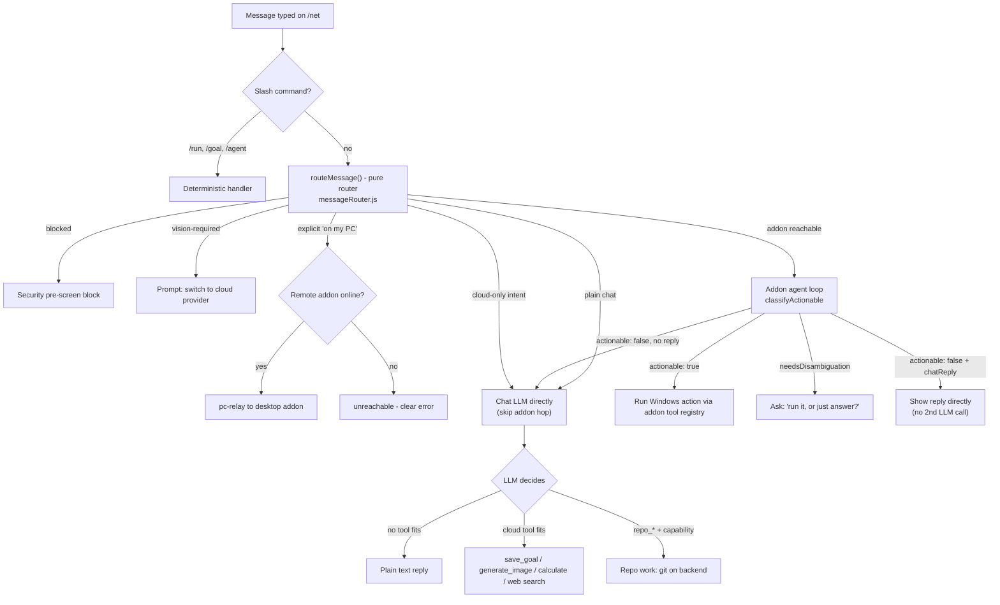

# Simple — Consumer PC Automation Platform (Plan & Architecture)

Single source of truth for the Simple platform: vision, architecture, current
state, the core agent loop, and the living roadmap/to-do. This merged the former
`simple-agent-prompt.md`, `ACTION_PLAN.md`, `AUTOMATION_ROADMAP.md`, and
`OBSERVE-ORIENT-GOAL-PLAN-ACTION.md` (2026-09-07). Security/threat model stays
in [`AUTOMATION_SECURITY.md`](AUTOMATION_SECURITY.md).

## Status legend

- ✅ **Implemented** — landed in code with tests.
- 🟡 **Partially implemented** — backend seam exists, integration/UI/guardrails still open.
- ⬜ **Planned** — not yet implemented.

---

## 0. Debugging & dogfooding (for agents)

**Agents working in this repo are welcome to sign in to the shared demo account and
click through the real UI + APIs.** Use **"Continue as Guest"** on `/login`, or the
credentials `guest@gmail.com` / `guest` (see `backend/constants/guestAccount.js`).

- Prefer it over inventing throwaway accounts — it already holds workspace items
  (goals, plans, actions, notes), so list / filter / sort / empty states are
  exercised for real instead of only in theory.
- It is a **shared, public** account: assume anything you write is visible to
  everyone. Treat test data as disposable, **delete what you create when you're
  done**, and never put real secrets, tokens, or personal data in it.
- It is deliberately **excluded from paid/powerful paths** (§13.2) — don't rely on
  it for credit-gated cloud LLM calls or admin-only surfaces such as the `repo_*`
  tools (§14.3), which require a real admin session.
- It's the account the read-only image-gen smoke test uses
  (`docs/guides/STATIC_ASSETS_AND_IMAGE_GENERATION.md`), so leaving junk behind
  degrades that test too.

---

## 1. Vision

Turn the existing `simple-addon` (currently a personal/dev-focused Electron+Node
addon) into a **consumer-facing PC automation platform** where any user can:

1. **Show, don't tell** — demonstrate a task once (mouse, keyboard, webcam, mic,
   screen — any PC input) by just doing it normally.
2. Have the system **generalize** that demonstration into a reusable, robust
   "skill" — not a brittle exact-replay macro.
3. **Share and discover** skills through a public marketplace, so the community
   builds the automation library together.

The product should feel like "recording a Loom, except the result is a robot
that can do the thing for you."

## 2. Target user & platform

- **Audience:** general consumers (not just developers/power users) — onboarding and UI must not require technical knowledge.
- **First wedge:** focus messaging/onboarding on **enthusiast/tinkerer** users first (fastest path to the first 100 paying users), then grow into **solo professionals** as the product gets more reliable. Don't market to "everyone."
- **Platform:** Windows only for v1 (matches current addon's PowerShell/UIA/Win32 dependencies).
- **Distribution:** desktop installer (NSIS, as today) + a lightweight companion web frontend (`sthopwood.com/net` integration pattern).

## 3. Core interaction model

Three complementary flows, all need to exist and interoperate:

- **Demonstration → generalized skill**: user performs a task once (or a few
  times) while the recorder captures mouse, keyboard, focus, screen state (see
  `server/automation/recorder/`). The compiler (`recorder/compiler.js`) currently
  does literal coalescing — the generalization pipeline is Section 5.
- **Natural language / agent-driven**: user describes a goal in text or voice,
  and the agent loop (`server/automation/agent-loop.js`) + tool registry
  (`server/automation/tool-registry.js`) plans and executes it directly, optionally
  invoking a matching skill (`findRelevantSkills`). The loop itself is the
  Observe → Orient → Goal → Plan → Action loop (Section 11).
- **Proactive observation → one-tap suggestion**: the agent passively watches
  everyday use, spots repeated patterns (`pattern-learner.js` + `predictor.js`),
  and offers to automate them — "I noticed you sort your downloads every
  morning. Want me to do that for you?" No recording, no scripting; the agent
  just notices and asks. This watch-and-learn path is the product's biggest
  differentiator from macro recorders (see [`BUSINESS_PLAN.md`](../guides/BUSINESS_PLAN.md)).

These three flows feed each other: agent-loop runs are recordable, recorded
skills are describable/searchable, and patterns the agent notices become new
skills the user can confirm, edit, and share.

### 3.1 The always-on assistant (four modes)

The same agent runs in four escalating modes, each with its own consent and
permission posture (§6). The promise is "a second set of eyes and hands on your
machine" that only escalates as far as the user trusts it.

| Mode | What it does | Guardrails | Trigger |
|---|---|---|---|
| **Watch** | Observes and reports — never acts. "Tell me when the printer dialog appears." | Read-only; notification only | User-set monitor |
| **Suggest** | Spots repeated patterns and proposes one-tap automations ("I noticed you sort your downloads every morning — automate it?"). | Nothing runs without a click | `pattern-learner.js` confidence |
| **Assist** | Runs a skill on demand (voice / NL / shortcut) with per-step permission, dry-run-first, and visual repair (§5.3). | Per-category/tool approval | User command |
| **Autopilot** | Runs scheduled or trigger-driven automations unattended under the saved permission profile. | Explicit opt-in per skill + global kill switch | Schedule / event trigger |

Design rule: a skill can never silently jump up a mode. Moving a skill from
Suggest → Assist → Autopilot is always an explicit user action, never automatic.

**Status: ✅ surfaced in the UI.** `/simple` opens with the four-mode ladder
(`components/Simple/AgentModes/AgentModes.jsx`). The current mode is *derived* from
the live permission state rather than stored separately — `continuousMode` +
`autoApproveAll` = Autopilot, `continuousMode` = Suggest, neither = Assist, and
`globalKillSwitch` overrides everything as **Paused** — so the ladder can never
disagree with what the addon actually permits. **Watch** is shown but not
selectable: read-only monitoring is a per-monitor posture, not a global permission,
and offering a toggle that enforces nothing would be dishonest.

### 3.2 Why users choose Simple (differentiation)

- **No scripting** — describe it or demonstrate it; the agent works out the steps
  (AutoHotkey / Power Automate / Zapier require thinking like a programmer).
- **Watches and learns** — proactive suggestions from observed behavior, not just
  user-authored macros.
- **Acts, doesn't just explain** — the chat is wired to the same agent that can
  perform actions on the PC, unlike a generic ChatGPT-style tool.
- **Local-first, cloud-assisted** — automation runs on the user's machine; cloud
  is for sync + AI metering, not a dependency for running skills.

## 4. Marketplace — 🟡 mostly shipped (backend, /market frontend, and pre-run capability + dry-run-first enforcement done; eval scenario + live-DynamoDB pass remain)

> ⚠️ **Scope note:** the marketplace is *not* "extend the existing skill
> endpoints." Today's skill endpoints (`/api/data/csimple/workspace/skill/*`)
> store **private, per-user** items keyed `csimple_ws_{userId}_{kind}_{slug}`.
> The marketplace needs a **new shared/public namespace** with its own read path
> (anyone can discover) and controlled write path (publish/fork).
> Link to it on the addon dashboard, /net, and /simple UIs

### 4.1 Data model (new backend surface)

- **Published skill record** (public, immutable per version): `marketId`, `authorUserId`, `name`, `slug`, `version` (semver), `steps` (scrubbed — see §6.1), `declaredCategories`, `toolSchemaVersion`, `naturalLanguageDescription`, `createdAt`.
- **Versioning + fork:** publishing creates a new immutable version; downloaders pin a version. A user can *fork* a published skill into their private workspace, edit, and re-publish.
- **Ratings:** `{ marketId, version, raterUserId, stars, ranAt, outcome }` — one rating per user per version, only from users who actually downloaded/ran it.
- **Counters (server-side, the KPI source):** `downloads`, `installs`, `creations` incremented atomically on the backend — NOT derived from the per-user action log.
- **Compatibility:** every published skill stores `toolSchemaVersion`; on download the client compares against its own registry and degrades gracefully (§5.4).

### 4.2 API surface — ✅ shipped

> Mounted at `/api/data/market/skills*` on the backend (`routeData.js` is mounted
> at `/api/data`). The addon's local server exposes bare `/api/market/skills*` proxies.

| Route (backend: prefix with `/api/data`) | Purpose | Status |
|---|---|---|
| `POST /api/market/skills` | Publish skill (server-side re-scrub before persisting — §4.5) | ✅ Shipped |
| `GET /api/market/skills?q=<nl>&sort=trust\|downloads\|recent` | NL search + ranking | ✅ Shipped |
| `GET /api/market/skills/:marketId[/:version]` | Fetch a specific version | ✅ Shipped |
| `POST /api/market/skills/:marketId/install` | Increment `downloads`/`installs`, return installable scrubbed steps | ✅ Shipped |
| `POST /api/market/skills/:marketId/rate` | Submit run-gated rating | ✅ Shipped |
| `POST /api/market/skills/:marketId/flag` | Community flagging | ✅ Shipped |

**Implemented in:** `backend/controllers/marketplaceController.js` (DynamoDB
`Simple` table, `csimple_market_*` namespace), `backend/services/marketplaceRanking.js`
(pure trust/ranking helpers), `backend/services/marketplaceScrub.js` (§6.1 scrub
port), `backend/services/marketplaceCapabilities.js` (§6.2 mismatch-check port),
routes in `backend/routes/routeData.js`, addon proxies in `server/automation/index.js`,
and `workspace-client.js` wrappers.

### 4.3 Trust model

- **Reputation/rating-based, no manual moderation/code-review queue** (matches Non-goals).
- Ranking signal = rating × volume × author reputation × recency × outcome-reliability (`outcomeFailRate`, derived from `successCriteria` outcomes); community flags deprioritize.
- **Cold-start mitigation:** the *real* safety floor is the execution layer (§6) — every downloaded skill runs through the permission gate, shell allow/deny-list, and protected-path blocking regardless of what it claims. In addition:
  - New/low-trust skills default to **dry-run-first** on first execution.
  - The pre-run capability summary (§6.2) is mandatory for any marketplace install.
- Marketplace success metric: **skill downloads and creations** are the primary KPI; `/telemetry/summary` folds in the marketplace counters.

### 4.4 Web frontend — ✅ shipped

- Route `sthopwood.com/market` (`frontend/src/pages/Simple/Market/`): NL search, sort by trust/downloads/recent, detail modal with the pre-run capability summary, install → rate → flag, publish modal with scrub review, and save-to-addon (or JSON download).

### 4.5 Marketplace implementation checklist

- 🟡 Backend contract tests for pagination/sort stability/install-rate constraints (offline tests cover these; a live-DynamoDB integration pass, `back.test.js`-style, remains).

### 4.6 Ranking weights as explicit config

Ranking weights (`services/marketplaceRanking.js`) are still inline constants; make them config so trust tuning doesn't need a deploy.

### 4.7 Shared GOALS — ✅ shipped (2026-09-12)

The marketplace carries **goals alongside skills**: a user can share one of their own
goals, and anyone else can save a copy of it into their workspace.

**Design: one namespace, two kinds.** A goal rides the exact same machinery as a
skill — the same `csimple_market_*` meta/version/install/rating/flag items, the same
trust ranking and `lowTrust` classification, the same install-attestation gate — with
`kind: 'goal'` on the meta item (absent means `'skill'`, so every pre-existing entry
is read correctly) and the goal's **text** in place of a compiled `steps` array:
`content`, `successCriteria`, `constraints`, `priority`.

- **A goal's `marketId` is its slug.** A slug is the thing someone can share, so
  `POST /market/goals` defaults `marketId` to the slugified name and refuses a slug
  already taken by a *skill* (the two would be indistinguishable in search) or by
  another author's goal (409). Publishing a new version of your own goal passes its
  `marketId` explicitly, exactly like a skill.
- **The goal's text is scrubbed** with the same PII/secret pass a skill's steps get
  (`scrubForPublish`, §6.1) before it is persisted — the reported `scrubReport`
  doubles as the pre-publish review data.
- **"Install" means "save a copy into my workspace"**, not "put it on my PC".
  `POST /market/goals/:marketId/install` writes an ordinary goal via
  `services/workspaceGoals.upsertGoal` under a *free* slug (a second save becomes
  "… (2)", never a clobber), bumps `downloads`/`installs`, and records the install
  attestation — so a saved goal can be rated through the existing rate endpoint.
- **Endpoints** (all `protect`ed; mounted next to the skill routes):

| Route (prefix `/api/data`) | Purpose |
|---|---|
| `GET /market/goals?q=&sort=trust\|downloads\|recent&page=&perPage=` | Browse shared goals |
| `POST /market/goals` | Share a goal (or publish a new version of your own) |
| `GET /market/goals/:marketId` | One shared goal |
| `POST /market/goals/:marketId/install` | Save it into my workspace |
| `POST /market/skills/:marketId/rate` / `/flag` | Shared route — a goal's marketId works here too |

**Frontend:** `/market` is now a **service page** (§5.7 of the UI standard — flat
surface, sticky toolbar with a **Skills | Goals** switch, dense panel grid) and the
fourth room in the header switcher (`SIMPLE_NAV_SURFACES`). Sharing is picked from
the user's own goals (`listWorkspace(kind:'goal')`); saving shows the goal text, its
"done when" criteria, and one **＋ Save to my goals** button.

**Still open:** a live-DynamoDB pass, ratings that reflect a *run* of the saved goal,
and `/market` in the addon dashboard (`renderer/dashboard.html` still links skills
only).

## 6. Safety & permissions — 🟡 partially implemented (backend seams + consent UI shipped; deny-path audit + future multimodal wiring open)

Keep and extend the existing permission model (`server/automation/permissions.js`,
`security-guard.js`) — do not weaken it for consumer onboarding. Category-based
approval, shell allow/deny-list, protected-path blocking, and the
`globalKillSwitch`/dry-run mechanisms all stay.

### 6.1 Privacy / PII scrubbing — ✅ implemented

### 6.2 Inspect-before-run capability summary — ✅ implemented

### 6.3 Cloud-vision consent — ✅ implemented

### 6.4 Remaining safety checklist

- 🟡 Require cloud-vision consent before any multimodal upload path (`vision-fusion.js` + `screenshot_check` gated; future paths need wiring).

## 7. Architecture — ✅ provider seam shipped

- **Keep the existing stack**: Electron + Node.js main process/server, Python subprocesses for ML (Whisper STT, MediaPipe eye tracking, webcam/vision). Do not rewrite.
- **Cloud-first AI, with a local/offline option**: default to AWS Bedrock (Claude Haiku 4.5) proxied through the portfolio backend; preserve the ability to swap in local models. Define a small **LLM provider interface** (`chat`, `chatMultimodal`) and route all callers through it.
- Reuse existing subsystems: tool registry, permission gate, event bus, recorder, agent loop, predictor/pattern-learner.

### Architecture overview

```
┌─────────────────────────────────────────────────────────────────────────────┐
│  INPUT (Perception): Webcam · Audio/Mic · Screen · Key/Mouse                │
│                          → PERCEPTION BUS (perception-bus.js)               │
├─────────────────────────────────────────────────────────────────────────────┤
│  INTERPRETATION: Vision (multimodal LLM) · Audio (Whisper) · Predictor      │
├─────────────────────────────────────────────────────────────────────────────┤
│  SYNTHESIS: AGENT LOOP (Observe → Orient → Goal → Plan → Action, §11)       │
│             Voice · NL Macro Compiler · Vision-Action Predictor             │
├─────────────────────────────────────────────────────────────────────────────┤
│  OUTPUT: shell_run · fs_write · uia_invoke · input_tap · browser_* · skill_run│
└─────────────────────────────────────────────────────────────────────────────┘
```

### Current state (shipped)

The end-to-end loop **signed-in user → cloud memory → local PC actions** works.

| Area | Files |
|---|---|
| Per-user workspace memory (memory/project/agent/skill/goal/action/log/decision) | `backend/controllers/workspaceController.js`, `backend/services/workspaceContext.js` |
| Workspace REST API mount | `backend/routes/routeData.js` (`/api/data/csimple/workspace/*`) |
| Electron addon + tray / local server | `simple-addon/main.js`, `simple-addon/tray.js`, `simple-addon/server/index.js` |
| Tool registry + permission gate | `server/automation/tool-registry.js`, `server/automation/permissions.js` |
| Agent loop (O-O-G-P-A) | `server/automation/agent-loop.js` (see §11) |
| Recorder + skill compiler/runner | `server/automation/recorder/*`, `server/automation/tools/skill.js` |
| Perception / UIA / browser / OCR tools | `server/automation/tools/*`, `server/automation/perception*.js` |
| Cloud audit + workspace client | `server/automation/workspace-client.js` |
| Live web panel + chat `/run` `/agent` | `frontend/src/components/SimpleAddon/*`, `SimpleChat.jsx` |
| Eval harness | `server/automation/eval/` |

### 7.1 LLM provider seam — ✅ implemented

## 8. Monetization — 🟡 provider-boundary credit gate shipped (UX copy + full integration matrix remain)

Freemium, gated at one seam (the LLM provider interface, §7.1) — not scattered
through feature code. Downgrade/expiry falls back to the free path without
breaking an installed skill's core replay.

### Decided tier model

| What | Free | Pro |
|---|---|---|
| Price | $0 | $15/mo (or $144/yr) |
| AI chat — Bedrock Claude Haiku 4.5, metered | $0.50/mo credit | $10/mo credit |
| OCR — platform-funded, metered | same credit allowance | same credit allowance |
| Local automation & addon | Unlimited (fair use) | Unlimited (fair use) |
| Cloud storage | 100 MB | 50 GB |
| Live phone viewing | — | Included |
| Support | Community | Email |

Locked decisions: **no BYOK** (all cloud AI is operator-funded and metered);
**OCR platform-funded**; **cancellation deferred to period end**; **annual billing**;
**no automation command cap**. (The admin `Special` flag can grant a specific user
unlimited credits — see [`special-user-flag.md`](special-user-flag.md); it's an admin
tool, not a documented tier.)

### 8.1 Monetization checklist — 🟡 partially implemented (provider-boundary gate shipped)

The meter already lived in `backend/utils/apiUsageTracker.js`
(`MEMBERSHIP_LIMITS` / `getMembershipLimit` / `canMakeApiCall` / `trackApiUsage`).
The gap was **enforcement at the provider boundary** — `agent-chat`/`agent-vision`
invoked Bedrock without checking it. That gate now exists.

- ✅ Enforce the credit limit at the provider boundary only — `agentChatProxy` /
  `agentVisionProxy` (`backend/controllers/workspaceController.js`) call
  `canMakeApiCall` before Bedrock, return a structured 402 (`planRequired`,
  `membership`, `limit`, `creditsRemaining`, `upgradeUrl`) when blocked, then
  `trackApiUsage` with the real token counts after success.
- ✅ Per-tier limits in one config table — `MEMBERSHIP_LIMITS` (Free $0.50 / Pro
  $10) in `backend/utils/apiUsageTracker.js`; local automation stays unmetered.
- 🟡 Downgrade immediately reflects in the limit — `getMembershipLimit(userRank)`
  resolves the rank from Stripe per call, so a downgrade/cancel drops the
  allowance on the next cloud-LLM call. (Grace-period copy and the local-path
  fallback for chat remain.)
- ✅ Blocked-call UX copy — `SimpleChat.jsx` already renders an "Usage Limit
  Reached → Upgrade" message for 402/credit/limit errors in both chat paths
  (and `dataService.js` shows upgrade toasts). The structured fields
  (`planRequired`/`membership`/`limit`/`creditsRemaining`/`upgradeUrl`) now also
  flow through `workspace-client.js` for richer copy later.
- 🟡 Integration tests — route gate covered in
  `backend/controllers/workspaceAgentGate.test.js`; the free/paid/expired/
  grace state machine now has unit coverage in
  `backend/utils/apiUsageTracker.test.js` (`getMembershipLimit`,
  `needsMonthlyReset`, `performMonthlyReset`). A full route-layer pass against
  real DynamoDB/Stripe fixtures remains.

### 8.2 Example marketable use cases

Concrete "show don't tell" scenarios for marketing/onboarding — each a plausible
single-demo recording in plain language with the payoff up front.

1. **Never organize your downloads again** — show it once; every messy file sorts itself forever.
2. **Grind your video game while you live your life** — show it the repetitive part; it keeps playing.
3. **Fill out the same form a hundred times** — it repeats your exact answers.
4. **Turn 10,000 photos into an organized album overnight** — it renames your collection.
5. **Copy information between programs** — it does the rest of your list.
6. **Get your daily report before you sit down** — it builds, saves, and emails it.
7. **Post once, appear everywhere** — it shares to all your accounts.
8. **Wake up to a clean inbox** — it keeps email tidy around the clock.
9. **Turn a shoebox of receipts into a budget** — it reads and totals them.
10. **Keep your game character stocked 24/7** — it handles shopping/crafting/cleanup.
11. **Make a folder of photos look professional** — it applies your edit to every photo.
12. **Never miss a sold-out item** — it watches and grabs it on restock.
13. **Turn messy notes into something you'd send** — it hands back a clean summary.
14. **Set up a new computer in minutes** — it repeats your setup.
15. **A tireless assistant for your files** — it flags what needs attention.
16. **Keep your media collection organized** — new downloads sort themselves.
17. **Apply to dozens of jobs while you do something else** — it repeats your info.
18. **Never build an expense report again** — it gathers, sorts, submits.
19. **Back up what matters, automatically** — copies on a schedule.
20. **Run your livestream like a one-person crew** — it switches scenes and saves clips.

### 8.3 Growth & conversion levers — ⬜ planned (from [`BUSINESS_PLAN.md`](../guides/BUSINESS_PLAN.md))

The biggest revenue lever is converting the existing Free → Pro funnel, not
inventing new tiers. Ordered by effort/risk.

**Tier 1 — do first (extends existing Stripe + usage-tracking code):**

- ⬜ In-app usage meter for storage ("82 MB/100 MB used") so free users see the
  ceiling before they hit it, plus a "you're at 90% of your daily limit —
  upgrade or wait" banner instead of a hard block. **Never silently fail a request.**
- ⬜ Annual billing discount — "$15/mo or $144/yr (2 months free)".
- ⬜ One-time storage top-up packs (~$3 for +5 GB/month) for users who are 90%
  happy on Free but occasionally need more — captures price-sensitive churn
  without a full subscription. (Automation commands stay ungated: local runs
  cost nothing.)

**Tier 2 — validate demand first, then build:**

- ⬜ One-time lifetime unlock of *one* Pro feature (e.g. "live phone viewing,
  $39 once") for users who dislike recurring billing — survey current Pro users
  first; skip if there's no signal.
- ⬜ Scheduled automation — start with a local reminder ("time to run your
  automation"), graduate to real background/remote execution only when paying
  demand for the cheap version exists.
- ⬜ "Supporter" tier ($3–5/mo patronage: badge, credits page, beta toggle) —
  only pursue with real goodwill signals (support mail, reviews, community).

## 9. Non-goals for this phase

- No cross-platform (Mac/Linux) support yet.
- No manual marketplace moderation/review queue.
- No enterprise/B2B features (SSO, team management, audit export) — consumer product.
- No fixed deadline — ongoing, iterative build; structure work as a prioritized backlog.

## 10. Roadmap & backlog

Ordered by value-per-risk. Ship the core "show don't tell" loop before the
marketplace, and ship privacy scrubbing before *any* publish path.

1. ✅ **Generalization MVP** — LLM re-derivation (5.1) + multi-demo parameter inference (5.2).
2. 🟡 **Privacy scrub pass** (6.1) — scrub engine + preview endpoint + consent gate shipped. ⬜ Remaining: scrub-report confirmation in pre-publish UI.
3. 🟡 **Pre-run capability summary** (6.2) — summarizer + preview endpoint shipped. ⬜ Remaining: mandatory pre-run confirmation UX.
4. ✅ **Marketplace backend** (4.1–4.2) — public namespace, versioning, install-gated ratings, atomic counters.
5. ✅ **Marketplace web frontend** (4.4) + trust ranking + dry-run-first — `/market` page, ranking + `lowTrust`, and dry-run-first enforcement all shipped.
6. ✅ **Vision re-targeting on replay** (5.3) — recovery path + UI messaging + broadened coverage (uia_invoke / click_at / browser_click) all shipped.
7. 🟡 **Monetization seam** (8) — provider-boundary credit gate + blocked-call UX copy + state-machine unit tests shipped; a full route-layer DynamoDB/Stripe fixture pass remains.
8. 🟡 **Onboarding/UX polish** for non-technical users — the three Simple surfaces are bound by one switcher that lives inside the site header (no extra row), `/simple` leads with the four-mode trust ladder, and `/net` opens as just the chat with the conversation rail a collapsed drawer. ⬜ Starter templates, a first-run guided demo, and the funnel gaps listed in §16.4 remain.
9. ✅ **Goal ↔ chat link** (§16.1) — a goal has its own `/net` conversation (id derived from the slug), enlisting from `/plans` runs the goal *in* that thread, the card flips to **View agent** once a run exists, and runs started from either surface are mirrored onto the goal. ⬜ Seeding a legacy goal's recorded run into a still-empty thread.

Each milestone ships with Jest unit tests and, where it touches the loop, an
`automation/eval/scenarios/` scenario.

### 10.1 Next implementation slices (file-targeted)

3. **Capability/scrub UI confirmations** — frontend route(s) following the `/net` integration pattern.
4. **Recorder consent gate** — `server/automation/permissions.js` + recorder capture pipeline.
5. **Vision replay repair fallback** — `server/automation/tools/skill.js` (`repairStep`) + `server/automation/vision-fusion.js`.

### 10.2 Sprint-ready backlog of not-done items

#### P0 — do now

- 🟡 Recorder sensitive-capture consent: frontend consent UX polish.

#### P2 — after core loop is stable

- 🟡 Trust-ranking tuning + low-trust dry-run-first hardening (formula + classifier shipped; tune against real usage).
- 🟡 LLM provider local adapter quality pass (deterministic stub shipped; a real local model backend remains).
- ⬜ Consumer onboarding polish and starter templates.

### 10.4 Future capability plans

Longer-horizon capabilities, listed by the roadmap.

- **Audio / voice pipeline** — mic → Whisper STT → intent → goal → TTS. (`scripts/voice_pipeline.py`, `server/audio-stream-manager.js`, `tools/audio.js`; endpoints `/api/voice/*`.)
- **Natural Language Macro Compiler** — English → structured skill steps (`nl-compiler.js`; `POST /api/skill/compile-natural`).
- **Continuous perception bus** — unified event stream (`perception-bus.js`) fed into the agent context.
- **Behavioral predictor** — n-gram model over action log; safe-read actions can execute speculatively (`predictor.js`).
- **Frontend integration** — NL macro textarea, perception status, voice input, predictions panel across `SimpleAddon/*`.
- **Proactive pattern detection** — surface repeated action patterns as one-tap
  "automate this?" suggestions (the watch-and-learn path from §3); built on
  `pattern-learner.js` + `predictor.js`.
- **Watch-and-alert** — user sets a monitor ("tell me when X appears/changes");
  the agent polls perception and notifies, acting only on confirmation.
- **Scheduled & unattended automation** — run a skill on a schedule or trigger;
  start with local reminders, graduate to background/remote execution only if
  paid demand validates the infra cost (§8.3).
- **Remember-and-repeat** — recall how a task was done before and offer to
  repeat it (memory over the action log → reusable skills).
- **Routines (skill composition)** — compose multiple skills into a sequence
  with minimal control flow (if/then, repeat N×, wait-for X, on-error) so users
  build multi-app workflows ("open spreadsheet → copy → paste into email")
  without scripting; reuses `skill_run` + per-step `successCriteria`.
- **Event-driven triggers (when → then)** — run a skill or routine automatically
  when something happens (a window opens, a file lands in a folder, an app
  launches, a time passes); built on the perception bus + predictor, every
  trigger opt-in and permission-gated.
- **Cloud continuity** — skills, settings, history, and consents sync across a
  user's machines (the same workspace items already do this), so a reinstall or
  new PC restores the agent in minutes.

## 11. The O-O-G-P-A loop (design reference)

The agent loop was upgraded from ReAct to an explicit **Observe → Orient → Goal →
Plan → Action** loop with a critic and meta-learning. **Status: ✅ complete** —
every task (T0.1 → T8.2) is implemented, tested, and green. This section is the
design reference; the code is the source of truth.

### 11.1 Three nested loops

| Loop | Cadence | Stages | Purpose |
|---|---|---|---|
| Inner | per action (~seconds) | Observe → Orient → Plan → Action | Fast progress; Goal held fixed |
| Outer | per goal re-eval (every N steps / T minutes) | + Goal | Re-derive or abandon intent |
| Meta | per session/day | Critic over the action log | Learn skills, drop dead policies |

### 11.2 State machine

```text
IDLE → OBSERVING → ORIENTING → SELECTING_GOAL → PLANNING → ACTING → REFLECTING
                                              ↑_______________↓        (inner loop)
                          └─→ BLOCKED ─→ (wait / new goal) ─────────┘
IDLE ← DONE / FAILED / STOPPED (kill switch)
```

Every transition is observable in `GET /api/agent/status`. Stages:

- **Observe** — sensors (screen, UIA, audio, gaze, keyboard patterns) fuse into a `Frame`; the last action's outcome is part of the next frame.
- **Orient** — assemble a bounded, priority-ordered situation block (perception → recent actions → goals → lessons → suggestions), capped at `ORIENT_CAP_BYTES`; drift detection (token-set Jaccard similarity over the *semantic* parts) sets `drifted`.
- **Goal** — cadence-gated re-eval: `refreshGoalStatus()` runs every tick (terminal-status + stall check, never cadence-gated); `selectGoal()` re-derives intent on cadence/drift and can emit `blocked`/`done`/`abandoned` (self-block gated by `autoAbandon`, default false).
- **Plan** — choose a concrete tool call or `idle`.
- **Act** — execute the tool; record the outcome.
- **Reflect / Critic** — `critic.js` scores the action (−1..1), writes an idempotent `lesson` workspace item on failure, and injects lessons into the next Orient block.

### 11.3 Data model & endpoints

**Additive goal fields** (`workspaceController.js`): `nextReevaluateAt`, `stallCount`, `lastOutcomeDelta` (−1..1), `autoAbandon` (bool), `maxSteps` (int).

**New workspace kind `lesson`** — written by the critic, read by Orient as semantic
memory: `{ kind:"lesson", slug:"lesson-<hash>", content:{ pattern, context, do, avoid, confidence, sourceGoal } }`.

**Endpoints:**

| Method | Path | Purpose |
|---|---|---|
| `GET` | `/api/agent/status` | `stage`, `loop` (inner/outer/meta), `stallCount`, `lastLesson` |
| `POST` | `/api/agent/start` | accept `goalSlug` + optional `{maxSteps, autoAbandon}` |
| `POST` | `/api/agent/block` | mark current goal `blocked` with a reason |
| `GET` | `/api/agent/lessons?goal=<slug>` | read critic lessons |
| `DELETE` | `/api/agent/worker/:goalSlug` | stop a worker |

**Configuration knobs** (in `agent-loop.js` defaults): `ORIENT_CAP_BYTES`, `EPISODIC_WINDOW`, `LESSON_TOPK`, `REEVAL_STEPS`, `REEVAL_MS`, `DRIFT_THRESHOLD`, `IDLE_SLEEP_MS`, `STALL_THRESHOLD`, `MAX_STEPS_DEFAULT`, `META_EVERY_ACTIONS`, `SKILL_PROMOTE_MIN_REPEATS`.

### 11.4 Success criteria (all met)

- Named `observe/orient/selectGoal/plan/act/reflect` stages, each unit-testable.
- Outer loop re-runs the Goal stage on cadence + drift and emits `blocked`/`done`/`abandoned`.
- A critic writes idempotent lessons and injects them into the next plan.
- The loop can `idle` and self-`block` on repeated stalls.
- Kill switch and permission gate remain authoritative at every stage.
- All existing eval scenarios pass; new ones green.
- UI shows live stage/loop/lessons without new security surface.

### 11.5 Open follow-ups

- **Offline runner coverage** — goal-block-on-stall and orient-bound-cap are unit-tested only; the offline eval runner can't drive the LLM loop deterministically.
- **Server-side `goalAgentService`** — kept as the offline fallback for `/plans`; the addon O-O-G-P-A loop is now the primary path.

## 12. Readiness & validation

The reliability bar before turning purchasing/visibility back on.

**Readiness bar:**
1. **Hard gate** — key simulation, perception, and auto-execution each work in ≥2 common apps.
2. **Reliability gate** — each of the 11 validation scenarios passes 9/10 across sessions/days; fix and restart on any consistent failure.
3. **Account plumbing gate** — purchase confirmation and password reset confirmed end-to-end with a real account.
4. Re-run the whole check after any significant change to the perception/action pipeline.

**Validation scenarios** (executable in `simple-addon/server/automation/eval/validate-core-functionality.js`, driven from `simple-addon/` via `npm run validate:core`):

| # | Scenario | Passes when… |
|---|---|---|
| 1 | Type + save a note in Notepad | saved file matches the typed string byte-for-byte |
| 2 | Calculator arithmetic by clicking | displayed result is `19` |
| 3 | Rename a file in File Explorer | old name gone, new name exists, content intact |
| 4 | Alt-Tab between two windows | foreground window is expected (both directions) |
| 5 | Detect human-typed input (interactive) | logged events reconstruct the sentence |
| 6 | Read UI state via perception | reported toggle states match ground truth |
| 7 | Record → compile → auto-replay | replay reproduces the same end state, no manual input |
| 8 | Planner-driven NL execution | final state matches the instruction's intent |
| 9 | Drag-and-drop with a moving path | the file/slider actually moved |
| 10 | Held input releases on focus loss | the key released after the focus switch |
| 11 | Workspace profile save → move → restore | window returns to its saved position/size |

## 13. Living action items

The remaining checklist — check items off as they land, add new gaps as found.

- ⬜ **Reliability tally** — run each validation scenario ≥10 times and require 90%+ per scenario (see §12).
- ⬜ **Perception loop** — scenario 5 needs one real `--interactive` run with a human.
- ⬜ **Auto action execution** — scenario 8 needs one real signed-in run (all LLM calls proxy through the backend).
- ⬜ **Scenario 11** — needs a live desktop run before it counts toward the tally.
- ⬜ **`input_hold`** — held keys/buttons lack a real-desktop regression test; add one.
- ⬜ **Existing Pro subscribers** — tell them plainly what works and what doesn't.
- ⬜ **Account/transactional email plumbing** — verify purchase confirmation + forgot/reset-password loop with a real account.
- ⬜ **Single installer** — consolidate "download, trust cert, configure" into one flow if feasible.

### 13.1 New findings (repo audit, 2026-09-09)

Issues surfaced while auditing the repo beyond the original plan. Ordered by
impact; none are Simple-core blockers, but several are user-visible or DRY/security-adjacent.

- 🟡 **Plaintext secret fallback outside Electron** — `simple-addon/server/secret-storage.js` stores secrets in plaintext when `safeStorage` is unavailable (documented + one-shot warning; fine for CLI/Jest). Confirm the packaged addon always runs under Electron, and consider refusing to persist (instead of plaintext) in non-Electron contexts.
- 🟡 **Derive admin-ness server-side** — the backend now attaches an `isAdmin` flag to the register/login/guest responses (`postData.js`), and the frontend reads it via shared `isAdminUser()`/`isMuseVisitor()` helpers in `constants/admin.js` (`AdminLayout`/`HeaderDropper`/`DeepStorage`/`Home`/`Muse`). Remaining: the hardcoded ID + `'girlfriend'` gate still ship as a legacy fallback until every active session re-logs in — then the constants can be deleted.
- ⚠️ **Committed user PII still in git history** — `backend/reports/support-tickets-*.json` was deleted from the working tree and added to `.gitignore`, but the file is still in git history; full removal needs a history rewrite (e.g. `git filter-repo`/BFG) + force-push.

### 13.2 New findings (second audit pass, 2026-09-09)

- 🟡 **Experimental `signal-bridge` predates the Bedrock-only decision** — marked ⚠️ DEPRECATED/UNWIRED in its header. Actual deletion (or re-implementation via the Bedrock proxy) is still a product decision.
- 🟡 **Public guest account with a known password** — `backend/constants/guestAccount.js` hardcodes `guest@gmail.com` / `guest` for "Login as Guest" (and `createGuestUser.js` logs the password). A deliberate demo feature, but a shared account with a known credential should stay strictly read-only/rate-limited and excluded from paid/powerful paths.

### 13.3 New findings (third audit pass, 2026-09-09)

- 🟡 **S3 upload file-type validation trusts the client MIME type** — *post-upload
  content check added (2026-09-12).* `validateFile` rejects known-dangerous
  extensions (.html/.svg/.exe/…) and extension/content-type mismatches, but those
  only constrain what the client *claims* — the bytes travel client → S3 via the
  presigned URL, so the server never sees them. `confirmUpload` now reads the
  object's leading 512 bytes (a Range GET) and refuses content that contradicts
  its extension, deleting the object so a rejected upload is neither recorded nor
  billed. See `utils/fileSignature.js` + `__tests__/unit/uploadSignatureGate.test.js`.
  Two deliberate properties: the rule is **contradiction-only** (content that can't
  be identified is accepted, because failing a real user's file is worse than the
  marginal gain) and it **fails open** on an S3 read error, with
  `UPLOAD_SIGNATURE_CHECK=false` as the operator kill-switch. ⬜ Remaining: content
  with no known signature is still accepted, so this narrows the gap rather than
  closing it — closing it needs real scanning (AV/content-inspection service).
- 🟡 **JWT persisted in `localStorage`** — `frontend/src/features/data/dataSlice.js` stores the auth token in localStorage, so any XSS could exfiltrate it. Combined with the loose CSP above, prefer an `httpOnly` session cookie (or at least tighten CSP).

### 13.5 New findings (fifth audit pass, 2026-09-09)

- 🟡 **HIGH — the addon's local HTTP API is unauthenticated and CORS-allows the production site + LAN origins** — hardened: `simple-addon/server/index.js` now rejects requests whose `Host` header isn't loopback/private (anti DNS-rebinding) and 403s non-allowlisted cross-site `Origin`s before any handler runs, so a drive-by `fetch('http://127.0.0.1:3001/...')` from an arbitrary site no longer executes. Remaining: the production site is still allowlisted, so a per-install random secret on every request (and tightening CORS to the Electron app's own origin) is still needed to close the allowlisted-origin path.

### 13.7 New findings (seventh audit pass, 2026-09-09)

- ⬜ **Addon is distributed unsigned (no code-signing certificate)** — `simple-addon/` is built without `CSC_LINK`/`CSC_KEY`/`win.certificateSubjectName`, so (a) Windows SmartScreen flags the installer/portable exe, and (b) `electron-updater` can't verify update authenticity against a publisher certificate — update trust rests on TLS + the blockmap hash alone (a compromised GitHub repo could ship a malicious update that installs silently). Sign the build and set `publisherName` so updates are authenticated.
- ✅ **CI actions pinned by mutable tags** — *fixed for immutability (2026-09-12).* All
  21 `uses:` references across the three workflows are pinned to full 40-character commit
  SHAs (version kept in a trailing comment), each verified against its repo's real
  tag→commit mapping with `git ls-remote`. Two traps worth knowing for next time:
  `github/codeql-action@v4` is an **annotated** tag, so the pin must be the *dereferenced*
  commit (`b96794f0…`, i.e. `refs/tags/v4^{}`) — pinning the tag object's own SHA fails
  the job; and `trufflesecurity/trufflehog@main` was a **moving branch**, now frozen to
  the commit `main` pointed at on 2026-09-12 (latest release: v3.97.4). Pins won't rot
  silently: `dependabot.yml` already carries a weekly `github-actions` ecosystem.
  ⬜ **Still open: the mixed versions.** `actions/checkout` and `actions/setup-node` are
  `@v4` in the two *Windows* jobs (`build-addon.yml`, `ci.yml`'s `test-simple-addon`) and
  `@v6` in every other job. Each was pinned to the version it already used rather than
  bumped: a major bump inside the addon **release** pipeline is a behaviour change that
  can't be exercised locally, so it wants a deliberate, watched change.
- ⬜ **CI can't be run locally** — the workflow changes above were validated by parsing
  each file as YAML and asserting every `uses:` resolves to a pinned SHA (plus the
  `ls-remote` mapping check), not by executing the pipelines. Worth one watched run
  before relying on it.

### 13.8 New findings (eighth audit pass, 2026-09-10)

- 🟡 **Unbounded per-request access-log writes** — *addressed for growth (2026-09-12).*
  Both per-request writers (`checkIP` in `utils/accessData.js` and `recordPageView` in
  `controllers/pageViewsController.js`) now stamp an `expiresAt` DynamoDB **TTL**,
  derived from `ANALYTICS_RETENTION_DAYS` (default 90) in the new
  `utils/analyticsRetention.js`. TTL only deletes items that *carry* the attribute, so
  durable rows (users, workspace items, goals, tickets) are never expired by it.
  **Remaining: the attribute is inert until table TTL is turned on once** —
  `node backend/scripts/configure-analytics-ttl.js` (dry run by default, `--apply` to
  change it). The per-request *write* cost itself is unchanged; sampling or a separate
  analytics table would address that, at the cost of changing what the dashboard counts.
- ✅ **`checkIP` put a third-party HTTP call on every request's critical path**
  (found 2026-09-12 while fixing the above) — it called `ipinfo` directly, and its
  callers `await` it *before* responding, so each request paid an ipinfo round-trip and
  a slow/hung ipinfo could stall the response. It now goes through
  `utils/geoLookup.getGeoForIp`, which caches per IP (1 h, 5 min for a miss) and bounds
  every lookup with a timeout. That helper also had a latent bug: `logger` was declared
  *inside* `cleanupCache`, so its `catch` threw `ReferenceError` instead of resolving
  `null` on any lookup failure — fixed, with regression tests. `extractIp` now also
  takes `req.ip` (trust-proxy aware) over the spoofable leftmost `X-Forwarded-For`.

### 13.9 New findings (ninth audit pass, 2026-09-12)

- ✅ **The 1 MB scan-truncation family was not actually finished** — the repo had fixed
  the worst offenders (storage tracking, search, delete) but five *list* endpoints in
  `controllers/csimpleController.js` still ran a single `ScanCommand` with a
  `begins_with(id, :prefix)` FilterExpression. A filter is applied only **within** the
  scanned page, so once the table passed 1 MB those endpoints returned *some* of a
  user's files — or none — with no error. That includes `getSimpleUserContext`, which
  is what the LLM is handed as the user's memory (the assistant would quietly
  "forget"), plus the memory / personality / behavior lists behind the addon's file
  browsers. The same unpaginated read sat in `llmService.loadUserContextFromDB`
  (chat memory), `workspaceContext.fetchAllOfKind` (agent context), and
  `marketplaceController` (browse + author KPI totals).
  All of it now goes through **one** importable helper, `utils/paginatedScan.js`,
  which also replaces the six copy-pasted private copies of it (`getData`,
  `getHashData`, `postData`, `profileController`, `passwordReset` — each had its own
  paragraph explaining the same mistake, which is how a seventh copy got written).
  The helper is bounded by `SCAN_MAX_PAGES` (default 200) and **warns** when it stops
  early: a partial result must never look like a complete one.
  Tests: `paginatedScan.test.js`, `csimpleListPagination.test.js` (asserts items from
  the *second* page are returned). Not verified against live DynamoDB.
- ✅ **`getUserDataCached` fetched one user with a full-table Scan** (found in the same
  pass) — `FilterExpression: "id = :userId"` filters on the partition key *after*
  scanning a page, so a user whose row sat past the first page read back as **"no
  record"**. That call decides a user's plan and credit allowance, so the failure mode
  is a paying subscriber being metered as a brand-new free account; it also billed a
  whole-table scan to fetch one row. Now a partition-key `QueryCommand`, matching the
  `getRawUserRecord` precedent. Tests: `__tests__/unit/userDataLookup.test.js`.
- ✅ **The rest of the single-page scans** (same pass) — `musicService.listSongs`,
  `stripeService.updateUserRank` (a Stripe event whose customer row sat past page 1
  never updated that subscriber's rank), `refererAnalytics` ×2 (the dashboard
  under-reported), and `testFunnelController.findUserByEmail` now use
  `utils/paginatedScan`. `putHashData`'s bug-reporter lookup was an **id-filtered
  Scan** and is now a partition-key Query — the resolution email had no recipient when
  the reporter's row sat past page 1.
- ✅ **`ocrService.updateItemWithOCR` rejected the record's real owner** (found in the
  same pass). The ownership check sliced the creator id to a fixed 24 characters
  (`substring(i + 8, i + 32)`) and compared *that* to the caller's id; ids in this
  table are 32-char crypto hex, so the comparison always failed and the actual owner
  was told "User not authorized to update this item". It also skipped the check
  entirely when a record carried no `Creator:` tag, so an untagged record was writable
  by anyone who knew its id. It now reads by partition key, matches the id up to the
  next `|` (`/(?:^|\|)Creator:([^|]+)/`) and **denies by default**, mirroring
  `fileUploadController.creatorIdOf`. Tests: `__tests__/unit/ocrItemUpdate.test.js`.
- ⚠️ **Do NOT query `userEmail-index` for email lookups** — the table carries a GSI on
  `userEmail`, but nothing in the codebase ever *writes* that attribute: every email
  read parses it out of the pipe-delimited `text` field. The index is therefore empty,
  and "optimising" the login / password-reset email scans onto it would break sign-in
  for every user. Populate + backfill the attribute first if that's ever wanted.
- ⬜ **Still outstanding** (verified, not yet fixed): `utils/guestUserManager.js` (dev
  script — single-page lookup, and its delete uses `Key: { id }` alone, which throws
  against the composite key), `utils/createGuestUser.js` (near-duplicate of it), and
  `testFunnelController`'s `GetCommand({ Key: { id: testUserId } })` (~line 304, also
  missing the sort key — it is inside a try/catch, so the funnel status endpoint just
  always reports "no live user"). Everything under `backend/scripts/` is unaudited.

### 13.10 New findings (tenth audit pass, 2026-09-12)

First pass over `backend/scripts/` — the one area §13.9 left unaudited. The
mutating scripts turned out to be mostly well-behaved (dry-run by default, and
`Key: { id, createdAt }` on every delete/update); two things were not.

- ✅ **`migrate-images-to-s3.js` defaulted to writing.** Its dry run was a
  hand-edited constant that shipped as `const DRY_RUN = false`, so
  `node backend/scripts/migrate-images-to-s3.js` uploaded inline base64 images to
  S3 and rewrote the DynamoDB `files` arrays on live data — no flag, no prompt, no
  dry-run pass, unlike every sibling script. It is now `--apply`-gated, and the dry
  run reports "Images that WOULD be migrated" separately instead of incrementing
  the `imagesMigrated` counter (a dry run could be read as "N images migrated").
  Verified by running it: the migration is already complete — 6 items with files,
  **0 images pending**. Tests: `__tests__/unit/migrateImagesDryRun.test.js`
  (pins "no arguments issues no writes").
- ✅ **`.gitignore` protected the wrong directory.** The rule was
  `backend/storage/migration-backups/*`, but `backup-dynamodb.js` writes next to
  itself — `path.join(__dirname, 'migration-backups')`, i.e.
  `backend/scripts/migration-backups/` — which nothing ignored, so its export of
  user records (text + file metadata) was committable. (`merge-duplicate-users.js`
  is fine: it writes under `backend/logs/`, already ignored.) Added the missing
  rule; `git check-ignore` now matches. Note the *existing* tracked dump at
  `backend/storage/migration-backups/dynamodb-backup-2025-10-12T*Z.json` — 2 items,
  no `Password:` (so no credential leak), but a data export that should not be in
  the repo; untracking it is a call for the repo owner, and it stays in history
  either way (see §13.1).
- ✅ **`migrate-images-to-s3.js` could not run at all.** It built its clients at
  module load from `process.env`, but `backend/.env` holds only the access keys, so
  it died with the SDK's opaque "Region is missing" (and `S3 Bucket: undefined`)
  before doing anything. It now bootstraps through `loadAllSecrets()` — the same
  path `server.js` and the other scripts use — and, when config is still missing,
  fails with the names of the missing variables instead of the SDK's message.
- ⚠️ **Other scripts may share that missing bootstrap.** `migrate-images-to-s3.js`
  was found by running it; the rest of `backend/scripts/` was read, not executed, so
  any of them that builds AWS clients at module load has the same latent failure.
  Worth a run-through before the next time one of them is needed.

### 13.11 New findings (eleventh audit pass, 2026-09-12)

Surfaced while building the Dream board (§17), which is the first frontend feature
to actually *use* the upload surface. Two real bugs, both in code nothing had
called since the feature that used it was removed — which is exactly why nobody
had noticed.

- ⚠️ **The presigned upload path is unusable from a browser — S3 has no CORS rule
  for the app's origin.** `POST /upload-url` mints a signed PUT correctly, but the
  browser then refuses it: `Response to preflight request doesn't pass access
  control check: No 'Access-Control-Allow-Origin' header`. So *any* browser upload
  via `upload-url` → PUT → `upload-confirm` fails, and `frontend/src/features/data/dataService.js`
  had already noted that no client calls that path today. Dream-board covers
  therefore go through a new server-side endpoint (`POST /api/data/upload-cover`,
  multer → S3) instead: one request, no CORS dependency, and the server sees the
  bytes it stores rather than a declared content type. **The presigned path is
  still broken** and needs a bucket CORS rule before it can be used by anything
  else.
- ✅ **`DELETE /api/data/file/:s3Key` 500'd on every bodyless request** — it read
  `const { dataId } = req.body`, and `express.json` leaves `req.body` *undefined*
  when there is nothing to parse. A DELETE with no body is the natural way to call
  it, so the endpoint deleted nothing and reported a 500. Now `req.body || {}`.
  (The s3Key also has to be percent-encoded: it contains slashes, and `:s3Key`
  matches one path segment, which is why the handler calls `decodeURIComponent`
  on it.)
- ⚠️ **Deleting a cover object is not the same as releasing the storage it used.**
  `uploadImageBuffer` writes the object; the *counted* bytes live in a separate
  `files[].size` record (that is how `getUserStorageUsage` sees them at all).
  Removing only the object leaves those bytes on the user's quota forever, so the
  upload returns its `recordId` and the delete passes it back as `dataId`.
  Two gaps remain: replacing a cover leaves the **previous** object behind (its
  key isn't recoverable from the URL the goal stored), and deleting a *goal* never
  touches its cover at all.

### 13.12 New findings (twelfth audit pass — responsive & colour modes, 2026-09-12)

Found by measuring the Dream board across 280→1920px in light + dark and under
`prefers-reduced-motion` / `prefers-contrast`. Every one of these is a *page-wide*
defect that had nothing to do with the board.

- ✅ **`prefers-contrast: high` was dead code — everywhere on the site.**
  `prefers-contrast` accepts `no-preference | less | more | custom`; **`high` is not
  a valid value** (it was a draft value that shipped). So all five blocks that were
  meant to provide high-contrast support — `index.css`'s token overrides and its
  `--focus-outline: 4px solid`, plus `App.css`, `ErrorBoundary.css`, `Pay.css`,
  `Support.css` — had never applied for anyone. Verified in Chrome:
  `matchMedia('(prefers-contrast: high)').matches === false` while `more` matches.
  All six blocks (incl. DreamBoard's) now use `more`, and the effect is confirmed:
  `--text-color-accent` darkens (`#4a4a4d` → `#2d2d2e`), the focus outline becomes
  `4px solid`, `--bg-1` snaps to `--white0`.
- ✅ **`.plans-shell` overflowed** every viewport under ~364px. It used
  `repeat(auto-fit, minmax(320px, 1fr))`, and a bare px inside `minmax()` is a hard
  track **minimum** — so on a 320px phone the shell's track (320px) was wider than
  the 276px it had, and the whole page spilled ~44px sideways. Now
  `minmax(min(320px, 100%), 1fr)`. Note the failure mode: it *clipped* rather than
  scrolled, so `document.scrollWidth === clientWidth` and a normal overflow check
  reported "fine". The probe that catches it compares every descendant's
  `rect.right` against its container's.
- ✅ **The three-tab view switcher didn't fit a phone** — `.plans-switch` is an
  inline-flex stadium pill whose three tabs need ~300px, so adding the 🌟 Board tab
  pushed the page sideways below ~344px. Below 400px it now drops the enclosing pill
  and the tabs become separate pills in a wrapping row, the same shape `.plans-tabs`
  already used.
- ℹ️ **Verified, not changed:** text contrast is AA-or-better in all four
  combinations for every text-on-plane pair on the board (light 16.1 / dark 11.4 for
  the title; the accent-tinted vision line is the tightest at 4.98 in dark, and
  high-contrast lifts it to 12.8). The footer's primary button is the house
  `--text-color-inv`-on-gradient pattern and reads correctly, but a contrast checker
  cannot measure it — the background is a gradient, so it must be judged by eye.

### 13.13 New findings (thirteenth audit pass — the Goals tab, 2026-09-12)

Same treatment applied to the Goals list (and the Library list, which shares its
shell). Measured 240→1920px, both themes, all four `prefers-*` combinations.

- ✅ **`.plans-controls { grid-column: span 2 }` created an implicit grid column.**
  `.plans-shell` is a single-column grid, so `span 2` made the browser invent a
  second track; the shell's *content* ended up 655px wide inside a 386px box — 269px
  of spill on the Goals and Library views at 430px. It **clipped**, so
  `document.scrollWidth > clientWidth` was `false` and a normal overflow check said
  "fine". Base rule is now `grid-column: 1 / -1`, with
  `@media (min-width: 769px) { .plans-switch { grid-column: 1 } .plans-controls { grid-column: 2 / -1 } }`.
- ✅ **Same `minmax()` px-floor bug as the shell, second and third instances.**
  `.plans-goal-grid` used `minmax(300px, 1fr)` (+24px spill at 320px). Both grids now
  use `minmax(min(<n>px, 100%), 1fr)`. **Rule: never put a bare px inside `minmax()`
  in a grid template that has to fit a phone.**
- ✅ **Tap targets were 22×22px** — `.plans-goal-check` and `.plans-icon-btn`, below
  WCAG 2.5.8's 24×24 minimum, and at that size genuinely awkward with a thumb. New
  `--plans-ctl-size: calc(var(--nav-size) * 0.66)` (≈32px) declared on `.plans-page`.
- ✅ **Goal titles were crushed to 12–24px wide (1325px tall) at 280px.** The title
  is a flex item with `overflow-wrap: anywhere`, so its min-content is ~0 and it
  shrinks past the point of legibility while the `flex-shrink: 0` chip and buttons
  hold their size. Fixed with `flex-wrap: wrap` on `.plans-goal-head` plus
  `min-width: min(100%, 14ch)` on the title; `.plans-lib-head` / `.plans-lib-title`
  got the same treatment.
- ✅ **On a phone the header is reordered into a deliberate two-row layout** (✓ ·
  status · ✎/× on row 1, full-width title on row 2) instead of a squeeze. Two traps
  here: (1) relying on the generic wrap alone left the two icon buttons dangling
  alone on their own row, which reads as a bug; (2) `order` won the cascade from
  where the media query sat, but **`flex-basis`/`min-width` did not** — they are
  same-specificity declarations, so the block had to be moved *below*
  `.plans-goal-title`'s base rule. Before the move, ≤420px got the two-row layout and
  430–480px got a third layout with the title squeezed to ~161px.
- ✅ **The reduced-motion block stopped animations but not transitions.** It set
  `animation: none` on the animated selectors, so hover/focus/state transitions still
  ran at full speed for motion-sensitive users. Added `transition: none` for 16
  selectors.
- ✅ **Dark-mode muted text on hue-washed panels was 3.89:1** (AA needs 4.5) — it sat
  on `--text-color-accent`, which is tuned for a *plain* page background, and the
  goal/library cards are tinted. New `--plans-muted` token on `.plans-page`
  (defaults to `var(--text-color-accent)`) overridden by
  `.dark-theme .plans-page { --plans-muted: color-mix(in srgb, var(--text-color-accent) 70%, var(--text-color)); }`.
  13 rules switched to it. 3.89 → **5.12**. **Rule: a token tuned for the page
  background needs a lift before it lands on a tinted panel.**
- ✅ **Light-mode group headings were 2.08:1 (mint) and 3.13:1 (pink)** — the raw
  `--fg-mint`/`--fg-pink` are display colours, not text colours. Now mixed toward
  `--text-color`: `color-mix(in srgb, var(--fg-mint) 35%, var(--text-color))` →
  7.95, and `... var(--fg-pink) 40% ...` → 9.38.
- ℹ️ **Measurement gotcha, worth keeping:** Chrome returns `color(srgb r g b)` with
  0–1 floats for `color-mix()` results but `rgb()` with 0–255 for plain values, so
  the probe must handle both — and translucent layers must be **composited with
  alpha** before the ratio is computed, or it reports false failures
  (`.plans-info-note` measured 2.29 this way, actually 6.26).
- ⚠️ **Found and reported, deliberately not fixed: goal descriptions never render on
  `/plans`.** `workspaceController.toListEntry` omits `content` (only `toFullEntry`
  has it) while `workspaceGoalToItem` maps `description: entry.content`, so the field
  is permanently `''`. Confirmed by round-trip: a PUT with `content` returns
  `contentLen: 0` from the list endpoint. Including it would change the list payload
  contract (size + shape), so it needs a decision rather than a drive-by edit. Cheap
  fix if approved: include `content` truncated to ~200 chars in `toListEntry`.
- ⚠️ **Cover orphans (known, not fixed):** replacing a goal's cover leaves the
  previous S3 object behind, and deleting a goal never touches its cover. The upload
  path returns a `recordId` so a future cleanup job (or delete hook) can release the
  counted bytes.
- ⚠️ **Presigned upload is still broken:** the bucket has no CORS rule allowing the
  app origin, so the preflight fails and the browser `PUT` never happens — which is
  why cover upload uses `POST /api/data/upload-cover` instead. Restoring the presigned
  path needs a bucket CORS rule.

---

## 14. Repo agent via /net chat (DeepSeek) — goal & plan

Status: 🟡 in progress (2026-09-10).

### 14.1 Goal

Let a signed-in administrator use the **/net chatbot (DeepSeek)** to make real
changes to this repository — end to end, without leaving the chat:

1. **Investigate** — the model reads the live repo (list files, read files) to
   find the right places to change.
2. **Implement** — the model writes edits into the working tree on the backend
   server (not the browser).
3. **Stage** — changes are `git add`-ed and committed locally on the backend
   server.
4. **Ask** — the model *always* summarizes what it changed and asks the user
   whether to push. It never pushes silently.
5. **Push** — only after the user replies with an explicit confirmation does the
   model `git push` to GitHub (using the server's `GITHUB_TOKEN` from AWS
   Secrets Manager).

The result is the "pretend you're my /net chatbot" workflow: user describes a
change → the chat investigates, implements, and stages it on the backend → the
chat asks "push?" → user says yes → pushed to GitHub.

### 14.2 Plan (subtasks)

11. ⬜ **Live end-to-end pass** — one real signed-in admin run through /net chat
    that stages a trivial change, asks, and pushes (requires `GITHUB_TOKEN` on
    the server).

### 14.3 Confirmation gate (safety)

`repo_push` refuses to run unless **all** of these hold:

- **Admin only** — `toolContext.isAdmin` is true (same `ADMIN_USER_ID` check the
  goal agent uses). Non-admins get a "restricted" message for every `repo_*`
  tool.
- **User confirmed** — the current-turn message matches a short confirmation
  pattern (`push`, `ship`, `confirm`, `proceed`, `yes`, `go ahead`, …).
- **Commit is from a previous turn** — HEAD's commit timestamp is strictly older
  than the turn start time, so the model can never stage-and-push in one shot,
  even if the user typed "…and push it" in the original request.
- **A feature branch exists** — `repo_push` only pushes the current `net/…`
  branch (recorded in the per-user proposal), never `master` and never an
  unrelated local commit.

Because the "ask → user confirms → push" round-trip spans two turns, the model's
own reply ("…want me to push?") becomes the user's cue; the next user message is
what unlocks `repo_push`.

### 14.4 Security constraints

- Repo tools are never sent to non-admin chats (`toolsForContext()` filters
  `repo_*` out of the schema list).
- Paths are sanitized (`sanitizeRepoPath` — shared with `goalAgentService.js`
  via `repoShared.js`) — no `..`, absolute paths, or `.git`.
- File writes capped at 120 KB; reads/diffs truncated to a bounded size.
- Every change lands on an isolated `net/…` feature branch; `repo_push` can only
  push that branch, never the base branch.
- The GitHub token is passed to `git` via `http.extraHeader` (in the process
  env, never embedded in the remote URL or commit message), reusing the existing
  `GITHUB_TOKEN` secret already seeded via `backend/scripts/seed-secrets.js`.

---

## 15. How /net chat messages are routed (reference)

Routing is a **layered cascade** across the browser, the desktop addon, and the
backend — but each layer's decision is now an explicit, named, testable unit
rather than an inline `if` chain. The client asks a pure function *where* a
message should go; the addon classifies *action vs. chat*; the cloud LLM picks
the tool. The final tie-breaker is still the LLM's own tool-calling choice.



### 15.1 Layer 1 — client (`SimpleChat.jsx` `sendMessage`)

The decision of *where* a message goes is now a single pure function,
`routeMessage()` in `frontend/src/utils/simpleAddon/messageRouter.js`. It takes
only the facts the client already knows and returns a typed decision:

```js
{ kind, reason, confidence, skippedAddon?, cloudOnly? }
```

`kind` is one of `slash | blocked | vision-required | pc-relay | unreachable |
agent | chat-cloud | chat-local`. `sendMessage` just switches on it, so the
ordering is testable without mounting the component (see
`messageRouter.test.js`) and the declared transitions (`ROUTE_TRANSITIONS`) can
be asserted against the implementation — which keeps the diagram above honest.

Ordered checks, first match wins:

1. **Slash commands** (`/run`, `/goal`, `/agent`, `/help`, `/compare`, …) — handled before the router, deterministic, no LLM.
2. **Client security pre-screen** (blocked) — fast, offline UX block; the server re-checks (see §15.5).
3. **Vision required** — an attached image with a non-cloud provider.
4. **Explicit PC phrasing** (`isPcControlRequest`, e.g. "on my PC") → `pc-relay` (remote addon online) or `unreachable` (clear "can't reach your PC" error).
5. **Scan-to-connect guard** — a `?addon=` session with no reachable addon → `unreachable`.
6. **Cloud-only shortcut** — image generation / arithmetic / explicit web search skip the addon hop entirely (they're cloud tools the addon can't run anyway), saving a relay round-trip. Detected by `isCloudOnlyIntent()`.
7. **Logic mode** (`agent`) — let the addon's O-O-G-P-A loop try the message first.
8. **Plain chat** (`chat-cloud` / `chat-local`) — by the `provider` setting.

### 15.2 Layer 2 — addon classifies "Windows action vs. chat"

Split into two small, unit-tested modules instead of inline regexes:

- **`routing-lexicon.js`** — the single source of truth for the action/chat
  word lists, Unicode-aware (lookarounds, not ASCII `\b`) and *weighted*
  (an imperative opening verb scores higher than a stray noun). Returns a
  `verdict` (`action` / `chat` / `ambiguous`) plus a `confidence`.
- **`routing-classifier.js`** — parses the LLM's strict JSON verdict
  (`{ actionable, confidence, reply }`), folds it with the heuristic, and caches
  results (TTL + bounded).

`simple-addon/server/automation/index.js` `POST /api/agent/run`:

- **Confident heuristic → no model call.** Only the genuinely *ambiguous*
  middle reaches the LLM.
- **Strict JSON verdict** replaces the old brittle single-word `ACT` sentinel
  (which mis-routed anything starting with "Act…" and truncated real replies).
  `reply` carries the conversational answer, so non-actionable messages still
  need only one LLM call.
- `actionable: true` → run the O-O-G-P-A loop with the real PC tool registry
  (`shell_run`, `uia_invoke`, `input_tap`, `browser_*`, …).
- **Low-confidence actionable → `needsDisambiguation`.** The addon refuses to
  act silently; the client shows "do you want me to run this on your PC, or were
  you asking a question?" and re-sends the original message with
  `forceAction: true` when the user confirms (a short "yes").
- `actionable: false` → `chatReply` (if the classifier produced one) is shown
  directly; otherwise the message falls through to the normal chat LLM.
- **`GET /api/agent/routing-stats`** exposes the decision counters/ring buffer
  for debugging (see §15.5).

### 15.3 Layer 3 — cloud chat LLM decides "repo vs. cloud tool vs. reply" (`llmService.js`)

The cloud path sends the message to Bedrock **or DeepSeek** (the model picker is
orthogonal to the toolset) with `TOOL_SCHEMAS` and `tool_choice: 'auto'`. The LLM
chooses, per turn:

- **no tool call** → plain text reply;
- a **cloud tool** (`save_goal`, `save_note`, `generate_image`, `calculate`, `web_search_suggestion`, …);
- a **`repo_*` tool** → work on the repository via git (`repoAgentService.js`).

Guardrails shape this:

- **Capability-scoped tools** (`toolScopes.js`): every privileged tool declares
  the capability it needs (`repo:read` / `repo:write` / `repo:push`).
  `filterToolSchemas()` only *offers* tools the context can use, and
  `executeTool` refuses them server-side regardless — so a hallucinated tool
  name still can't run.
- **Proposal-bound push** (`repoAgentService.js`): `repo_commit_changes` records
  an expiring, branch-bound proposal with a one-time confirmation code;
  `repo_push` only pushes *that* branch, only before it expires, and only on an
  explicit confirmation (the code, a strong push phrase, or a bare short "yes" —
  never a vague "ok, but…").
- Shared plumbing — `buildToolContext()` (`netChatContext.js`) and
  `runToolLoop()` / `executeToolCall()` — is used by both the streaming and
  non-streaming paths so they can't drift.

### 15.4 Key separation (who owns what)

| Capability | Where it lives | Endpoint / mechanism | Who decides |
|---|---|---|---|
| Where a message goes | Client | `messageRouter.js` (`routeMessage`) | pure function, unit-tested |
| Windows/PC actions (`shell_run`, `uia_invoke`, …) | Desktop addon tool registry + agent loop | `POST /api/agent/run` (addon) | addon `classifyActionable` (+ disambiguation) |
| Repo changes (`repo_*`) | Backend server (`repoAgentService.js`, git) | `/net` chat tool loop (`llmService.js`) | cloud LLM tool-call + capability gate |
| Cloud tools (`save_goal`, `generate_image`, math, search, …) | Backend `netTools.js` | `/net` chat tool loop | cloud LLM tool-call |
| Just reply | Any LLM | chat streaming path | no tool call |

The cloud `/net` chat has **no** Windows-action tools, and the addon has **no**
repo tools — so the two cannot be confused. "Repo or chat?" is an LLM tool-choice
on the backend; "Windows action or chat?" is the addon's actionability classifier
(now shared with the client only as a *routing* decision, not a second lexicon).

### 15.5 Observability & enforcement

- **Routing telemetry** — the addon (`routing-telemetry.js` +
  `GET /api/agent/routing-stats`) and the backend (`routingTelemetry.js`) each
  record one bounded, low-cardinality event per decision: layer, intent, source
  (`heuristic` / `llm` / `cache` / `fallback`), confidence, tools offered/used,
  and latency. Log + in-memory only (no per-request DynamoDB writes — see the
  audit note in §13.8).
- **Server-side message pre-screen** — `backend/middleware/netMessageGuard.js` is
  the authoritative copy of the dangerous-command patterns. It runs on the
  compress (and stream) routes and returns a 403 *before* any LLM/tool
  processing. The browser copy is UX only and bypassable by design.

> **Code is the source of truth** — this section is a snapshot. The
> authoritative code lives in:
> `frontend/src/utils/simpleAddon/messageRouter.js` (the router),
> `SimpleChat.jsx` (`sendMessage`),
> `simple-addon/server/automation/routing-lexicon.js` +
> `routing-classifier.js` + `index.js` (`classifyActionable`, `/api/agent/run`),
> `backend/services/netChatContext.js`, `toolScopes.js`, `llmService.js`
> (the cloud tool loop), `repoAgentService.js` (the push gate), and
> `backend/middleware/netMessageGuard.js` (the server-side pre-screen).

---

## 16. Customer funnel — Discovery → Understanding → Pay

How a cold visitor becomes a paying user, mapped from the code (audited 2026-09-11).
The stages are deliberately narrow: **one job per page**, so each stage has a single
job to do well.

| Stage | Pages | The job of the page |
|---|---|---|
| **Discovery** | `/home` (+`/`), `/projects` | Establish what Simple is and route the visitor into the product or the story |
| **Product entry** | `/simple`, `/net`, `/plans`, `/profile` | Let the visitor *use* Simple for real |
| **Understanding** | `/pricing` | Explain what it costs and what each tier buys |
| **Conversion** | `/pay` | Take payment |
| **Retention** | `/profile` | Self-serve plan/usage management (the post-purchase home base) |

### 16.1 The three Simple surfaces are one journey

This is the part that used to be missing: `/net`, `/simple` and `/plans` are three
rooms of one product, but nothing in the UI said so, and `/net` and `/simple` didn't
link to each other at all. They are now bound by a shared
`components/Simple/SimpleNav/SimpleNav.jsx` switcher — **💬 Chat → 🎛️ Control → 🎯 Goals** —
that appears on all three surfaces plus `/plans/goal/:id`, carries the live addon
badge (so "is my PC agent reachable?" has one answer everywhere), and marks the
current surface with `aria-current`.

It renders **inside the fixed site header** via `<Header center={<SimpleNav compact />} />`,
so it costs zero vertical space. Do not stack it as its own row: that adds ~57px on
every page and reads as a second header.

```
💬 Chat (/net)      say what you want, in words (or voice)
🎛️ Control (/simple) watch it work · decide how far it may go · stop it
🎯 Goals (/plans)    where intent lives — goals, plans, actions, notes, lessons
```

A goal is the object that flows between all three: you *describe* it on `/net`, it
is *stored* on `/plans`, you *watch* it run on `/simple`, and `/plans/goal/:id`
hand-off links send you back to either surface.

**A goal has its own conversation.** Enlisting an agent is not a page you visit — it
hands the goal to a chat thread, because that is where the output is legible and
where iterating on it is natural ("now do the same for the screenshots folder").
The thread's id is *derived* from the goal slug (`goal-<slug>`, see
`frontend/src/utils/simpleAddon/goalChat.js`), so /plans, /net and every device
compute the same conversation with no pointer to keep in sync — and it merges
through the normal cloud conversation sync like any other chat. Concretely:

- `/plans` **🤖 Enlist agent** → `/net?goal=<slug>&enlist=1`: the thread is created,
  seeded with the goal's own words (title, description, success criteria,
  constraints, step budget), and the run starts in it.
- `/plans` **👁 View agent** (shown once the goal has a recorded run) and
  `/plans/goal/:id`'s **💬 Agent chat on /net** hand-off → `/net?goal=<slug>`: open
  the thread and keep iterating.
- The run's result is mirrored onto the goal either way, so the `/plans` card, the
  goal page's timeline and the thread never disagree about what happened; a run
  started on the goal page is also written back into the thread.
- Goal threads wear a 🎯 badge in the conversation rail and a goal bar in the chat
  header (which is the route back to the goal's record). They keep the goal's
  title — never the LLM's auto-title.

Known edge: a goal whose run predates this link (or was mirrored without it) opens
an empty thread; its run is still on `/plans/goal/:id`, and the goal bar points there.

The **closing CTA band teaches this vocabulary before the visitor signs in**, and it
is now *one component* shared by every Discovery page
(`frontend/src/components/Simple/SimpleCtaBand/`): three cards — 💬 Chat → `/net`,
🎛️ Control → `/simple`, 🎯 Goals → `/plans` — plus the addon download and a single
quiet price note. The card titles come from
`frontend/src/constants/simpleSurfaces.js`, which `SimpleNav` reads too, so the
switcher's words and the band's words cannot drift apart into a fourth thing to
learn. See §16.6 for the CTA policy this band exists to enforce.

### 16.2 Funnel graph (as built)

```
Home ──hero "See it work"────────────▶ /simple     (explains the loop signed-out, then LoginGate)
Home ──hero "Browse my work"─────────▶ /projects ──▶ project pages

Home ──closing CTA band ─┐
/projects ──same band ───┴───────────▶ SimpleCtaBand — product first, price last (§16.6)
        ├── "Start chatting" ────────▶ /net
        ├── "Download the addon" ────▶ GitHub release (ADDON_DOWNLOAD_URL)
        ├── Chat / Control / Goals ──▶ /net · /simple · /plans ──▶ LoginGate ──▶ /login?redirectTo=… | /register?redirectTo=…
        └── note "See pricing" ──────▶ /pricing ──plan card──▶ /login?redirectTo=/pay?plan=pro ──▶ /pay ──▶ /profile
/net ──header switcher───────────────▶ /simple | /plans
/simple ──header switcher────────────▶ /net | /plans
/plans ──header switcher─────────────▶ /net | /simple
/plans ──goal card───────────────────▶ /plans/goal/:id ──handoff──▶ /net?goal=<slug> | /simple
/plans ──"Enlist agent"──────────────▶ /net?goal=<slug>&enlist=1   (run starts in the goal's thread)
/plans ──"View agent"────────────────▶ /net?goal=<slug>            (reopen the goal's thread)
/net ──🎯 conversation───────────────▶ /plans/goal/:id             (chat goal bar)
/net ──UsageMeter / chat 402 actions──▶ /pay?plan=pro        (gated: /support?tab=contact)
/profile ──"Upgrade Now" ×3──────────▶ /pay?plan=pro
/pricing ──plan card─────────────────▶ /pay?plan=<id>  (free | pro)
```

### 16.3 Per-page contract

| Route | Gate | Primary CTA → target |
|---|---|---|
| `/home` | public | hero CTAs → `/simple` ("See it work"), `/projects`; closing `SimpleCtaBand` → `/net` ("Start chatting"), the addon download, three surface cards → `/net`, `/simple`, `/plans`, one quiet "Free to start… See pricing" note |
| `/projects` | public | project cards; the **same** `SimpleCtaBand` as `/home` |
| `/simple` | public shell, gated dashboard | the four-mode ladder; header switcher → `/net`, `/plans` |
| `/net` | gated (LoginGate) | the chat itself; `UsageMeter` → `/pay?plan=pro` |
| `/plans` | soft-gated (login prompt inline) | "+ New goal"; header switcher → `/net`, `/simple` |
| `/plans/goal/:id` | soft-gated | "Enlist agent"; hand-offs → `/net`, `/simple` |
| `/profile` | login-gated (redirects) | storage/credit meters; "Upgrade Now" ×3 → `/pay?plan=pro` |
| `/pricing` | public | plan cards → `/pay?plan=<free\|pro>` (via `/login` when signed out) |
| `/pay` | login-required | plan → payment method → "Confirm & Subscribe" → `/profile` |

Plan IDs are the canonical strings `free` / `pro` (`frontend/src/constants/pricing.js`);
tier limits live backend-side in `MEMBERSHIP_LIMITS`
(`backend/utils/apiUsageTracker.js`). `/pricing` reads plan data from
`getMembershipPricing()` with a static fallback, and every conversion CTA is inert
while `purchasesEnabled` is false.

### 16.4 Funnel gaps (audited — status as of 2026-09-11)

Fixed in this pass:

- ✅ **`/net` imported `Footer` but never rendered it, and had no way to reach the
  other surfaces.** It now renders the footer and the shared switcher.
- ✅ **`/plans` sent logged-out users to `/login` with no `redirectTo`**, so signing
  in dumped them on `/` instead of back on their goals. Same bug on
  `/plans/goal/:id`. Both now pass `state.redirectTo` (`LoginGate` already did this
  correctly on `/net` and `/simple`).
- ✅ **`/simple` hero sent its two CTAs to `/pricing` and `/market`** — exit points
  from a logged-in product surface, and both already reachable from the header.
- ✅ **The four trust modes (§3.1) were unreachable from the UI.** `/simple` now
  opens with the Watch → Suggest → Assist → Autopilot ladder, derived from the live
  permission state so it can't disagree with what the addon actually allows.
- ✅ **Neither `/pricing` nor `/simple` was in `HeaderDropper.jsx`** — the two
  highest-intent pages were unreachable from the nav. Both are now listed (Pricing
  always; Simple when signed in, where it is also the phone route into Control).
- ✅ **`/net` opened as "conversation rail + chat" and lost a quarter of the
  window to history whether you wanted it or not.** The **Conversations list**
  inside the rail is now a collapsed disclosure (`showConversations`, off by
  default) with a count badge. The rail *itself* stays open on desktop — an earlier
  pass turned the whole rail into a drawer and that was the wrong read.
- ✅ **Home's closing CTA taught a four-step "download the addon" flow** whose steps
  no longer matched the product (`/simple` was labelled "Show it once" — it is
  Control) and which never mentioned Goals at all. It is now three surface cards
  mirroring the switcher, plus a single low-key funnel exit to `/pricing`. It is
  also now the shared `SimpleCtaBand` component rather than Home-local markup, so
  `/projects` renders the same band instead of a lookalike.
- ✅ **The surface switcher was a second row stacked under the header**, pushing
  every page down ~57px. It now renders *inside* the header band via
  `<Header center={…} />` and costs zero height.
- ✅ **`/projects` was a dead end, and the CTA added for it sold the price.** A
  visitor who left the home hero for the catalog had no onward path except the
  header dropper, and the band first added here led with "See what it costs". It
  now ends on the shared `SimpleCtaBand` — product first (Chat, Control, Goals +
  the addon download), price as one quiet line — so the catalogue hands the
  visitor into the product rather than into a bill. See §16.6.
- ✅ **Every Discovery CTA led with the price.** Home's hero primary was "What I
  can do for you" → `/pricing`, which asked for money before the visitor had seen
  anything work. It is now "See it work" → `/simple`, the surface that explains
  the whole loop while staying readable signed-out. `/pricing` is still one click
  away — the header lists it, and the closing band's note points at it.
- ✅ **The purchase-gate dead end.** With `purchasesEnabled` false the Pro card was
  a disabled "Not available yet", `/profile` *hid* every upgrade control, and
  `UsageMeter` dropped its links — while the `/pricing` gate notice offered no way
  to ask about any of it. A Free user over their storage limit was hard-blocked
  with nothing to click and nobody to contact. All of it now routes through one
  `components/PurchaseGateNotice/` (admin's message + a `/support?tab=contact`
  link): the pricing notice, the storage-limit warning, both `/profile` upgrade
  prompts, the plan-select hint, and the usage meter's gated state. §16.5 rule 6.
- ✅ **Conversion CTAs were `<button onClick={navigate}>`, not links.** The
  `/pricing` plan cards and closing CTA, and the three `/profile` "Upgrade Now"
  buttons, are `<Link>`s now — middle-clickable, crawlable, and still carrying
  `state.redirectTo` for the signed-out case (§16.5 rule 3). The gated Pro card
  stays a disabled `<button>`, because there is genuinely nowhere to go.
- ✅ **The in-chat upgrade CTA depended on the markdown renderer.** `SimpleChat`
  built `[Upgrade Now →](/pay?plan=pro)` into the message *body*, and
  `MessageBubble` fell back to `<p>{content}</p>` when the chat's markdown
  setting was off — so the literal brackets "`[Upgrade Now →](/pay?plan=pro)`"
  appeared and **the money path silently did nothing**. The CTA is now a
  structured `message.actions` entry rendered as `<Link>`s in *every* mode. The
  markdown `a` renderer was also routing every link through
  `target="_blank"`, which threw the upgrade into a second browser tab and
  reloaded the SPA; internal hrefs are `<Link>`s now, external ones keep the new
  tab. With the gate on, the action becomes "Ask us about Pro" rather than the
  dead `_Upgrading is temporarily paused_` italics. Pinned by
  `components/SimpleAddon/MessageBubble.test.jsx`.
- ✅ **`/pay` rendered `null` while its redirect effect ran** (`Pay.jsx`), so a
  signed-out visitor saw a blank page flash before `/login`. It now renders the
  card shell with a spinner and "Taking you to sign in…".
- ✅ **`/payment-success` was an orphan route — deleted.** Nothing ever navigated
  to it (both post-checkout paths in `useCheckoutHandlers.js` go straight to
  `/profile`, which is the right destination: it is the Retention home base and
  already shows the updated plan), so `PaymentSuccess.jsx` was dead code whose
  only job was a 5-second countdown *back* to `/profile`. Removed the route, the
  lazy import, the component and its stylesheet; the path now falls to the `*`
  NotFound route, which is honest for a URL nobody hands out. `CheckoutForm`'s own
  inline `.payment-success` state is a different thing and is untouched.
- ✅ **Internal links no longer force a full page reload.** Converted the raw
  `<a href>` anchors on SPA routes to `<Link>`: the three `Footer.jsx` links
  (`/about`, `/privacy`, `/terms`), the `Header.jsx` logo (`/`), the terms/privacy
  links in `CheckoutForm.jsx`, `/support` in `BillingDisclosure.jsx`, and `/login`
  in `Music.jsx` and `ResetPassword.jsx`. Deliberately left alone: the
  `target="_blank"` anchors (a new tab is a fresh document either way) and the FAQ
  answers in `data/supportData.js`, which are plain strings containing literal
  `<a>` markup that `HelpFaqTab.jsx` parses with a regex into `<a>` elements — they
  cannot hold a `<Link>` without restructuring the FAQ data model.

Still open (ordered by funnel impact):

- ⬜ **Home's three surface cards** (`/net`, `/simple`, `/plans`) send guests
  straight into a gate — `/net` is `LoginGate`-gated and `/plans` is soft-gated,
  while `/simple` shows the signed-out journey band. Decide whether Discovery
  should warm guests with a signed-out preview or route them through
  `/register?redirectTo=…` first.

### 16.5 Rules for changing funnel pages

1. **Service first, price as an afterthought.** A Discovery CTA's job is to get the
   visitor *using* Simple — the payment happens afterwards, once they like it. Lead
   with the product (Chat, Control, Goals, the addon download) and keep "what does
   it cost?" as one low-key line beneath it. Never open a Discovery page's CTA with
   a price. §16.6 spells out the policy and where price-led CTAs are still right.
2. **Every page needs one obvious next step** — and it should move the visitor
   *forward* (Discovery → Understanding → Pay), never sideways to a page they
   already have in the nav.
3. **Product surfaces (`/net`, `/simple`, `/plans`) must render the surface
   switcher**, so the three-room model stays legible from anywhere.
4. **Deep-link login, don't drop the destination** — always pass
   `state.redirectTo` (`LoginGate` does this; ad-hoc `navigate('/login')` does not).
5. **Put cross-surface navigation in the header, not in a second row.** Use
   `<Header center={<SimpleNav compact />} />`; a stacked nav bar costs ~57px on
   every page and reads as a second header.
6. **One clear action per page.** If a hero CTA duplicates a link already in the
   header nav, delete the CTA — the nav is always visible.
7. **Never hard-block without a way out.** A disabled CTA needs an adjacent link to
   `/support` or an explanation.
8. **Use `<Link>` for internal routes** so CTAs are middle-clickable and crawlable.
9. Verify the funnel with the shared demo account (§0) — most of these pages are
   behind login, so a logged-out eyeball proves almost nothing.

### 16.6 CTA policy — service first, price second

**People pay once they like the product, so a CTA's job is to get them using it.**
Every Discovery surface (`/`, `/projects`) therefore ends on the same
`SimpleCtaBand`: the three surface cards, "Start chatting", "Download the addon",
and — last, small, one line — "Free to start. Wondering what it costs? See pricing".

What follows from that:

- **The band is one component** (`frontend/src/components/Simple/SimpleCtaBand/`),
  used by every Discovery page, so a page cannot quietly grow its own price-first
  variant. Don't restyle it per page — a local override is how two bands drift apart.
- **The three card titles come from `constants/simpleSurfaces.js`**, which
  `SimpleNav` also reads: one list, so the words can't drift.
- **No price-led call to action.** "See what it costs", "What I can do for you" and
  friends are not verbs for a page the visitor hasn't tried yet.
- **Free-to-start belongs in the copy.** The note says it plainly, so nobody has to
  reach the pricing page to discover there is nothing to pay up front.
- **The policy is enforced by a test**
  (`components/Simple/SimpleCtaBand/SimpleCtaBand.test.jsx`): the price link must be
  the band's last element and the action row must contain no pricing link at all.

**Where price-led CTAs are still correct** — this is not a ban on selling:

| Surface | Why the price belongs there |
|---|---|
| `/pricing` plan cards → `/pay` | The visitor came for the price on purpose |
| `/profile` "Upgrade Now" ×3 | They are already a user, managing their own plan |
| Chat 402 → the message's `actions` row | The allowance just ran out mid-task — that *is* the moment. It is a structured action, deliberately **not** a markdown link, so it survives the markdown setting being off |
| `PurchaseGateNotice` (gate copy) | Informational, not a pitch — and it always carries the support link, so a gated CTA is never a dead end |

The line is **intent**: a visitor who came looking for the price, or who is already
using the product, gets sold to. A visitor who has not tried it gets handed the
product.

---

## 17. Dream board — `/plans` 🌟

Status: ✅ shipped (2026-09-12). The `/plans` toolbar switches between three views
of **one** store: `🎯 Goals` (the list), `🌟 Board` (the same goals as a visual
board), and `📚 Library` (plans/actions/notes).

### 17.1 What it is, and the one decision behind it

A dream board is a wall of aspirations you can look at. The reason it lives on
`/plans` rather than on its own page is that **a dream is a goal** — it rides the
canonical workspace goal store (`kind='goal'`) with three extra optional
attributes:

| Attribute | Purpose | Cap |
|---|---|---|
| `vision` | The user's own words, shown on the tile | 280 chars |
| `cover` | A preset key (`health`) **or** an image URL (uploaded / generated / pasted) | 600 chars |
| `targetDate` | A bare `YYYY-MM-DD`, read through the planner's local-day parser | 10 chars |

One string for both cover kinds is deliberate: the tile only ever needs *a*
picture, and two fields could disagree with no rule for which wins.
`workspaceController.resolveGoalField` makes these **explicitly clearable** (send
`''`) while still carrying them forward when a body doesn't mention them — the
write is a whole-item Put, so without that a status update from the addon would
silently wipe someone's cover.

That tie-in is the whole feature: every tile can say **🤖 Enlist agent**, and the
run's progress shows back up on the tile. A dream board you can't act on is a
poster; this one is a to-do list with pictures.

### 17.2 Covers — four ways, in the order people use them

1. **Presets** (12: home, work, money, health, travel, learning, people, creative,
   play, calm, adventure, milestone). Real artwork, not icon tiles —
   `FRONTEND_UI_STANDARD.md` §5 is explicit about "imagery over emoji". Generated
   by `backend/scripts/generate-dream-art.js` (Bedrock, PNG → JPG via sharp) into
   `frontend/src/assets/art/dream-*.jpg`. **The script's `key` list and
   `frontend/src/pages/Simple/Plans/dreamCovers.js` are one list** — a key renamed
   in one and not the other leaves a goal pointing at art that isn't there.
2. **Upload** (`POST /api/data/upload-cover`) — see §13.11 for why this is *not*
   the presigned path. Resized client-side to a 1600px JPEG first.
3. **Paste a URL** — also how an image `/net` generated for you gets onto a board.
4. **✨ Make one from my words** — `dreamCoverPrompt()` wraps the goal's title +
   vision in the house art direction and calls the existing metered
   `/api/data/image/generate`, then uploads the result.

A goal that has never chosen a cover still gets a tile: `coverSource()` borrows one
**deterministically from the goal's slug**, so a board is never a wall of
placeholders and a goal keeps the same picture across reloads and devices.

### 17.3 Still open

- ⬜ Replacing a cover, or deleting a goal, leaves the old S3 object behind (§13.11).
- ⬜ A bucket CORS rule, so the presigned path works in a browser again and larger
  uploads can skip the API.
- ⬜ `/plans` in the addon dashboard, and the surface switcher's board entry, if the
  board turns out to be where people actually live.

---

### 13.14 New findings (fourteenth audit pass — the admin console, 2026-09-12)

Surfaced while rebuilding `/admin/*` to the service-page standard (§5.7).

- ✅ **`position: sticky` never worked anywhere on the site.** Every service-page toolbar
  (`.sd-bar`, `.plans-bar`, and the new `.admin-head`) is declared `position: sticky`, but
  `App.css` clamped the app root with `overflow-x: hidden` — and `hidden` on one axis
  resolves the other to `auto`, so `.App` became a **scroll container that never scrolls**
  (it has `min-height`, so it grows with its content). A sticky descendant then offsets
  itself against that box instead of the viewport and never engages. Measured on `/simple`
  before the fix: `.sd-bar` moved 55px → **-392px** while the window scrolled 447px.
  `Fit.css` and `Plans.css` had each *noticed* this (Fit's comment refuses to be sticky
  over it; Plans' comment avoids the same clamp on `.plans-page`) — but the root cause was
  never fixed, so `/plans`' toolbar was sticky in name only. Fixed with
  `overflow-x: clip` (after the `hidden` fallback, which old browsers still get); `clip`
  does not create a scroll container. Both `.sd-bar` and `.admin-head` now hold at
  `--nav-size` exactly, and an A/B of `scrollHeight` / landmark offsets across 10 pages is
  byte-identical, so no page layout moved.
- ✅ **The admin console is a service page now** (`pages/Admin/`): one flat surface, a
  sticky head carrying the route's view name + a live readout + the view tabs, then dense
  panels as planes of color. `Admin.css` was rewritten (2919 lines → ~1000, with the dead
  `.admin-hero`/`.admin-orb`/`.admin-page` legacy and the hand-rolled visitor-map styles
  gone). New `components/Admin/AdminPanel.jsx` (a panel) and `Admin/adminBarContext.js`
  (`useAdminReadout`, so a view publishes its headline numbers into the toolbar).
  `CollapsibleSection` now renders as a bare disclosure (a label + caret, no card) rather
  than a bordered wrapper around already-colored panels, and is a real `<button>` with
  `aria-expanded`/`aria-controls` instead of a `role="button"` div.
- ✅ **Two `.admin-table` definitions were racing.** `pages/Admin/Admin.css` and
  `components/Admin/ScrollableTable.css` (used by `/deepstorage`) both styled
  `.admin-table`, `.admin-search` and `.table-scroll-container` globally, so whichever
  stylesheet loaded last won. The admin console's copies are now scoped to
  `.admin-surface`, which settles it without touching Deep Storage.
- ✅ **Six transactional emails shared one hand-copied layout.** `services/emailTemplates.js`
  repeated a `<style>` block, header and footer per template (810 lines). It is now one
  `renderEmail()` builder (table-based shell, inline structural styles, solid-color
  fallbacks under every gradient, `prefers-color-scheme` class overrides, a preheader) with
  the six templates as content — 810 → ~560 lines. Two real defects fell out of the
  rewrite: the password-reset request details (IP, device, browser) and the bug-report
  title/resolution were interpolated **unescaped**, so an `&` or `<` in a user-agent string
  corrupted the HTML — everything dynamic is now escaped. The footer also links
  `/settings#notifications` (where the preferences actually live) and `/support`.
- ⚠️ **Not verified against a real inbox.** The templates were rendered in Chrome (light and
  dark) and inspected, not sent through Gmail/Outlook/Apple Mail. Table layout + inline
  styles + solid fallbacks are the mitigations, but one real send per template is still the
  only proof.
- ⚠️ **The admin console's data states were not eyeballed.** The only browser session
  available is the shared guest account, which is deliberately not an admin, so every admin
  fetch 403s. Structure, the shell, all nine routes, the 320→1366px overflow sweep, light +
  dark and the stickiness were verified; the populated tables, charts and forms were not.

### 13.15 Special accounts get four admin views (2026-09-12)

The `Special` tag (`PUT /admin/users/:id/special`, stored as `|Special:true`) used to
grant one thing: unlimited API credits. It now also grants **read-only access to four
admin views** — Dashboard, Visitor map, Reviews and Page rankings — so a helper can
watch the funnel without being handed the write surfaces.

- **The boundary is `backend/middleware/adminAccess.js`** (`requireAdmin` vs
  `requireAdminOrSpecial`), and only three routes take the `OrSpecial` variant:
  `GET /all/admin` (the map + reviews payload), `GET /admin/dashboard` and
  `GET /analytics/page-rankings`. The users list, the purchase gate, the data explorer,
  the home-title editor, the email tests, `POST /admin/agent-fix` and Deep Storage stay
  admin-only. The per-handler checks in `adminController.getAdminDashboard`,
  `pageViewsController.getPageRankings` and `getHashData.getAllData` were widened to match
  — flipping only the route middleware would have 403'd inside the controller.
- **The client mirrors it** (`frontend/src/constants/admin.js`): `SPECIAL_ADMIN_PATHS`
  drives the tab row, the toolbar `<h1>` and a guard that bounces a Special account off
  any other `/admin/*` view instead of showing panels that would 403. `isSpecial` is
  attached to the login/register responses; there is no client-side fallback, so an
  account flagged *after* signing in must sign in again.
- ✅ **`GET /all/admin` was shipping every user's password hash.** It returns `item.text`
  verbatim, and a user row carries `|Password:<bcrypt hash>` inline. No client reads it;
  it is now `redactPassword()`-ed. Non-negotiable before widening access to the endpoint to
  anyone but the owner.
- ⚠️ **A Special account can still see what those four views show**: visitor IPs, cities,
  reviewer emails, signup emails and MRR. That is inherent to the views the owner asked
  for, but it is a lot for what is nominally a credits perk — worth a second look if the
  tag is ever granted more widely.
- ✅ **The purchase gate moved to `/admin/funnel-tester`.** It sat at the top of the
  Dashboard, which is exactly the view a Special account *can* open, so it either had to
  paint a 403 or be conditionally rendered. Moving it is the honest fix: it now lives on
  an admin-only view with the rest of the money plumbing, and the toolbar readout carries
  `Purchasing ON/PAUSED` there instead.
- ✅ **`Hide my visits` → `Hide admin visits` + `Hide special visits`** on `/admin/map`.
  The old toggle compared against *whoever was signed in*; the two new ones filter the
  `ADMIN_USER_ID` account and the set of `|Special:true` accounts, independently. The
  nickname/Special directory is now built from the `getAllData` payload the page already
  loads, which also fixed a silent cap: the previous lookup asked `/admin/users` for
  `limit: 200`, so any account past the first 200 had no nickname.
- ✅ **Top countries (and the map's Location column) spell the country out.** ipinfo
  returns `country: "CA"`, which is fine in a dump and useless in a report —
  `frontend/src/utils/countryName.js` maps it via `Intl.DisplayNames`, passes anything
  that isn't a bare two-letter code through untouched, and never invents a value.
- ✅ **The sales funnel showed three identical rectangles.** Each bar's label sat *inside*
  it with `min-width: 108px`, so a 0.3% step was padded to the same width as the 100%
  step. It is now a `label | track | count` grid: the widths are true proportions (1.5%
  floor so a small step is still a visible sliver), the conversion captions sit under the
  bar they convert from, and the overall rate moved into the panel head.
- ✅ **Two `VisitorMap` bugs found while polishing it**: the dark tile `invert()`
  filter ran in light mode too (navy map on a light page — now scoped to `.dark-theme`),
  and the popups/tooltips used `--bg-2`, a token that does not exist in `index.css`, so
  they rendered with no background at all (now `--bg-1` + a real shadow).

---

**Companion doc:** [`AUTOMATION_SECURITY.md`](AUTOMATION_SECURITY.md) — threat model, trust boundaries, and the permissions matrix.
