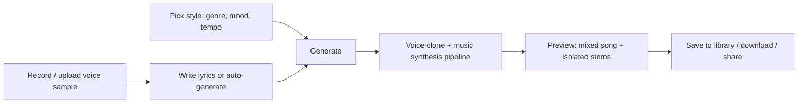
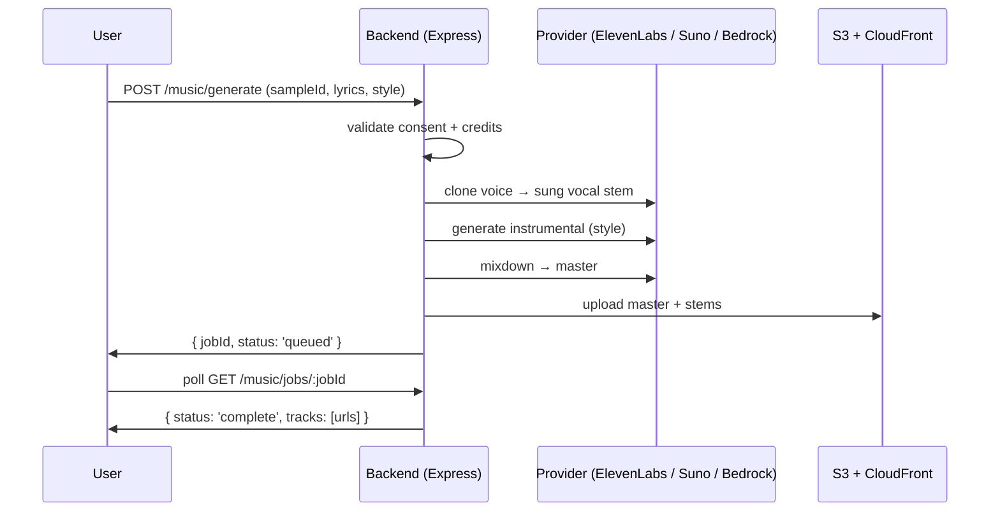

# AI Music Generator — "Sing as You" (Feature Spec & Plan)

Generates a fully produced, tailored song **in the user's own voice** from three
inputs: a **voice sample** (human voice audio file), **lyrics** (optional text
input), and **style/creative direction** (genre, mood, tempo, instruments). This
is the audio counterpart to the existing AI image generator
([`AWS_SETUP_GUIDE.md` Part 3](../guides/AWS_SETUP_GUIDE.md)).

## Status legend

- ✅ **Implemented** — landed in code with tests.
- 🟡 **Partially implemented** — backend seam exists, integration/UI/guardrails still open.
- ⬜ **Planned** — not yet implemented.

> Current status: **⬜ Planned** — this document is the design target. No music
> generator code exists yet. Reuse the image-generation pattern
> (`bedrockImageService.js` + `imageGenController.js` + `netTools.js`
> `generate_image` tool) as the architectural template.

---

## 1. Vision

Let a user record (or upload) a short clip of their own voice, write a few
lines of lyrics (or say "surprise me"), pick a style, and get back a complete,
mixed-down song where **the lead vocal is a cloned rendition of their voice**.
The result should feel like "a song I wrote, performed by a studio version of
me" — not a text-to-speech readout of lyrics.

Target use cases:

1. **Personal / gifting** — a birthday song, an anniversary song, a hype track
   with the user's own voice.
2. **Creator tooling** — vocal demos before booking a real studio session.
3. **Fun / virality** — "here's me singing in the style of 90s boy-band."

## 2. Inputs & user flow



### 2.1 Voice sample (required)

- **Sources:** microphone recording in-browser, or upload of an audio file
  (`mp3`, `wav`, `m4a`, `webm`).
- **Minimum quality bar:** 30–90 seconds of clean speech/singing, no heavy
  background noise. A quality gate runs client-side (RMS level, clipping,
  speech-vs-silence ratio) before upload.
- **Storage:** S3 via the existing presigned-upload flow
  (`POST /api/data/upload-url`, `fileUploadController.js`), keyed
  `voice/<userId>/<sampleId>.<ext>`, served from CloudFront.
- **Consent is mandatory** (see §7) — voice cloning is a biometric-adjacent
  asset.

### 2.2 Lyrics (optional)

- Free-text lyrics field (max ~1000 words), or **auto-generate** via the chat
  LLM (`llmService`) from a short prompt ("a verse about surfing at dawn").
- Structure parsing: split into `[Verse]`, `[Chorus]`, `[Bridge]` blocks so the
  music model can map sections to arrangement.

### 2.3 Style / creative direction (optional)

| Field | Type | Example |
|---|---|---|
| `genre` | enum | `pop`, `rock`, `hip-hop`, `country`, `r&b`, `electronic`, `lofi`, `ballad` |
| `mood` | enum | `upbeat`, `melancholic`, `epic`, `chill`, `romantic` |
| `tempo` | string | `slow`, `mid`, `fast`, or explicit BPM |
| `instruments` | string[] | `["piano", "strings", "808s"]` |
| `reference` | string | "in the style of 90s boy-band" (freeform prompt) |

Defaults apply when omitted: `pop` / `upbeat` / `mid`.

## 3. Generation pipeline

The song is produced in two cooperating stages, wrapped in one request:

1. **Voice cloning / vocal synthesis** — convert the cloned voice + lyrics into
   a **sung vocal stem** (melody-aware, not flat TTS).
2. **Music synthesis** — generate the backing track (instrumental) matching the
   style and arrangement of the lyrics.
3. **Mixdown** — align vocal + instrumental, normalize loudness, return a single
   master track plus optional stems.



> Generation is **async** (jobs) because synthesis takes tens of seconds to
> minutes. The image generator is synchronous; music should not block an HTTP
> request that long.

## 4. Provider strategy

Pick per-environment, mirroring how `BEDROCK_IMAGE_MODEL_ID` overrides the
default image model. **Do not hardcode one vendor** — wrap them behind
`musicService.js` with a common interface.

| Capability | Primary option | Notes |
|---|---|---|
| Voice cloning + sung vocals | ElevenLabs (Voice Design / Sing-to-Song) | Best-in-class voice cloning; API supports song/vocal modes. |
| Music / instrumental synthesis | Suno / Udio, or AWS Bedrock music models (when GA) | Suno/Udio need key management; Bedrock keeps everything in-AWS. |
| Lyrics auto-generation | Existing `llmService` (Claude) | No new provider needed. |

- **Secrets:** store keys in AWS Secrets Manager (`portfolio-app/production`),
  same as the DeepSeek/Bedrock keys (`SECRETS_MANAGEMENT.md`).
- **Env overrides:** `MUSIC_VOCAL_PROVIDER`, `MUSIC_INSTRUMENTAL_PROVIDER`,
  `MUSIC_DEFAULT_MODEL`, `AWS_BEDROCK_MUSIC_REGION`.

## 5. Backend surface (planned)

Follow the image-gen layout: `services/musicService.js` +
`controllers/musicController.js` + routes in `routes/routeData.js`.

### 5.1 Data model (DynamoDB)

- **Song record** `music_<userId>_<songId>`:
  `{ songId, userId, title, sampleId, lyrics, style:{genre,mood,tempo,instruments,reference}, status, tracks:[{kind:'master'|'vocal'|'instrumental', url}], durationMs, provider, creditsUsed, createdAt }`
- **Voice sample record** `voice_<userId>_<sampleId>`:
  `{ sampleId, userId, s3Key, durationSec, quality:{rms,clipping,speechRatio}, status, createdAt }`
- **Job record** `music_job_<userId>_<jobId>`:
  `{ jobId, userId, songId, status:'queued'|'processing'|'complete'|'failed', error, createdAt, updatedAt }`

### 5.2 API surface (planned)

| Route (prefix `/api/data`) | Purpose | Auth | Rate limit |
|---|---|---|---|
| `POST /api/data/music/voice-samples` | Request presigned upload URL for a voice sample | JWT | `musicLimiter` |
| `POST /api/data/music/generate` | Start a generation job | JWT | `musicGenLimiter` |
| `GET /api/data/music/jobs/:jobId` | Poll job status | JWT | — |
| `GET /api/data/music/songs` | List user's songs | JWT | — |
| `DELETE /api/data/music/songs/:songId` | Delete song (and stems) | JWT | — |

Request body for `generate`:

```json
{
  "sampleId": "voice_123_abc",
  "title": "Surfing at Dawn",
  "lyrics": "[Verse]\nGolden light...\n\n[Chorus]\n...",
  "style": { "genre": "pop", "mood": "upbeat", "tempo": "mid", "instruments": ["piano", "strings"], "reference": "sunny 2000s pop" }
}
```

Response (job accepted):

```json
{ "success": true, "jobId": "music_job_123_xyz", "status": "queued" }
```

## 6. Credits, rate limits & cost

- **Rate limiters:** add `musicLimiter` (sample uploads) and `musicGenLimiter`
  (generations, e.g. 3 / hour per user) in `middleware/rateLimiter.js`, matching
  `imageGenLimiter` style.
- **Credit accounting:** extend `apiUsageTracker` with `checkMusicCredits` (pre)
  and `trackMusicUsage` (post), exactly like `checkImageCredits` / `trackImageUsage`.
  Voice cloning + music synthesis are both premium actions.
- **Storage cost:** master + stems are large; auto-delete failed/queued jobs and
  enforce a per-user library cap (e.g. 20 songs) unless Pro.

## 7. Consent & safety (voice cloning)

Voice cloning is a **biometric-adjacent** capability. This must ship with:

1. **Explicit, informed consent** at sample capture time — a checkbox confirming
   the user owns the voice and consents to a clone being created and used.
2. **Ownership attestation** — user confirms the voice is their own or they have
   the owner's permission.
3. **No third-party voices** — reject samples that appear to be celebrity/famous
   voices; block prompts naming specific real people ("sing like Taylor Swift").
4. **Deletion rights** — deleting a song or the account deletes the stored
   sample, clone, and outputs. Voice samples are never used to train or
   re-generate for other users.
5. **Audit log** — consent timestamp + IP stored with the sample record.

This mirrors the privacy posture already documented for the Simple platform
(`AUTOMATION_SECURITY.md`) and image generation.

## 8. Net chat integration (like image generation)

Typing "make a song in my voice about my dog" in `/net` should work end-to-end,
reusing the `llmService` tool loop:

1. `POST /api/data/compress` (`text:"Net:..."`) → `llmService` tool loop.
2. New `netTools.js` tool `generate_song` executor → `musicService.generate` →
   S3 upload → DynamoDB song record → `apiUsageTracker` checks.
3. Frontend `NNetChatView.jsx` renders an inline audio player (reuse the
   `` rendering pattern, add `<audio controls>` support).

Diagnostic scripts to add: `backend/scripts/test-net-music.js` (mirrors
`test-net-image.js`).

## 9. Frontend

- **New page** `/music` (or a section in `/net`): three-step wizard —
  (1) record/upload voice sample with quality meter, (2) lyrics + style, (3) job
  progress + player.
- Follow `FRONTEND_UI_STANDARD.md` for theming, sizing, and page template.
- Audio player with waveform preview + per-stem toggles (master / vocals /
  instrumental) when stems are available.

## 10. Roadmap

- [ ] **⬜** Voice sample upload + quality gate + consent (S3 flow).
- [ ] **⬜** `musicService.js` provider wrapper (ElevenLabs vocal + Suno/Bedrock instrumental).
- [ ] **⬜** Async job queue + `musicController.js` + routes.
- [ ] **⬜** Credits/rate-limit integration.
- [ ] **⬜** Net chat `generate_song` tool + inline player.
- [ ] **⬜** `/music` page wizard.
- [ ] **⬜** Tests: `musicService.test.js`, `musicController.test.js` (mock providers).

## 11. Open questions

- Bedrock music models availability/region vs. third-party keys (Suno/Udio/ElevenLabs).
- Melody quality: does the vocal provider accept melody input, or is it
  fully generated? (Affects whether lyrics map to a fixed melody or a prompt.)
- Copyright of generated songs — clarify ownership in Terms before launch.
