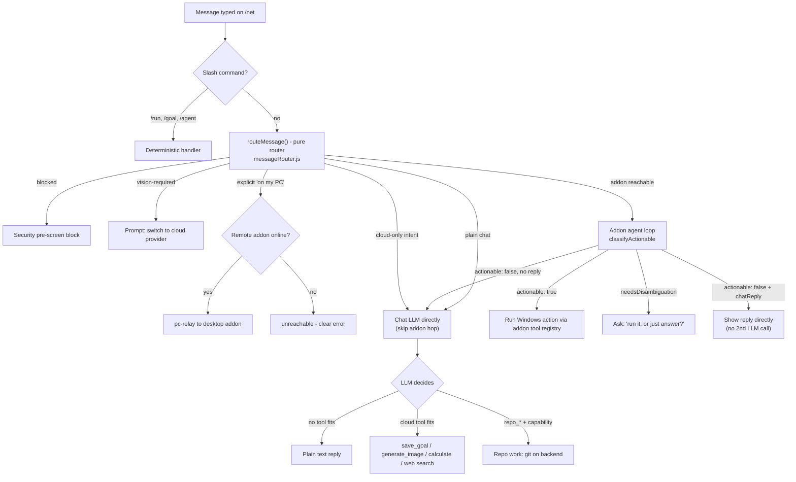

# Simple — Consumer PC Automation Platform (Plan & Architecture)

Single source of truth for the Simple platform: vision, architecture, current
state, the core agent loop, and the living roadmap/to-do. This merged the former
`simple-agent-prompt.md`, `ACTION_PLAN.md`, `AUTOMATION_ROADMAP.md`, and
`OBSERVE-ORIENT-GOAL-PLAN-ACTION.md` (2026-09-07). Security/threat model stays
in [`AUTOMATION_SECURITY.md`](AUTOMATION_SECURITY.md).

## Status legend

- ✅ **Implemented** — landed in code with tests.
- 🟡 **Partially implemented** — backend seam exists, integration/UI/guardrails still open.
- ⬜ **Planned** — not yet implemented.

---

## 0. Debugging & dogfooding (for agents)

**Agents working in this repo are welcome to sign in to the shared demo account and
click through the real UI + APIs.** Use **"Continue as Guest"** on `/login`, or the
credentials `guest@gmail.com` / `guest` (see `backend/constants/guestAccount.js`).

- Prefer it over inventing throwaway accounts — it already holds workspace items
  (goals, plans, actions, notes), so list / filter / sort / empty states are
  exercised for real instead of only in theory.
- It is a **shared, public** account: assume anything you write is visible to
  everyone. Treat test data as disposable, **delete what you create when you're
  done**, and never put real secrets, tokens, or personal data in it.
- It is deliberately **excluded from paid/powerful paths** (§13.2) — don't rely on
  it for credit-gated cloud LLM calls or admin-only surfaces such as the `repo_*`
  tools (§14.3), which require a real admin session.
- It's the account the read-only image-gen smoke test uses
  (`docs/guides/STATIC_ASSETS_AND_IMAGE_GENERATION.md`), so leaving junk behind
  degrades that test too.

---

## 1. Vision

Turn the existing `simple-addon` (currently a personal/dev-focused Electron+Node
addon) into a **consumer-facing PC automation platform** where any user can:

1. **Show, don't tell** — demonstrate a task once (mouse, keyboard, webcam, mic,
   screen — any PC input) by just doing it normally.
2. Have the system **generalize** that demonstration into a reusable, robust
   "skill" — not a brittle exact-replay macro.
3. **Share and discover** skills through a public marketplace, so the community
   builds the automation library together.

The product should feel like "recording a Loom, except the result is a robot
that can do the thing for you."

## 2. Target user & platform

- **Audience:** general consumers (not just developers/power users) — onboarding and UI must not require technical knowledge.
- **First wedge:** focus messaging/onboarding on **enthusiast/tinkerer** users first (fastest path to the first 100 paying users), then grow into **solo professionals** as the product gets more reliable. Don't market to "everyone."
- **Platform:** Windows only for v1 (matches current addon's PowerShell/UIA/Win32 dependencies).
- **Distribution:** desktop installer (NSIS, as today) + a lightweight companion web frontend (`sthopwood.com/net` integration pattern).

## 3. Core interaction model

Three complementary flows, all need to exist and interoperate:

- **Demonstration → generalized skill**: user performs a task once (or a few
  times) while the recorder captures mouse, keyboard, focus, screen state (see
  `server/automation/recorder/`). The compiler (`recorder/compiler.js`) currently
  does literal coalescing — the generalization pipeline is Section 5.
- **Natural language / agent-driven**: user describes a goal in text or voice,
  and the agent loop (`server/automation/agent-loop.js`) + tool registry
  (`server/automation/tool-registry.js`) plans and executes it directly, optionally
  invoking a matching skill (`findRelevantSkills`). The loop itself is the
  Observe → Orient → Goal → Plan → Action loop (Section 11).
- **Proactive observation → one-tap suggestion**: the agent passively watches
  everyday use, spots repeated patterns (`pattern-learner.js` + `predictor.js`),
  and offers to automate them — "I noticed you sort your downloads every
  morning. Want me to do that for you?" No recording, no scripting; the agent
  just notices and asks. This watch-and-learn path is the product's biggest
  differentiator from macro recorders (see [`BUSINESS_PLAN.md`](../guides/BUSINESS_PLAN.md)).

These three flows feed each other: agent-loop runs are recordable, recorded
skills are describable/searchable, and patterns the agent notices become new
skills the user can confirm, edit, and share.

### 3.1 The always-on assistant (four modes)

The same agent runs in four escalating modes, each with its own consent and
permission posture (§6). The promise is "a second set of eyes and hands on your
machine" that only escalates as far as the user trusts it.

| Mode | What it does | Guardrails | Trigger |
|---|---|---|---|
| **Watch** | Observes and reports — never acts. "Tell me when the printer dialog appears." | Read-only; notification only | User-set monitor |
| **Suggest** | Spots repeated patterns and proposes one-tap automations ("I noticed you sort your downloads every morning — automate it?"). | Nothing runs without a click | `pattern-learner.js` confidence |
| **Assist** | Runs a skill on demand (voice / NL / shortcut) with per-step permission, dry-run-first, and visual repair (§5.3). | Per-category/tool approval | User command |
| **Autopilot** | Runs scheduled or trigger-driven automations unattended under the saved permission profile. | Explicit opt-in per skill + global kill switch | Schedule / event trigger |

Design rule: a skill can never silently jump up a mode. Moving a skill from
Suggest → Assist → Autopilot is always an explicit user action, never automatic.

**Status: ✅ surfaced in the UI.** `/simple` opens with the four-mode ladder
(`components/Simple/AgentModes/AgentModes.jsx`). The current mode is *derived* from
the live permission state rather than stored separately — `continuousMode` +
`autoApproveAll` = Autopilot, `continuousMode` = Suggest, neither = Assist, and
`globalKillSwitch` overrides everything as **Paused** — so the ladder can never
disagree with what the addon actually permits. **Watch** is shown but not
selectable: read-only monitoring is a per-monitor posture, not a global permission,
and offering a toggle that enforces nothing would be dishonest.

### 3.2 Why users choose Simple (differentiation)

- **No scripting** — describe it or demonstrate it; the agent works out the steps
  (AutoHotkey / Power Automate / Zapier require thinking like a programmer).
- **Watches and learns** — proactive suggestions from observed behavior, not just
  user-authored macros.
- **Acts, doesn't just explain** — the chat is wired to the same agent that can
  perform actions on the PC, unlike a generic ChatGPT-style tool.
- **Local-first, cloud-assisted** — automation runs on the user's machine; cloud
  is for sync + AI metering, not a dependency for running skills.

## 4. Marketplace — 🟡 mostly shipped (backend, /market frontend, and pre-run capability + dry-run-first enforcement done; eval scenario + live-DynamoDB pass remain)

> ⚠️ **Scope note:** the marketplace is *not* "extend the existing skill
> endpoints." Today's skill endpoints (`/api/data/csimple/workspace/skill/*`)
> store **private, per-user** items keyed `csimple_ws_{userId}_{kind}_{slug}`.
> The marketplace needs a **new shared/public namespace** with its own read path
> (anyone can discover) and controlled write path (publish/fork).
> Link to it on the addon dashboard, /net, and /simple UIs

### 4.1 Data model (new backend surface)

- **Published skill record** (public, immutable per version): `marketId`, `authorUserId`, `name`, `slug`, `version` (semver), `steps` (scrubbed — see §6.1), `declaredCategories`, `toolSchemaVersion`, `naturalLanguageDescription`, `createdAt`.
- **Versioning + fork:** publishing creates a new immutable version; downloaders pin a version. A user can *fork* a published skill into their private workspace, edit, and re-publish.
- **Ratings:** `{ marketId, version, raterUserId, stars, ranAt, outcome }` — one rating per user per version, only from users who actually downloaded/ran it.
- **Counters (server-side, the KPI source):** `downloads`, `installs`, `creations` incremented atomically on the backend — NOT derived from the per-user action log.
- **Compatibility:** every published skill stores `toolSchemaVersion`; on download the client compares against its own registry and degrades gracefully (§5.4).

### 4.2 API surface — ✅ shipped

> Mounted at `/api/data/market/skills*` on the backend (`routeData.js` is mounted
> at `/api/data`). The addon's local server exposes bare `/api/market/skills*` proxies.

| Route (backend: prefix with `/api/data`) | Purpose | Status |
|---|---|---|
| `POST /api/market/skills` | Publish skill (server-side re-scrub before persisting — §4.5) | ✅ Shipped |
| `GET /api/market/skills?q=<nl>&sort=trust\|downloads\|recent` | NL search + ranking | ✅ Shipped |
| `GET /api/market/skills/:marketId[/:version]` | Fetch a specific version | ✅ Shipped |
| `POST /api/market/skills/:marketId/install` | Increment `downloads`/`installs`, return installable scrubbed steps | ✅ Shipped |
| `POST /api/market/skills/:marketId/rate` | Submit run-gated rating | ✅ Shipped |
| `POST /api/market/skills/:marketId/flag` | Community flagging | ✅ Shipped |

**Implemented in:** `backend/controllers/marketplaceController.js` (DynamoDB
`Simple` table, `csimple_market_*` namespace), `backend/services/marketplaceRanking.js`
(pure trust/ranking helpers), `backend/services/marketplaceScrub.js` (§6.1 scrub
port), `backend/services/marketplaceCapabilities.js` (§6.2 mismatch-check port),
routes in `backend/routes/routeData.js`, addon proxies in `server/automation/index.js`,
and `workspace-client.js` wrappers.

### 4.3 Trust model

- **Reputation/rating-based, no manual moderation/code-review queue** (matches Non-goals).
- Ranking signal = rating × volume × author reputation × recency × outcome-reliability (`outcomeFailRate`, derived from `successCriteria` outcomes); community flags deprioritize.
- **Cold-start mitigation:** the *real* safety floor is the execution layer (§6) — every downloaded skill runs through the permission gate, shell allow/deny-list, and protected-path blocking regardless of what it claims. In addition:
  - New/low-trust skills default to **dry-run-first** on first execution.
  - The pre-run capability summary (§6.2) is mandatory for any marketplace install.
- Marketplace success metric: **skill downloads and creations** are the primary KPI; `/telemetry/summary` folds in the marketplace counters.

### 4.4 Web frontend — ✅ shipped

- Route `sthopwood.com/market` (`frontend/src/pages/Simple/Market/`): NL search, sort by trust/downloads/recent, detail modal with the pre-run capability summary, install → rate → flag, publish modal with scrub review, and save-to-addon (or JSON download).

### 4.5 Marketplace implementation checklist

- 🟡 Backend contract tests for pagination/sort stability/install-rate constraints (offline tests cover these; a live-DynamoDB integration pass, `back.test.js`-style, remains).

## 6. Safety & permissions — 🟡 partially implemented (backend seams + consent UI shipped; deny-path audit + future multimodal wiring open)

Keep and extend the existing permission model (`server/automation/permissions.js`,
`security-guard.js`) — do not weaken it for consumer onboarding. Category-based
approval, shell allow/deny-list, protected-path blocking, and the
`globalKillSwitch`/dry-run mechanisms all stay.

### 6.1 Privacy / PII scrubbing — ✅ implemented

### 6.2 Inspect-before-run capability summary — ✅ implemented

### 6.3 Cloud-vision consent — ✅ implemented

### 6.4 Remaining safety checklist

- 🟡 Require cloud-vision consent before any multimodal upload path (`vision-fusion.js` + `screenshot_check` gated; future paths need wiring).

## 7. Architecture — ✅ provider seam shipped

- **Keep the existing stack**: Electron + Node.js main process/server, Python subprocesses for ML (Whisper STT, MediaPipe eye tracking, webcam/vision). Do not rewrite.
- **Cloud-first AI, with a local/offline option**: default to AWS Bedrock (Claude Haiku 4.5) proxied through the portfolio backend; preserve the ability to swap in local models. Define a small **LLM provider interface** (`chat`, `chatMultimodal`) and route all callers through it.
- Reuse existing subsystems: tool registry, permission gate, event bus, recorder, agent loop, predictor/pattern-learner.

### Architecture overview

```
┌─────────────────────────────────────────────────────────────────────────────┐
│  INPUT (Perception): Webcam · Audio/Mic · Screen · Key/Mouse                │
│                          → PERCEPTION BUS (perception-bus.js)               │
├─────────────────────────────────────────────────────────────────────────────┤
│  INTERPRETATION: Vision (multimodal LLM) · Audio (Whisper) · Predictor      │
├─────────────────────────────────────────────────────────────────────────────┤
│  SYNTHESIS: AGENT LOOP (Observe → Orient → Goal → Plan → Action, §11)       │
│             Voice · NL Macro Compiler · Vision-Action Predictor             │
├─────────────────────────────────────────────────────────────────────────────┤
│  OUTPUT: shell_run · fs_write · uia_invoke · input_tap · browser_* · skill_run│
└─────────────────────────────────────────────────────────────────────────────┘
```

### Current state (shipped)

The end-to-end loop **signed-in user → cloud memory → local PC actions** works.

| Area | Files |
|---|---|
| Per-user workspace memory (memory/project/agent/skill/goal/action/log/decision) | `backend/controllers/workspaceController.js`, `backend/services/workspaceContext.js` |
| Workspace REST API mount | `backend/routes/routeData.js` (`/api/data/csimple/workspace/*`) |
| Electron addon + tray / local server | `simple-addon/main.js`, `simple-addon/tray.js`, `simple-addon/server/index.js` |
| Tool registry + permission gate | `server/automation/tool-registry.js`, `server/automation/permissions.js` |
| Agent loop (O-O-G-P-A) | `server/automation/agent-loop.js` (see §11) |
| Recorder + skill compiler/runner | `server/automation/recorder/*`, `server/automation/tools/skill.js` |
| Perception / UIA / browser / OCR tools | `server/automation/tools/*`, `server/automation/perception*.js` |
| Cloud audit + workspace client | `server/automation/workspace-client.js` |
| Live web panel + chat `/run` `/agent` | `frontend/src/components/SimpleAddon/*`, `SimpleChat.jsx` |
| Eval harness | `server/automation/eval/` |

### 7.1 LLM provider seam — ✅ implemented

## 8. Monetization — 🟡 provider-boundary credit gate shipped (UX copy + full integration matrix remain)

Freemium, gated at one seam (the LLM provider interface, §7.1) — not scattered
through feature code. Downgrade/expiry falls back to the free path without
breaking an installed skill's core replay.

### Decided tier model

| What | Free | Pro |
|---|---|---|
| Price | $0 | $15/mo (or $144/yr) |
| AI chat — Bedrock Claude Haiku 4.5, metered | $0.50/mo credit | $10/mo credit |
| OCR — platform-funded, metered | same credit allowance | same credit allowance |
| Local automation & addon | Unlimited (fair use) | Unlimited (fair use) |
| Cloud storage | 100 MB | 50 GB |
| Live phone viewing | — | Included |
| Support | Community | Email |

Locked decisions: **no BYOK** (all cloud AI is operator-funded and metered);
**OCR platform-funded**; **cancellation deferred to period end**; **annual billing**;
**no automation command cap**. (The admin `Special` flag can grant a specific user
unlimited credits — see [`special-user-flag.md`](special-user-flag.md); it's an admin
tool, not a documented tier.)

### 8.1 Monetization checklist — 🟡 partially implemented (provider-boundary gate shipped)

The meter already lived in `backend/utils/apiUsageTracker.js`
(`MEMBERSHIP_LIMITS` / `getMembershipLimit` / `canMakeApiCall` / `trackApiUsage`).
The gap was **enforcement at the provider boundary** — `agent-chat`/`agent-vision`
invoked Bedrock without checking it. That gate now exists.

- ✅ Enforce the credit limit at the provider boundary only — `agentChatProxy` /
  `agentVisionProxy` (`backend/controllers/workspaceController.js`) call
  `canMakeApiCall` before Bedrock, return a structured 402 (`planRequired`,
  `membership`, `limit`, `creditsRemaining`, `upgradeUrl`) when blocked, then
  `trackApiUsage` with the real token counts after success.
- ✅ Per-tier limits in one config table — `MEMBERSHIP_LIMITS` (Free $0.50 / Pro
  $10) in `backend/utils/apiUsageTracker.js`; local automation stays unmetered.
- 🟡 Downgrade immediately reflects in the limit — `getMembershipLimit(userRank)`
  resolves the rank from Stripe per call, so a downgrade/cancel drops the
  allowance on the next cloud-LLM call. (Grace-period copy and the local-path
  fallback for chat remain.)
- ✅ Blocked-call UX copy — `SimpleChat.jsx` already renders an "Usage Limit
  Reached → Upgrade" message for 402/credit/limit errors in both chat paths
  (and `dataService.js` shows upgrade toasts). The structured fields
  (`planRequired`/`membership`/`limit`/`creditsRemaining`/`upgradeUrl`) now also
  flow through `workspace-client.js` for richer copy later.
- 🟡 Integration tests — route gate covered in
  `backend/controllers/workspaceAgentGate.test.js`; the free/paid/expired/
  grace state machine now has unit coverage in
  `backend/utils/apiUsageTracker.test.js` (`getMembershipLimit`,
  `needsMonthlyReset`, `performMonthlyReset`). A full route-layer pass against
  real DynamoDB/Stripe fixtures remains.

### 8.2 Example marketable use cases

Concrete "show don't tell" scenarios for marketing/onboarding — each a plausible
single-demo recording in plain language with the payoff up front.

1. **Never organize your downloads again** — show it once; every messy file sorts itself forever.
2. **Grind your video game while you live your life** — show it the repetitive part; it keeps playing.
3. **Fill out the same form a hundred times** — it repeats your exact answers.
4. **Turn 10,000 photos into an organized album overnight** — it renames your collection.
5. **Copy information between programs** — it does the rest of your list.
6. **Get your daily report before you sit down** — it builds, saves, and emails it.
7. **Post once, appear everywhere** — it shares to all your accounts.
8. **Wake up to a clean inbox** — it keeps email tidy around the clock.
9. **Turn a shoebox of receipts into a budget** — it reads and totals them.
10. **Keep your game character stocked 24/7** — it handles shopping/crafting/cleanup.
11. **Make a folder of photos look professional** — it applies your edit to every photo.
12. **Never miss a sold-out item** — it watches and grabs it on restock.
13. **Turn messy notes into something you'd send** — it hands back a clean summary.
14. **Set up a new computer in minutes** — it repeats your setup.
15. **A tireless assistant for your files** — it flags what needs attention.
16. **Keep your media collection organized** — new downloads sort themselves.
17. **Apply to dozens of jobs while you do something else** — it repeats your info.
18. **Never build an expense report again** — it gathers, sorts, submits.
19. **Back up what matters, automatically** — copies on a schedule.
20. **Run your livestream like a one-person crew** — it switches scenes and saves clips.

### 8.3 Growth & conversion levers — ⬜ planned (from [`BUSINESS_PLAN.md`](../guides/BUSINESS_PLAN.md))

The biggest revenue lever is converting the existing Free → Pro funnel, not
inventing new tiers. Ordered by effort/risk.

**Tier 1 — do first (extends existing Stripe + usage-tracking code):**

- ⬜ In-app usage meter for storage ("82 MB/100 MB used") so free users see the
  ceiling before they hit it, plus a "you're at 90% of your daily limit —
  upgrade or wait" banner instead of a hard block. **Never silently fail a request.**
- ⬜ Annual billing discount — "$15/mo or $144/yr (2 months free)".
- ⬜ One-time storage top-up packs (~$3 for +5 GB/month) for users who are 90%
  happy on Free but occasionally need more — captures price-sensitive churn
  without a full subscription. (Automation commands stay ungated: local runs
  cost nothing.)

**Tier 2 — validate demand first, then build:**

- ⬜ One-time lifetime unlock of *one* Pro feature (e.g. "live phone viewing,
  $39 once") for users who dislike recurring billing — survey current Pro users
  first; skip if there's no signal.
- ⬜ Scheduled automation — start with a local reminder ("time to run your
  automation"), graduate to real background/remote execution only when paying
  demand for the cheap version exists.
- ⬜ "Supporter" tier ($3–5/mo patronage: badge, credits page, beta toggle) —
  only pursue with real goodwill signals (support mail, reviews, community).

## 9. Non-goals for this phase

- No cross-platform (Mac/Linux) support yet.
- No manual marketplace moderation/review queue.
- No enterprise/B2B features (SSO, team management, audit export) — consumer product.
- No fixed deadline — ongoing, iterative build; structure work as a prioritized backlog.

## 10. Roadmap & backlog

Ordered by value-per-risk. Ship the core "show don't tell" loop before the
marketplace, and ship privacy scrubbing before *any* publish path.

1. ✅ **Generalization MVP** — LLM re-derivation (5.1) + multi-demo parameter inference (5.2).
2. 🟡 **Privacy scrub pass** (6.1) — scrub engine + preview endpoint + consent gate shipped. ⬜ Remaining: scrub-report confirmation in pre-publish UI.
3. 🟡 **Pre-run capability summary** (6.2) — summarizer + preview endpoint shipped. ⬜ Remaining: mandatory pre-run confirmation UX.
4. ✅ **Marketplace backend** (4.1–4.2) — public namespace, versioning, install-gated ratings, atomic counters.
5. ✅ **Marketplace web frontend** (4.4) + trust ranking + dry-run-first — `/market` page, ranking + `lowTrust`, and dry-run-first enforcement all shipped.
6. ✅ **Vision re-targeting on replay** (5.3) — recovery path + UI messaging + broadened coverage (uia_invoke / click_at / browser_click) all shipped.
7. 🟡 **Monetization seam** (8) — provider-boundary credit gate + blocked-call UX copy + state-machine unit tests shipped; a full route-layer DynamoDB/Stripe fixture pass remains.
8. 🟡 **Onboarding/UX polish** for non-technical users — the three Simple surfaces are bound by one switcher that lives inside the site header (no extra row), `/simple` leads with the four-mode trust ladder, and `/net` opens as just the chat with the conversation rail a collapsed drawer. ⬜ Starter templates, a first-run guided demo, and the funnel gaps listed in §16.4 remain.
9. ✅ **Goal ↔ chat link** (§16.1) — a goal has its own `/net` conversation (id derived from the slug), enlisting from `/plans` runs the goal *in* that thread, the card flips to **View agent** once a run exists, and runs started from either surface are mirrored onto the goal. ⬜ Seeding a legacy goal's recorded run into a still-empty thread.

Each milestone ships with Jest unit tests and, where it touches the loop, an
`automation/eval/scenarios/` scenario.

### 10.1 Next implementation slices (file-targeted)

3. **Capability/scrub UI confirmations** — frontend route(s) following the `/net` integration pattern.
4. **Recorder consent gate** — `server/automation/permissions.js` + recorder capture pipeline.
5. **Vision replay repair fallback** — `server/automation/tools/skill.js` (`repairStep`) + `server/automation/vision-fusion.js`.

### 10.2 Sprint-ready backlog of not-done items

#### P0 — do now

- 🟡 Recorder sensitive-capture consent: frontend consent UX polish.

#### P2 — after core loop is stable

- 🟡 Trust-ranking tuning + low-trust dry-run-first hardening (formula + classifier shipped; tune against real usage).
- 🟡 LLM provider local adapter quality pass (deterministic stub shipped; a real local model backend remains).
- ⬜ Consumer onboarding polish and starter templates.

### 10.4 Future capability plans

Longer-horizon capabilities, listed by the roadmap.

- **Audio / voice pipeline** — mic → Whisper STT → intent → goal → TTS. (`scripts/voice_pipeline.py`, `server/audio-stream-manager.js`, `tools/audio.js`; endpoints `/api/voice/*`.)
- **Natural Language Macro Compiler** — English → structured skill steps (`nl-compiler.js`; `POST /api/skill/compile-natural`).
- **Continuous perception bus** — unified event stream (`perception-bus.js`) fed into the agent context.
- **Behavioral predictor** — n-gram model over action log; safe-read actions can execute speculatively (`predictor.js`).
- **Frontend integration** — NL macro textarea, perception status, voice input, predictions panel across `SimpleAddon/*`.
- **Proactive pattern detection** — surface repeated action patterns as one-tap
  "automate this?" suggestions (the watch-and-learn path from §3); built on
  `pattern-learner.js` + `predictor.js`.
- **Watch-and-alert** — user sets a monitor ("tell me when X appears/changes");
  the agent polls perception and notifies, acting only on confirmation.
- **Scheduled & unattended automation** — run a skill on a schedule or trigger;
  start with local reminders, graduate to background/remote execution only if
  paid demand validates the infra cost (§8.3).
- **Remember-and-repeat** — recall how a task was done before and offer to
  repeat it (memory over the action log → reusable skills).
- **Routines (skill composition)** — compose multiple skills into a sequence
  with minimal control flow (if/then, repeat N×, wait-for X, on-error) so users
  build multi-app workflows ("open spreadsheet → copy → paste into email")
  without scripting; reuses `skill_run` + per-step `successCriteria`.
- **Event-driven triggers (when → then)** — run a skill or routine automatically
  when something happens (a window opens, a file lands in a folder, an app
  launches, a time passes); built on the perception bus + predictor, every
  trigger opt-in and permission-gated.
- **Cloud continuity** — skills, settings, history, and consents sync across a
  user's machines (the same workspace items already do this), so a reinstall or
  new PC restores the agent in minutes.

## 11. The O-O-G-P-A loop (design reference)

The agent loop was upgraded from ReAct to an explicit **Observe → Orient → Goal →
Plan → Action** loop with a critic and meta-learning. **Status: ✅ complete** —
every task (T0.1 → T8.2) is implemented, tested, and green. This section is the
design reference; the code is the source of truth.

### 11.1 Three nested loops

| Loop | Cadence | Stages | Purpose |
|---|---|---|---|
| Inner | per action (~seconds) | Observe → Orient → Plan → Action | Fast progress; Goal held fixed |
| Outer | per goal re-eval (every N steps / T minutes) | + Goal | Re-derive or abandon intent |
| Meta | per session/day | Critic over the action log | Learn skills, drop dead policies |

### 11.2 State machine

```text
IDLE → OBSERVING → ORIENTING → SELECTING_GOAL → PLANNING → ACTING → REFLECTING
                                              ↑_______________↓        (inner loop)
                          └─→ BLOCKED ─→ (wait / new goal) ─────────┘
IDLE ← DONE / FAILED / STOPPED (kill switch)
```

Every transition is observable in `GET /api/agent/status`. Stages:

- **Observe** — sensors (screen, UIA, audio, gaze, keyboard patterns) fuse into a `Frame`; the last action's outcome is part of the next frame.
- **Orient** — assemble a bounded, priority-ordered situation block (perception → recent actions → goals → lessons → suggestions), capped at `ORIENT_CAP_BYTES`; drift detection (token-set Jaccard similarity over the *semantic* parts) sets `drifted`.
- **Goal** — cadence-gated re-eval: `refreshGoalStatus()` runs every tick (terminal-status + stall check, never cadence-gated); `selectGoal()` re-derives intent on cadence/drift and can emit `blocked`/`done`/`abandoned` (self-block gated by `autoAbandon`, default false).
- **Plan** — choose a concrete tool call or `idle`.
- **Act** — execute the tool; record the outcome.
- **Reflect / Critic** — `critic.js` scores the action (−1..1), writes an idempotent `lesson` workspace item on failure, and injects lessons into the next Orient block.

### 11.3 Data model & endpoints

**Additive goal fields** (`workspaceController.js`): `nextReevaluateAt`, `stallCount`, `lastOutcomeDelta` (−1..1), `autoAbandon` (bool), `maxSteps` (int).

**New workspace kind `lesson`** — written by the critic, read by Orient as semantic
memory: `{ kind:"lesson", slug:"lesson-<hash>", content:{ pattern, context, do, avoid, confidence, sourceGoal } }`.

**Endpoints:**

| Method | Path | Purpose |
|---|---|---|
| `GET` | `/api/agent/status` | `stage`, `loop` (inner/outer/meta), `stallCount`, `lastLesson` |
| `POST` | `/api/agent/start` | accept `goalSlug` + optional `{maxSteps, autoAbandon}` |
| `POST` | `/api/agent/block` | mark current goal `blocked` with a reason |
| `GET` | `/api/agent/lessons?goal=<slug>` | read critic lessons |
| `DELETE` | `/api/agent/worker/:goalSlug` | stop a worker |

**Configuration knobs** (in `agent-loop.js` defaults): `ORIENT_CAP_BYTES`, `EPISODIC_WINDOW`, `LESSON_TOPK`, `REEVAL_STEPS`, `REEVAL_MS`, `DRIFT_THRESHOLD`, `IDLE_SLEEP_MS`, `STALL_THRESHOLD`, `MAX_STEPS_DEFAULT`, `META_EVERY_ACTIONS`, `SKILL_PROMOTE_MIN_REPEATS`.

### 11.4 Success criteria (all met)

- Named `observe/orient/selectGoal/plan/act/reflect` stages, each unit-testable.
- Outer loop re-runs the Goal stage on cadence + drift and emits `blocked`/`done`/`abandoned`.
- A critic writes idempotent lessons and injects them into the next plan.
- The loop can `idle` and self-`block` on repeated stalls.
- Kill switch and permission gate remain authoritative at every stage.
- All existing eval scenarios pass; new ones green.
- UI shows live stage/loop/lessons without new security surface.

### 11.5 Open follow-ups

- **Offline runner coverage** — goal-block-on-stall and orient-bound-cap are unit-tested only; the offline eval runner can't drive the LLM loop deterministically.
- **Server-side `goalAgentService`** — kept as the offline fallback for `/plans`; the addon O-O-G-P-A loop is now the primary path.

## 12. Readiness & validation

The reliability bar before turning purchasing/visibility back on.

**Readiness bar:**
1. **Hard gate** — key simulation, perception, and auto-execution each work in ≥2 common apps.
2. **Reliability gate** — each of the 11 validation scenarios passes 9/10 across sessions/days; fix and restart on any consistent failure.
3. **Account plumbing gate** — purchase confirmation and password reset confirmed end-to-end with a real account.
4. Re-run the whole check after any significant change to the perception/action pipeline.

**Validation scenarios** (executable in `simple-addon/server/automation/eval/validate-core-functionality.js`, driven from `simple-addon/` via `npm run validate:core`):

| # | Scenario | Passes when… |
|---|---|---|
| 1 | Type + save a note in Notepad | saved file matches the typed string byte-for-byte |
| 2 | Calculator arithmetic by clicking | displayed result is `19` |
| 3 | Rename a file in File Explorer | old name gone, new name exists, content intact |
| 4 | Alt-Tab between two windows | foreground window is expected (both directions) |
| 5 | Detect human-typed input (interactive) | logged events reconstruct the sentence |
| 6 | Read UI state via perception | reported toggle states match ground truth |
| 7 | Record → compile → auto-replay | replay reproduces the same end state, no manual input |
| 8 | Planner-driven NL execution | final state matches the instruction's intent |
| 9 | Drag-and-drop with a moving path | the file/slider actually moved |
| 10 | Held input releases on focus loss | the key released after the focus switch |
| 11 | Workspace profile save → move → restore | window returns to its saved position/size |

## 13. Living action items

The remaining checklist — check items off as they land, add new gaps as found.

- ⬜ **Reliability tally** — run each validation scenario ≥10 times and require 90%+ per scenario (see §12).
- ⬜ **Perception loop** — scenario 5 needs one real `--interactive` run with a human.
- ⬜ **Auto action execution** — scenario 8 needs one real signed-in run (all LLM calls proxy through the backend).
- ⬜ **Scenario 11** — needs a live desktop run before it counts toward the tally.
- ⬜ **`input_hold`** — held keys/buttons lack a real-desktop regression test; add one.
- ⬜ **Existing Pro subscribers** — tell them plainly what works and what doesn't.
- ⬜ **Account/transactional email plumbing** — verify purchase confirmation + forgot/reset-password loop with a real account.
- ⬜ **Single installer** — consolidate "download, trust cert, configure" into one flow if feasible.

### 13.1 New findings (repo audit, 2026-09-09)

Issues surfaced while auditing the repo beyond the original plan. Ordered by
impact; none are Simple-core blockers, but several are user-visible or DRY/security-adjacent.

- 🟡 **Plaintext secret fallback outside Electron** — `simple-addon/server/secret-storage.js` stores secrets in plaintext when `safeStorage` is unavailable (documented + one-shot warning; fine for CLI/Jest). Confirm the packaged addon always runs under Electron, and consider refusing to persist (instead of plaintext) in non-Electron contexts.
- 🟡 **Derive admin-ness server-side** — the backend now attaches an `isAdmin` flag to the register/login/guest responses (`postData.js`), and the frontend reads it via shared `isAdminUser()`/`isMuseVisitor()` helpers in `constants/admin.js` (`AdminLayout`/`HeaderDropper`/`DeepStorage`/`Home`/`Muse`). Remaining: the hardcoded ID + `'girlfriend'` gate still ship as a legacy fallback until every active session re-logs in — then the constants can be deleted.
- ⚠️ **Committed user PII still in git history** — `backend/reports/support-tickets-*.json` was deleted from the working tree and added to `.gitignore`, but the file is still in git history; full removal needs a history rewrite (e.g. `git filter-repo`/BFG) + force-push.

### 13.2 New findings (second audit pass, 2026-09-09)

- 🟡 **Experimental `signal-bridge` predates the Bedrock-only decision** — marked ⚠️ DEPRECATED/UNWIRED in its header. Actual deletion (or re-implementation via the Bedrock proxy) is still a product decision.
- 🟡 **Public guest account with a known password** — `backend/constants/guestAccount.js` hardcodes `guest@gmail.com` / `guest` for "Login as Guest" (and `createGuestUser.js` logs the password). A deliberate demo feature, but a shared account with a known credential should stay strictly read-only/rate-limited and excluded from paid/powerful paths.

### 13.3 New findings (third audit pass, 2026-09-09)

- 🟡 **S3 upload file-type validation trusts the client MIME type** — `validateFile` now rejects known-dangerous extensions (.html/.svg/.exe/…) and mismatches between the file extension and the declared `contentType`. Full magic-byte/signature inspection still requires a post-upload verification step (uploads are client→S3 via pre-signed URL, so the server never sees the bytes).
- 🟡 **JWT persisted in `localStorage`** — `frontend/src/features/data/dataSlice.js` stores the auth token in localStorage, so any XSS could exfiltrate it. Combined with the loose CSP above, prefer an `httpOnly` session cookie (or at least tighten CSP).

### 13.5 New findings (fifth audit pass, 2026-09-09)

- 🟡 **HIGH — the addon's local HTTP API is unauthenticated and CORS-allows the production site + LAN origins** — hardened: `simple-addon/server/index.js` now rejects requests whose `Host` header isn't loopback/private (anti DNS-rebinding) and 403s non-allowlisted cross-site `Origin`s before any handler runs, so a drive-by `fetch('http://127.0.0.1:3001/...')` from an arbitrary site no longer executes. Remaining: the production site is still allowlisted, so a per-install random secret on every request (and tightening CORS to the Electron app's own origin) is still needed to close the allowlisted-origin path.

### 13.7 New findings (seventh audit pass, 2026-09-09)

- ⬜ **Addon is distributed unsigned (no code-signing certificate)** — `simple-addon/` is built without `CSC_LINK`/`CSC_KEY`/`win.certificateSubjectName`, so (a) Windows SmartScreen flags the installer/portable exe, and (b) `electron-updater` can't verify update authenticity against a publisher certificate — update trust rests on TLS + the blockmap hash alone (a compromised GitHub repo could ship a malicious update that installs silently). Sign the build and set `publisherName` so updates are authenticated.
- ⬜ **CI actions pinned by mutable tags + mixed versions** — `.github/workflows/` mixes `actions/checkout@v4` / `setup-node@v4` (build-addon.yml, ci.yml's `test-simple-addon`) with `@v6` (ci.yml's other jobs, security.yml). Tag-based pinning lets a compromised action repo inject code; pin all actions to full commit SHAs and use one version consistently.

### 13.8 New findings (eighth audit pass, 2026-09-10)

- 🟡 **Unbounded per-request access-log writes** — `checkIP` appends a new `IP:…|Method:…|URL:…` DynamoDB record on essentially every request (authenticated or not), so the `Simple` table grows without bound and every API call costs an extra write. Consider sampling, a TTL/retention window, or a separate analytics table.

---

## 14. Repo agent via /net chat (DeepSeek) — goal & plan

Status: 🟡 in progress (2026-09-10).

### 14.1 Goal

Let a signed-in administrator use the **/net chatbot (DeepSeek)** to make real
changes to this repository — end to end, without leaving the chat:

1. **Investigate** — the model reads the live repo (list files, read files) to
   find the right places to change.
2. **Implement** — the model writes edits into the working tree on the backend
   server (not the browser).
3. **Stage** — changes are `git add`-ed and committed locally on the backend
   server.
4. **Ask** — the model *always* summarizes what it changed and asks the user
   whether to push. It never pushes silently.
5. **Push** — only after the user replies with an explicit confirmation does the
   model `git push` to GitHub (using the server's `GITHUB_TOKEN` from AWS
   Secrets Manager).

The result is the "pretend you're my /net chatbot" workflow: user describes a
change → the chat investigates, implements, and stages it on the backend → the
chat asks "push?" → user says yes → pushed to GitHub.

### 14.2 Plan (subtasks)

11. ⬜ **Live end-to-end pass** — one real signed-in admin run through /net chat
    that stages a trivial change, asks, and pushes (requires `GITHUB_TOKEN` on
    the server).

### 14.3 Confirmation gate (safety)

`repo_push` refuses to run unless **all** of these hold:

- **Admin only** — `toolContext.isAdmin` is true (same `ADMIN_USER_ID` check the
  goal agent uses). Non-admins get a "restricted" message for every `repo_*`
  tool.
- **User confirmed** — the current-turn message matches a short confirmation
  pattern (`push`, `ship`, `confirm`, `proceed`, `yes`, `go ahead`, …).
- **Commit is from a previous turn** — HEAD's commit timestamp is strictly older
  than the turn start time, so the model can never stage-and-push in one shot,
  even if the user typed "…and push it" in the original request.
- **A feature branch exists** — `repo_push` only pushes the current `net/…`
  branch (recorded in the per-user proposal), never `master` and never an
  unrelated local commit.

Because the "ask → user confirms → push" round-trip spans two turns, the model's
own reply ("…want me to push?") becomes the user's cue; the next user message is
what unlocks `repo_push`.

### 14.4 Security constraints

- Repo tools are never sent to non-admin chats (`toolsForContext()` filters
  `repo_*` out of the schema list).
- Paths are sanitized (`sanitizeRepoPath` — shared with `goalAgentService.js`
  via `repoShared.js`) — no `..`, absolute paths, or `.git`.
- File writes capped at 120 KB; reads/diffs truncated to a bounded size.
- Every change lands on an isolated `net/…` feature branch; `repo_push` can only
  push that branch, never the base branch.
- The GitHub token is passed to `git` via `http.extraHeader` (in the process
  env, never embedded in the remote URL or commit message), reusing the existing
  `GITHUB_TOKEN` secret already seeded via `backend/scripts/seed-secrets.js`.

---

## 15. How /net chat messages are routed (reference)

Routing is a **layered cascade** across the browser, the desktop addon, and the
backend — but each layer's decision is now an explicit, named, testable unit
rather than an inline `if` chain. The client asks a pure function *where* a
message should go; the addon classifies *action vs. chat*; the cloud LLM picks
the tool. The final tie-breaker is still the LLM's own tool-calling choice.



### 15.1 Layer 1 — client (`SimpleChat.jsx` `sendMessage`)

The decision of *where* a message goes is now a single pure function,
`routeMessage()` in `frontend/src/utils/simpleAddon/messageRouter.js`. It takes
only the facts the client already knows and returns a typed decision:

```js
{ kind, reason, confidence, skippedAddon?, cloudOnly? }
```

`kind` is one of `slash | blocked | vision-required | pc-relay | unreachable |
agent | chat-cloud | chat-local`. `sendMessage` just switches on it, so the
ordering is testable without mounting the component (see
`messageRouter.test.js`) and the declared transitions (`ROUTE_TRANSITIONS`) can
be asserted against the implementation — which keeps the diagram above honest.

Ordered checks, first match wins:

1. **Slash commands** (`/run`, `/goal`, `/agent`, `/help`, `/compare`, …) — handled before the router, deterministic, no LLM.
2. **Client security pre-screen** (blocked) — fast, offline UX block; the server re-checks (see §15.5).
3. **Vision required** — an attached image with a non-cloud provider.
4. **Explicit PC phrasing** (`isPcControlRequest`, e.g. "on my PC") → `pc-relay` (remote addon online) or `unreachable` (clear "can't reach your PC" error).
5. **Scan-to-connect guard** — a `?addon=` session with no reachable addon → `unreachable`.
6. **Cloud-only shortcut** — image generation / arithmetic / explicit web search skip the addon hop entirely (they're cloud tools the addon can't run anyway), saving a relay round-trip. Detected by `isCloudOnlyIntent()`.
7. **Logic mode** (`agent`) — let the addon's O-O-G-P-A loop try the message first.
8. **Plain chat** (`chat-cloud` / `chat-local`) — by the `provider` setting.

### 15.2 Layer 2 — addon classifies "Windows action vs. chat"

Split into two small, unit-tested modules instead of inline regexes:

- **`routing-lexicon.js`** — the single source of truth for the action/chat
  word lists, Unicode-aware (lookarounds, not ASCII `\b`) and *weighted*
  (an imperative opening verb scores higher than a stray noun). Returns a
  `verdict` (`action` / `chat` / `ambiguous`) plus a `confidence`.
- **`routing-classifier.js`** — parses the LLM's strict JSON verdict
  (`{ actionable, confidence, reply }`), folds it with the heuristic, and caches
  results (TTL + bounded).

`simple-addon/server/automation/index.js` `POST /api/agent/run`:

- **Confident heuristic → no model call.** Only the genuinely *ambiguous*
  middle reaches the LLM.
- **Strict JSON verdict** replaces the old brittle single-word `ACT` sentinel
  (which mis-routed anything starting with "Act…" and truncated real replies).
  `reply` carries the conversational answer, so non-actionable messages still
  need only one LLM call.
- `actionable: true` → run the O-O-G-P-A loop with the real PC tool registry
  (`shell_run`, `uia_invoke`, `input_tap`, `browser_*`, …).
- **Low-confidence actionable → `needsDisambiguation`.** The addon refuses to
  act silently; the client shows "do you want me to run this on your PC, or were
  you asking a question?" and re-sends the original message with
  `forceAction: true` when the user confirms (a short "yes").
- `actionable: false` → `chatReply` (if the classifier produced one) is shown
  directly; otherwise the message falls through to the normal chat LLM.
- **`GET /api/agent/routing-stats`** exposes the decision counters/ring buffer
  for debugging (see §15.5).

### 15.3 Layer 3 — cloud chat LLM decides "repo vs. cloud tool vs. reply" (`llmService.js`)

The cloud path sends the message to Bedrock **or DeepSeek** (the model picker is
orthogonal to the toolset) with `TOOL_SCHEMAS` and `tool_choice: 'auto'`. The LLM
chooses, per turn:

- **no tool call** → plain text reply;
- a **cloud tool** (`save_goal`, `save_note`, `generate_image`, `calculate`, `web_search_suggestion`, …);
- a **`repo_*` tool** → work on the repository via git (`repoAgentService.js`).

Guardrails shape this:

- **Capability-scoped tools** (`toolScopes.js`): every privileged tool declares
  the capability it needs (`repo:read` / `repo:write` / `repo:push`).
  `filterToolSchemas()` only *offers* tools the context can use, and
  `executeTool` refuses them server-side regardless — so a hallucinated tool
  name still can't run.
- **Proposal-bound push** (`repoAgentService.js`): `repo_commit_changes` records
  an expiring, branch-bound proposal with a one-time confirmation code;
  `repo_push` only pushes *that* branch, only before it expires, and only on an
  explicit confirmation (the code, a strong push phrase, or a bare short "yes" —
  never a vague "ok, but…").
- Shared plumbing — `buildToolContext()` (`netChatContext.js`) and
  `runToolLoop()` / `executeToolCall()` — is used by both the streaming and
  non-streaming paths so they can't drift.

### 15.4 Key separation (who owns what)

| Capability | Where it lives | Endpoint / mechanism | Who decides |
|---|---|---|---|
| Where a message goes | Client | `messageRouter.js` (`routeMessage`) | pure function, unit-tested |
| Windows/PC actions (`shell_run`, `uia_invoke`, …) | Desktop addon tool registry + agent loop | `POST /api/agent/run` (addon) | addon `classifyActionable` (+ disambiguation) |
| Repo changes (`repo_*`) | Backend server (`repoAgentService.js`, git) | `/net` chat tool loop (`llmService.js`) | cloud LLM tool-call + capability gate |
| Cloud tools (`save_goal`, `generate_image`, math, search, …) | Backend `netTools.js` | `/net` chat tool loop | cloud LLM tool-call |
| Just reply | Any LLM | chat streaming path | no tool call |

The cloud `/net` chat has **no** Windows-action tools, and the addon has **no**
repo tools — so the two cannot be confused. "Repo or chat?" is an LLM tool-choice
on the backend; "Windows action or chat?" is the addon's actionability classifier
(now shared with the client only as a *routing* decision, not a second lexicon).

### 15.5 Observability & enforcement

- **Routing telemetry** — the addon (`routing-telemetry.js` +
  `GET /api/agent/routing-stats`) and the backend (`routingTelemetry.js`) each
  record one bounded, low-cardinality event per decision: layer, intent, source
  (`heuristic` / `llm` / `cache` / `fallback`), confidence, tools offered/used,
  and latency. Log + in-memory only (no per-request DynamoDB writes — see the
  audit note in §13.8).
- **Server-side message pre-screen** — `backend/middleware/netMessageGuard.js` is
  the authoritative copy of the dangerous-command patterns. It runs on the
  compress (and stream) routes and returns a 403 *before* any LLM/tool
  processing. The browser copy is UX only and bypassable by design.

> **Code is the source of truth** — this section is a snapshot. The
> authoritative code lives in:
> `frontend/src/utils/simpleAddon/messageRouter.js` (the router),
> `SimpleChat.jsx` (`sendMessage`),
> `simple-addon/server/automation/routing-lexicon.js` +
> `routing-classifier.js` + `index.js` (`classifyActionable`, `/api/agent/run`),
> `backend/services/netChatContext.js`, `toolScopes.js`, `llmService.js`
> (the cloud tool loop), `repoAgentService.js` (the push gate), and
> `backend/middleware/netMessageGuard.js` (the server-side pre-screen).

---

## 16. Customer funnel — Discovery → Understanding → Pay

How a cold visitor becomes a paying user, mapped from the code (audited 2026-09-11).
The stages are deliberately narrow: **one job per page**, so each stage has a single
job to do well.

| Stage | Pages | The job of the page |
|---|---|---|
| **Discovery** | `/home` (+`/`), `/projects` | Establish what Simple is and route the visitor into the product or the story |
| **Product entry** | `/simple`, `/net`, `/plans`, `/profile` | Let the visitor *use* Simple for real |
| **Understanding** | `/pricing` | Explain what it costs and what each tier buys |
| **Conversion** | `/pay` | Take payment |
| **Retention** | `/profile` | Self-serve plan/usage management (the post-purchase home base) |

### 16.1 The three Simple surfaces are one journey

This is the part that used to be missing: `/net`, `/simple` and `/plans` are three
rooms of one product, but nothing in the UI said so, and `/net` and `/simple` didn't
link to each other at all. They are now bound by a shared
`components/Simple/SimpleNav/SimpleNav.jsx` switcher — **💬 Chat → 🎛️ Control → 🎯 Goals** —
that appears on all three surfaces plus `/plans/goal/:id`, carries the live addon
badge (so "is my PC agent reachable?" has one answer everywhere), and marks the
current surface with `aria-current`.

It renders **inside the fixed site header** via `<Header center={<SimpleNav compact />} />`,
so it costs zero vertical space. Do not stack it as its own row: that adds ~57px on
every page and reads as a second header.

```
💬 Chat (/net)      say what you want, in words (or voice)
🎛️ Control (/simple) watch it work · decide how far it may go · stop it
🎯 Goals (/plans)    where intent lives — goals, plans, actions, notes, lessons
```

A goal is the object that flows between all three: you *describe* it on `/net`, it
is *stored* on `/plans`, you *watch* it run on `/simple`, and `/plans/goal/:id`
hand-off links send you back to either surface.

**A goal has its own conversation.** Enlisting an agent is not a page you visit — it
hands the goal to a chat thread, because that is where the output is legible and
where iterating on it is natural ("now do the same for the screenshots folder").
The thread's id is *derived* from the goal slug (`goal-<slug>`, see
`frontend/src/utils/simpleAddon/goalChat.js`), so /plans, /net and every device
compute the same conversation with no pointer to keep in sync — and it merges
through the normal cloud conversation sync like any other chat. Concretely:

- `/plans` **🤖 Enlist agent** → `/net?goal=<slug>&enlist=1`: the thread is created,
  seeded with the goal's own words (title, description, success criteria,
  constraints, step budget), and the run starts in it.
- `/plans` **👁 View agent** (shown once the goal has a recorded run) and
  `/plans/goal/:id`'s **💬 Agent chat on /net** hand-off → `/net?goal=<slug>`: open
  the thread and keep iterating.
- The run's result is mirrored onto the goal either way, so the `/plans` card, the
  goal page's timeline and the thread never disagree about what happened; a run
  started on the goal page is also written back into the thread.
- Goal threads wear a 🎯 badge in the conversation rail and a goal bar in the chat
  header (which is the route back to the goal's record). They keep the goal's
  title — never the LLM's auto-title.

Known edge: a goal whose run predates this link (or was mirrored without it) opens
an empty thread; its run is still on `/plans/goal/:id`, and the goal bar points there.
The **homepage's closing CTA band teaches this vocabulary before the visitor signs
in**: three cards — 💬 Chat → `/net`, 🎛️ Control → `/simple`, 🎯 Goals → `/plans` —
plus one funnel exit to `/pricing`. Keep the card titles identical to the `SimpleNav`
labels (`frontend/src/pages/Home/Home.jsx`, `SURFACES`); if they drift, the switcher
stops being a familiar landmark and becomes a fourth thing to learn.
### 16.2 Funnel graph (as built)

```
Home ──hero "What I can do for you"──▶ /pricing ──plan card──▶ /login?redirectTo=/pay?plan=pro ──▶ /pay ──▶ /profile
Home ──hero "Browse my work"─────────▶ /projects ──▶ project pages            (no route back to /pricing)
Home ──CTA band surface cards───────▶ /net · /simple · /plans ──▶ LoginGate ──▶ /login?redirectTo=… | /register?redirectTo=…
Home ──CTA band "See pricing"───────▶ /pricing
/net ──header switcher───────────────▶ /simple | /plans
/simple ──header switcher────────────▶ /net | /plans
/plans ──header switcher─────────────▶ /net | /simple
/plans ──goal card───────────────────▶ /plans/goal/:id ──handoff──▶ /net?goal=<slug> | /simple
/plans ──"Enlist agent"──────────────▶ /net?goal=<slug>&enlist=1   (run starts in the goal's thread)
/plans ──"View agent"────────────────▶ /net?goal=<slug>            (reopen the goal's thread)
/net ──🎯 conversation───────────────▶ /plans/goal/:id             (chat goal bar)
/net ──UsageMeter / chat 402 copy────▶ /pay?plan=pro
/profile ──"Upgrade Now" ×3──────────▶ /pay?plan=pro
/pricing ──plan card─────────────────▶ /pay?plan=<id>  (free | pro)
```

### 16.3 Per-page contract

| Route | Gate | Primary CTA → target |
|---|---|---|
| `/home` | public | hero CTAs → `/pricing`, `/projects`; closing CTA band: "Start chatting" → `/net`, three surface cards → `/net`, `/simple`, `/plans`, "See pricing" → `/pricing` |
| `/projects` | public | project cards only — **no monetization path** |
| `/simple` | public shell, gated dashboard | the four-mode ladder; header switcher → `/net`, `/plans` |
| `/net` | gated (LoginGate) | the chat itself; `UsageMeter` → `/pay?plan=pro` |
| `/plans` | soft-gated (login prompt inline) | "+ New goal"; header switcher → `/net`, `/simple` |
| `/plans/goal/:id` | soft-gated | "Enlist agent"; hand-offs → `/net`, `/simple` |
| `/profile` | login-gated (redirects) | storage/credit meters; "Upgrade Now" ×3 → `/pay?plan=pro` |
| `/pricing` | public | plan cards → `/pay?plan=<free\|pro>` (via `/login` when signed out) |
| `/pay` | login-required | plan → payment method → "Confirm & Subscribe" → `/profile` |

Plan IDs are the canonical strings `free` / `pro` (`frontend/src/constants/pricing.js`);
tier limits live backend-side in `MEMBERSHIP_LIMITS`
(`backend/utils/apiUsageTracker.js`). `/pricing` reads plan data from
`getMembershipPricing()` with a static fallback, and every conversion CTA is inert
while `purchasesEnabled` is false.

### 16.4 Funnel gaps (audited — status as of 2026-09-11)

Fixed in this pass:

- ✅ **`/net` imported `Footer` but never rendered it, and had no way to reach the
  other surfaces.** It now renders the footer and the shared switcher.
- ✅ **`/plans` sent logged-out users to `/login` with no `redirectTo`**, so signing
  in dumped them on `/` instead of back on their goals. Same bug on
  `/plans/goal/:id`. Both now pass `state.redirectTo` (`LoginGate` already did this
  correctly on `/net` and `/simple`).
- ✅ **`/simple` hero sent its two CTAs to `/pricing` and `/market`** — exit points
  from a logged-in product surface, and both already reachable from the header.
- ✅ **The four trust modes (§3.1) were unreachable from the UI.** `/simple` now
  opens with the Watch → Suggest → Assist → Autopilot ladder, derived from the live
  permission state so it can't disagree with what the addon actually allows.
- ✅ **Neither `/pricing` nor `/simple` was in `HeaderDropper.jsx`** — the two
  highest-intent pages were unreachable from the nav. Both are now listed (Pricing
  always; Simple when signed in, where it is also the phone route into Control).
- ✅ **`/net` opened as "conversation rail + chat" and lost a quarter of the
  window to history whether you wanted it or not.** The **Conversations list**
  inside the rail is now a collapsed disclosure (`showConversations`, off by
  default) with a count badge. The rail *itself* stays open on desktop — an earlier
  pass turned the whole rail into a drawer and that was the wrong read.
- ✅ **Home's closing CTA taught a four-step "download the addon" flow** whose steps
  no longer matched the product (`/simple` was labelled "Show it once" — it is
  Control) and which never mentioned Goals at all. It is now three surface cards
  mirroring the switcher, plus a single low-key funnel exit to `/pricing`.
- ✅ **The surface switcher was a second row stacked under the header**, pushing
  every page down ~57px. It now renders *inside* the header band via
  `<Header center={…} />` and costs zero height.

Still open (ordered by funnel impact):

- ⬜ **`/projects` has no route to `/pricing`.** Once a visitor leaves the home hero
  for `/projects`, the only paths to pricing are the header dropper or a direct URL.
  Add a closing CTA band.
- ⬜ **Purchase-gate dead end.** When `purchasesEnabled` is false the Pro card is
  disabled ("Not available yet"), `/profile` hides every upgrade button, and
  `UsageMeter` hides its links — while the gate notice (`Pricing.jsx:204`) contains
  no support link. Pro-intent users are stranded at the card.
- ⬜ **Conversion CTAs are `<button onClick={navigate}>`, not `<Link>`**
  (`Pricing.jsx:266`, `Profile.jsx:339,423,610`) — not middle-clickable, not
  crawlable.
- ⬜ **`/payment-success` is an orphan route.** Nothing navigates to it; both
  post-payment paths go to `/profile` (`useCheckoutHandlers.js:56,91`), leaving
  `PaymentSuccess.jsx` dead code. `/pay/success` doesn't exist at all (falls to the
  `*` NotFound route).
- ⬜ **`/pay` renders `null` while its redirect effect runs** (`Pay.jsx:33`), giving
  signed-out visitors a blank flash before `/login`.
- ⬜ **Raw `<a href>` for SPA routes** — `UsageMeter.jsx:136,141`, `Footer.jsx:12–16`,
  the `Header.jsx` logo, and the terms/privacy links in `CheckoutForm.jsx` all force
  a full page reload.
- ⬜ **The in-chat upgrade CTA relies on the markdown renderer.** `SimpleChat.jsx`
  injects `[Upgrade Now →](/pay?plan=pro)` as markdown (lines 719, 1751); if
  `[text](url)` isn't converted to an anchor, that monetization path silently
  no-ops.
- ⬜ **Home's three surface cards** (`/net`, `/simple`, `/plans`) send guests
  straight into a gate — `/net` is `LoginGate`-gated and `/plans` is soft-gated,
  while `/simple` shows the signed-out journey band. Decide whether Discovery
  should warm guests with a signed-out preview or route them through
  `/register?redirectTo=…` first.

### 16.5 Rules for changing funnel pages

1. **Every page needs one obvious next step** — and it should move the visitor
   *forward* (Discovery → Understanding → Pay), never sideways to a page they
   already have in the nav.
2. **Product surfaces (`/net`, `/simple`, `/plans`) must render the surface
   switcher**, so the three-room model stays legible from anywhere.
3. **Deep-link login, don't drop the destination** — always pass
   `state.redirectTo` (`LoginGate` does this; ad-hoc `navigate('/login')` does not).
4. **Put cross-surface navigation in the header, not in a second row.** Use
   `<Header center={<SimpleNav compact />} />`; a stacked nav bar costs ~57px on
   every page and reads as a second header.
5. **One clear action per page.** If a hero CTA duplicates a link already in the
   header nav, delete the CTA — the nav is always visible.
6. **Never hard-block without a way out.** A disabled CTA needs an adjacent link to
   `/support` or an explanation.
7. **Use `<Link>` for internal routes** so CTAs are middle-clickable and crawlable.
8. Verify the funnel with the shared demo account (§0) — most of these pages are
   behind login, so a logged-out eyeball proves almost nothing.

---

**Companion doc:** [`AUTOMATION_SECURITY.md`](AUTOMATION_SECURITY.md) — threat model, trust boundaries, and the permissions matrix.
